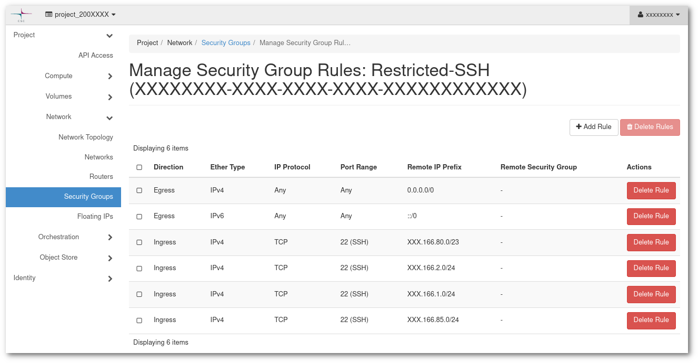
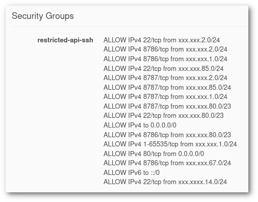

# Security Guidelines for Pouta

!!! warning "Security responsibility"

    Users are responsible of the security of the resources and infrastructure under their control. This includes, but it is not limited to: **virtual machines**, **network configuration**, **user accounts**, ...

!!! info "Security reports"

    If you have discovered a critical security flaw or believe your machine has been compromised, please contact us immediately at <servicedesk@csc.fi>.

This list of security guidelines is not meant to cover all the possible cases and scenarios, but to serve as a starting point for keeping everyone secure. 

## Network

It is very important to keep your network configuration as secure as possible, as it is the gate any intruder will use to enter in your system. It is relatively simple to apply some good practises that will give a good extra security layer. Few strategies are advisable. 

### Restrictive firewall (white listing)

Your virtual machine instances should be configured so that they allow the minimum required access to run your application. By default, virtual machines have no external access, this means no single port is opened by default to the public Internet. In order to connect to them, or to provide any kind of service, access has to be explicitly added. It is important to only open the ports that need to be opened and only open it for the least amount of IPs possible.

Every virtual machine running in Pouta comes with two firewalls: the firewall of the virtual machine itself (netfilter/iptables) and Pouta Security groups. We are only going to focus on Pouta security groups, as they are the easiest way to apply a set of complex firewall rules to a set of virtual machines. This is an example of a security group that gives access to port 22/SSH to only 4 subnets:



These 4 subnets could be the 4 public ranges that your organization uses in its office network.

Security groups are easy to configure and easy to visualize. This is the view from a virtual machine's instance page:



you can see that every single opening is shown there. 

### Disable unneeded services

Do not run unnecessary services on your VM, even if they are not accessible from the outside. The more services you run, the more attack surface you will have top intruders to exploit. For example, do not deploy your own mail server. If you need to send email from cPouta, use [Pouta's SMTP server](additional-services.md#sending-e-mail-from-cpouta). If this SMTP server does not cover your use case, please contact <servicedesk@csc.fi>.

### Use secure protocols

Wherever possible, use encrypted and secure communication protocols to avoid man in the middle attacks, this is when someone get access to your communications and can read the data going through like in a public WIFI. For example: Do not use HTTP, use instead HTTPS. Do not use FTP to transfer files, use instead FTPS, SFTP or S3.

### Use intrusion detection software

Tools such as [denyhosts](https://github.com/denyhosts/denyhosts) or [Fail2ban](https://en.wikipedia.org/wiki/Fail2ban) will analyse log files and ban IP addresses that are attempting to make brute-force attacks to your application. They are very powerful tools, but they have to be used used with care as they can lead to false positives, i.e. Banning IPs that should not be banned. 

## Software

Running secure software is also very important. It is not a trivial task to develop fully secure software, but there are some simple strategies that will help with the task. 

### Only install from reputable sources

Be mindful of the sources for the software you install. Only install software from reputable sources. If possible, use the distribution's package manager (`yum`, `dnf`, `apt`, ...). Packages managers make it easy to install software, keep it updated, and uninstall it. If the desired software it not available in the distribution package manager repository, an official source must be used. Follow the instructions on the official website of the software you need. If more than one source is offered, think about using the one that provides an easier life-cycle (install/update/uninstall/...), like [snap](https://en.wikipedia.org/wiki/Snap_(software)) or [flatpak](https://en.wikipedia.org/wiki/Flatpak).

### Automatic software updates

All operating systems have the ability to apply updates automatically. If you run regular updates, you are less exposed to known security problems. It is common that the fix is available before the security problem is published.

In Centos 8 and newer, you have `dnf-automatic`:

```yaml
sudo yum install dnf-automatic -y
systemctl enable --now dnf-automatic-install.timer
```

`yum-cron` for Centos 7:

```yaml
sudo yum install yum-cron -y
sudo systemctl enable yum-cron.service
sudo systemctl start yum-cron.service
```

`unattended-upgrades` for Ubuntu:

```yml
sudo apt install unattended-upgrades
```

Each OS version will have its own way to activate this.

!!! info "Kernel updates" 

    Some updates, such as kernel upgrades, require rebooting the virtual machines. Please schedule this into your regular maintenance.

If your use case does not support automatic updates, which is common for highly available setups, please make sure to schedule regular maintenance windows where the software upgrade is scheduled.

* **Subscribe to security announcements for your OS**, if there is a security problem in your operating system, you need to find it out as soon as possible. You can subscribe to an appropriate mailing list, RSS feed, ... to keep an eye out for anything that requires urgent action.

### Be mindful about the user accounts in the VM

Keep an eye on the user accounts enabled in your system. Some applications create default accounts which are unnecessary or even directly insecure. An ideal scenario might be three accounts:

* `root` with ssh disabled and no password. This is the default in [Pouta VM images](images.md).
* A user account for a sysadmin that can only be accessed via ssh keys and has sudo access. Pouta VM images provide this user preconfigured as well, the name of the user depends on the distribution (`cloud-user`, `centos` or `ubuntu`), see the documentation above for more reference.
* and add user-level accounts that run a single service and have no login possible, neither remote nor local access. 

Do not enable password login, **use SSH keys** instead. Passwords can be, with enough time and compute power, guessed with brute force. The average SSH server deals with thousands of such attacks every week. When using SSH keys, challenge-response authentication is used instead. This means that for each login a different challenge is asked and a different response is the correct one. No secret (password or key) ever travels across the network 

Password protect your SSH keys and make sure your key never leaves the hardware where it was created.

* Do not store public keys (much less private) on the image used to create the VM. Pouta clouds provide a metadata service so that you can download public keys on boot. This is recommended as it ensures that if your key is compromised, access from that key can be removed from all running instances and no new one will ever have this public key.

### Keep logs of your applications

Use the best practices for logging:

- Make sure that the services are logging to a secure location, that is as tamper-proof as possible.
- Keep the logs for a reasonably long amount of time.
- Consider logging to a remote server as well.

*Reused with kind permission from <a
href="https://support.ehelp.edu.au/support/solutions"
class="external-link">NeCTAR</a>.*
