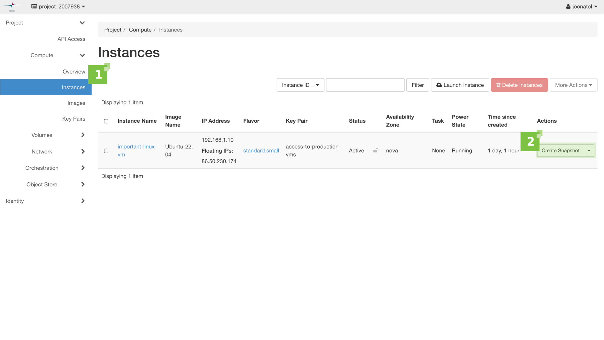

# Tilannevedokset { #snapshots }

Sisällysluettelo

[TOC]

Tässä artikkelissa kerrotaan, miten [tilannevedoksia](https://docs.openstack.org/arch-design/common/glossary.html#term-snapshot){target="_blank"} käytetään tallentamaan ja säilyttämään Pouta‑virtuaalikoneen tiedostojärjestelmän tila.

## Tilannevedostyypit { #types-of-snapshots }

OpenStackissa on kaksi tilannevedostyyppiä: [levykuva](https://docs.openstack.org/arch-design/common/glossary.html#image){target="_blank"} (instanssi)tilannevedokset ja [taltio](https://docs.openstack.org/arch-design/common/glossary.html#term-volume){target="_blank"}tilannevedokset. Molempia tilannevedostyyppejä voidaan käyttää uutta instanssia luotaessa. Levykuvatilannevedokset ovat yleisempiä.

### Instanssin tilannevedos { #instance-snapshot }

#### Instanssin tilannevedos verkkokäyttöliittymästä { #instance-snapshot-from-the-web-interface }

Valitse vasemman reunan valikosta 'Compute'‑osion 'Instances'‑välilehti (**1**).
Valitse listasta virtuaalikone, josta haluat ottaa tilannevedoksen, ja napsauta
'Actions'‑sarakkeessa painiketta 'Create Snapshot' (**2**).



Anna tilannevedokselle kuvaava nimi (**3**) ja käynnistä prosessi napsauttamalla 'Create Snapshot' (**4**).


Pääset tilannevedosluetteloon 'Images'‑välilehdeltä.

#### Instanssin tilannevedos komentoriviltä { #instance-snapshot-from-the-cli }

!!! info

    Varmista, että olet lähteyttänyt OpenStackin RC‑tiedoston ja että yhteys OpenStack‑ympäristöösi toimii.

Tarkista käytettävissä olevat instanssit seuraavalla [komennolla](https://docs.openstack.org/python-openstackclient/latest/cli/command-objects/server.html#server-list){target="_blank"}:

```
$ openstack server list
```

Tulos näyttää suunnilleen tältä:

```
+--------------------------------------+--------------------+--------+---------------------------------------------+--------------+----------------+
| ID                                   | Name               | Status | Networks                                    | Image        | Flavor         |
+--------------------------------------+--------------------+--------+---------------------------------------------+--------------+----------------+
| db2214e7-2175-4a82-9e3b-0a1892a6066a | important-linux-vm | ACTIVE | project_2007938=192.168.1.10, 86.50.230.174 | Ubuntu-22.04 | standard.small |
+--------------------------------------+--------------------+--------+---------------------------------------------+--------------+----------------+
```

Valitse haluamasi instanssi joko tunnisteen (ID) tai nimen perusteella ja suorita seuraava [komento](https://docs.openstack.org/python-openstackclient/latest/cli/command-objects/server-image.html){target="_blank"}:

```
$ openstack server image create --name important-linux-vm-snapshot-20320912-cli important-linux-vm
```

Tässä käytettiin instanssin nimeä tunnisteen sijaan. Tilannevedoksen nimen voi määrittää `--name`‑parametrilla. 

```
+------------+-------------------------------------------------------------------------------------------------------------------------------+
| Field      |                                                                                                                               |
+------------+-------------------------------------------------------------------------------------------------------------------------------+
| created_at | 2032-09-12T08:05:39Z                                                                                                          |
| file       | /v2/images/5b92fd8b-d7e2-471c-bfbc-27c3041e54f7/file                                                                          |
| id         | 5b92fd8b-d7e2-471c-bfbc-27c3041e54f7                                                                                          |
| min_disk   | 80                                                                                                                            |
| min_ram    | 0                                                                                                                             |
| name       | important-linux-vm-snapshot-20320912-cli                                                                                      |
| owner      | 124c43e4gafc46e4a18693b1a7ee47ed                                                                                              |
| properties | base_image_ref='41c7cd7e-8e10-4ced-a89e-41f159fe49fd', boot_roles='member,heat_stack_owner,creator', description='To find ... |
| protected  | False                                                                                                                         |
| schema     | /v2/schemas/image                                                                                                             |
| status     | queued                                                                                                                        |
| tags       |                                                                                                                               |
| updated_at | 2032-09-12T08:05:39Z                                                                                                          |
| visibility | private                                                                                                                       |
+------------+-------------------------------------------------------------------------------------------------------------------------------+
```

Voit varmistaa tilannevedoksen onnistuneen luonnin seuraavalla [komennolla](https://docs.openstack.org/python-openstackclient/latest/cli/command-objects/image-v2.html#image-list){target="_blank"}:

```
$ openstack image list
```

Komennon tulosteen pitäisi näyttää suunnilleen tältä:

```
+--------------------------------------+------------------------------------------+--------+
| ID                                   | Name                                     | Status |
+--------------------------------------+------------------------------------------+--------+
| 143ccb94-50cd-4030-8d6b-d749e91ca52f | AlmaLinux-8                              | active |
| 45bbe30b-2168-4155-8fdf-85450a5cbdcf | AlmaLinux-9                              | active |
| f35fafee-bd55-412d-9125-01e7216918de | CentOS-9-Stream                          | active |
| 020ec67a-4fdc-4131-8442-29f69a5e82f9 | Ubuntu-18.04                             | active |
| 75457f65-fbe2-4159-875f-fd053bba66b0 | Ubuntu-20.04                             | active |
| ce9b602b-7d46-4255-bca0-038f26e99db4 | Ubuntu-22.04                             | active |
| 7ccf2de3-2953-4d66-8ace-f6ed5a0cb092 | Ubuntu-24.04                             | active |
| ec5efcc0-689c-45a3-bffc-2439218adb00 | cirros                                   | active |
| 14b2de4d-a5de-453a-bee0-f0b506198760 | important-linux-vm-snapshot-20320912     | active |
| 5b92fd8b-d7e2-471c-bfbc-27c3041e54f7 | important-linux-vm-snapshot-20320912-cli | active |
+--------------------------------------+------------------------------------------+--------+
```

Levykuvatilannevedokset sisältävät kyseisen instanssin juurilevyn tilan, ja
niitä voidaan yleensä käyttää käynnistettävinä levykuvina.

!!! warning

    Mahdollinen [väliaikaislevy](ephemeral-storage.md) ei sisälly tilannevedokseen.

#### Tilannevedoksen käynnistäminen verkkokäyttöliittymästä { #launching-a-snapshot-from-the-web-interface }

Levykuvatilannevedoksia käytetään kuten muitakin levykuvia. Voit käynnistää sellaisen
'Images'‑näkymästä tai 'Instances'‑näkymästä ('Launch Instance' ‑painike).

Anna uuden instanssin perustiedot (**1**). Valitse käynnistyslähteeksi 'Boot from snapshot'
(**2**) ja valitse tilannevedosten listasta (**3**) se, jonka haluat käynnistää.


#### Tilannevedoksen käynnistäminen komentoriviltä { #launching-a-snapshot-from-the-cli }

Tilannevedoksen voi käynnistää myös komentoriviltä seuraavalla [komennolla](https://docs.openstack.org/python-openstackclient/latest/cli/command-objects/server.html#server-create){target="_blank"}:

```
$ openstack server create --flavor standard.small --image important-linux-vm-snapshot-20320912 important-linux-vm-RECOVERED
```

Komennon viimeinen parametri on uuden instanssin nimi. Tulosteen pitäisi jälleen olla samankaltainen kuin alla:

```
+-----------------------------+-----------------------------------------------------------------------------+
| Field                       | Value                                                                       |
+-----------------------------+-----------------------------------------------------------------------------+
| OS-DCF:diskConfig           | MANUAL                                                                      |
| OS-EXT-AZ:availability_zone |                                                                             |
| OS-EXT-STS:power_state      | NOSTATE                                                                     |
| OS-EXT-STS:task_state       | scheduling                                                                  |
| OS-EXT-STS:vm_state         | building                                                                    |
| OS-SRV-USG:launched_at      | None                                                                        |
| OS-SRV-USG:terminated_at    | None                                                                        |
| accessIPv4                  |                                                                             |
| accessIPv6                  |                                                                             |
| addresses                   |                                                                             |
| adminPass                   | DL5D7HESPahe                                                                |
| config_drive                |                                                                             |
| created                     | 2032-09-12T12:34:46Z                                                        |
| flavor                      | standard.small (d4a2cb9c-99da-4e0f-82d7-3313cca2b2c2)                       |
| hostId                      |                                                                             |
| id                          | 288284b1-1bad-45ee-9e5e-fe56b40aacba                                        |
| image                       | important-linux-vm-snapshot-20320912 (cf2b4ffb-b9a4-4937-abf7-9c461f778ce2) |
| key_name                    | None                                                                        |
| name                        | important-linux-vm-RECOVERED                                                |
| progress                    | 0                                                                           |
| project_id                  | 124c43e4efeb86e8a116e3fa174047ec                                            |
| properties                  |                                                                             |
| security_groups             | name='default'                                                              |
| status                      | BUILD                                                                       |
| updated                     | 2032-09-12T12:34:46Z                                                        |
| user_id                     | joonatol                                                                    |
| volumes_attached            |                                                                             |
+-----------------------------+-----------------------------------------------------------------------------+
```

Kun uusi instanssi on käynnistetty tilannevedoksesta (verkkokäyttöliittymästä tai komentoriviltä),
'Instances'‑näkymä näyttää tältä.


Huomioitavaa:

 * Uusi instanssi saa oman IP‑osoitteensa, jos DHCP on käytössä (**1**).
 * Vaikka SSH‑avainparia ei näytetä uuden instanssin Key Pair ‑sarakkeessa (**2**), se on silti olemassa, koska tilannevedos on täsmällinen kopio vanhasta instanssista.
 * Sidoksia (esim. julkiseen IP‑osoitteeseen) ei siirretä automaattisesti vanhasta instanssista uuteen (**3**).
 * Myös mahdolliset taltiokytkennät on määritettävä uudelleen, jos haluat käyttää niitä uuden instanssin kanssa.

#### Instanssin tilannevedoksen lataaminen { #downloading-an-instance-snapshot }

Levykuvan, mukaan lukien levykuvatilannevedokset, voi ladata vain komentoriviltä. Toimi näin:

!!! Info
    Näiden komentojen suorittaminen edellyttää, että [asennat OpenStack‑asiakasohjelman](install-client.md) ja [kirjaudut Poutaan](install-client.md#configure-your-terminal-environment-for-openstack).

2. Listaa projektin kaikki levykuvat:

    ```sh
    $ openstack image list

    +--------------------------------------+------------------------------------------+--------+
    | ID                                   | Name                                     | Status |
    +--------------------------------------+------------------------------------------+--------+
    | 143ccb94-50cd-4030-8d6b-d749e91ca52f | AlmaLinux-8                              | active |
    | 45bbe30b-2168-4155-8fdf-85450a5cbdcf | AlmaLinux-9                              | active |
    | f35fafee-bd55-412d-9125-01e7216918de | CentOS-9-Stream                          | active |
    | 020ec67a-4fdc-4131-8442-29f69a5e82f9 | Ubuntu-18.04                             | active |
    | 75457f65-fbe2-4159-875f-fd053bba66b0 | Ubuntu-20.04                             | active |
    | ce9b602b-7d46-4255-bca0-038f26e99db4 | Ubuntu-22.04                             | active |
    | 7ccf2de3-2953-4d66-8ace-f6ed5a0cb092 | Ubuntu-24.04                             | active |
    | ec5efcc0-689c-45a3-bffc-2439218adb00 | cirros                                   | active |
    | 14b2de4d-a5de-453a-bee0-f0b506198760 | important-linux-vm-snapshot-20320912     | active |
    | 5b92fd8b-d7e2-471c-bfbc-27c3041e54f7 | important-linux-vm-snapshot-20320912-cli | active |
    +--------------------------------------+------------------------------------------+--------+
    ```

1. Kopioi ladattavan levykuvan (tilannevedoksen) tunniste (ID) ja aja `openstack image save` ‑komento, esim. näin:

    ```sh
    openstack image save 14b2de4d-a5de-453a-bee0-f0b506198760 >./important-linux-vm-snapshot-20320912.raw
    ```

1. Muutaman minuutin kuluttua saat tiedoston, joka sisältää levykuvan (tilannevedoksen).

### Taltiotilannevedokset { #volume-snapshots }

#### Taltiotilannevedos verkkokäyttöliittymästä { #volume-snapshot-from-the-web-interface }

Valitse vasemman reunan valikosta kohdasta 'Volumes' 'Volumes'‑välilehti (**1**). Valitse listasta taltio,
josta haluat ottaa tilannevedoksen, ja avaa 'Actions'‑valikko.
Valitse listasta 'Create Snapshot' (**2**).


Anna tilannevedokselle kuvaava nimi (**3**) ja käynnistä prosessi napsauttamalla 'Create Volume Snapshot' (**4**).


#### Taltiotilannevedos komentoriviltä { #volume-snapshot-from-the-cli }

Tarkista käytettävissä olevat taltiot seuraavalla [komennolla](https://docs.openstack.org/python-openstackclient/latest/cli/command-objects/volume.html#volume-list){target="_blank"}:

```
$ openstack volume list
```

Tulos näyttää suunnilleen tältä:

```
+--------------------------------------+---------------+-----------+------+-------------+
| ID                                   | Name          | Status    | Size | Attached to |
+--------------------------------------+---------------+-----------+------+-------------+
| 27698e6c-92e2-41b6-bd6f-667a17495c3d | backup-volume | available |  100 |             |
+--------------------------------------+---------------+-----------+------+-------------+
```

Valitse haluamasi taltio joko tunnisteen (ID) tai nimen perusteella ja suorita seuraava [komento](https://docs.openstack.org/python-openstackclient/latest/cli/command-objects/volume-snapshot.html){target="_blank"}:

```
$ openstack volume snapshot create --volume backup-volume snapshot-of-a-backup-volume-cli
```

annetun komennon viimeinen argumentti on tilannevedoksen nimi. Komento tuottaa seuraavanlaisen tulosteen:

```
+-------------+--------------------------------------+
| Field       | Value                                |
+-------------+--------------------------------------+
| created_at  | 2032-09-12T14:03:09.496299           |
| description | None                                 |
| id          | 890c4b19-44e6-4b6e-88a7-1806d6d8e3e1 |
| name        | snapshot-of-a-backup-volume-cli      |
| properties  |                                      |
| size        | 100                                  |
| status      | creating                             |
| updated_at  | None                                 |
| volume_id   | 27698e6c-92e2-41b6-bd6f-667a17495c3d |
+-------------+--------------------------------------+
```

Listataksesi kaikki taltiotilannevedokset, käytä [komentoa](https://docs.openstack.org/python-openstackclient/latest/cli/command-objects/volume-snapshot.html#volume-snapshot-list){target="_blank"}:

```
$ openstack volume snapshot list
```

saat seuraavanlaisen listauksen:

```
+--------------------------------------+---------------------------------+-------------+-----------+------+
| ID                                   | Name                            | Description | Status    | Size |
+--------------------------------------+---------------------------------+-------------+-----------+------+
| 890c4b19-44e6-4b6e-88a7-1806d6d8e3e1 | snapshot-of-a-backup-volume-cli | None        | available |  100 |
| 53f74334-54c1-41fa-bfde-4bbb41a36900 | snapshot-of-a-backup-volume     |             | available |  100 |
+--------------------------------------+---------------------------------+-------------+-----------+------+
```

#### Instanssin käynnistäminen taltiotilannevedoksesta { #launching-an-instance-from-a-volume-snapshot }

Jos tietyt vaatimukset täyttyvät (taltiotilannevedos on käynnistettävä,
sisältää käyttöjärjestelmän jne.), uusi instanssi voidaan
käynnistää taltiotilannevedoksesta.

Taltiotilannevedoksesta käynnistäminen toimii kuten minkä tahansa muun levykuvan käynnistäminen.

Anna uuden instanssin perustiedot (**1**). Valitse
käynnistyslähteeksi 'Boot from volume snapshot (creates a new volume)' (**2**) ja valitse
'Volume Snapshot' ‑kohtaan listasta (**3**) se tilannevedos, jonka haluat käynnistää.


Palvelimen käynnistäminen taltiotilannevedoksesta komentoriviltä 
on hieman pidempi prosessi eikä sitä käsitellä 
tässä artikkelissa. Lisätietoja löytyy kuitenkin OpenStackin virallisesta [dokumentaatiosta](https://docs.openstack.org/ocata/user-guide/cli-nova-launch-instance-from-volume.html){target="_blank"}.

#### Taltiotilannevedoksen lataaminen { #downloading-a-volume-snapshot }

Taltiotilannevedosta ei voi ladata suoraan OpenStackista, ei verkkokäyttöliittymästä eikä komentoriviltä. Mutta tilannevedoksen sisältö on mahdollista ladata epäsuorasti. Perusidea on luoda taltiotilannevedoksesta uusi taltio ja liittää tämä taltio virtuaalikoneeseen. Kun tämä on tehty, on mahdollista ladata yksittäisiä tiedostoja tai koko taltio yhtenä tiedostona.

1. Luo taltio tilannevedoksesta:

    

    

    Aseta kenttään `Volume Name` nimi, josta käy selvästi ilmi, että kyse on tilannevedoksesta luodusta taltiosta, sillä prosessin päätyttyä tämä taltio tulee poistaa.
    !!! Info "Komentorivin käyttö"
        `openstack volume create --snapshot b4f95381-e56d-4080-95e4-935c66528005 test-snapshot`

        Tunnus `b4f95381-e56d-4080-95e4-935c66528005` viittaa palautettavaan tilannevedokseen, ja `test-snapshot` on uuden luodun taltion nimi.

1. Liitä taltio virtuaalikoneeseen. Voit käyttää olemassa olevaa virtuaakonetta tai [luoda uuden](launch-vm-from-web-gui.md). Kun virtuaalikone on valmiina, liitä taltio siihen:

    

    

    !!! Info "Komentorivin käyttö"
        `openstack server add volume salto 1a0c583d-1981-4246-9b7f-23865c1884c1`

         `salto` on virtuaalikoneen nimi, ja tunnus viittaa äsken luotuun taltioon.

1. Kun taltio on liitetty, se on liitettävä (mount) virtuaalikoneen hakemistoon. Tarvitset ensin laitteen nimen. Tieto löytyy Volumes‑taulukon kentästä 'Attached To'.

     

1. [Kirjaudu virtuaalikoneeseen SSH:n kautta](connecting-to-vm.md) ja liitä hakemisto:

    ```sh
    sudo mount /dev/vdb /mnt
    ```

    Yllä olevassa esimerkissä laite on `/dev/vdb` ja hakemisto `/mnt`.

1. Kun taltio on liitetty, voit hakea yksittäisiä tiedostoja hakemistosta komennolla `scp` tai `rsync`:

    ```sh
    scp salto:/mnt/important-file .
    ```

    Tässä käytetään `scp`:tä; isäntänimi on `salto` ja haettava tiedosto on `important-file`. Jos haluat noutaa kaikki tiedostot pakattuna `tar`‑tiedostona, aja esimerkiksi:

    ```sh
    $ ssh salto "sudo tar czf - /mnt/" > file.tar.gz
    ```

1. Kun olet hakenut tarvitsemasi tiedostot, suorita siivous:

    * Irrota taltio: `umount /mnt`.
    * Irrota taltio virtuaalikoneesta.
    * Poista vaiheessa 1 luotu taltio.

## Yleisiä huomioita { #general-considerations }

Suosittelemme sammuttamaan instanssin ja irrottamaan taltiot
ennen tilannevedoksen ottamista. Näin varmistat parhaiten,
että tiedostojärjestelmä tallentuu johdonmukaisessa tilassa.

Huomaa, että tilannevedokset eivät aina ole paras tapa saada
instanssi ennalta määriteltyyn tilaan. Vankempaan ratkaisuun
suositellaan konfiguraatioautomaatiotyökaluja, kuten [Ansible](https://github.com/ansible/ansible){target="_blank"}
ja [Puppet](https://github.com/puppetlabs/puppet){target="_blank"}.
Tilannevedosten sijaan näillä työkaluilla luodaan
ympäristö alusta lähtien ja palautetaan sen jälkeen aiemman
ympäristön sisältö.

Tilannevedosten määrää ei ole rajoitettu,
mutta yleisenä kohteliaisuutena niitä kannattaa pitää mahdollisimman vähän
ja poistaa tarpeettomat.