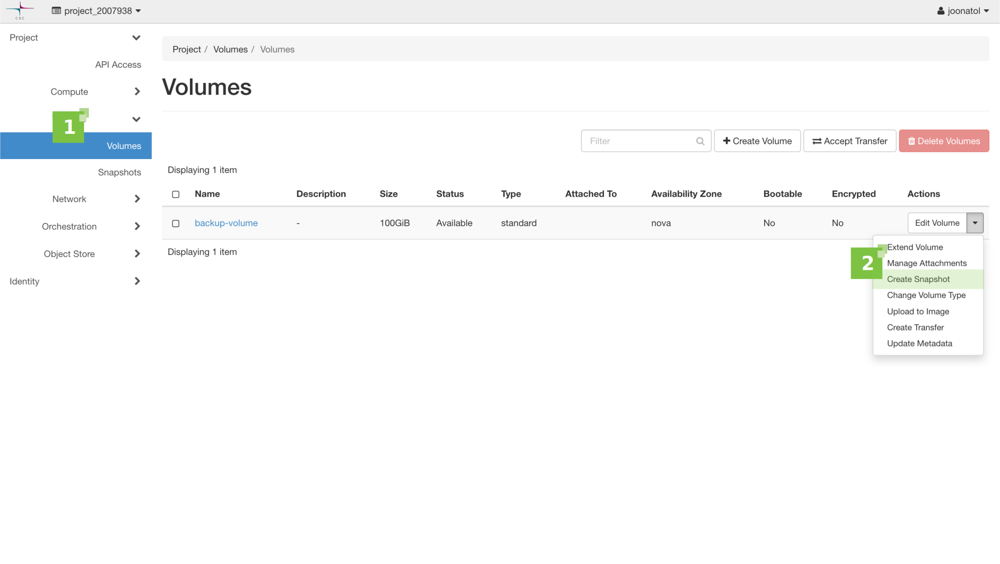

# Snapshots

Table of Contents

[TOC]

This article describes how to use [snapshots](https://docs.openstack.org/arch-design/common/glossary.html#term-snapshot){target="_blank"} to capture and store 
the file system state of a Pouta virtual machine.

## Types of snapshots

There are two types of snapshots used in OpenStack: [image](https://docs.openstack.org/arch-design/common/glossary.html#image){target="_blank"} (instance)
snapshots and [volume](https://docs.openstack.org/arch-design/common/glossary.html#term-volume){target="_blank"} snapshots. Both snapshot types can be utilized
when creating a new instance. Image snapshots are more common.

### Instance snapshot

#### Instance snapshot from the web interface

Select 'Instances' tab, under 'Compute', from the left hand side menu (**1**).
Select the virtual machine you want to take a snapshot of from the list
and click the 'Create Snapshot' button in the 'Actions' column (**2**).


Give the snapshot a descriptive name (**3**) and click 'Create Snapshot' (**4**)
to start the process.


You can access a list of snapshots from the 'Images' tab.

#### Instance snapshot from the CLI

!!! info

    Ensure you have sourced the OpenStack RC file and can communicate with your OpenStack environment.

Use the following [command](https://docs.openstack.org/python-openstackclient/latest/cli/command-objects/server.html#server-list){target="_blank"} to check the list of available instances:

```
$ openstack server list
```

The result should look something like this:

```
+--------------------------------------+--------------------+--------+---------------------------------------------+--------------+----------------+
| ID                                   | Name               | Status | Networks                                    | Image        | Flavor         |
+--------------------------------------+--------------------+--------+---------------------------------------------+--------------+----------------+
| db2214e7-2175-4a82-9e3b-0a1892a6066a | important-linux-vm | ACTIVE | project_2007938=192.168.1.10, 86.50.230.174 | Ubuntu-22.04 | standard.small |
+--------------------------------------+--------------------+--------+---------------------------------------------+--------------+----------------+
```

Select the wanted instance, either by ID or name, and issue the following [command](https://docs.openstack.org/python-openstackclient/latest/cli/command-objects/server-image.html){target="_blank"}:

```
$ openstack server image create --name important-linux-vm-snapshot-20320912-cli important-linux-vm
```

Here the name of the server instance was used instead of the ID. The name of the snapshot
can be defined with the `--name` parameter. 

```
+------------+-------------------------------------------------------------------------------------------------------------------------------+
| Field      |                                                                                                                               |
+------------+-------------------------------------------------------------------------------------------------------------------------------+
| created_at | 2032-09-12T08:05:39Z                                                                                                          |
| file       | /v2/images/5b92fd8b-d7e2-471c-bfbc-27c3041e54f7/file                                                                          |
| id         | 5b92fd8b-d7e2-471c-bfbc-27c3041e54f7                                                                                          |
| min_disk   | 80                                                                                                                            |
| min_ram    | 0                                                                                                                             |
| name       | important-linux-vm-snapshot-20320912-cli                                                                                      |
| owner      | 124c43e4gafc46e4a18693b1a7ee47ed                                                                                              |
| properties | base_image_ref='41c7cd7e-8e10-4ced-a89e-41f159fe49fd', boot_roles='member,heat_stack_owner,creator', description='To find ... |
| protected  | False                                                                                                                         |
| schema     | /v2/schemas/image                                                                                                             |
| status     | queued                                                                                                                        |
| tags       |                                                                                                                               |
| updated_at | 2032-09-12T08:05:39Z                                                                                                          |
| visibility | private                                                                                                                       |
+------------+-------------------------------------------------------------------------------------------------------------------------------+
```

You can use the following [command](https://docs.openstack.org/python-openstackclient/latest/cli/command-objects/image-v2.html#image-list){target="_blank"} to check that the snapshot has been taken successfully:

```
$ openstack image list
```

The output of the command should look something like this:

```
+--------------------------------------+------------------------------------------+--------+
| ID                                   | Name                                     | Status |
+--------------------------------------+------------------------------------------+--------+
| 143ccb94-50cd-4030-8d6b-d749e91ca52f | AlmaLinux-8                              | active |
| 45bbe30b-2168-4155-8fdf-85450a5cbdcf | AlmaLinux-9                              | active |
| f35fafee-bd55-412d-9125-01e7216918de | CentOS-9-Stream                          | active |
| 020ec67a-4fdc-4131-8442-29f69a5e82f9 | Ubuntu-18.04                             | active |
| 75457f65-fbe2-4159-875f-fd053bba66b0 | Ubuntu-20.04                             | active |
| ce9b602b-7d46-4255-bca0-038f26e99db4 | Ubuntu-22.04                             | active |
| 7ccf2de3-2953-4d66-8ace-f6ed5a0cb092 | Ubuntu-24.04                             | active |
| ec5efcc0-689c-45a3-bffc-2439218adb00 | cirros                                   | active |
| 14b2de4d-a5de-453a-bee0-f0b506198760 | important-linux-vm-snapshot-20320912     | active |
| 5b92fd8b-d7e2-471c-bfbc-27c3041e54f7 | important-linux-vm-snapshot-20320912-cli | active |
+--------------------------------------+------------------------------------------+--------+
```

Image snapshots hold the state of a given instance's root disk, and
can typically be used as bootable images.

!!! warning

    Possible [ephemeral disk](ephemeral-storage.md) is not included in the snapshot.

#### Launching a snapshot from the web interface

Image snapshots are used just like any other image. You can launch one
from the 'Images' view or from the 'Instances' view ('Launch Instance' button).

Enter the basic information for the new instance (**1**). Select 'Boot from snapshot'
(**2**) as the boot source for the instance and to 'Instance Snapshot' select
from the list of snapshots (**3**) the one you wish to launch.


#### Launching a snapshot from the CLI

A snapshot can also be launched from a command line using the following [command](https://docs.openstack.org/python-openstackclient/latest/cli/command-objects/server.html#server-create){target="_blank"}:

```
$ openstack server create --flavor standard.small --image important-linux-vm-snapshot-20320912 important-linux-vm-RECOVERED
```

Last parameter of the command is the name of the new instance. Again, the output should be similar to the one below:

```
+-----------------------------+-----------------------------------------------------------------------------+
| Field                       | Value                                                                       |
+-----------------------------+-----------------------------------------------------------------------------+
| OS-DCF:diskConfig           | MANUAL                                                                      |
| OS-EXT-AZ:availability_zone |                                                                             |
| OS-EXT-STS:power_state      | NOSTATE                                                                     |
| OS-EXT-STS:task_state       | scheduling                                                                  |
| OS-EXT-STS:vm_state         | building                                                                    |
| OS-SRV-USG:launched_at      | None                                                                        |
| OS-SRV-USG:terminated_at    | None                                                                        |
| accessIPv4                  |                                                                             |
| accessIPv6                  |                                                                             |
| addresses                   |                                                                             |
| adminPass                   | DL5D7HESPahe                                                                |
| config_drive                |                                                                             |
| created                     | 2032-09-12T12:34:46Z                                                        |
| flavor                      | standard.small (d4a2cb9c-99da-4e0f-82d7-3313cca2b2c2)                       |
| hostId                      |                                                                             |
| id                          | 288284b1-1bad-45ee-9e5e-fe56b40aacba                                        |
| image                       | important-linux-vm-snapshot-20320912 (cf2b4ffb-b9a4-4937-abf7-9c461f778ce2) |
| key_name                    | None                                                                        |
| name                        | important-linux-vm-RECOVERED                                                |
| progress                    | 0                                                                           |
| project_id                  | 124c43e4efeb86e8a116e3fa174047ec                                            |
| properties                  |                                                                             |
| security_groups             | name='default'                                                              |
| status                      | BUILD                                                                       |
| updated                     | 2032-09-12T12:34:46Z                                                        |
| user_id                     | joonatol                                                                    |
| volumes_attached            |                                                                             |
+-----------------------------+-----------------------------------------------------------------------------+
```

After launching a new instance from a snapshot (either from the web interface or the CLI)
the 'Instances' view looks like below.


A few points to bear in mind:

 * The new instance gets its own IP address if DHCP is used (**1**).
 * Even though the SSH key pair is not shown in the Key Pair column for the new instance (**2**), it still exists because the snapshot is an exact copy of the old instance.
 * Any bindings, e.g. to a public IP address, are not automatically changed from the old instance to the new one (**3**).
 * Any volume mappings will also need to be reconfigured if you want to use them with the new instance.

#### Downloading an instance snapshot

It is possible to download an image, including image snapshots, but only from the CLI. The steps are the following:

!!! Info
    In order to run this commands you need to [install the openstack client](install-client.md) and [login into Pouta](install-client.md#configure-your-terminal-environment-for-openstack).

2. List all the images in the project:

    ```sh
    $ openstack image list

    +--------------------------------------+------------------------------------------+--------+
    | ID                                   | Name                                     | Status |
    +--------------------------------------+------------------------------------------+--------+
    | 143ccb94-50cd-4030-8d6b-d749e91ca52f | AlmaLinux-8                              | active |
    | 45bbe30b-2168-4155-8fdf-85450a5cbdcf | AlmaLinux-9                              | active |
    | f35fafee-bd55-412d-9125-01e7216918de | CentOS-9-Stream                          | active |
    | 020ec67a-4fdc-4131-8442-29f69a5e82f9 | Ubuntu-18.04                             | active |
    | 75457f65-fbe2-4159-875f-fd053bba66b0 | Ubuntu-20.04                             | active |
    | ce9b602b-7d46-4255-bca0-038f26e99db4 | Ubuntu-22.04                             | active |
    | 7ccf2de3-2953-4d66-8ace-f6ed5a0cb092 | Ubuntu-24.04                             | active |
    | ec5efcc0-689c-45a3-bffc-2439218adb00 | cirros                                   | active |
    | 14b2de4d-a5de-453a-bee0-f0b506198760 | important-linux-vm-snapshot-20320912     | active |
    | 5b92fd8b-d7e2-471c-bfbc-27c3041e54f7 | important-linux-vm-snapshot-20320912-cli | active |
    +--------------------------------------+------------------------------------------+--------+
    ```

1. Copy the ID of the image (snapshot) you want to download and run the `openstack image save` command, like this:

    ```sh
    openstack image save 14b2de4d-a5de-453a-bee0-f0b506198760 >./important-linux-vm-snapshot-20320912.raw
    ```

1. After a few minutes, you will get a file with the image (snapshot).

### Volume snapshots

#### Volume snapshot from the web interface

Select 'Volumes' tab, under Volumes, from the left hand side menu (**1**). Select the volume 
you want to take a snapshot of from the list and extend the 'Actions' menu.
Choose the 'Create Snapshot' item from the list (**2**).



Give the snapshot a descriptive name (**3**) and click 'Create Volume Snapshot' (**4**)
to start the process.


#### Volume snapshot from the CLI

Use the following [command](https://docs.openstack.org/python-openstackclient/latest/cli/command-objects/volume.html#volume-list){target="_blank"} to check the list of available volumes:

```
$ openstack volume list
```

The result should look something like this:

```
+--------------------------------------+---------------+-----------+------+-------------+
| ID                                   | Name          | Status    | Size | Attached to |
+--------------------------------------+---------------+-----------+------+-------------+
| 27698e6c-92e2-41b6-bd6f-667a17495c3d | backup-volume | available |  100 |             |
+--------------------------------------+---------------+-----------+------+-------------+
```

Select the wanted volume, either by ID or name, and issue the following [command](https://docs.openstack.org/python-openstackclient/latest/cli/command-objects/volume-snapshot.html){target="_blank"}:

```
$ openstack volume snapshot create --volume backup-volume snapshot-of-a-backup-volume-cli
```

specifying the name of the snapshot as a last argument. The command produces following output:

```
+-------------+--------------------------------------+
| Field       | Value                                |
+-------------+--------------------------------------+
| created_at  | 2032-09-12T14:03:09.496299           |
| description | None                                 |
| id          | 890c4b19-44e6-4b6e-88a7-1806d6d8e3e1 |
| name        | snapshot-of-a-backup-volume-cli      |
| properties  |                                      |
| size        | 100                                  |
| status      | creating                             |
| updated_at  | None                                 |
| volume_id   | 27698e6c-92e2-41b6-bd6f-667a17495c3d |
+-------------+--------------------------------------+
```

To list all volume snapshots, use the [command](https://docs.openstack.org/python-openstackclient/latest/cli/command-objects/volume-snapshot.html#volume-snapshot-list){target="_blank"}:

```
$ openstack volume snapshot list
```

to get the following kind of listing:

```
+--------------------------------------+---------------------------------+-------------+-----------+------+
| ID                                   | Name                            | Description | Status    | Size |
+--------------------------------------+---------------------------------+-------------+-----------+------+
| 890c4b19-44e6-4b6e-88a7-1806d6d8e3e1 | snapshot-of-a-backup-volume-cli | None        | available |  100 |
| 53f74334-54c1-41fa-bfde-4bbb41a36900 | snapshot-of-a-backup-volume     |             | available |  100 |
+--------------------------------------+---------------------------------+-------------+-----------+------+
```

#### Launching an instance from a volume snapshot

If certain requirements are met (the volume snapshot is bootable,
contains a bootable operating system etc.), a new instance can be
launched from the volume snapshot.

Again launching a volume snapshot instance works just like launching any other image.

Enter the basic information for the new instance (**1**). Select
'Boot from volume snapshot (creates a new volume)' (**2**) as the boot
source for the instance and to 'Volume Snapshot' select
from the list of snapshots (**3**) the one you wish to launch.


Launching a server image from a volume snapshot using the CLI 
is a slightly longer process and is not covered in 
this article. However, if you are interested, you can find more
information in the official OpenStack [documentation](https://docs.openstack.org/ocata/user-guide/cli-nova-launch-instance-from-volume.html){target="_blank"}.

#### Downloading a volume snapshot

It is not possible to download a volume snapshot directly from OpenStack, not from the web interface neither from the CLI. But it is possible to indirectly download the contents of a snapshot. The basic idea is to create a volume from the volume snapshot, and then mount said new volume into a VM. Once that is done, it will be possible to download individual files or the whole volume in a single file.

1. Create the volume from the snapshot:

    

    

    Set the `Volume Name` to something that clearly identifies the volume as a snapshot, as when the process is over, you will need to delete this volume.
    !!! Info "Using the CLI"
        `openstack volume create --snapshot b4f95381-e56d-4080-95e4-935c66528005 test-snapshot`

        The id `b4f95381-e56d-4080-95e4-935c66528005` corresponds to the snapshot we want to restore, and `test-snapshot` is the name of the new createc volume.

1. Now you need to attach the volume to a VM. You can use an existing VM or [create a new VM](launch-vm-from-web-gui.md). Once you have a VM ready, you need to attach the volume to it:

    

    

    !!! Info "Using the CLI"
        `openstack server add volume salto 1a0c583d-1981-4246-9b7f-23865c1884c1`

         `salto` is the name of the VM, the id corresponds to the volume newly created.

1. Once attached, you need to mount the volume into a folder of the VM. First, you need to know the device name. The information is under the `Attached To` field in the Volumes table.

     

1. [Log in the VM via SSH](connecting-to-vm.md) and mount the folder:

    ```sh
    sudo mount /dev/vdb /mnt
    ```

    In the case above, the device is `/dev/vdb`, and the folder `/mnt`.

1. Once mounted, you can use `scp` or `rsync` to get individual files in a folder:

    ```sh
    scp salto:/mnt/important-file .
    ```

    In this case we are using `scp`, with the host name `salto` and the file we are retrieving `important-file`. On the other hand, if you want to get all the files in a compressed `tar` file, you can run something like:

    ```sh
    $ ssh salto "sudo tar czf - /mnt/" > file.tar.gz
    ```

1. After you get the files you needed to get, you need to clean up:

    * Unmount the volume `umount /mnt`.
    * Detach the volume from the VM.
    * Remove the volume you created in step 1.

## General considerations

We recommend powering off the instance and detaching volumes
before taking snapshots. This is the best way to make sure
the file system is captured in a consistent state.

Please note that snapshots may not always be the optimal method of
getting an instance into a predefined state. For more robust solution,
configuration automation tools such as [Ansible](https://github.com/ansible/ansible){target="_blank"}
and [Puppet](https://github.com/puppetlabs/puppet){target="_blank"} are recommended.
Instead of using snapshots, these tools are used to create
the environment from scratch and then restore the content
of previous environment.

There is no limit to the number of snapshots you can take,
but as a general courtesy you should keep snapshots to a minimum
and remove unnecessary ones.
