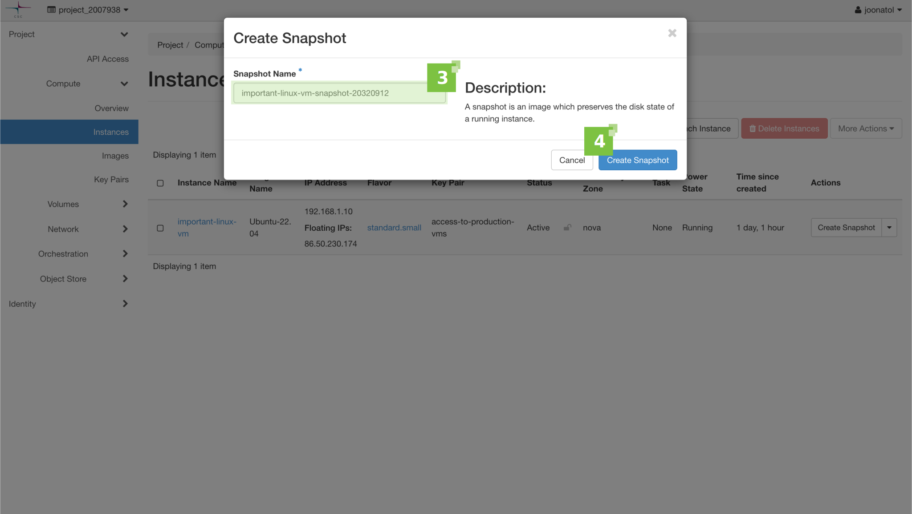
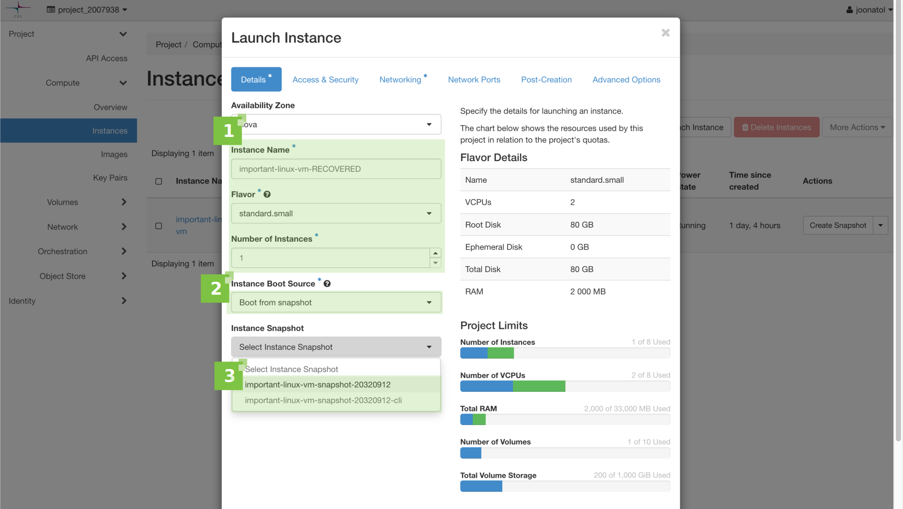
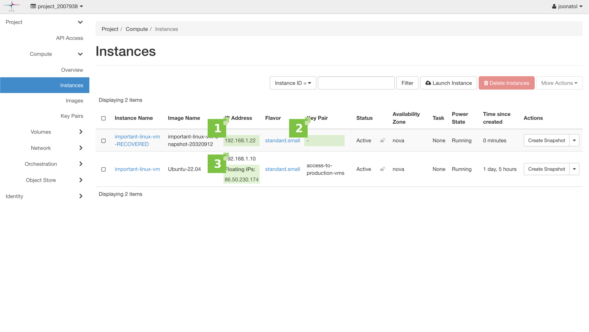

# Tilannevedokset {#snapshots}

Sisällysluettelo

[TOC]

Tässä artikkelissa kerrotaan, miten käytetään [tilannevedoksia](https://docs.openstack.org/arch-design/common/glossary.html#term-snapshot){target="_blank"} tallentamaan ja säilyttämään Pouta-virtuaalikoneen tiedostojärjestelmän tilaa.

## Tilannevedostyypit {#types-of-snapshots}

OpenStackissa käytetään kahta tilannevedostyyppiä: [kuva](https://docs.openstack.org/arch-design/common/glossary.html#image){target="_blank"} (instanssi) -tilannevedokset ja [levy](https://docs.openstack.org/arch-design/common/glossary.html#term-volume){target="_blank"} tilannevedokset. Molempia tilannevedostyyppejä voidaan hyödyntää uutta instanssia luotaessa. Kuvatilannevedokset ovat yleisempiä.

### Instanssi-tilannevedos {#instance-snapshot}

#### Instanssi-tilannevedos verkkokäyttöliittymästä {#instance-snapshot-from-the-web-interface}

Valitse "Instanssit" -välilehti "Laskenta" -kategoriasta vasemman puolen valikosta (**1**). Valitse listalta virtuaalikone, josta haluat ottaa tilannevedoksen, ja paina "Luo tilannevedos" -painiketta "Toiminnot" -sarakkeessa (**2**).


Anna tilannevedokselle kuvaava nimi (**3**) ja klikkaa "Luo tilannevedos" (**4**) aloittaaksesi prosessin.



Voit päästä käsiksi tilannevedosten listaan "Kuvat" -välilehdeltä.

#### Instanssi-tilannevedos komentoriviltä {#instance-snapshot-from-the-cli}

!!! info

    Varmista, että olet ladannut OpenStackin RC-tiedoston ja pystyt kommunikoimaan OpenStack-ympäristösi kanssa.

Käytä seuraavaa [komentoa](https://docs.openstack.org/python-openstackclient/latest/cli/command-objects/server.html#server-list){target="_blank"} tarkistaaksesi saatavilla olevien instanssien listan:

```bash
$ openstack server list
```

Tuloksen pitäisi näyttää suunnilleen tältä:

```bash
+--------------------------------------+--------------------+--------+---------------------------------------------+--------------+----------------+
| ID                                   | Nimi               | Tila   | Verkot                                      | Kuva         | Flavor         |
+--------------------------------------+--------------------+--------+---------------------------------------------+--------------+----------------+
| db2214e7-2175-4a82-9e3b-0a1892a6066a | important-linux-vm | ACTIVE | project_2007938=192.168.1.10, 86.50.230.174 | Ubuntu-22.04 | standard.small |
+--------------------------------------+--------------------+--------+---------------------------------------------+--------------+----------------+
```

Valitse haluttu instanssi joko ID:n tai nimen perusteella ja anna seuraava [komento](https://docs.openstack.org/python-openstackclient/latest/cli/command-objects/server-image.html){target="_blank"}:

```bash
$ openstack server image create --name important-linux-vm-snapshot-20320912-cli important-linux-vm
```

Tässä käytetään palvelininstanssin nimeä ID:n sijaan. Tilannevedoksen nimi voidaan määrittää `--name`-parametrilla.

```bash
+------------+-------------------------------------------------------------------------------------------------------------------------------+
| Field      |                                                                                                                               |
+------------+-------------------------------------------------------------------------------------------------------------------------------+
| created_at | 2032-09-12T08:05:39Z                                                                                                          |
| file       | /v2/images/5b92fd8b-d7e2-471c-bfbc-27c3041e54f7/file                                                                          |
| id         | 5b92fd8b-d7e2-471c-bfbc-27c3041e54f7                                                                                          |
| min_disk   | 80                                                                                                                            |
| min_ram    | 0                                                                                                                             |
| name       | important-linux-vm-snapshot-20320912-cli                                                                                      |
| owner      | 124c43e4gafc46e4a18693b1a7ee47ed                                                                                              |
| properties | base_image_ref='41c7cd7e-8e10-4ced-a89e-41f159fe49fd', boot_roles='member,heat_stack_owner,creator', description='To find ... |
| protected  | False                                                                                                                         |
| schema     | /v2/schemas/image                                                                                                             |
| status     | queued                                                                                                                        |
| tags       |                                                                                                                               |
| updated_at | 2032-09-12T08:05:39Z                                                                                                          |
| visibility | private                                                                                                                       |
+------------+-------------------------------------------------------------------------------------------------------------------------------+
```

Voit käyttää seuraavaa [komentoa](https://docs.openstack.org/python-openstackclient/latest/cli/command-objects/image-v2.html#image-list){target="_blank"} varmistaaksesi, että tilannevedos on onnistuneesti otettu:

```bash
$ openstack image list
```

Komennon tuloksen pitäisi näyttää tältä:

```bash
+--------------------------------------+------------------------------------------+--------+
| ID                                   | Name                                     | Status |
+--------------------------------------+------------------------------------------+--------+
| 5c057d87-5353-4f3c-a7a9-bffbbb99da4c | CentOS-7                                 | active |
| 1585f871-f9c3-47ec-a3ff-1b80bce0b0eb | CentOS-7-Cuda                            | active |
| 500e4de4-23fb-4cc1-bac7-83c43a8cb7eb | CentOS-8-Stream                          | active |
| bef0ff50-1aaa-48af-95b2-910bf1da7dc9 | Ubuntu-18.04                             | active |
| 5842526b-c835-4ad7-b572-4a8fe87752d1 | Ubuntu-20.04                             | active |
| 41c7cd7e-8e10-4ced-a89e-41f159fe49fd | Ubuntu-22.04                             | active |
| 3a9aad67-0f9c-4493-b574-17fe28d40afc | cirros                                   | active |
| 14b2de4d-a5de-453a-bee0-f0b506198760 | important-linux-vm-snapshot-20320912     | active |
| 5b92fd8b-d7e2-471c-bfbc-27c3041e54f7 | important-linux-vm-snapshot-20320912-cli | active |
+--------------------------------------+------------------------------------------+--------+
```

Kuvatilannevedokset tallentavat tietyn instanssin juurilevyn tilan ja niitä voidaan tyypillisesti käyttää käynnistettävinä kuvina.

!!! varoitus

    Mahdollista [väliaikaislevyä](ephemeral-storage.md) ei sisällytetä tilannevedokseen.

#### Tilannevedoksen käynnistäminen verkkokäyttöliittymästä {#launching-a-snapshot-from-the-web-interface}

Kuvatilannevedoksia käytetään kuten mitä tahansa muuta kuvaa. Voit käynnistää yhden "Kuvat" näkymästä tai "Instanssit" näkymästä ("Käynnistä instanssi" -painike).

Anna uuden instanssin perusasetukset (**1**). Valitse "Käynnistä tilannevedoksesta" (**2**) instanssin käynnistyslähteeksi ja valitse "Tilannevedosinstanssi" valikosta tilannevedos, jonka haluat käynnistää (**3**).



#### Tilannevedoksen käynnistäminen komentoriviltä {#launching-a-snapshot-from-the-cli}

Tilannevedos voidaan myös käynnistää komentoriviltä käyttäen seuraavaa [komentoa](https://docs.openstack.org/python-openstackclient/latest/cli/command-objects/server.html#server-create){target="_blank"}:

```bash
$ openstack server create --flavor standard.small --image important-linux-vm-snapshot-20320912 important-linux-vm-RECOVERED
```

Komennon viimeinen parametri on uuden instanssin nimi. Jälleen kerran, tuloksen tulisi olla samankaltainen kuin alla:

```bash
+-----------------------------+-----------------------------------------------------------------------------+
| Field                       | Value                                                                       |
+-----------------------------+-----------------------------------------------------------------------------+
| OS-DCF:diskConfig           | MANUAL                                                                      |
| OS-EXT-AZ:availability_zone |                                                                             |
| OS-EXT-STS:power_state      | NOSTATE                                                                     |
| OS-EXT-STS:task_state       | scheduling                                                                  |
| OS-EXT-STS:vm_state         | building                                                                    |
| OS-SRV-USG:launched_at      | None                                                                        |
| OS-SRV-USG:terminated_at    | None                                                                        |
| accessIPv4                  |                                                                             |
| accessIPv6                  |                                                                             |
| addresses                   |                                                                             |
| adminPass                   | DL5D7HESPahe                                                                |
| config_drive                |                                                                             |
| created                     | 2032-09-12T12:34:46Z                                                        |
| flavor                      | standard.small (d4a2cb9c-99da-4e0f-82d7-3313cca2b2c2)                       |
| hostId                      |                                                                             |
| id                          | 288284b1-1bad-45ee-9e5e-fe56b40aacba                                        |
| image                       | important-linux-vm-snapshot-20320912 (cf2b4ffb-b9a4-4937-abf7-9c461f778ce2) |
| key_name                    | None                                                                        |
| name                        | important-linux-vm-RECOVERED                                                |
| progress                    | 0                                                                           |
| project_id                  | 124c43e4efeb86e8a116e3fa174047ec                                            |
| properties                  |                                                                             |
| security_groups             | name='default'                                                              |
| status                      | BUILD                                                                       |
| updated                     | 2032-09-12T12:34:46Z                                                        |
| user_id                     | joonatol                                                                    |
| volumes_attached            |                                                                             |
+-----------------------------+-----------------------------------------------------------------------------+
```

Kun olet käynnistänyt uuden instanssin tilannevedoksesta (olipa kyseessä verkkokäyttöliittymä tai CLI), "Instanssit" -näkymä näyttää tältä.



Muutamia seikkoja:

 * Uusi instanssi saa oman IP-osoitteen, jos DHCP:tä käytetään (**1**).
 * Vaikka SSH-avainparia ei näytetä uuden instanssin Avainpari-sarakkeessa (**2**), se on edelleen olemassa, koska tilannevedos on tarkka kopio vanhasta instanssista.
 * Mitään sidontoja, kuten julkiseen IP-osoitteeseen, ei automaattisesti muuteta vanhasta instanssista uuteen (**3**).
 * Mitään levykarttoja ei myöskään automaattisesti konfiguroida uudelleen, jos haluat käyttää niitä uuden instanssin kanssa.

#### Instanssin tilannevedoksen lataaminen {#downloading-an-instance-snapshot}

On mahdollista ladata kuva, mukaan lukien kuvatilannevedokset, mutta vain komentoriviltä. Vaiheet ovat seuraavat:

!!! Info
    Jotta voit suorittaa nämä komennot, sinun täytyy [asentaa openstack client](install-client.md) ja [kirjautua Poutaan](install-client.md#configure-your-terminal-environment-for-openstack).

1. Listaa kaikki kuvaprojektin kuvat:

    ```sh
    $ openstack image list

    +--------------------------------------+------------------------------------------+--------+
    | ID                                   | Nimi                                     | Tila   |
    +--------------------------------------+------------------------------------------+--------+
    | 5c057d87-5353-4f3c-a7a9-bffbbb99da4c | CentOS-7                                 | aktiivinen |
    | 1585f871-f9c3-47ec-a3ff-1b80bce0b0eb | CentOS-7-Cuda                            | aktiivinen |
    | 500e4de4-23fb-4cc1-bac7-83c43a8cb7eb | CentOS-8-Stream                          | aktiivinen |
    | bef0ff50-1aaa-48af-95b2-910bf1da7dc9 | Ubuntu-18.04                             | aktiivinen |
    | 5842526b-c835-4ad7-b572-4a8fe87752d1 | Ubuntu-20.04                             | aktiivinen |
    | 41c7cd7e-8e10-4ced-a89e-41f159fe49fd | Ubuntu-22.04                             | aktiivinen |
    | 3a9aad67-0f9c-4493-b574-17fe28d40afc | cirros                                   | aktiivinen |
    | 14b2de4d-a5de-453a-bee0-f0b506198760 | important-linux-vm-snapshot-20320912     | aktiivinen |
    | 5b92fd8b-d7e2-471c-bfbc-27c3041e54f7 | important-linux-vm-snapshot-20320912-cli | aktiivinen |
    +--------------------------------------+------------------------------------------+--------+
    ```

2. Kopioi haluamasi kuvan (tilannevedoksen) ID ja suorita `openstack image save` -komento, kuten tämä:

    ```sh
    openstack image save 14b2de4d-a5de-453a-bee0-f0b506198760 >./important-linux-vm-snapshot-20320912.raw
    ```

3. Muutaman minuutin kuluttua saat tiedoston, jossa on kuva (tilannevedos).

### Levytilannevedokset {#volume-snapshots}

#### Levytilannevedos verkkokäyttöliittymästä {#volume-snapshot-from-the-web-interface}

Valitse "Levy" -välilehti Levyjen alta vasemman puolen valikosta (**1**). Valitse listalta levy, josta haluat ottaa tilannevedoksen, ja laajenna "Toiminnot" -valikko. Valitse listasta "Luo tilannevedos" -vaihtoehto (**2**).


Anna tilannevedokselle kuvaava nimi (**3**) ja paina "Luo levytilannevedos" (**4**) aloittaaksesi prosessin.


#### Levytilannevedos komentoriviltä {#volume-snapshot-from-the-cli}

Käytä seuraavaa [komentoa](https://docs.openstack.org/python-openstackclient/latest/cli/command-objects/volume.html#volume-list){target="_blank"} tarkistaaksesi saatavilla olevat levyt:

```bash
$ openstack volume list
```

Tuloksen pitäisi näyttää suunnilleen tältä:

```bash
+--------------------------------------+---------------+-----------+------+-------------+
| ID                                   | Nimi          | Tila      | Koko | Liitetty    |
+--------------------------------------+---------------+-----------+------+-------------+
| 27698e6c-92e2-41b6-bd6f-667a17495c3d | backup-volume | saatavilla |  100 |             |
+--------------------------------------+---------------+-----------+------+-------------+
```

Valitse haluamasi levy joko ID:n tai nimen perusteella ja anna seuraava [komento](https://docs.openstack.org/python-openstackclient/latest/cli/command-objects/volume-snapshot.html){target="_blank"}:

```bash
$ openstack volume snapshot create --volume backup-volume snapshot-of-a-backup-volume-cli
```

Tilannevedoksen nimi ilmoitetaan viimeisenä argumenttina. Komento tuottaa seuraavanlaista tulosta:

```bash
+-------------+--------------------------------------+
| Kenttä      | Arvo                                 |
+-------------+--------------------------------------+
| created_at  | 2032-09-12T14:03:09.496299           |
| kuvaus      | None                                 |
| id          | 890c4b19-44e6-4b6e-88a7-1806d6d8e3e1 |
| nimi        | snapshot-of-a-backup-volume-cli      |
| properties  |                                      |
| koko        | 100                                  |
| tila        | creating                             |
| updated_at  | None                                 |
| volume_id   | 27698e6c-92e2-41b6-bd6f-667a17495c3d |
+-------------+--------------------------------------+
```

Listataksesi kaikki levytilannevedokset, käytä [komentoa](https://docs.openstack.org/python-openstackclient/latest/cli/command-objects/volume-snapshot.html#volume-snapshot-list){target="_blank"}:

```bash
$ openstack volume snapshot list
```

saadaksesi tällaisen listauksen:

```bash
+--------------------------------------+---------------------------------+-------------+-----------+------+
| ID                                   | Nimi                            | Kuvaus      | Tila      | Koko |
+--------------------------------------+---------------------------------+-------------+-----------+------+
| 890c4b19-44e6-4b6e-88a7-1806d6d8e3e1 | snapshot-of-a-backup-volume-cli | None        | saatavilla |  100 |
| 53f74334-54c1-41fa-bfde-4bbb41a36900 | snapshot-of-a-backup-volume     |             | saatavilla |  100 |
+--------------------------------------+---------------------------------+-------------+-----------+------+
```

#### Instanssin käynnistäminen levytilannevedoksesta {#launching-an-instance-from-a-volume-snapshot}

Jos tietyt ehdot täyttyvät (levytilannevedos on käynnistettävä, sisältää käynnistettävän käyttöjärjestelmän jne.), uusi instanssi voidaan käynnistää levytilannevedoksesta.

Jälleen kerran, levytilannevedosinstanssin käynnistäminen toimii kuten minkä tahansa muun kuvan käynnistäminen.

Anna uuden instanssin perusasetukset (**1**). Valitse "Käynnistä levytilannevedoksesta (luo uuden levyn)" (**2**) instanssin käynnistyslähteeksi ja valitse "Levytilannevedos" valikosta tilannevedos, jonka haluat käynnistää (**3**).


Palvelinimagen käynnistämisen levytilannevedoksesta käyttämällä komentoriviä on hieman pidempi prosessi, eikä sitä käsitellä tässä artikkelissa. Kuitenkin, jos olet kiinnostunut, voit löytää lisää tietoa virallisesta OpenStack [dokumentaatiosta](https://docs.openstack.org/ocata/user-guide/cli-nova-launch-instance-from-volume.html){target="_blank"}.

#### Levytilannevedoksen lataaminen {#downloading-a-volume-snapshot}

Levytilannevedosta ei ole mahdollista ladata suoraan OpenStackista, ei verkkokäyttöliittymästä eikä komentoriviltä. Mutta on mahdollista epäsuorasti ladata tilannevedoksen sisältö. Perusidea on luoda levy levytilannevedoksesta ja liittää sitten se uusi levy VM:ään. Kun tämä on tehty, on mahdollista ladata yksittäisiä tiedostoja tai koko levy.

1. Luo levy tilannevedoksesta:

    

    

    Aseta `Levy Nimi` joksikin, joka selvästi tunnistaa levyn tilannevedokseksi, koska kun prosessi on ohi, sinun täytyy poistaa tämä levy.
    !!! Info "Kommentorivin käyttö"
        `openstack volume create --snapshot b4f95381-e56d-4080-95e4-935c66528005 test-snapshot`

        ID `b4f95381-e56d-4080-95e4-935c66528005` vastaa tilannevedosta, jonka haluamme palauttaa, ja `test-snapshot` on uuden luodun levyn nimi.

2. Nyt sinun täytyy liittää levy VM:ään. Voit käyttää olemassa olevaa VM:ää tai [luoda uuden VM:n](launch-vm-from-web-gui.md). Kun sinulla on VM valmiina, sinun täytyy liittää levy siihen:

    

    

    !!! Info "Kommentorivin käyttö"
        `openstack server add volume salto 1a0c583d-1981-4246-9b7f-23865c1884c1`

         `salto` on VM:n nimi, id vastaa vasta luotua levyä.

3. Kun levy on liitetty, sinun täytyy liittää levyn kansio VM:ään. Ensin sinun täytyy tietää laitteen nimi. Tiedot löytyvät "Kiinnitetty"-kentästä Levyjen taulukossa.

     

4. [Kirjaudu VM:ään SSH:n kautta](connecting-to-vm.md) ja liitä kansio:

    ```sh
    sudo mount /dev/vdb /mnt
    ```

    Tässä tapauksessa laite on `/dev/vdb` ja kansio `/mnt`.

5. Kun kansio on liitetty, voit käyttää `scp`:tä tai `rsync`:iä saadaksesi yksittäisiä tiedostoja:

    ```sh
    scp salto:/mnt/important-file .
    ```

    Tässä tapauksessa käytämme `scp`:tä, jossa isäntä-nimi on `salto` ja palautettava tiedosto on `important-file`. Toisaalta jos haluat saada kaikki tiedostot pakatuksi `tar`-tiedostoon, voit suorittaa jotain tällaista:

    ```sh
    $ ssh salto "sudo tar czf - /mnt/" > file.tar.gz
    ```

6. Kun olet saanut tarvitsemasi tiedostot, sinun täytyy siivota:

    * Irrota levy `umount /mnt`.
    * Irrota levy VM:stä.
    * Poista levy, jonka loit vaiheessa 1.

## Yleisiä huomioita {#general-considerations}

Suosittelemme sammuttamaan instanssin ja irrottamaan levyt ennen tilannevedosten ottamista. Tämä on paras tapa varmistaa, että tiedostojärjestelmä on johdonmukaisessa tilassa.

Huomaa, että tilannevedokset eivät aina ole paras tapa saada instanssi ennalta määritettyyn tilaan. Vakaampaa ratkaisua varten suosittelemme konfiguroinnin automatisointityökaluja, kuten [Ansible](https://github.com/ansible/ansible){target="_blank"} ja [Puppet](https://github.com/puppetlabs/puppet){target="_blank"}. Näiden työkalujen avulla ympäristö luodaan tyhjästä ja sisältö palautetaan aiemmasta ympäristöstä, sen sijaan että käytettäisiin tilannevedoksia.

Ei ole rajoitusta sille, kuinka monta tilannevedosta voi ottaa, mutta kohteliaisuuden vuoksi tilannevedokset kannattaa pitää minimissä ja poistaa tarpeettomat.

