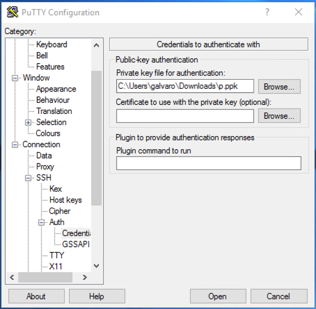

### SSH key-pair

!!! error-label

    WIP: Moved from another place, not reviewed yet

To open a connection to your virtual machines in cPouta/ePouta, you first need to prove your identity to the Virtual and for that need SSH keys. This is the default (and more secure) way to access Virtual Machines. You only need to set up your SSH keys once per project.

!!! info "Import puyblic keys"
    If you are already familiar with SSH keys, you can use your existing SSH keys to access the virtual machines. In the web interface, go to the **Compute > Key Pairs** section, and select **Import Public Key**. You need to name your key, keep in mind you will need to use this name when creating Virtual Machines, so the recomendation is to keep it short and informative of the intended use. Secondly paste your public key, it must be in a single line and be in the form of `key-type hash comment`, for example a RSA key from `person@doamin.name`:

    `ssh-rsa AAAAB3NzaC1yc2EAAAADAQABAAAAQQCo9+BpMRYQ/dL3DS2CyJxRF+j6ctbT3/Qp84+KeFhnii7NT7fELilKUSnxS30WAvQCCo2yU1orfgqr41mM70MB person@domain.name`

If you have not used SSH keypairs before, you need to create one. The web interface can take care of this for you:

1. Go to the **Compute > Key Pairs** section, and select **Create Key Pair**.

    

    **Figure** The _Access & Security_ subpage in the cPouta web interface

1. Give your key a name and click in **Create Key Pair**. You will get a "_keyname.pem_" to save. Save it in your home directory. This will be the last time you will be able to download this **private key**, Pouta does not keep a copy in its servers.

    

    **Figure** The Create Key Pair dialog

#### Linux and Mac

In order to install the key you downloaded in the previous step (_keyname.pem_ or _keyname.cer_), you must run this commmands:

!!! info "For MacOS"
    If you are using Chrome browser in Mac OS X Monterey, you will get keyname.cer instead of keyname.pem. The following procedure will remain same.

```bash
mkdir -p ~/.ssh
chmod 700 .ssh
mv keyname.pem ~/.ssh
chmod 400 ~/.ssh/keyname.pem
```

!!! info "400 = Only owner can read"
    When a file in Unix has 400 permissions, it translates to:
    `r-- --- ---`

    which means, only the owner can read the file. This is the recommended value for SSH, but in case you need to overwrite the file, you will need to give also write permissions: `chmod 600 ~/.ssh/keyname.pem`.


Before using the newly created key, you should protect it with a passphrase:

```bash
chmod 600 ~/.ssh/keyname.pem
ssh-keygen -p -f .ssh/keyname.pem
chmod 400 ~/.ssh/keyname.pem
```

#### Windows (PowerShell)

In **Windows** environments it is recommended to use PowerShell. The process is very similar

```PowerShell
mkdir ~/.ssh
mv yourkey.pem ~/.ssh/
```

Before using the newly created key, you should protect it with a passphrase:

```PowerShell
ssh-keygen.exe -p -f yourkey.pem
```

Then, still from PowerShell, you can use the `ssh` command to connect to your machine, in the same way it is done from Linux or Mac.

#### Windows (Putty)

If your copy of Windows does not have the _ssh_ command installed, it is also possible to use _Putty_.

This is done by using the _puttygen_ tool to load your private key (.pem) and save it in the (password protected) .ppk format which Putty can use.

1. Download _Putty_ and _puttygen_, which are available at <http://www.chiark.greenend.org.uk/~sgtatham/putty/download.html>.

1. Run _puttygen_ and load the key you downloaded (it should be in the Downloads page).

    

1. Set a password to the key. This is not compulsory, but advised.

1. Save the key in _ppk_ format, this is the default Putty format for keys.

    

Now we can use this new in Putty to connect to a Virtual Machine.

1. Run _putty_ and load the ssh key. Go to **Connection > SSH > Auth** and under **Private key file for authentication**, use the **Browse...** button to select the proper .ppk file.

    

1. Once the key is loaded, you will save the session. Go to the **Session** section and under **Saved Sessions** write the name of the new session and click save.
