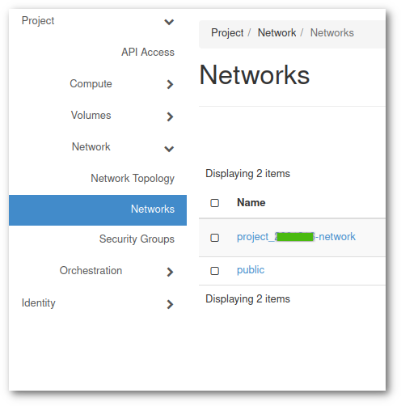
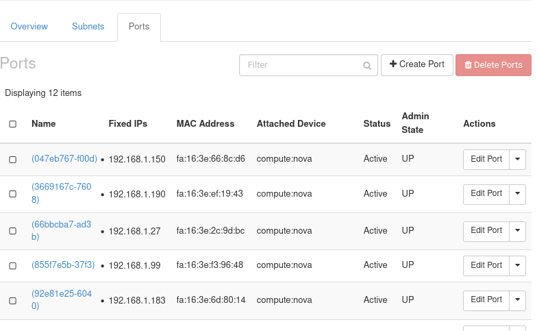
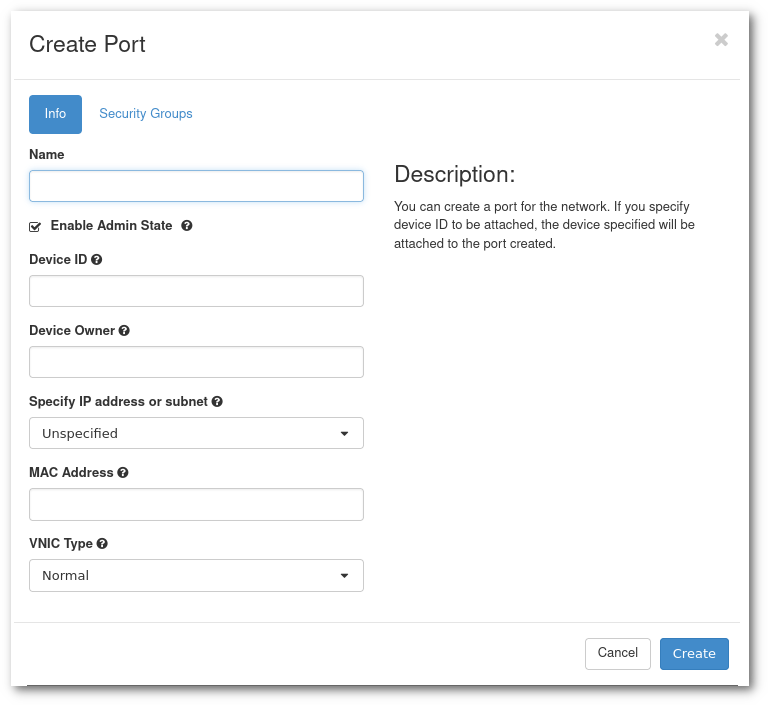
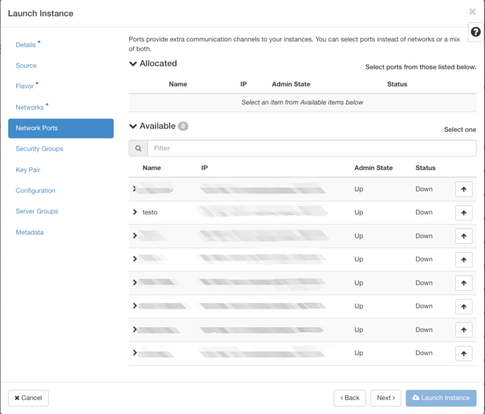

# Create a fixed IP for a VM

## Introduction

It is a simple process to know/fix the IP address of the VM before launching it. Also, IP can be reserved if you want to re-launch a VM.

### Fix IP address before launching a VM

Follow the procedure:

1. In menu of your project, go to **Networks** and Click on the `project_XXXXXXX-network` link, where XXXXXXX is your project number.

    

1. Go to **Ports** tab and click on **Create Port** in right-top corner.

    

1. A dialog box like this one should appear:

    

    - A **Name**, any descriptive name is fine
    - In **Specify IP address or subnet**, select **Fixed IP address or subnet**.
    - A new new field called **Fixed IP Address** will appear, enter there the IP address.
    - And finally click **Create**.

1. Now, while launching an instance, got to **Network Ports** and use this port. 

     

### Reserve IP to re-launch a VM

The procedure is almost the same with only few additional steps:

1. Write down the IP and the list of security groups of the current VM.

2. Shutdown the VM.

3. Take a snapshot.

4. Click on **Ports** in network of your project.

5. Delete the port corresponding to the IP of your current VM, if present. We need to delete the port because it is auto generated and cannot be re-assigned to any other VM than to the one that is currently assigned. The delete button is under Actions. 

6. Now, create a port as mentioned above (on [Fix IP address before launching a VM](#fix-ip-address-before-launching-a-vm)).

