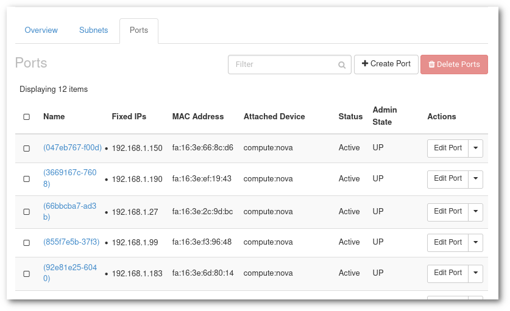

# Create a fixed IP for a VM

## Introduction

It is a simple process to know/fix the IP address of the VM before launching it. Also, IP can be reserved if you want to re-launch a VM.

### Fix IP address before launching a VM

Follow the procedure:

1. In menu of your project, go to **Networks** and Click on the `project_XXXXXXX-network` link, where XXXXXXX is your project number.

2. Go to **Ports** tab and click on **Create Port** in right-top corner.

3. A dialog box should apear as shown in next image. Enter the name and click **Create**.

4. Now, while launching an instance, got to **Network Ports** and use this port. 

 

### Reserve IP to re-launch a VM
Procedure is almost same with few additional steps:

1. Write down the IP and the list of security groups of the current VM.

2. Shutdown the VM.

3. Take a snapshot.

4. Click on **Ports** in network of your project.

5. Delete the port corresponding to the IP of your current VM. This is because that port is auto generated and cannot be assigned to any other VM than the one that is currently assigned. The delete button is under Actions. 

6. Now, create a port as mentioned above. Here, in **Specify IP address or subnet**, change it to **Fixed IP Address**. A new field will appear, input there the IP of you current VM.

7. Use this port while launching a VM. 

