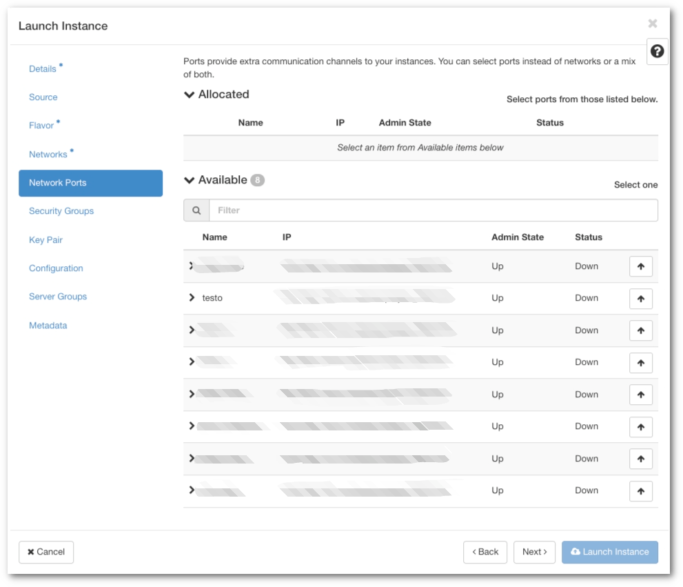

# Luo kiinteä IP-osoite VM:lle { #create-a-fixed-ip-for-a-vm }

## Johdanto { #introduction }

VM:n IP-osoitteen voi helposti määrittää kiinteäksi ennen sen käynnistämistä. Lisäksi IP-osoitteen voi varata, jos haluat käynnistää VM:n uudelleen.

### Määritä IP-osoite kiinteäksi ennen VM:n käynnistämistä { #fix-ip-address-before-launching-a-vm }

Toimi seuraavasti:

1. Projektisi valikossa siirry kohtaan **Networks** ja napsauta linkkiä `project_XXXXXXX-network`, jossa XXXXXXX on projektisi numero.

2. Siirry **Ports**-välilehdelle ja napsauta oikeassa yläkulmassa **Create Port**.

3. Valintaikkuna avautuu kuten seuraavassa kuvassa. Anna nimi ja napsauta **Create**.

4. Nyt instanssia käynnistäessä siirry kohtaan **Network Ports** ja käytä tätä porttia. 

 

### Varaa IP VM:n uudelleenkäynnistystä varten { #reserve-ip-to-re-launch-a-vm }
Menettely on lähes sama, mutta sisältää muutamia lisävaiheita:

1. Kirjoita ylös nykyisen VM:n IP-osoite ja sen suojausryhmien luettelo.

2. Sammuta VM.

3. Ota tilannekuva.

4. Klikkaa projektisi verkon kohdalla **Ports**.

5. Poista nykyisen VM:n IP-osoitteeseen liittyvä portti. Tämä portti on luotu automaattisesti eikä sitä voi liittää mihinkään muuhun VM:ään kuin siihen, johon se on tällä hetkellä liitetty. Poistopainike löytyy kohdasta **Actions**. 

6. Luo nyt portti edellä kuvatulla tavalla. Muuta kohdassa **Specify IP address or subnet** valinnaksi **Fixed IP Address**. Näkyviin tulee uusi kenttä; syötä siihen nykyisen VM:si IP-osoite.

7. Käytä tätä porttia VM:ää käynnistettäessä.