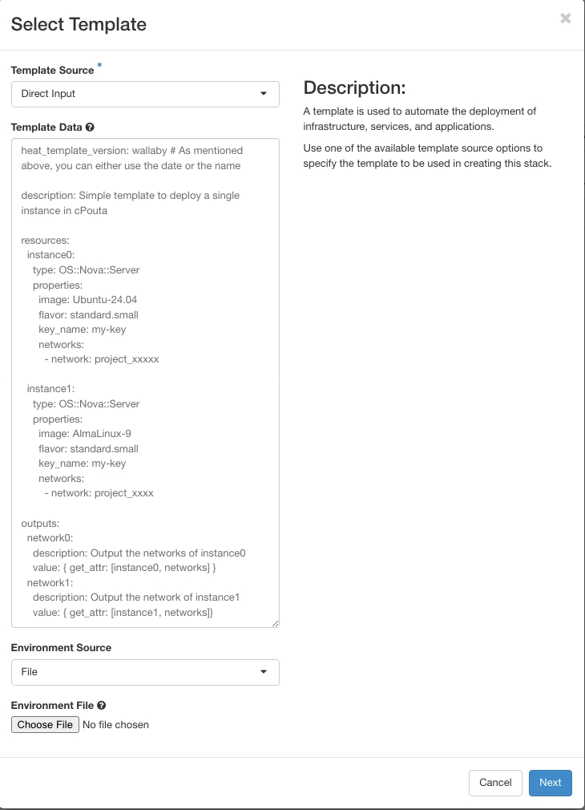

# Orkestrointi Heatilla { #orchestration-with-heat }

Tässä artikkelissa esitellään Poutassa käytettävissä oleva OpenStack Heat -pohjainen virtuaalikonepalveluiden orkestrointi.

Voit käyttää tätä ominaisuutta verkkokäyttöliittymän vasemman reunan paneelista tai OpenStack- tai Heat-komentorivityökalulla. Orkestrointi tarjoaa helpon tavan luoda koko infrastruktuuri uudelleenkäytettävän ja ihmisen luettavan mallin avulla. Malli voi kuvata monia infrastruktuurin komponentteja, kuten palvelimia, levyjä ja julkisia (floating) IP-osoitteita. Samassa tiedostossa levyt ja IP-osoitteet voidaan liittää tiettyihin instansseihin. Malli voi myös määrittää useita instansseja liitettynä tiettyihin verkkoihin siten, että osalla on julkiset IP-osoitteet ja osalla levy liitettynä. Tiedostoa voidaan käyttää myös olemassa olevan infrastruktuurin muokkaamiseen.

### Orkestrointi verkkokäyttöliittymän kautta { #orchestration-via-the-web-user-interface }

!!! info

    Sinun tulisi käyttää Heat-mallin versiona "2021-04-16" ("wallaby") tai vanhempaa [Heat template version](https://docs.openstack.org/heat/latest/template_guide/hot_spec.html#wallaby). Uusimpien malliversioiden ominaisuudet eivät välttämättä ole tuettuja. 

Nämä ohjeet esittävät yksinkertaisen esimerkin pinon (stack) luomisesta verkkokäyttöliittymän kautta. Luodaksesi Heat-pinon klikkaa _Orchestration_-valikon "Stacks"-linkkiä. Avautuvassa näkymässä näet kaikki olemassa olevat pinot ja painikkeen "Launch Stack" uuden pinon käynnistämiseen. Ikkunassa, joka avautuu "Launch Stack" -painiketta napsautettaessa, voit ladata aiemmin tekemäsi mallin tai aloittaa pinon määrittelyn. Mallin valinta on pakollista, ja mallin voi myös antaa suoraan tekstikenttään kuten alla olevassa kuvassa. Huomaa, että kuvassa on kelvollinen, joskin yksinkertainen malliesimerkki, joka luo kaksi instanssia ja näyttää ensimmäisen instanssin IP-osoitteen.

  

Tässä esimerkki:  
```yaml
heat_template_version: wallaby # As mentioned above, you can either use the date or the name

description: Simple template to deploy a single instance in cPouta

resources:
  instance0:
    type: OS::Nova::Server
    properties:
      image: Ubuntu-24.04
      flavor: standard.small
      key_name: my-key
      networks:
        - network: project_xxxxx

  instance1:
    type: OS::Nova::Server
    properties:
      image: AlmaLinux-9
      flavor: standard.small
      key_name: my-key
      networks:
        - network: project_xxxx

outputs:
  network0:
    description: Output the networks of instance0
    value: { get_attr: [instance0, networks] }
  network1:
    description: Output the network of instance1
    value: { get_attr: [instance1, networks]}
```

Kun valitset "Next", verkkokäyttöliittymä pyytää pinon nimen ja salasanasi. Tämän jälkeen voit käynnistää pinon. Kun pino on rakennettu, sitä voi hallita orkestroinnin _Stacks_-näkymästä. Pinossa luodut kohteet löytyvät omista valikoistaan. Tässä tapauksessa kaksi instanssia näkyvät ja niitä voi hallita instanssien valikossa. Pinon Overview-välilehdellä (Orchestration -&gt; Stacks -&gt; klikkaa pinoa) näet myös "outputs"-osiossa määritetyt tulosteet esimerkin mukaisesti. Poistaaksesi kaikki pinon luomat komponentit, paina "Delete Stack" Stacks-sivulla.

### Orkestroinnin käyttö komentorivityökalulla { #using-orchestration-with-the-command-line-client }

!!! info

    Varmista, että `python-heatclient` on asennettu. Voit asentaa sen komennolla `pip install python-heatclient` (https://pypi.org/project/python-heatclient/)

Heatia voi käyttää OpenStackin komentorivityökalulla, ja toistaiseksi voit käyttää myös vanhentunutta Heat-komentorivityökalua. Luo pino komentoriviltä:

```sh
openstack stack create -t /path/to/my/stack.yml my-heat-stack
```

Näytä uuden pinon tiedot muiden pinojen joukossa komennolla `openstack stack list`:

    openstack stack list
    +--------------------------------------+---------------+-----------------+----------------------+--------------+
    | ID                                   | Stack Name    | Stack Status    | Creation Time        | Updated Time |
    +--------------------------------------+---------------+-----------------+----------------------+--------------+
    | 98077bd5-9d69-47c3-98db-b0e19a60b1fa | my-heat-stack | CREATE_COMPLETE | 2016-06-08T07:34:46Z | None         |
    +--------------------------------------+---------------+-----------------+----------------------+--------------+

### Selitykset { #explanations }
Malli koostuu kahdesta pääosiosta:  
- Käytetty versio (`heat_template_version`)  
- Resurssit (`resources`)  

Lisäksi on valinnaisia osioita, kuten:  
- Kuvaus (`description`)  
- Parametriryhmät (`parameter_groups`)  
- Parametrit (`parameters`)  
- Tulosteet (`outputs`)  
- Ehdot (`conditions`)  

Alla on tarkempi kuvaus kustakin osiosta:  

`heat_template_version`  
    Ilmaisee, että YAML-asiakirja on HOT (Heat Orchestration Template) -malli määritetyllä versiolla.

`description`  
    Mahdollistaa mallin kuvauksen antamisen.

`parameter_groups`  
    Mahdollistaa syöteparametrien ryhmittelyn ja järjestyksen määrittelyn.

`parameters`  
    Mahdollistaa syöteparametrien määrittelyn, jotka on annettava mallin instansioinnin yhteydessä.

`resources`  
    Sisältää mallin yksittäisten resurssien määrittelyt.

`outputs`  
    Mahdollistaa tulosteparametrien määrittelyn, jotka ovat saatavilla mallin instansioinnin jälkeen.

`conditions`  
    Sisältää lausekkeita, joilla voidaan rajoittaa, milloin resurssi luodaan tai milloin ominaisuus määritellään.

### Edistynyt esimerkki: luo malli yhden tai useamman instanssin luontiin { #advanced-example-create-a-template-to-build-one-or-more-instances }
Suunnitelma:  
- Luo OpenStack Heatia varten parametrityt tiedosto.  
- Luo kaksi OpenStack Heat -mallia: toinen instanssien määrälle (OS::Heat::ResourceGroup) ja toinen käyttöönoton määrittelylle.  
- Luo Ansible-skripti käyttöönoton automatisointiin.  

!!! info

    Seuraavat työkalut on oltava asennettuna:  
    - [Ansible](https://docs.ansible.com/ansible/latest/installation_guide/intro_installation.html)  
    - python-openstackclient (`pip install python-openstackclient`)  
    - python-heatclient (`pip install python-heatclient`)  

Ensin voit luoda tiedoston `heat_params.yaml`, joka sisältää instanssiasi varten käytettäviä muuttujia. Käytä omia arvojasi:  

```yaml
parameter_defaults:
  ssh_key_name:
  vm_flavor:
  vm_image:
  vm_network:
  count:
```

Toiseksi, kaksi OpenStack Heat -mallia. Ensimmäiseen otamme aiemman esimerkin pienin muutoksin. Nimeämme sen `heat_stack_vm.yaml`:  

```yaml
heat_template_version: wallaby # As mentioned above, you can either use the date or the name

description: Simple template to deploy a single or several instance(s) in cPouta

parameters: # Since we created a heat_params.yaml, they will be retrieved from this file
  ssh_key_name:
    description: SSH key name
    type: string
  vm_name:
    description: Name for the VM
    type: string
  vm_flavor:
    description: Flavor for the VM
    type: string
  vm_image:
    description: Image for the VM
    type: string
  vm_network:
    description: Network for the VM
    type: string

resources:
  instance:
    type: OS::Nova::Server
    properties:
      name: { get_param: vm_name } # This value will be retrieved from servers_group.yaml file. See after.
      image: { get_param: vm_image }
      flavor: { get_param: vm_flavor }
      key_name: { get_param: ssh_key_name }
      networks:
        - network: { get_param: vm_network }

outputs:
  network:
    description: Output the networks of instance
    value: { get_attr: [instance, networks] }
```

Kolmanneksi luomme tiedoston `servers_group.yaml`, [ResourceGroupin](https://docs.openstack.org/heat/latest/template_guide/openstack.html#OS::Heat::ResourceGroup), jonka avulla voimme skaalata instansseja:  

```yaml
heat_template_version: wallaby

description: Resource Group to deploy one or several instance(s)

parameters: # Parameter retrieves from heat_params.yaml file.
  count:
    description: Number of resources
    type: string

resources:
  instances_group:
    type: OS::Heat::ResourceGroup
    properties:
      count: { get_param: count }
      resource_def:
        type: heat_stack_vm.yaml # We defined our previous template.
        properties:
          vm_name: test-stack-%index% # Value %index% will be increased if more than one vm is created.

outputs:
  print_out:
    value: { get_attr: [instances_group, network] }
```

Lopuksi luomme Ansible-skriptin, joka rakentaa ja ottaa käyttöön VM:t. Nimetään se `build-heat-stack.yaml`:  

```yaml
- hosts: localhost
  gather_facts: false
  vars:
    heat_environment_file: "heat_params.yaml" # Be sure that the file is located at the same level as build-heat-stack.yaml

  tasks:
    - name: Build a Heat stack VM
      register: heat_stack
      os_stack:
        name: "{{ stack_name }}"
        state: present
        template: "servers_group.yaml" # Be sure that the file is located at the same level as build-heat-stack.yaml
        environment: 
          - "{{ heat_environment_file }}"

    - name: Print out network
      debug:
        var: heat_stack
```

Lataa cPouta-projektisi (`source project_xxxxx.sh`) ja suorita komento:   
```sh
ansible-playbook -e stack_name="test-stack" build-heat-stack.yaml`
```

Jos kaikki meni hyvin, voit tarkistaa, että pino luotiin joko cPoudan web-käyttöliittymästä tai komennolla: `openstack stack list`.  
Voit myös tarkistaa luodut instanssit: `openstack server list`.  

Jos poistat pinon, myös kaikki sen luomat resurssit poistetaan.

### Heat-ohjeet ja komentoviitteet { #heat-guidelines-and-command-references }

Lisätietoja löytyy OpenStackin [Heat-wikistä](https://wiki.openstack.org/wiki/Heat). OpenStackin komentorivityökalun täydellinen viite löytyy [komentoriviviitteestä](http://docs.openstack.org/cli-reference/openstack.html).  
Esimerkki GitHubissa yhden tai useamman instanssin käyttöönotosta nginxin kanssa: [Lue lisää GitHub-reposta](https://github.com/CSCfi/heat-openstack-example){ target="_blank" }