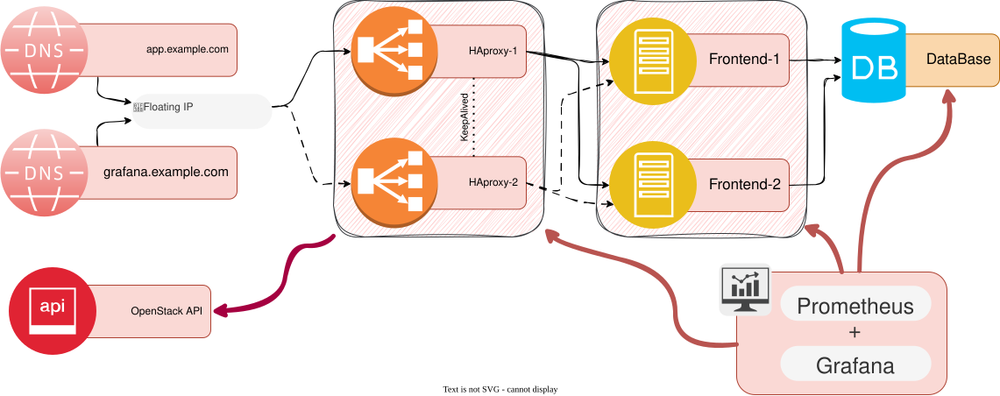

# How to deploy a High Available application in Pouta

This is a simple High Available web application deployment in Pouta. We have a similar tutorial for [High availability](../../rahti/tutorials/intermediate/high-availability.md) in Rahti.

## Schema


In the schema above you can see the end result that you will achieve at the end of this tutorial. We will deploy two URLs, one for the application itself (`app.example.com`), and the other for the monitoring dashboard(s) (`grafana.example.com`). The application runs on the Frontend VMs, we will create two replicas. The frontend is connected to a Postgres database running on [CSC's Pukki database on demand service](../../dbaas/index.md). The monitoring is provided by Grafana and Prometheus, two very commonly used software solutions for monitoring. Prometheus gathers the metrics exposed by the frontend and Grafana show the data in nice graphs.

We will deploy each part step by step, and describe them in more detail while doing so.

## Manual deployment

### Create the VMs

We will start by creating 4 VMs: `HAProxy-1`, `HAProxy-2`, `Frontend-1`, `Frontend-2` and `Monitoring`. You can follow the [create a new VM](../launch-vm-from-web-gui.md) guide. We are creating all VMs from the start so we get the IPs of each of them, this will make the networking configuration easier. Few notes:

* In order to save quota and resources, please use the smallest flavor available.
* We only need one single **floating IP** for the whole deployment and it will be initially assigned to `HAProxy-1`.
* Make sure you can SSH into `HAProxy-1`. If in doubt, you can use the [Connecting to your virtual machine](../connecting-to-vm.md) guide. We will use this machine as a SSH jumphost to connect to the other VMs.

In order to be able to SSH easily to each machine we will create a SSH config file:

```sh
mkdir -p ~/.ssh/config.d/
cat >~/.ssh/config.d/pouta-ha-tutorial <<EOF
Host HAProxy-1
    User ubuntu # Replace if not using an Ubuntu distribution
    Hostname <floating_IP> # Replace by the floating IP

Host HAProxy-2
    User ubuntu
    ProxyJump HAProxy-1
    Hostname <private_IP> # Replace by the private IP

Host Frontend-1
    User ubuntu
    ProxyJump HAProxy-1
    Hostname <private_IP> # Replace by the private IP

Host Frontend-2
    User ubuntu
    ProxyJump HAProxy-1
    Hostname <private_IP> # Replace by the private IP

Host Monitoring
    User ubuntu
    ProxyJump HAProxy-1
    Hostname <private_IP> # Replace by the private IP
EOF
```

After this, you will be able to ssh to any VM by just running:

```sh
ssh Frontend-2
```

### Load Balancer

For Load balancing, we will use two HAProxy VMs with [Keepalived](https://www.keepalived.org/) to achieve high availability at the load balancer layer. Keepalived uses the VRRP protocol to share a single Virtual IP (VIP) between the two HAProxy nodes, if `HAproxy-1` goes down, `HAproxy-2` takes over the Floating IP automatically using the OpenStack API.

#### Install and configure HAProxy

1. SSH into `HAproxy-1` and install HAProxy, Keepalived, and the OpenStack CLI:

    ```sh
    sudo apt update && sudo apt install -y haproxy keepalived python3-openstackclient
    ```

1. Edit `/etc/haproxy/haproxy.cfg` on `HAproxy-1` (repeat on `HAproxy-2` with the same content):

    ```
    global
        log /dev/log local0
        maxconn 4096

    defaults
        log     global
        mode    http
        option  httplog
        option  dontlognull
        timeout connect 5s
        timeout client  30s
        timeout server  30s

    frontend http_front
        bind *:80
        default_backend http_back

    backend http_back
        balance roundrobin
        option httpchk GET /
        server frontend1 <FRONTEND_1_IP>:5000 check
        server frontend2 t <FRONTEND_2_IP>:5000 check
    ```

    You will replace `<FRONTEND_1_IP>` and `<FRONTEND_2_IP>` with the internal IP addresses of `Frontend-1` and `Frontend-2`.

1. Enable and start the HAProxy service to apply the configuration:

    ```sh
    sudo systemctl enable --now haproxy
    ```

#### Configure Keepalived

1. Create the failover script `/etc/keepalived/failover.sh` on both HAProxy VMs. This script moves the Floating IP to whichever node becomes MASTER using the OpenStack CLI:

    ```sh
    #!/bin/bash
    STATE=$3
    FLOATING_IP_ID="<FLOATING_IP_ID>"

    if [ "$STATE" = "MASTER" ]; then
        MY_PORT=$(openstack port list --server $(hostname) -f value -c ID | head -1)
        openstack floating ip set --port "$MY_PORT" "$FLOATING_IP_ID"
    fi
    ```

    !!! Info "Application credentials"
        The script requires valid OpenStack credentials on each HAProxy VM. Create an [application credential](../application-credentials.md) and configure it in `/etc/openstack/clouds.yaml` on both nodes.

    !!!Info "Floating IP ID"
        You can get the floating IP ID by running:
        `openstack port list --server HAProxy-1`

1. Make the script executable:

    ```sh
    sudo chmod +x /etc/keepalived/failover.sh
    ```

1. On `HAproxy-1`, create `/etc/keepalived/keepalived.conf`:

    ```
    vrrp_script chk_haproxy {
        script "systemctl is-active haproxy"
        interval 2
        weight -20
    }

    vrrp_instance VI_1 {
        state MASTER
        interface ens3
        virtual_router_id 51
        priority 100
        advert_int 1
        authentication {
            auth_type PASS
            auth_pass changeme
        }
        track_script {
            chk_haproxy
        }
        notify /etc/keepalived/failover.sh
    }
    ```

1. On `HAproxy-2`, use the same file but set `state BACKUP` and `priority 90`.

1. Enable and start Keepalived on both nodes:

    ```sh
    sudo systemctl enable --now keepalived
    ```

#### Open Security Group ports

In the Pouta web interface, add the following security group rules:

| VM | Protocol | Port | Source |
|---|---|---|---|
| HAproxy-1, HAproxy-2 | TCP | 80 | 0.0.0.0/0 |
| HAproxy-1, HAproxy-2 | 112 (VRRP) | - | Internal network |
| Frontend-1, Frontend-2 | TCP | 5000 | Internal network |

For more reference on [Security Groups](../networking.md#security-groups), check out our documentation.

### Database

The database is provided by [Pukki DBaaS](../../dbaas/index.md), CSC's managed PostgreSQL service. Using Pukki removes the need to manage database replication and backups yourself.

1. Follow the [Pukki getting started guide](../../dbaas/index.md) to create a new PostgreSQL instance. When creating it:
    - Note the public IP
    - Create a database and a user, for example called `postgres` (user) and `postgres` (database) to match the defaults used in this tutorial.
    - Set a good password for the database user

1. Allow the Frontend VMs to connect to Pukki. In the Pukki web interface, add the **internal IP addresses** of `Frontend-1` and `Frontend-2` to the allowed hosts list.

### Frontend VMs

We will install the following test application:

- <https://github.com/CSCfi/rahti-ha-tutorial/>

It is the same repository used for the Rahti tutorial mentioned before. It contains all the necessary files to also run it in Pouta. You can clone it in your local machine and check out the code, it is a simple Python application.

!!! Info "Frontend 1 and 2"
    You need to make these changes in `Frontend-1` and `Frontend-2`.

1. Make sure that `git` is installed and then clone the repository mentioned above:

    ```sh
    sudo apt install -y git
    git clone https://github.com/CSCfi/rahti-ha-tutorial /opt/rahti-ha-tutorial
    ```

1. Install Python 3 and the application dependencies:

    ```sh
    sudo apt update && sudo apt install -y python3 python3-pip netcat-openbsd
    cd /opt/rahti-ha-tutorial
    pip3 install -r requirements.txt
    ```

1. The application reads the database connection from environment variables. Create a file to store them:

    ```sh
    sudo cat >/opt/rahti-ha-tutorial/.env <<EOF
    DB_HOST=<PUKKI_DB_HOST>
    DB_PORT=5432
    DB_USER=postgres
    DB_PASSWORD=<DB_PASSWORD>
    DB_NAME=postgres
    EOF
    ```

    !!! Note
        Leave `DB_HOST` and `DB_PASSWORD` as a placeholders for now. We will fill in the actual values after creating the Pukki database in the next section.

1. Create a systemd service so the application starts automatically and restarts on failure:

    ```sh
    sudo tee /etc/systemd/system/ha-tutorial.service > /dev/null <<'EOF'
    [Unit]
    Description=HA Tutorial Flask App
    After=network.target

    [Service]
    User=ubuntu
    WorkingDirectory=/opt/rahti-ha-tutorial
    EnvironmentFile=/opt/rahti-ha-tutorial/.env
    ExecStart=/usr/bin/python3 app.py
    Restart=always
    RestartSec=5

    [Install]
    WantedBy=multi-user.target
    EOF

    sudo systemctl daemon-reload
    sudo systemctl enable --now ha-tutorial
    ```

Point your DNS records (or local `/etc/hosts` for testing) to the Floating IP of the load balancer:

```
<FLOATING_IP>  app.example.com
<FLOATING_IP>  grafana.example.com
```

Verify the application is reachable through the load balancer:

```sh
curl http://app.example.com/
```

### Monitoring

For monitoring we will use Prometheus to collect metrics from the Frontend VMs and Grafana to visualize them. Both will run on a dedicated `Monitoring` VM.

#### Install the software

1. SSH into the `Monitoring` VM and install Prometheus:

    ```sh
    sudo apt update && sudo apt install -y prometheus
    ```

1. For Grafana, add the official repository and install it:

    ```sh
    sudo apt install -y apt-transport-https software-properties-common
    wget -q -O - https://packages.grafana.com/gpg.key | sudo apt-key add -
    echo "deb https://packages.grafana.com/oss/deb stable main" | \
        sudo tee /etc/apt/sources.list.d/grafana.list
    sudo apt update && sudo apt install -y grafana
    ```

#### Configure Prometheus

Edit `/etc/prometheus/prometheus.yml` to scrape the Flask application metrics from both Frontend VMs:

```yaml
global:
  scrape_interval: 15s

scrape_configs:
  - job_name: 'ha-tutorial'
    static_configs:
      - targets:
          - '<FRONTEND_1_IP>:5000'
          - '<FRONTEND_2_IP>:5000'
```

Restart Prometheus:

```sh
sudo systemctl enable --now prometheus
```

#### Configure Grafana

1. Start Grafana:

    ```sh
    sudo systemctl enable --now grafana-server
    ```

1. Access Grafana through an SSH tunnel from your local machine:

    ```sh
    ssh -L 3000:localhost:3000 ubuntu@<MONITORING_VM_IP>
    ```

    Open <http://localhost:3000> in your browser. The default credentials are `admin`/`admin`.

1. Add Prometheus as a data source: go to **Connections → Data sources → Add data source**, select **Prometheus**, and set the URL to `http://localhost:9090`. Click **Save & test**.

1. Go to **Explore**, select the Prometheus data source, and enter the query:

    ```
    rate(flask_app_request_count_total[5m])
    ```

    You will see the request rate per second for each Frontend instance, similar to what we saw in the Rahti tutorial.

!!! Note
    To expose Grafana externally through the load balancer, add a second HAProxy frontend on port 3000 (or another dedicated port) that proxies to the Monitoring VM, and point `grafana.example.com` to the Floating IP.

## Automated deployment with Ansible

All of the manual steps above can be automated with the Ansible playbooks in the [ha-ansible](https://github.com/lvarin/ha-ansible) repository. Clone it first:

```sh
git clone https://github.com/lvarin/ha-ansible.git
cd ha-ansible
```

### Prerequisites

- Ansible ≥ 2.14 on your local machine
- OpenStack credentials sourced:

    ```sh
    source <project>-openrc.sh
    ```

- An SSH key pair registered in Pouta, with the private key available locally
- Python `openstackclient` available locally (for ad-hoc queries)
- A working database, we recommend [Pukki DBaaS](../../dbaas/index.md), but any PostgreSQL database works. You will need: `db_host`, `db_port`, `db_user`, `db_password`, and `db_name`.

Install the required Ansible collection:

```sh
ansible-galaxy collection install -r requirements.yml
```

### Configure variables

Edit `group_vars/all.yml` and replace every `REPLACE_WITH_*` placeholder:

| Variable | Description |
|---|---|
| `project_cidr` | Your Pouta project network CIDR (e.g. `192.168.1.0/24`) |
| `keepalived_auth_pass` | Shared VRRP password (choose any strong password) |
| `os_project_id` / `os_project_name` | Your OpenStack project |
| `os_username` / `os_password` | OpenStack credentials for the failover script |
| `db_host` / `db_password` | Pukki DBaaS connection details (see [Database](#database)) |

!!! Note
    The `floating_ip_id` variable is filled in after Step 2.

### Provision infrastructure

```sh
ansible-playbook create_infra.yml
```

The playbook prompts for:

- **SSH key pair name**, as registered in the Pouta dashboard
- **Project network name**, your project's internal network

When it finishes it prints a summary like:

```
inventory.ini
  haproxy1   ansible_host=<FLOATING_IP>
  haproxy2   ansible_host=<HAPROXY_2_PRIVATE_IP>
  frontend1  ansible_host=<FRONTEND_1_PRIVATE_IP>
  frontend2  ansible_host=<FRONTEND_2_PRIVATE_IP>
  monitoring ansible_host=<MONITORING_PRIVATE_IP>

group_vars/all.yml
  frontend_1_ip: <FRONTEND_1_PRIVATE_IP>
  frontend_2_ip: <FRONTEND_2_PRIVATE_IP>
  floating_ip_id: (run: openstack floating ip list)
```

Get the floating IP UUID and add it to `group_vars/all.yml`:

```sh
openstack floating ip list
```

| Variable | Description |
|---|---|
| `floating_ip_id` | UUID of the floating IP from the command above |

### Create the Pukki database

Follow the [Database](#database) section above to create the Pukki PostgreSQL instance, then fill in `db_host` and `db_password` in `group_vars/all.yml`.

### Configure all VMs

```sh
ansible-playbook -i inventory.ini site.yml
```

This single run configures all five VMs in three plays:

1. **HAProxy play**, installs HAProxy, Keepalived, and the OpenStack CLI; deploys the load-balancer config and the VRRP failover script.
2. **Frontend play**, clones the [rahti-ha-tutorial](https://github.com/CSCfi/rahti-ha-tutorial) Flask app and runs it as a systemd service.
3. **Monitoring play**, installs Prometheus and Grafana.

### Teardown

To destroy all provisioned resources, set `state: absent` in `group_vars/all.yml` and re-run:

```sh
ansible-playbook -i inventory.ini create_infra.yml
```

### File reference

```
.
├── create_infra.yml       # Provision VMs, security groups, and floating IP
├── site.yml               # Configure all VMs
├── inventory.ini          # Host list and SSH settings
├── requirements.yml       # Ansible collection dependencies
├── group_vars/
│   └── all.yml            # All variables (fill in REPLACE_WITH_* values)
└── templates/
    ├── haproxy.cfg.j2          # HAProxy load-balancer config
    ├── keepalived.conf.j2      # VRRP config (master/backup priority)
    ├── failover.sh.j2          # Keepalived notify script (reassigns floating IP)
    ├── clouds.yaml.j2          # OpenStack credentials for the failover script
    ├── ha-tutorial.env.j2      # Flask app environment variables
    ├── ha-tutorial.service.j2  # systemd unit for the Flask app
    └── prometheus.yml.j2       # Prometheus scrape config
```

## Conclusion

This tutorial shows how to build a highly available web application stack on Pouta using standard open-source tools. Unlike Rahti, where the platform handles load balancing, container orchestration, and health checks automatically, on Pouta you have full control, and full responsibility — over each layer:

- **HAProxy + Keepalived**: provide load balancing and automatic VIP failover at the network layer.
- **Frontend VMs**: run the application with automatic restarts via systemd.
- **Pukki DBaaS**: provides a managed, reliable PostgreSQL backend without the complexity of self-managed replication.
- **Prometheus + Grafana**: collect and visualize application metrics from all Frontend instances.

There are several ways this deployment can be expanded:

- Add HTTPS termination to HAProxy using Let's Encrypt certificates (e.g. with Certbot).
- Add Grafana alerting to notify you when the error rate spikes or a backend becomes unavailable.
- Replace the local Prometheus storage with a persistent Cinder volume so metrics survive a VM rebuild or deletion.
