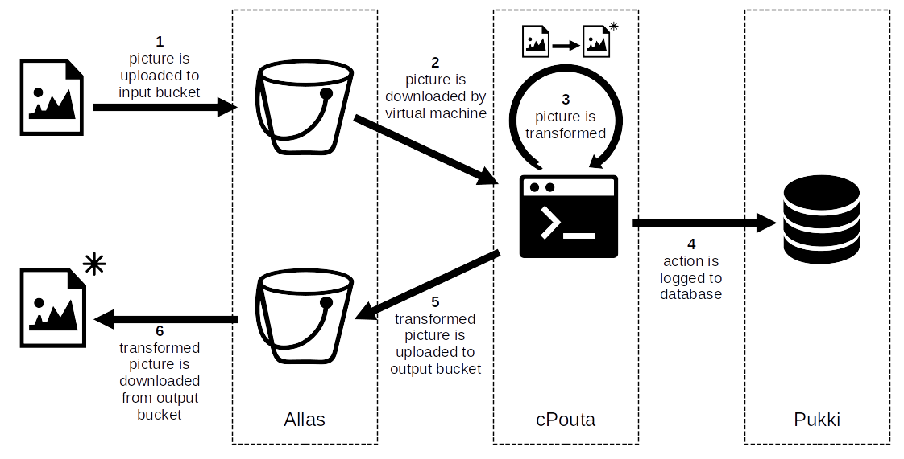

# Setting up a pipeline for images

## Objectives

* Get familiarity on how to use multiple cloud services together.
* Get familiarity on how to use cloud services using their command-line interfaces.

The tutorial focuses on the following services:

* [Allas](../../../data/Allas/introduction.md), our object storage service
* [cPouta](../index.md), our public cloud service
* [Pukki](../../dbaas/what-is-dbaas.md), our on-demand database service

## Introduction

We want to set up a simple pipeline which transforms the images that are given in input to it.



First, we upload our images from our workstation to a bucket in Allas.
A virtual machine in cPouta takes the images from the bucket and downloads them locally.
The virtual machine transforms the images and logs the completed action to a database hosted in Pukki.
Finally, the virtual machine uploads the transformed images to another bucket in Allas.
We can then download from the bucket the transformed images to our workstation.

For the sake of this tutorial, the transformed image simply corresponds to the input image whose colors have been inverted, sometimes also called "reversed".

## Step 1: creating buckets in Allas

We open a new terminal window, to which we will refer using the name `terminal_A`.
We use `terminal_A` for all the commands dealing with Allas.

To create buckets in Allas, we need to have a working command-line interface for it.
If we haven't set up such interface before on our workstation, we follow the [instructions on how to install and configure s3cmd](../../../data/Allas/using_allas/s3_client.md#getting-started-with-s3cmd).

We can test the correct functioning of the command-line interface by simply listing all the buckets currently in our project.
An example of the command and its expected output follows:
```
$ s3cmd ls
2021-07-14 15:14  s3://bucket1
2020-01-14 17:40  s3://bucket2
...
```
Please note that the list can also be empty, if we haven't created any bucket in our project before.

We create the input and the output buckets for our pipeline using the following commands:
```
$ s3cmd mb s3://input_bucket
Bucket 's3://input_bucket/' created
$ s3cmd mb s3://output_bucket
Bucket 's3://output_bucket/' created
```

!!! warning
    Bucket names must be unique.
    If another user has already selected the same name, bucket creation command will fail:
    ```
    $ s3cmd mb s3://input_bucket
    ERROR: Bucket 'input_bucket' already exists
    ERROR: S3 error: 409 (BucketAlreadyExists)
    ```
    In such case, we can just select a different name and retry the command.

In the rest of the tutorial, we assume:

* the name of the bucket used for uploading images to the pipeline is `input_bucket`
* the name of the bucket used by the pipeline to make available its outputs is `output_bucket`

## Step 2: creating a database in Pukki

We open a second terminal window, to which we will refer using the name `terminal_B`.
We use `terminal_B` for all the commands dealing with Pukki.

Having a working command-line interface for Pukki is a prerequisite for continuing with the tutorial.
If we haven't set it up before, we follow the [instructions on how to install and configure Pukki command-line interface](../../dbaas/cli.md#getting-started).

We can test the correct functioning of the command-line interface by simply listing the available types of database.
An example of the command and its expected output follows:
```
$ openstack datastore list
+--------------------------------------+------------+
| ID                                   | Name       |
+--------------------------------------+------------+
| 71920375-6967-466e-b955-8ee8629312b7 | postgresql |
| 1a8efda2-7bb7-4c52-9eab-e251fd18323c | mariadb    |
+--------------------------------------+------------+
```

We now create the database that we will use to log the actions of the pipeline by issuing the following command:
```
$ openstack database instance create pipeline_db_instance \
--flavor standard.small \
--databases pipeline_db \
--users db_admin:db_password \
--datastore postgresql \
--is-public \
--size 1
```

The output from the command should be similar to the following:
```
+--------------------------+--------------------------------------+
| Field                    | Value                                |
+--------------------------+--------------------------------------+
| allowed_cidrs            | []                                   |
| created                  | 2025-02-04T13:08:51                  |
| datastore                | postgresql                           |
| datastore_version        | 17.2                                 |
| datastore_version_number | 17.2                                 |
| flavor                   | d4a2cb9c-99da-4e0f-82d7-3313cca2b2c2 |
| id                       | 2f347948-9460-4ac0-a588-32187c8b6ab1 |
| name                     | pipeline_db_instance                 |
| operating_status         |                                      |
| public                   | True                                 |
| region                   | regionOne                            |
| service_status_updated   | 2025-02-04T13:08:51                  |
| status                   | BUILD                                |
| updated                  | 2025-02-04T13:08:51                  |
| volume                   | 1                                    |
+--------------------------+--------------------------------------+
```

In the rest of the tutorial, we assume that:

* the name of the database instance in Pukki is `pipeline_db_instance`
* the name of the postgresql database is `pipeline_db`
* the username for the admin of the postgresql database is `db_admin`
* the password for the admin of the postgresql database is `db_password`

## Step 3: creating virtual machine in cPouta

We open a third terminal window, to which we will refer using the name `terminal_C`.
We use `terminal_C` for all the commands dealing with cPouta.

In the same way as for Allas and Pukki, to continue the tutorial we need to have a working command-line interface for cPouta as well.
We follow the [instructions on how to install and configure cPouta command-line interface](../install-client.md), if we haven't done it already.

!!! warning
    Although similar in many aspects, Pukki and cPouta command-line interfaces are different and cannot be used interchangeably.
    For example, running Pukki commands on the terminal configured for cPouta will result in the following error:
    ```
    public endpoint for database service in regionOne region not found
    ```
    Stick to using two different terminals to interact with them to avoid this type of issues.

We can test the correct functioning of the command-line interface by, for example, showing the properties of one of the flavors.
An example of the command and its expected output follows:
```
$ openstack flavor show standard.tiny
+----------------------------+--------------------------------------+
| Field                      | Value                                |
+----------------------------+--------------------------------------+
| OS-FLV-DISABLED:disabled   | False                                |
| OS-FLV-EXT-DATA:ephemeral  | 0                                    |
| access_project_ids         | None                                 |
| disk                       | 80                                   |
| id                         | 0143b0d1-4788-4d1f-aa04-4473e4a7c2a6 |
| name                       | standard.tiny                        |
| os-flavor-access:is_public | True                                 |
| properties                 | standard='true'                      |
| ram                        | 1000                                 |
| rxtx_factor                | 1.0                                  |
| swap                       |                                      |
| vcpus                      | 1                                    |
+----------------------------+--------------------------------------+
```

First, we create a keypair, which we will use to access the virtual machine once it is up and running.
To create a new keypair, we run the following command:
```
openstack keypair create mykeypair > mykeypair.pem
```

We check that the command has indeed created a file called `mykeypair.pem` in the current folder of our workstation.
```
$ ls mykeypair.pem
mykeypair.pem
```

We also restrict the permission of the just-created keypair file by issuing the following command:
```
$ chmod 600 mykeypair.pem
```

We now create the virtual machine that we will use for our pipeline.
The command we issue is the following:
```
$ openstack server create --flavor standard.tiny --image Ubuntu-24.04 --key-name mykeypair pipeline_vm
```

The output from the command should be similar to the following:
```
+-----------------------------+------------------------------------------------------+
| Field                       | Value                                                |
+-----------------------------+------------------------------------------------------+
| OS-DCF:diskConfig           | MANUAL                                               |
| OS-EXT-AZ:availability_zone |                                                      |
| OS-EXT-STS:power_state      | NOSTATE                                              |
| OS-EXT-STS:task_state       | scheduling                                           |
| OS-EXT-STS:vm_state         | building                                             |
| OS-SRV-USG:launched_at      | None                                                 |
| OS-SRV-USG:terminated_at    | None                                                 |
| accessIPv4                  |                                                      |
| accessIPv6                  |                                                      |
| addresses                   |                                                      |
| adminPass                   | gCUbcRtu26Ka                                         |
| config_drive                |                                                      |
| created                     | 2025-02-04T13:10:43Z                                 |
| flavor                      | standard.tiny (0143b0d1-4788-4d1f-aa04-4473e4a7c2a6) |
| hostId                      |                                                      |
| id                          | ae9f924b-f6c5-488c-b617-36809008e37e                 |
| image                       | Ubuntu-24.04 (bc68d79a-6dcc-446f-a8cd-c8313b885718)  |
| key_name                    | mykeypair                                            |
| name                        | pipeline_vm                                          |
| progress                    | 0                                                    |
| project_id                  | abcdef0123456789abcdef0123456789                     |
| properties                  |                                                      |
| security_groups             | name='default'                                       |
| status                      | BUILD                                                |
| updated                     | 2025-02-04T13:10:43Z                                 |
| user_id                     | timo                                                 |
| volumes_attached            |                                                      |
+-----------------------------+------------------------------------------------------+
```

In the rest of the tutorial we assume that the name of the virtual machine in cPouta is `pipeline_vm`.

## Step 4: configuring the pipeline

Now that we have built all the components, we configure them to work as a pipeline.
First, we configure the virtual machine to allow us to access it from our workstation.
Then, we make sure that the virtual machine can work with the buckets in Allas, as well as that our database instance in Pukki accepts traffic coming from the virtual machine.
Finally, we install and configure in the virtual machine the tools required to get the pipeline working.

### Allowing traffic from workstation to virtual machine

To prevent unauthorized access attempts, by default a virtual machine does not allow incoming traffic from the Internet.
Access to the virtual machine is regulated by means of _security groups_ and the rules they contain.
We thus create a new security group with a single rule, which allow access to the virtual machine from our workstation.

We go back to `terminal_C`.

First, we find what is the public ip address used by our workstation by typing the following command:
```
$ MY_IP=$(curl -4 ifconfig.me)

```

We create a new security group issuing the following command:
```
$ openstack security group create pipeline_security_group
```

Output will look like the following:
```
+-----------------+----------------------------------------------------------------------------------------------------------------------------------------------------------------------------+
| Field           | Value                                                                                                                                                                      |
+-----------------+----------------------------------------------------------------------------------------------------------------------------------------------------------------------------+
| created_at      | 2025-02-04T13:12:43Z                                                                                                                                                       |
| description     | pipeline_security_group                                                                                                                                                    |
| id              | a8630776-db3d-408a-ba8e-8c52b5f2a8c9                                                                                                                                       |
| location        | cloud='', project.domain_id='default', project.domain_name=, project.id='abcdef0123456789abcdef0123456789', project.name='project_*******', region_name='regionOne', zone= |
| name            | pipeline_security_group                                                                                                                                                    |
| project_id      | abcdef0123456789abcdef0123456789                                                                                                                                           |
| revision_number | 1                                                                                                                                                                          |
| rules           | created_at='2025-02-04T13:12:44Z', direction='egress', ethertype='IPv6', id='8e0cba6e-814d-4e70-92de-61389f9b6ca7', updated_at='2025-02-04T13:12:44Z'                      |
|                 | created_at='2025-02-04T13:12:43Z', direction='egress', ethertype='IPv4', id='cdf6527c-ca5a-4247-8e47-40213b601ee0', updated_at='2025-02-04T13:12:43Z'                      |
| tags            | []                                                                                                                                                                         |
| updated_at      | 2025-02-04T13:12:43Z                                                                                                                                                       |
+-----------------+----------------------------------------------------------------------------------------------------------------------------------------------------------------------------+
```

We add the rule to allow access by issuing the following command:
```
$ openstack security group rule create --remote-ip $MY_IP/32 --dst-port 22 --protocol tcp pipeline_security_group
```

The output will be similar to the following:
```
+-------------------+----------------------------------------------------------------------------------------------------------------------------------------------------------------------------+
| Field             | Value                                                                                                                                                                      |
+-------------------+----------------------------------------------------------------------------------------------------------------------------------------------------------------------------+
| created_at        | 2025-02-04T13:13:04Z                                                                                                                                                       |
| description       |                                                                                                                                                                            |
| direction         | ingress                                                                                                                                                                    |
| ether_type        | IPv4                                                                                                                                                                       |
| id                | 29ebe032-f09c-4cb5-9e49-bc75e6d1880c                                                                                                                                       |
| location          | cloud='', project.domain_id='default', project.domain_name=, project.id='abcdef0123456789abcdef0123456789', project.name='project_*******', region_name='regionOne', zone= |
| name              | None                                                                                                                                                                       |
| port_range_max    | 22                                                                                                                                                                         |
| port_range_min    | 22                                                                                                                                                                         |
| project_id        | abcdef0123456789abcdef0123456789                                                                                                                                           |
| protocol          | tcp                                                                                                                                                                        |
| remote_group_id   | None                                                                                                                                                                       |
| remote_ip_prefix  | *.*.*.*/32                                                                                                                                                                  |
| revision_number   | 0                                                                                                                                                                          |
| security_group_id | a8630776-db3d-408a-ba8e-8c52b5f2a8c9                                                                                                                                       |
| tags              | []                                                                                                                                                                         |
| updated_at        | 2025-02-04T13:13:04Z                                                                                                                                                       |
+-------------------+----------------------------------------------------------------------------------------------------------------------------------------------------------------------------+
```

Now we apply the security group to the previously created virtual machine, so that this newly-created rule applies to its traffic.
```
$ openstack server add security group pipeline_vm pipeline_security_group
```
In case of success, the command will show no output.

### Connecting to the virtual machine

The virtual machine is now configured to allow traffic from our workstation but it is not reachable yet.
A virtual machine gets assigned a private IP address at launch, but it has no automatically-assigned public IP, which is required to connect to the virtual machine via the Internet.

We go back to `terminal_C`.
We acquire a new address issuing the command:
```
$ openstack floating ip create public
```

The output will be similar to the following:
```
+---------------------+------------------------------------------------------------------------------------------------------------------------------------------------------------------------------------------------------+
| Field               | Value                                                                                                                                                                                                |
+---------------------+------------------------------------------------------------------------------------------------------------------------------------------------------------------------------------------------------+
| created_at          | 2025-02-04T13:13:38Z                                                                                                                                                                                 |
| description         |                                                                                                                                                                                                      |
| dns_domain          | None                                                                                                                                                                                                 |
| dns_name            | None                                                                                                                                                                                                 |
| fixed_ip_address    | None                                                                                                                                                                                                 |
| floating_ip_address | 1.2.3.4                                                                                                                                                                                              |
| floating_network_id | 26f9344a-2e81-4ef5-a018-7d20cff891ee                                                                                                                                                                 |
| id                  | 1a38ae4f-1354-4958-b2be-72502b53c492                                                                                                                                                                 |
| location            | Munch({'cloud': '', 'region_name': 'regionOne', 'zone': None, 'project': Munch({'id': 'abcdef0123456789abcdef0123456789', 'name': 'project_*******', 'domain_id': 'default', 'domain_name': None})}) |
| name                | 1.2.3.4                                                                                                                                                                                              |
| port_details        | None                                                                                                                                                                                                 |
| port_id             | None                                                                                                                                                                                                 |
| project_id          | abcdef0123456789abcdef0123456789                                                                                                                                                                     |
| qos_policy_id       | None                                                                                                                                                                                                 |
| revision_number     | 0                                                                                                                                                                                                    |
| router_id           | None                                                                                                                                                                                                 |
| status              | DOWN                                                                                                                                                                                                 |
| subnet_id           | None                                                                                                                                                                                                 |
| tags                | []                                                                                                                                                                                                   |
| updated_at          | 2025-02-04T13:13:38Z                                                                                                                                                                                 |
+---------------------+------------------------------------------------------------------------------------------------------------------------------------------------------------------------------------------------------+
```
In particular, we note down the value returned for the field `floating_ip_address`, which in this case corresponds to the dummy value `1.2.3.4`.

We now associate the obtained address to our virtual machine by issuing the following command:
```
$ openstack server add floating ip pipeline_vm 1.2.3.4
```
In case of success, the command will show no output.

Everything is now ready.
We can test the connection to our virtual machine by issuing the command:
```
$ ssh -i mykeypair.pem ubuntu@1.2.3.4
```

Most probably we will be asked the following question:
```
The authenticity of host '1.2.3.4 (1.2.3.4)' can't be established.
ED25519 key fingerprint is SHA256:waKe82wIU0HYSGpRFCBOx0n6GOvH108nkJ+koosOF80.
This key is not known by any other names
Are you sure you want to continue connecting (yes/no/[fingerprint])?
```

We can safely answer `yes` and press enter, which will finally lead us to the virtual machine:
```
Are you sure you want to continue connecting (yes/no/[fingerprint])? yes
Warning: Permanently added '1.2.3.4' (ED25519) to the list of known hosts.
Welcome to Ubuntu 24.04.1 LTS (GNU/Linux 6.8.0-51-generic x86_64)

...

To run a command as administrator (user "root"), use "sudo <command>".
See "man sudo_root" for details.

ubuntu@pipeline-vm:~$
```

We leave for a moment `terminal_C`, we come back when it is time to install and configure the tools inside it.

### Allowing traffic from virtual machine to database

Our database in Pukki, by default, does not accept any incoming traffic.
We want to configure it so that it accepts traffic from our virtual machine.

We move to `terminal_B`.
We issue the following command:
```
$ openstack database instance update pipeline_db_instance --allowed-cidr 1.2.3.4/32
```

In case of success, the command will show no output.
However, we can check the successful operation by looking at the information about our database instance:
```
$ openstack database instance show pipeline_db_instance
+--------------------------+-----------------------------------------------------------------------------------------------------------+
| Field                    | Value                                                                                                     |
+--------------------------+-----------------------------------------------------------------------------------------------------------+
| addresses                | [{'address': '192.168.215.98', 'type': 'private', 'network': 'a89ef792-74ec-434f-8e20-7d33b5b6d633'},     |
|                          | {'address': '5.6.7.8', 'type': 'public'}]                                                                 |
| allowed_cidrs            | ['1.2.3.4/32']                                                                                            |
| created                  | 2025-02-04T13:08:51                                                                                       |
| datastore                | postgresql                                                                                                |
| datastore_version        | 17.2                                                                                                      |
| datastore_version_number | 17.2                                                                                                      |
| flavor                   | d4a2cb9c-99da-4e0f-82d7-3313cca2b2c2                                                                      |
| id                       | 2f347948-9460-4ac0-a588-32187c8b6ab1                                                                      |
| ip                       | 192.168.215.98, 5.6.7.8                                                                                   |
| name                     | pipeline_db_instance                                                                                      |
| operating_status         | HEALTHY                                                                                                   |
| public                   | False                                                                                                     |
| region                   | regionOne                                                                                                 |
| service_status_updated   | 2025-02-04T13:16:10                                                                                       |
| status                   | ACTIVE                                                                                                    |
| updated                  | 2025-02-04T13:16:52                                                                                       |
| volume                   | 1                                                                                                         |
| volume_used              | 0.08                                                                                                      |
+--------------------------+-----------------------------------------------------------------------------------------------------------+
```
We can see that the public IP address of our virtual machine (`1.2.3.4/32`) is indeed listed in the `allowed_cidrs`.

From the information displayed with the previous command we also extract and take down the public IP address of our database instance, which we will need in the following steps.
The first row, whose name is `addresses`, contains two parts: an address that is marked as `private`, and one that is marked as `public`.
We are interested in the second one, so we note down `5.6.7.8`, which is a dummy value selected for the purpose of this tutorial.

### Configuring access from virtual machine to Allas

Similarly to our own workstation, to access the buckets hosted in Allas the virtual machine needs to be configured as well.

We go back to `terminal_C`, where we are still logged in to our virtual machine in cPouta, and we follow the [instructions on how to install and configure s3cmd](../../../data/Allas/using_allas/s3_client.md#getting-started-with-s3cmd).
It basically boils down to running the following commands:
```
$ sudo apt update

$ sudo apt install python3-openstackclient s3cmd

$ wget https://raw.githubusercontent.com/CSCfi/allas-cli-utils/master/allas_conf

$ source allas_conf --mode S3 --user your-csc-username
```

Once these three steps are done, we test that everything works properly by listing our buckets in Allas:
```
$ s3cmd ls
2025-01-16 14:59  s3://input_bucket
2025-01-16 14:59  s3://output_bucket
```
We notice that we can see the two buckets that we have created earlier in the tutorial.
We have thus confirmed that the virtual machine can now access properly the buckets in Allas.

### Configuring access from virtual machine to database

At this point in the tutorial, traffic from the virtual machine is allowed to flow towards the database in Pukki.
However, at the moment the virtual machine has no information about where the database can be found, i.e., its public IP address, nor which are the credentials to use when accessing the database.
Therefore, next we configure the access to the database from the virtual machine.

We stay on `terminal_C`.
First, we install a tool that we will need to talk with the database:
```
$ sudo apt install postgresql-client
Reading package lists... Done
Building dependency tree... Done
Reading state information... Done
The following NEW packages will be installed:
  postgresql-client
0 upgraded, 1 newly installed, 0 to remove and 28 not upgraded.
Need to get 11.6 kB of archives.
After this operation, 17.4 kB of additional disk space will be used.
Get:1 http://nova.clouds.archive.ubuntu.com/ubuntu noble-updates/main amd64 postgresql-client all 16+257build1.1 [11.6 kB]
Fetched 11.6 kB in 0s (47.3 kB/s)             
Selecting previously unselected package postgresql-client.
(Reading database ... 117863 files and directories currently installed.)
Preparing to unpack .../postgresql-client_16+257build1.1_all.deb ...
Unpacking postgresql-client (16+257build1.1) ...
Setting up postgresql-client (16+257build1.1) ...
Scanning processes...                                                                                                                                                                    
Scanning linux images...                                                                                                                                                                 

Running kernel seems to be up-to-date.

No services need to be restarted.

No containers need to be restarted.

No user sessions are running outdated binaries.

No VM guests are running outdated hypervisor (qemu) binaries on this host.
```

We then prepare a script with the information on how to reach and access the database hosted in Pukki.
On `terminal_C` we type the following:
```
$ nano db_cred.sh
```
We see a blinking cursor on the top-left corner of the window, indicating that the terminal is ready to receive our input.
We write in the terminal what follows:
```
#!/bin/bash
export DB_HOST="5.6.7.8"
export DB_PORT="5432"
export DB_NAME="pipeline_db"
export DB_USER="db_admin"
export PGPASSWORD='db_password'
```
When we are done writing, we press the key combination `CTRL + X`.
From the terminal we are asked if we want to save our changes, to which we reply by pressing the key `y`.
Finally, it is given to us a chance to modify the name of the file in which our text is saved.
We are happy with the current name of the file, so we just type `Enter` key, and we are back to our typical terminal view.

Let's now test the access to the database.
On `terminal_C` we run the following two commands:
```
$ source db_cred.sh
$ psql -h "$DB_HOST" -p "$DB_PORT" -U "$DB_USER" -d "$DB_NAME"
```
After entering the second command we get the following prompt, which indicates successful connection to the database:
```
psql (16.6 (Ubuntu 16.6-0ubuntu0.24.04.1), server 17.2 (Debian 17.2-1.pgdg110+1))
WARNING: psql major version 16, server major version 17.
         Some psql features might not work.
SSL connection (protocol: TLSv1.3, cipher: TLS_AES_256_GCM_SHA384, compression: off)
Type "help" for help.

pipeline_db=>
```
To go back to our virtual machine we just type `exit` and press `Enter` key.

Now that we can communicate with the database, we prepare it to host the data that we will send to it when processing our images.
On `terminal_C` we run the following command:
```
$ psql -h "$DB_HOST" -p "$DB_PORT" -U "$DB_USER" -d "$DB_NAME" -c "CREATE TABLE IF NOT EXISTS log_records (timestamp varchar(25) primary key, negated_image_name text, negated_image_hash text)"
```
If the command is successful, the terminal simply replies to us with the string `CREATE TABLE`.
The database is now configured for our pipeline.

### Installing image transforming script

The final part in our configuration phase is to install the script that takes care of talking with Allas, Pukki, as well as transforming the image in input.
To do so, we first install the tool to transform the images.
On `terminal_C` we run:
```
$ sudo apt install imagemagick
```

Once the tool is installed with all its dependencies, we run:
```
$ nano pipeline_script.sh
```
The terminal shows us a blinking cursor on the top-left corner, indicating that we can now write in our new file named `pipeline_script.sh`.
We type (or copy-and-paste) the following:
```
#!/bin/bash

export INPUT_BUCKET="input_bucket"
export OUTPUT_BUCKET="output_bucket"

source /home/ubuntu/db_cred.sh
    
export NEGATED_PREFIX="negated_"

(
# perform the task if the lock is free, otherwise exit
flock -n 200 || exit 1
# iterate over the images in the bucket
for IMAGE_URL in `s3cmd ls s3://$INPUT_BUCKET | awk '{ print $4 }'`
do
        # get the current timestamp
        TIMESTAMP=$(date +%FT%T)
        # get the image
        IMAGE_NAME=$(echo "$IMAGE_URL" | awk -F '/' '{ print $NF }')
        s3cmd get $IMAGE_URL $IMAGE_NAME
        # compute the negated
        NEGATED_IMAGE_NAME="$NEGATED_PREFIX$IMAGE_NAME"
        convert -negate $IMAGE_NAME $NEGATED_IMAGE_NAME
        # compute hash of the result
        NEGATED_IMAGE_HASH=$(sha256sum $NEGATED_IMAGE_NAME | awk '{ print $1 }')
        # log to the db that this was done
        psql -h "$DB_HOST" -p "$DB_PORT" -U "$DB_USER" -d "$DB_NAME" -c "INSERT INTO log_records (timestamp, negated_image_name, negated_image_hash) VALUES ('$TIMESTAMP', '$NEGATED_IMAGE_NAME', '$NEGATED_IMAGE_HASH')"
        # push the negated image to the output bucket
        s3cmd put $NEGATED_IMAGE_NAME s3://$OUTPUT_BUCKET
        # delete the local copies of the images
        rm $IMAGE_NAME $NEGATED_IMAGE_NAME
        # delete the image from the input bucket
        s3cmd del $IMAGE_URL
        # sleep 1 sec
        sleep 1
done
) 200>/var/lock/pipeline_script_lock
```
As done earlier as well, we save the content of the file by pressing `CTRL + X`, then `y`, and finally `Enter` key.

The script now contains the logic of the pipeline, but it is not set to run automatically yet.
On `terminal_C` we run the following commands:
```
$ chmod +x /home/ubuntu/pipeline_script.sh
$ crontab -l > crontab_list
$ echo "* * * * * /home/ubuntu/pipeline_script.sh" >> crontab_list
$ crontab crontab_list
```

Now the script is configured to run automatically every minute.
We are ready to test the functioning of the pipeline.

## Step 5: testing the pipeline

We pick up an image of choice and we copy it to the home folder of our workstation.
As an example, here is our image at `~/cat1.jpg`:


We now want to send the image through the pipeline.
On `terminal_A`, we first navigate to the home folder and then upload the image to Allas:
```
$ cd ~
$ s3cmd put cat1.jpg s3://input_bucket
upload: 'cat1.jpg' -> 's3://input_bucket/cat1.jpg'  [1 of 1]
 133275 of 133275   100% in    0s     2.47 MB/s  done
```

We wait a minute or so, we check the content of `input_bucket`, and we notice that it is empty.
```
$ s3cmd ls s3://input_bucket
$
```
The pipeline has thus taken the image from `input_bucket` and processed it.

We check if we have a trace of the image transformation in the database.
On `terminal_C` we run the following command:
```
$ psql -h "$DB_HOST" -p "$DB_PORT" -U "$DB_USER" -d "$DB_NAME" -c "select * from log_records where negated_image_name like '%cat1%'"
```
We get an output similar to the following:
```
      timestamp      | negated_image_name |                        negated_image_hash                        
---------------------+--------------------+------------------------------------------------------------------
 2025-02-04T12:01:01 | negated_cat1.jpg   | 50cc363c1528371cf9526d1fddead5f37f3004f11e9f24b72ea210db58dee095
(1 row)
```
The output tells us that the pipeline has processed correctly our original image `cat1.jpg` and has produced the `negated_cat1.jpg` image in output.

Let's check out the transformed image.
On `terminal_A` first we check that the image is indeed available in `output_bucket`.
Then, we download it to our home folder:
```
$ s3cmd ls s3://output_bucket
2025-02-04 12:01       140798  s3://output_bucket/negated_cat1.jpg
$ s3cmd get s3://output_bucket/negated_cat1.jpg .
download: 's3://output_bucket/negated_cat1.jpg' -> './negated_cat1.jpg'  [1 of 1]
 140798 of 140798   100% in    0s     2.12 MB/s  done
```

We can finally admire the result of our hard work!


## Conclusion

We have built an automated workflow to transform images using three different cloud services.
In this tutorial the workflow is just a simple procedure to transform an image into its negated version, but it can be built upon to help in more concrete use cases.
We can draw a couple of key take-aways from our experience:

* When operating with multiple cloud services at the same time, it might be beneficial to use *one terminal window per cloud service*. Although not necessary, it helps in keeping order in the credentials loaded for different services, e.g., in case we use Allas from a project `X` and cPouta from another project `Y`.
* By default the instances running on cPouta and Pukki *do not accept incoming traffic*. Access to such instances needs to be always specified explicitly using security groups and allowed CIDRs, respectively.

