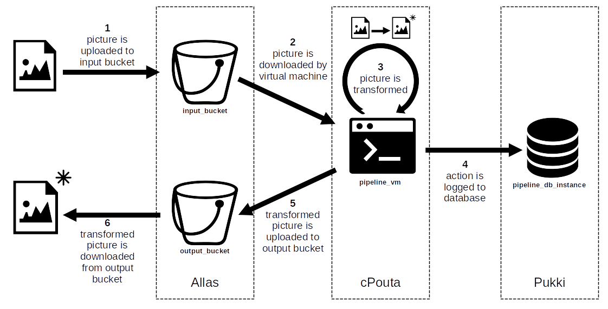

# Setting up a pipeline for images

## Objectives

Get familarity with using the following services:
- Allas
- cPouta
- Pukki

## Introduction

We want to set up a simple pipeline which transforms the images that are given in input to it.
In this tutorial, the transformation applied just inverts the colors of the image.

We use Allas as the place where to upload our images in input.
The pipeline uploads its transformed images to Allas too.
A virtual machine in cPouta takes care of downloading, transforming, and re-uploading the images received in input.
Once it has transformed an image, the virtual machine also logs the event to a database hosted in Pukki.

## Step 1: creating buckets in Allas

## Step 2: creating database in Pukki

## Step 3: creating virtual machine in cPouta

## Step 4: configuring the virtual machine

## Step 5: testing the pipeline

## Conclusion
