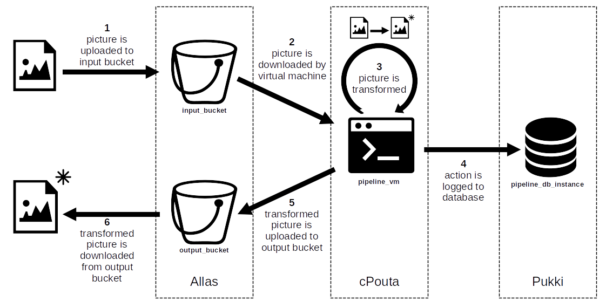

# Setting up a pipeline for images

## Objectives

* Get familiarity on how to use multiple cloud services together.
* Get familiarity on how to use cloud services using their command-line interfaces.

The tutorial focuses on the following services:

* [Allas](../../../data/Allas/introduction.md), our object storage service
* [cPouta](../index.md), our public cloud service
* [Pukki](../../dbaas/what-is-dbaas.md), our on-demand database service

## Introduction

We want to set up a simple pipeline which transforms the pictures that are given in input to it.



First, we upload our pictures from our workstation to a bucket in Allas.
A virtual machine in cPouta takes the pictures from the bucket and downloads them locally.
The virtual machine transforms the pictures and logs the completed action to a database hosted in Pukki.
Finally, the virtual machine uploads the transformed pictures to another bucket in Allas.
We can then download from the bucket the transformed pictures to our workstation.

For the sake of this tutorial, the transformed picture simply corresponds to the input picture whose colors have been inverted, sometimes also called "reversed".

## Step 1: creating buckets in Allas

We open a new terminal window, to which we will refer using the name `terminal_allas`.
We use `terminal_allas` for all the commands dealing with Allas.

To create buckets in Allas, we need to have a working command-line interface for it.
If we haven't set up such interface before on our workstation, we follow the [instructions on how to install and configure s3cmd](../../../data/Allas/using_allas/s3_client.md#getting-started-with-s3cmd).

We can test the correct functioning of the command-line interface by simply listing all the buckets currently in our project.
An example of the command and its expected output follows:
```
$ s3cmd ls
2021-07-14 15:14  s3://bucket1
2020-01-14 17:40  s3://bucket2
...
```
Please note that the list can also be empty, if we haven't created any bucket in our project before.

We now create the input and the output buckets for our pipeline.
First, we define the names for the buckets as environment variables:
```
$ export INPUT_BUCKET="input_bucket"
$ export OUTPUT_BUCKET="output_bucket"
```

We then use the following commands to actually create the buckets:
```
$ s3cmd mb s3://$INPUT_BUCKET
Bucket 's3://input_bucket/' created
$ s3cmd mb s3://$OUTPUT_BUCKET
Bucket 's3://output_bucket/' created
```

!!! warning
    Bucket names must be unique.
    If another user has already selected the same name, bucket creation command will fail:
    ```
    $ s3cmd mb s3://$INPUT_BUCKET
    ERROR: Bucket 'input_bucket' already exists
    ERROR: S3 error: 409 (BucketAlreadyExists)
    ```
    In such case, we can just select a different name and retry the command.

## Step 2: creating a database in Pukki

We open a second terminal window, to which we will refer using the name `terminal_pukki`.
We use `terminal_pukki` for all the commands dealing with Pukki.

Having a working command-line interface for Pukki is a prerequisite for continuing with the tutorial.
If we haven't set it up before, we follow the [instructions on how to install and configure Pukki command-line interface](../../dbaas/cli.md#getting-started).

We can test the correct functioning of the command-line interface by simply listing the available types of database.
An example of the command and its expected output follows:
```
$ openstack datastore list
+--------------------------------------+------------+
| ID                                   | Name       |
+--------------------------------------+------------+
| 71920375-6967-466e-b955-8ee8629312b7 | postgresql |
| 1a8efda2-7bb7-4c52-9eab-e251fd18323c | mariadb    |
+--------------------------------------+------------+
```

We now create the database that we will use to log the actions of the pipeline.
First, we define few environment variables that we will use later on:
```
$ export DB_INSTANCE_NAME="pipeline_db_instance" # name of the database instance in Pukki
$ export DB_NAME="pipeline_db" # name of the database
$ export DB_USERNAME="db_admin" # name of the user to be configured in the database
$ export DB_PASSWORD="xxxxxx" # put here the password for the user to be configured in the database 
```

We then create the actual database instance issuing the following command:
```
$ openstack database instance create $DB_INSTANCE_NAME \
--flavor standard.small \
--databases $DB_NAME \
--users $DB_USERNAME:$DB_PASSWORD \
--datastore postgresql \
--is-public \
--size 1
```
The parameters of the command are as follows:

* **flavor** determines the amount of resources (CPU, memory) that are allocated for the database instance, see the [DBaaS flavors and prices](../../../dbaas/flavors/) for more information.
* **databases** is a list of the names of the databases that we want to create inside the instance, in this case corresponding to a single database.
* **users** is a list of credentials in the format *username:password* to configure the users for the databases, in this case corresponding to a single pair of credentials.
* **datastore** specifies the type of database to be used, e.g., postgresql or mariadb.
* **is-public** specifies that the database instance should be made publicly reachable.
* **size** is the size of the database in gigabytes.

The output from the command should be similar to the following:
```
+--------------------------+--------------------------------------+
| Field                    | Value                                |
+--------------------------+--------------------------------------+
| allowed_cidrs            | []                                   |
| created                  | 2025-02-04T13:08:51                  |
| datastore                | postgresql                           |
| datastore_version        | 17.2                                 |
| datastore_version_number | 17.2                                 |
| flavor                   | d4a2cb9c-99da-4e0f-82d7-3313cca2b2c2 |
| id                       | 2f347948-9460-4ac0-a588-32187c8b6ab1 |
| name                     | pipeline_db_instance                 |
| operating_status         |                                      |
| public                   | True                                 |
| region                   | regionOne                            |
| service_status_updated   | 2025-02-04T13:08:51                  |
| status                   | BUILD                                |
| updated                  | 2025-02-04T13:08:51                  |
| volume                   | 1                                    |
+--------------------------+--------------------------------------+
```


## Step 3: creating virtual machine in cPouta

We open a third terminal window, to which we will refer using the name `terminal_pouta`.
We use `terminal_pouta` for all the commands dealing with cPouta.

In the same way as for Allas and Pukki, to continue the tutorial we need to have a working command-line interface for cPouta as well.
We follow the [instructions on how to install and configure cPouta command-line interface](../install-client.md), if we haven't done it already.

!!! warning
    Although similar in many aspects, Pukki and cPouta command-line interfaces are different and cannot be used interchangeably.
    For example, running Pukki commands on the terminal configured for cPouta will result in the following error:
    ```
    public endpoint for database service in regionOne region not found
    ```
    Stick to using two different terminals to interact with them to avoid this type of issues.
    
    If you want to check for which service your current terminal is configured, you can type the following command:
    ```
    $ printenv | grep OS_AUTH_URL
    OS_AUTH_URL=https://pukki.dbaas.csc.fi:5000/v3 # our terminal is configured for Pukki
    
    $ printenv | grep OS_AUTH_URL
    OS_AUTH_URL=https://pouta.csc.fi:5001/v3 # our terminal is configured for cPouta
    ```

We can test the correct functioning of the command-line interface by, for example, showing the properties of one of the flavors.
An example of the command and its expected output follows:
```
$ openstack flavor show standard.tiny
+----------------------------+--------------------------------------+
| Field                      | Value                                |
+----------------------------+--------------------------------------+
| OS-FLV-DISABLED:disabled   | False                                |
| OS-FLV-EXT-DATA:ephemeral  | 0                                    |
| access_project_ids         | None                                 |
| disk                       | 80                                   |
| id                         | 0143b0d1-4788-4d1f-aa04-4473e4a7c2a6 |
| name                       | standard.tiny                        |
| os-flavor-access:is_public | True                                 |
| properties                 | standard='true'                      |
| ram                        | 1000                                 |
| rxtx_factor                | 1.0                                  |
| swap                       |                                      |
| vcpus                      | 1                                    |
+----------------------------+--------------------------------------+
```

First, we create a keypair, which we will use to access the virtual machine once it is up and running.
To create a new keypair, we first define its name using an environment variable and then we run the dedicated command:
```
$ export POUTA_KEYPAIR="mykeypair"
$ ssh-keygen -t rsa -b 2048 -f $POUTA_KEYPAIR -N ''
```

We check that the command has indeed created two files in the current folder of our workstation.
```
$ ls $POUTA_KEYPAIR*
mykeypair mykeypair.pub
```
The first file, without `.pub` extension, corresponds to the private key, while the file ending with `.pub` corresponds to the public key.
The private key should never leave your workstation, i.e., you should not need to copy it to anywhere else.
Instead, the public key can be freely copied and distributed to the locations where you would like to access using the just-created keypair.
To this end, we upload the public key to cPouta by issuing the following command:
```
$ openstack keypair create $POUTA_KEYPAIR \
--public-key $POUTA_KEYPAIR.pub 
```
The parameters of the command are as follows:

* **public-key** specifies the path to the public key file.

The output of the command will be similar to the following:
```
+-------------+-------------------------------------------------+
| Field       | Value                                           |
+-------------+-------------------------------------------------+
| fingerprint | 0e:60:39:df:83:83:fb:18:91:87:67:25:a9:67:27:fd |
| name        | mykeypair                                       |
| user_id     | xxxxxxxx                                        |
+-------------+-------------------------------------------------+
```

We now create the virtual machine that we will use for our pipeline.
First, we define the name of the virtual machine as an environment variable:
```
$ export POUTA_INSTANCE_NAME="pipeline_vm"
```

The command we then issue to actually create the virtual machine is the following:
```
$ openstack server create $POUTA_INSTANCE_NAME \
--flavor standard.tiny \
--image Ubuntu-24.04 \
--key-name $POUTA_KEYPAIR
```
The parameters of the command are as follows:

* **flavor** determines the amount of resources (CPU, memory) that are allocated for virtual machine, see the [Virtual machine flavors and billing unit rates](../../vm-flavors-and-billing/) for more information.
* **image** specifies the image of the operating system to be used to build the virtual machine, see the [Basic information about images](../../images/) for a list of the available alternative images.
* **key-name** specifies the public key to be configured inside the virtual machine.

The output from the command should be similar to the following:
```
+-----------------------------+------------------------------------------------------+
| Field                       | Value                                                |
+-----------------------------+------------------------------------------------------+
| OS-DCF:diskConfig           | MANUAL                                               |
| OS-EXT-AZ:availability_zone |                                                      |
| OS-EXT-STS:power_state      | NOSTATE                                              |
| OS-EXT-STS:task_state       | scheduling                                           |
| OS-EXT-STS:vm_state         | building                                             |
| OS-SRV-USG:launched_at      | None                                                 |
| OS-SRV-USG:terminated_at    | None                                                 |
| accessIPv4                  |                                                      |
| accessIPv6                  |                                                      |
| addresses                   |                                                      |
| adminPass                   | xxxxxxxxxxxx                                         |
| config_drive                |                                                      |
| created                     | 2025-02-04T13:10:43Z                                 |
| flavor                      | standard.tiny (0143b0d1-4788-4d1f-aa04-4473e4a7c2a6) |
| hostId                      |                                                      |
| id                          | ae9f924b-f6c5-488c-b617-36809008e37e                 |
| image                       | Ubuntu-24.04 (bc68d79a-6dcc-446f-a8cd-c8313b885718)  |
| key_name                    | mykeypair                                            |
| name                        | pipeline_vm                                          |
| progress                    | 0                                                    |
| project_id                  | xxxxxxxxxxxxxxxxxxxxxxxxxxxxxxxx                     |
| properties                  |                                                      |
| security_groups             | name='default'                                       |
| status                      | BUILD                                                |
| updated                     | 2025-02-04T13:10:43Z                                 |
| user_id                     | timo                                                 |
| volumes_attached            |                                                      |
+-----------------------------+------------------------------------------------------+
```


## Step 4: configuring the pipeline

Now that we have built all the components, we configure them to work as a pipeline.
First, we configure the virtual machine to allow us to access it from our workstation.
Then, we make sure that the virtual machine can work with the buckets in Allas, as well as that our database instance in Pukki accepts traffic coming from the virtual machine.
Finally, we install and configure in the virtual machine the tools required to get the pipeline working.

### Allowing traffic from workstation to virtual machine

To prevent unauthorized access attempts, by default a virtual machine does not allow incoming traffic from the Internet.
Access to the virtual machine is regulated by means of _security groups_ and the rules they contain.
We thus create a new security group with a single rule, which allow access to the virtual machine from our workstation.

We go back to `terminal_pouta`.

First, we find what is the public ip address used by our workstation and we store it in an environment variable by typing the following command:
```
$ export WORKSTATION_IP=$(curl -4 ifconfig.me)

```

We create a new security group by first defining its name in an environment variable and then issuing the dedicated command:
```
$ export POUTA_SEC_GROUP_NAME="pipeline_security_group"
$ openstack security group create $POUTA_SEC_GROUP_NAME
```

Output will look like the following:
```
+-----------------+----------------------------------------------------------------------------------------------------------------------------------------------------------------------------+
| Field           | Value                                                                                                                                                                      |
+-----------------+----------------------------------------------------------------------------------------------------------------------------------------------------------------------------+
| created_at      | 2025-02-04T13:12:43Z                                                                                                                                                       |
| description     | pipeline_security_group                                                                                                                                                    |
| id              | a8630776-db3d-408a-ba8e-8c52b5f2a8c9                                                                                                                                       |
| location        | cloud='', project.domain_id='default', project.domain_name=, project.id='xxxxxxxxxxxxxxxxxxxxxxxxxxxxxxxx', project.name='project_xxxxxxx', region_name='regionOne', zone= |
| name            | pipeline_security_group                                                                                                                                                    |
| project_id      | xxxxxxxxxxxxxxxxxxxxxxxxxxxxxxxx                                                                                                                                           |
| revision_number | 1                                                                                                                                                                          |
| rules           | created_at='2025-02-04T13:12:44Z', direction='egress', ethertype='IPv6', id='8e0cba6e-814d-4e70-92de-61389f9b6ca7', updated_at='2025-02-04T13:12:44Z'                      |
|                 | created_at='2025-02-04T13:12:43Z', direction='egress', ethertype='IPv4', id='cdf6527c-ca5a-4247-8e47-40213b601ee0', updated_at='2025-02-04T13:12:43Z'                      |
| tags            | []                                                                                                                                                                         |
| updated_at      | 2025-02-04T13:12:43Z                                                                                                                                                       |
+-----------------+----------------------------------------------------------------------------------------------------------------------------------------------------------------------------+
```

We add the rule to allow access by issuing the following command:
```
$ openstack security group rule create $POUTA_SEC_GROUP_NAME \
--remote-ip $WORKSTATION_IP/32 \
--dst-port 22 \
--protocol tcp
```
The parameters of the command are as follows:

* **remote-ip** specifies the set of ip addresses for which the rule is defined. The remote ips correspond to the source of the traffic.
* **dst-port** specifies for which port of the destination the rule is defined. The destination port correspond to the destination of the traffic.
* **protocol** specifies the protocol for which the rule is defined. In this case, the rule considers only TCP traffic.

The output will be similar to the following:
```
+-------------------+----------------------------------------------------------------------------------------------------------------------------------------------------------------------------+
| Field             | Value                                                                                                                                                                      |
+-------------------+----------------------------------------------------------------------------------------------------------------------------------------------------------------------------+
| created_at        | 2025-02-04T13:13:04Z                                                                                                                                                       |
| description       |                                                                                                                                                                            |
| direction         | ingress                                                                                                                                                                    |
| ether_type        | IPv4                                                                                                                                                                       |
| id                | 29ebe032-f09c-4cb5-9e49-bc75e6d1880c                                                                                                                                       |
| location          | cloud='', project.domain_id='default', project.domain_name=, project.id='xxxxxxxxxxxxxxxxxxxxxxxxxxxxxxxx', project.name='project_xxxxxxx', region_name='regionOne', zone= |
| name              | None                                                                                                                                                                       |
| port_range_max    | 22                                                                                                                                                                         |
| port_range_min    | 22                                                                                                                                                                         |
| project_id        | xxxxxxxxxxxxxxxxxxxxxxxxxxxxxxxx                                                                                                                                           |
| protocol          | tcp                                                                                                                                                                        |
| remote_group_id   | None                                                                                                                                                                       |
| remote_ip_prefix  | xxx.xxx.xxx.xxx/32                                                                                                                                                         |
| revision_number   | 0                                                                                                                                                                          |
| security_group_id | a8630776-db3d-408a-ba8e-8c52b5f2a8c9                                                                                                                                       |
| tags              | []                                                                                                                                                                         |
| updated_at        | 2025-02-04T13:13:04Z                                                                                                                                                       |
+-------------------+----------------------------------------------------------------------------------------------------------------------------------------------------------------------------+
```

Now we apply the security group to the previously created virtual machine, so that this newly-created rule applies to its traffic.
```
$ openstack server add security group $POUTA_INSTANCE_NAME $POUTA_SEC_GROUP_NAME
```
In case of success, the command will show no output.

### Connecting to the virtual machine

The virtual machine is now configured to allow traffic from our workstation but it is not reachable yet.
A virtual machine gets assigned a private IP address at launch, but it has no automatically-assigned public IP, which is required to connect to the virtual machine via the Internet.

We go back to `terminal_pouta`.
We acquire a new address issuing the command:
```
$ openstack floating ip create public
```

The output will be similar to the following:
```
+---------------------+------------------------------------------------------------------------------------------------------------------------------------------------------------------------------------------------------+
| Field               | Value                                                                                                                                                                                                |
+---------------------+------------------------------------------------------------------------------------------------------------------------------------------------------------------------------------------------------+
| created_at          | 2025-02-04T13:13:38Z                                                                                                                                                                                 |
| description         |                                                                                                                                                                                                      |
| dns_domain          | None                                                                                                                                                                                                 |
| dns_name            | None                                                                                                                                                                                                 |
| fixed_ip_address    | None                                                                                                                                                                                                 |
| floating_ip_address | xxx.xxx.xxx.xxx                                                                                                                                                                                      |
| floating_network_id | 26f9344a-2e81-4ef5-a018-7d20cff891ee                                                                                                                                                                 |
| id                  | 1a38ae4f-1354-4958-b2be-72502b53c492                                                                                                                                                                 |
| location            | Munch({'cloud': '', 'region_name': 'regionOne', 'zone': None, 'project': Munch({'id': 'xxxxxxxxxxxxxxxxxxxxxxxxxxxxxxxx', 'name': 'project_xxxxxxx', 'domain_id': 'default', 'domain_name': None})}) |
| name                | xxx.xxx.xxx.xxx                                                                                                                                                                                      |
| port_details        | None                                                                                                                                                                                                 |
| port_id             | None                                                                                                                                                                                                 |
| project_id          | xxxxxxxxxxxxxxxxxxxxxxxxxxxxxxxx                                                                                                                                                                     |
| qos_policy_id       | None                                                                                                                                                                                                 |
| revision_number     | 0                                                                                                                                                                                                    |
| router_id           | None                                                                                                                                                                                                 |
| status              | DOWN                                                                                                                                                                                                 |
| subnet_id           | None                                                                                                                                                                                                 |
| tags                | []                                                                                                                                                                                                   |
| updated_at          | 2025-02-04T13:13:38Z                                                                                                                                                                                 |
+---------------------+------------------------------------------------------------------------------------------------------------------------------------------------------------------------------------------------------+
```
In particular, we note down the value returned for the field `floating_ip_address` in an environment variable:
```
$ export POUTA_FLOATING_IP="xxx.xxx.xxx.xxx" # put here the value returned for floating_ip_address
```

We now associate the obtained address to our virtual machine by issuing the following command:
```
$ openstack server add floating ip $POUTA_INSTANCE_NAME $POUTA_FLOATING_IP
```
In case of success, the command will show no output.

Everything is now ready.
We can test the connection to our virtual machine by issuing the command:
```
$ ssh -i mykeypair.pem ubuntu@$POUTA_FLOATING_IP
```

Most probably we will be asked the following question:
```
The authenticity of host 'xxx.xxx.xxx.xxx (xxx.xxx.xxx.xxx)' can't be established.
ED25519 key fingerprint is SHA256:waKe82wIU0HYSGpRFCBOx0n6GOvH108nkJ+koosOF80.
This key is not known by any other names
Are you sure you want to continue connecting (yes/no/[fingerprint])?
```

We can safely answer `yes` and press enter, which will finally lead us to the virtual machine:
```
Are you sure you want to continue connecting (yes/no/[fingerprint])? yes
Warning: Permanently added 'xxx.xxx.xxx.xxx' (ED25519) to the list of known hosts.
Welcome to Ubuntu 24.04.1 LTS (GNU/Linux 6.8.0-51-generic x86_64)

...

To run a command as administrator (user "root"), use "sudo <command>".
See "man sudo_root" for details.

ubuntu@pipeline-vm:~$
```

We leave for a moment `terminal_pouta`, we come back when it is time to install and configure the tools inside it.

### Allowing traffic from virtual machine to database

Our database in Pukki, by default, does not accept any incoming traffic.
We want to configure it so that it accepts traffic from our virtual machine.

We move to `terminal_pukki`.
First, environment variables defined in one terminal do not propagate automatically to other terminals.
For this reason, we need to define the floating ip assigned to the virtual machine in cPouta as an environment variable also in this terminal.
```
$ export POUTA_FLOATING_IP="xxx.xxx.xxx.xxx" # put here the same value assigned to the same variable in terminal_pouta
```

We issue then the following command:
```
$ openstack database instance update $DB_INSTANCE_NAME \
--allowed-cidr $POUTA_FLOATING_IP/32
```
The parameters of the command are as follows:

* **allowed-cidr** specifies the set of ip addresses for which traffic towards the database instance is allowed.

In case of success, the command will show no output.
However, we can check the successful operation by looking at the information about our database instance:
```
$ openstack database instance show pipeline_db_instance
+--------------------------+-----------------------------------------------------------------------------------------------------------+
| Field                    | Value                                                                                                     |
+--------------------------+-----------------------------------------------------------------------------------------------------------+
| addresses                | [{'address': '192.168.215.98', 'type': 'private', 'network': 'a89ef792-74ec-434f-8e20-7d33b5b6d633'},     |
|                          | {'address': 'xxx.xxx.xxx.xxx', 'type': 'public'}]                                                         |
| allowed_cidrs            | ['xxx.xxx.xxx.xxx/32']                                                                                    |
| created                  | 2025-02-04T13:08:51                                                                                       |
| datastore                | postgresql                                                                                                |
| datastore_version        | 17.2                                                                                                      |
| datastore_version_number | 17.2                                                                                                      |
| flavor                   | d4a2cb9c-99da-4e0f-82d7-3313cca2b2c2                                                                      |
| id                       | 2f347948-9460-4ac0-a588-32187c8b6ab1                                                                      |
| ip                       | 192.168.215.98, xxx.xxx.xxx.xxx                                                                           |
| name                     | pipeline_db_instance                                                                                      |
| operating_status         | HEALTHY                                                                                                   |
| public                   | False                                                                                                     |
| region                   | regionOne                                                                                                 |
| service_status_updated   | 2025-02-04T13:16:10                                                                                       |
| status                   | ACTIVE                                                                                                    |
| updated                  | 2025-02-04T13:16:52                                                                                       |
| volume                   | 1                                                                                                         |
| volume_used              | 0.08                                                                                                      |
+--------------------------+-----------------------------------------------------------------------------------------------------------+
```
We can see that the floating IP address of our virtual machine is now listed in the `allowed_cidrs`.

From the information displayed with the previous command we also extract and take down the public IP address of our database instance, which we will need in the following steps.
The first row, whose name is `addresses`, contains two parts: an address that is marked as `private`, and one that is marked as `public`.
We go back to `terminal_pouta`, where we are still logged in to our virtual machine in cPouta, and we define an environment variable to store the public address of the database, as we will need it later for configuration.
```
$ export DB_PUBLIC_IP="xxx.xxx.xxx.xxx" # put here the public ip address of the database instance in Pukki
```

### Configuring access from virtual machine to Allas

Similarly to our own workstation, to access the buckets hosted in Allas the virtual machine needs to be configured as well.

On `terminal_pouta` we follow the [instructions on how to install and configure s3cmd](../../../data/Allas/using_allas/s3_client.md#getting-started-with-s3cmd).
Once s3cmd is configured, we test that everything works properly by listing our buckets in Allas:
```
$ s3cmd ls
2025-01-16 14:59  s3://input_bucket
2025-01-16 14:59  s3://output_bucket
```
We notice that we can see the two buckets that we have created earlier in the tutorial.
We have thus confirmed that the virtual machine can now access properly the buckets in Allas.

### Configuring access from virtual machine to database

At this point in the tutorial, traffic from the virtual machine is allowed to flow towards the database in Pukki.
However, at the moment the virtual machine has no information about where the database can be found, i.e., its public IP address, nor which are the credentials to use when accessing the database.
Therefore, next we configure the access to the database from the virtual machine.

We stay on `terminal_pouta`.
First, we install a tool that we will need to talk with the database:
```
$ sudo apt update ; sudo apt install postgresql-client
```

We then define all the environment variables we need to connect and access the database hosted in Pukki.
```
$ export DB_NAME="pipeline_db" # name of the database
$ export DB_USERNAME="db_admin" # name of the user configured for the database
$ export DB_PASSWORD="xxxxxx" # put here the password of the user configured for the database
```

We also define the postgresql password file, which can be then used to easily connect to the database using the command line.
```
$ echo "$DB_PUBLIC_IP:5432:$DB_NAME:$DB_USERNAME:$DB_PASSWORD" >> ~/.pgpass
$ chmod 0600 ~/.pgpass
```
More details about the postgresql password file can be found in its own [reference page](https://www.postgresql.org/docs/current/libpq-pgpass.html).

Let's now test the access to the database.
On `terminal_pouta` we run the following command:
```
$ psql -h "$DB_PUBLIC_IP" -U "$DB_USERNAME"
```
We get the following prompt, which indicates successful connection to the database:
```
psql (16.6 (Ubuntu 16.6-0ubuntu0.24.04.1), server 17.2 (Debian 17.2-1.pgdg110+1))
WARNING: psql major version 16, server major version 17.
         Some psql features might not work.
SSL connection (protocol: TLSv1.3, cipher: TLS_AES_256_GCM_SHA384, compression: off)
Type "help" for help.

pipeline_db=>
```
To go back to our virtual machine we just type `exit` and press `Enter` key.

Now that we can communicate with the database, we prepare it to host the data that we will send to it when processing our pictures.
We run the following command to create a table which will host the data about the pictures:
```
$ psql \
-h "$DB_PUBLIC_IP" \
-U "$DB_USERNAME" \
-c "CREATE TABLE IF NOT EXISTS log_records (timestamp varchar(25) primary key, negated_picture_name text, negated_picture_hash text)"
```
The parameters of the command are as follows:

* **h** is the hostname, i.e., the ip address at which the database can be reached.
* **U** is the username to be used when authenticating with the database.
* **c** is a command to be issued on the database itself. The command must be written using a syntax that can be understood by the database.

If the command is successful, the terminal simply replies to us with the string `CREATE TABLE`.
The database is now configured for our pipeline.

### Installing picture transforming script

The final part in our configuration phase is to install the script that takes care of talking with Allas, Pukki, as well as transforming the picture in input.
To do so, we first install the tool to transform the pictures.
On `terminal_pouta` we run:
```
$ sudo apt install imagemagick
```

Once the tool is installed with all its dependencies, we run:
```
$ nano pipeline_script.sh
```
We see a blinking cursor on the top-left corner of the window, indicating that we can now write in our new file named `pipeline_script.sh`.
We copy-and-paste the content that follows.
Please make sure to change to their correct value the environment variables defined at the beginning of the script.
```
#!/bin/bash

### NB! Change the value of these environment variables to match your setup
export INPUT_BUCKET="input_bucket"
export OUTPUT_BUCKET="output_bucket"
export DB_PUBLIC_IP="xxx.xxx.xxx.xxx"
export DB_USERNAME="db_admin"
###


export NEGATED_PREFIX="negated_"

(
# perform the task if the lock is free, otherwise exit
flock -n 200 || exit 1
# iterate over the pictures in the bucket
for PICTURE_URL in $(s3cmd ls s3://$INPUT_BUCKET | awk '{ print $4 }')
do
        # get the current timestamp
        TIMESTAMP=$(date +%FT%T)
        # get the picture
        PICTURE_NAME=$(echo "$PICTURE_URL" | awk -F '/' '{ print $NF }')
        s3cmd get "$PICTURE_URL" "$PICTURE_NAME"
        # compute the negated
        NEGATED_PICTURE_NAME="$NEGATED_PREFIX$PICTURE_NAME"
        convert -negate "$PICTURE_NAME" "$NEGATED_PICTURE_NAME"
        # compute hash of the result
        NEGATED_PICTURE_HASH=$(sha256sum "$NEGATED_PICTURE_NAME" | awk '{ print $1 }')
        # log to the db that this was done
        psql -h "$DB_PUBLIC_IP" -U "$DB_USERNAME" -c "INSERT INTO log_records (timestamp, negated_picture_name, negated_picture_hash) VALUES ('$TIMESTAMP', '$NEGATED_PICTURE_NAME', '$NEGATED_PICTURE_HASH')"
        # push the negated picture to the output bucket
        s3cmd put "$NEGATED_PICTURE_NAME" s3://$OUTPUT_BUCKET
        # delete the local copies of the pictures
        rm "$PICTURE_NAME" "$NEGATED_PICTURE_NAME"
        # delete the picture from the input bucket
        s3cmd del "$PICTURE_URL"
        # sleep 1 sec
        sleep 1
done
) 200>/var/lock/pipeline_script_lock
```
When we are done writing, we press the key combination `CTRL + X`.
From the terminal we are asked if we want to save our changes, to which we reply by pressing the key `y`.
Finally, it is given to us a chance to modify the name of the file in which our text is saved.
We are happy with the current name of the file, so we just type `Enter` key, and we are back to our typical terminal view.

The script now contains the logic of the pipeline, but it is not set to run automatically yet.
On `terminal_pouta` we run the following commands:
```
$ chmod +x /home/ubuntu/pipeline_script.sh
$ crontab -l > crontab_list
$ echo "* * * * * /home/ubuntu/pipeline_script.sh" >> crontab_list
$ crontab crontab_list
```

Now the script is configured to run automatically every minute.
We are ready to test the functioning of the pipeline.

## Step 5: testing the pipeline

We pick up an picture of choice and we copy it to the home folder of our workstation.
As an example, here is our picture at `~/cat1.jpg`:


We now want to send the picture through the pipeline.
On `terminal_allas`, we first navigate to the home folder and then upload the picture to Allas:
```
$ cd ~
$ s3cmd put cat1.jpg s3://$INPUT_BUCKET
upload: 'cat1.jpg' -> 's3://input_bucket/cat1.jpg'  [1 of 1]
 133275 of 133275   100% in    0s     2.47 MB/s  done
```

We wait a minute or so, we check the content of the bucket, and we notice that it is empty.
```
$ s3cmd ls s3://$INPUT_BUCKET
$
```
The pipeline has thus taken the picture from the bucket and processed it.

We check if we have a trace of the picture transformation in the database.
On `terminal_pouta` we run the following command:
```
$ psql \
-h "$DB_PUBLIC_IP" \
-U "$DB_USERNAME" \
-c "select * from log_records where negated_picture_name like '%cat1%'"
```
We get an output similar to the following:
```
      timestamp      | negated_picture_name |                        negated_picture_hash                        
---------------------+--------------------+------------------------------------------------------------------
 2025-02-04T12:01:01 | negated_cat1.jpg   | 50cc363c1528371cf9526d1fddead5f37f3004f11e9f24b72ea210db58dee095
(1 row)
```
The output tells us that the pipeline has processed correctly our original picture `cat1.jpg` and has produced the `negated_cat1.jpg` picture in output.

Let's check out the transformed picture.
On `terminal_allas` first we check that the picture is indeed available in the other bucket.
Then, we download it to our home folder:
```
$ s3cmd ls s3://$OUTPUT_BUCKET
2025-02-04 12:01       140798  s3://output_bucket/negated_cat1.jpg
$ s3cmd get s3://$OUTPUT_BUCKET/negated_cat1.jpg .
download: 's3://output_bucket/negated_cat1.jpg' -> './negated_cat1.jpg'  [1 of 1]
 140798 of 140798   100% in    0s     2.12 MB/s  done
```

We can finally admire the result of our hard work!


## Conclusion

We have built an automated workflow to transform pictures using three different cloud services.
In this tutorial the workflow is just a simple procedure to transform an picture into its negated version, but it can be built upon to help in more concrete use cases.
We can draw a couple of key take-aways from our experience:

* When operating with multiple cloud services at the same time, it might be beneficial to use *one terminal window per cloud service*. Although not necessary, it helps in keeping order in the credentials loaded for different services, e.g., in case we use Allas from a project `X` and cPouta from another project `Y`.
* By default the instances running on cPouta and Pukki *do not accept incoming traffic*. Access to such instances needs to be always specified explicitly using security groups and allowed CIDRs, respectively.

