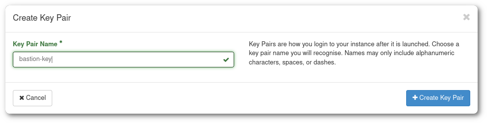

# SSH-avainpari {#ssh-key-pair}

SSH-avainpari on erittäin hyödyllinen [monissa tilanteissa](https://en.wikipedia.org/wiki/Secure_Shell#Use), eikä sitä ole rajoitettu käytettäväksi vain OpenStack-ympäristössä.

Tämä opetusohjelma kattaa SSH-avainparin luomisen sekä käytännön käyttötapauksen OpenStackin kanssa.

SSH-avaimet ovat tekstitiedostoja, ja kuten tämän opetusohjelman nimi viittaa, ne tulevat pareina: yksityinen avain ja julkinen avain.

<center>
{width=400}
</center>

Opetusohjelman jälkeen osaat käyttää SSH-avaimia sijaan salasana-autentikointi.

## SSH-avainparin luominen tietokoneella {#creating-an-ssh-key-pair-on-a-computer}

SSH-avainpari voidaan luoda komennolla `ssh-keygen` kaikissa kolmessa suuressa käyttöjärjestelmässä.

Oletuksena komento tallentaa avainparin oikeaan paikkaan - käyttäjän kotihakemistoon, hakemistoon nimeltä `.ssh` - ja pyytää lisäämään sille salasanan.

```text
$ ssh-keygen
Generating public/private rsa key pair.
Enter file in which to save the key (~/.ssh/id_rsa):
Enter passphrase (empty for no passphrase):
Enter same passphrase again:
Your identification has been saved in ~/.ssh/id_rsa
Your public key has been saved in ~/.ssh/id_rsa.pub
The key fingerprint is:
SHA256:Z/IxPJHY5fO7k28819BXw4jRZeQaNGdSq1GGPneuZ+8 username@usercomputer
The key's randomart image is:
+---[RSA 3072]----+
|            o+=X |
|         o =.oX .|
|        . + *ooo |
|         . o *=+o|
|        S B  o+o+|
|         = +  ..+|
|          .   .=o|
|              +oB|
|              .BE|
+----[SHA256]-----+
$ ls -l .ssh | grep rsa
-rw-------  1 username  staff   2655 Nov 18 08:24 id_rsa
-rw-r--r--  1 username  staff    577 Nov 18 08:24 id_rsa.pub
$
```

Kun komento päättyy, .ssh -hakemistosta löytyy kaksi tiedostoa.

!!! success "Avainpari luotu"

    Oletuksena `ssh-keygen`-komento luo yksityisen avaimen nimeltä **id_rsa** ja julkisen avaimen nimeltä **id_rsa.pub**.

Alla on esimerkki komennon suorittamisesta Windows 11 PowerShellissä.


## Olemassa olevan avainparin lisääminen OpenStackiin {#adding-an-existing-key-pair-to-openstack}

Jos sinulla on olemassa oleva avainpari tai olet luonut sellaisen tietokoneellasi, sen voi lisätä OpenStack-ympäristöön.

Tätä varten sinun tulee olla kirjautuneena johonkin Pouta-palveluista.

1. Mene **Laskenta > Avainparit** -osioon ja valitse **Tuo julkinen avain**.
2. Anna avainparille nimi.
3. Käytä **Valitse tiedosto** -painiketta ja valitse **id_rsa.pub** -tiedosto tai kopioi ja liitä sen sisältö **Julkinen avain** -tekstialueelle.
4. Klikkaa **Tuo julkinen avain** -painiketta.


!!! info "Vinkki"

    OpenStack-yhteensopivuuden varmistamiseksi ja useiden avainten erottamiseksi on suositeltavaa käyttää komentoa seuraavassa muodossa: `ssh-keygen -t rsa -f keyname.key`.

## SSH-avaimen luominen OpenStackissa {#creating-an-ssh-key-in-openstack}

Tämä luku opastaa sinut SSH-avainparin luomiseen OpenStackin verkkokäyttöliittymässä. Sinun tulee olla kirjautuneena johonkin Pouta-palveluista.

1. Mene **Laskenta > Avainparit** -osioon ja valitse **Luo avainpari**.

    

    **Kuva** _Access & Security_ -alasivu cPouta-verkkokäyttöliittymässä

1. Anna avaimellesi nimi ja klikkaa **Luo avainpari**. Saat tallennettavaksi "_keyname.pem_". Tallenna se kotihakemistoosi. Tämä on viimeinen kerta, kun voit ladata tämän **yksityisen avaimen**, Pouta ei säilytä kopiota sen palvelimilla.

    

    **Kuva** Luo avainpari -dialogi

### Linux ja Mac {#linux-and-mac}

Jotta voit asentaa viimeisessä vaiheessa ladatun avaimen (_keyname.pem_ tai _keyname.cer_), sinun tulee suorittaa nämä komennot:

!!! info "macOS:lle"

    Jos käytät Chrome-selainta macOS Montereyssä, saat keyname.cer:n sijaan keyname.pem. Seuraava toimenpide pysyy samana.

```bash
mkdir -p ~/.ssh
chmod 700 .ssh
mv keyname.pem ~/.ssh
chmod 400 ~/.ssh/keyname.pem
```

!!! info "400 = Vain omistaja voi lukea"

    Kun tiedostolla Unixissa on 400 oikeudet, se tarkoittaa:
    `r-- --- ---`

    mikä tarkoittaa, että vain omistaja voi lukea tiedoston. Tämä on suositeltu arvo SSH:lle, mutta jos sinun on ylikirjoitettava tiedosto, sinun on annettava myös kirjoitusoikeudet: `chmod 600 ~/.ssh/keyname.pem`.

Ennen uuden avaimen käyttöä sinun tulisi suojata se salasanalla:

```bash
chmod 600 ~/.ssh/keyname.pem
ssh-keygen -p -f .ssh/keyname.pem
chmod 400 ~/.ssh/keyname.pem
```

### Windows (PowerShell) {#windows-powershell}

**Windows**-ympäristöissä on suositeltavaa käyttää PowerShelliä. Prosessi on hyvin samanlainen

```PowerShell
mkdir ~/.ssh
mv yourkey.pem ~/.ssh/
```

Ennen uuden avaimen käyttöä sinun tulisi suojata se salasanalla:

```PowerShell
ssh-keygen.exe -p -f yourkey.pem
```

Sen jälkeen, edelleen PowerShellistä, voit käyttää `ssh`-komentoa yhdistääksesi koneeseesi samalla tavalla kuin Linuxista tai Macista.

#### Windows (Putty) {#windows-putty}

Jos Windows-versiossasi ei ole _ssh_-komentoa asennettuna, voit käyttää myös _Puttya_.

Tämä tapahtuu käyttämällä _puttygen_-työkalua yksityisen avaimen (.pem) lataamiseen ja sen tallentamiseen (salasanasuojatussa) .ppk-muodossa, jota Putty voi käyttää.

1. Lataa _Putty_ ja _puttygen_ osoitteesta <https://www.chiark.greenend.org.uk/~sgtatham/putty/latest.html>.

1. Käynnistä _puttygen_ ja lataa ladattu avain (sen pitäisi olla Lataukset-sivulla).

    

1. Aseta salasanan avaimelle. Tämä ei ole pakollista, mutta suositeltavaa.

1. Tallenna avain _ppk_-muodossa, joka on oletusmuoto Putty-avainsille.

    

Nyt voimme käyttää tätä uutta Puttyn kanssa yhdistääksemme virtuaalikoneeseen.

1. Käynnistä _putty_ ja lataa ssh-avain. Siirry kohtaan **Connection > SSH > Auth** ja **Private key file for authentication** -kohdassa käytä **Selaa...** -painiketta valitaksesi oikea .ppk-tiedosto.

    

1. Kun avain on ladattu, tallenna istunto. Siirry kohtaan **Session** ja kohdassa **Saved Sessions** kirjoita uuden istunnon nimi ja klikkaa tallenna.