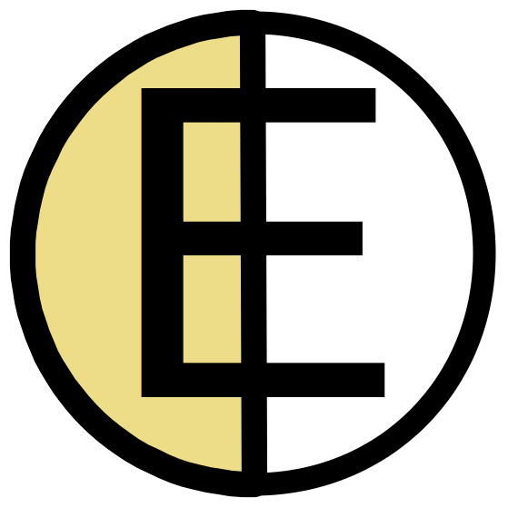

# Virtuaalikoneiden konetyypit ja Billing Unit -hinnat { #virtual-machine-flavors-and-billing-unit-rates }

Tällä hetkellä Pouta laskuttaa kolmen resurssin käytöstä: tallennusvolumit, kelluvat IP-osoitteet ja virtuaalikoneet. Resurssien käyttö tilastoidaan yhden tunnin jaksoissa. Hyvä tapa arvioida kustannuksia on [Billing Unit -laskuri](https://research.csc.fi/resources/#buc) -työkalu (*tilapäisesti poissa käytöstä*). Kaikki nämä resurssit kuluttavat Cloud Billing -yksiköitä; lisätietoja CSC:n laskutuksesta löydät [Billing](../../accounts/billing.md)-sivulta.

- Storage-volumit: 3,5 Cloud BU / TiB tunti. Projektisi [Volumes](https://pouta.csc.fi/dashboard/project/volumes/)-sivulla näet olemassa olevat volumit. Laskutus perustuu volumien kokonaiskokoon, ja ne kuluttavat Cloud BU:ita, vaikka niitä ei olisi liitetty virtuaalikoneisiin. Tämä johtuu siitä, että data on yhä tallennettuna järjestelmiimme.
- Kelluvat IP-osoitteet: 0,2 Cloud BU / tunti. Jokaisesta projektiin varatusta kelluvasta IP-osoitteesta laskutetaan. Katso projektisi varatut [Floating IPs](https://pouta.csc.fi/dashboard/project/floating_ips/). Myös kaikki ylimääräiset reitittimet, jotka luot ja yhdistät ulkoiseen verkkoon, laskutetaan yhtenä kelluvana IP:nä. Projektin oletusreititin ei kuluta Cloud Billing -yksiköitä.
- Virtuaalikoneet: katso alla luettelo [cPouta](#cpouta-flavors)- ja [ePouta](#epouta-flavors)-konetyypeistä (kunkin konetyypin muistin arvot (GiB) ovat likiarvoja). Virtuaalikoneet kuluttavat Cloud BU:ita riippumatta siitä, käytätkö niitä vai et. Tämä tarkoittaa, että sammutettu tai keskeytetty virtuaalikone kuluttaa edelleen Cloud BU:ita, koska resurssit ovat varattuna eikä niitä voida käyttää muiden käyttäjien toimesta. Lisätietoa virtuaalikoneiden eri tiloista ja niiden Cloud BU -kulutuksesta on kohdassa [Virtual machine lifecycle](vm-lifecycle.md).

* Cloud BU: Cloud Billing -yksiköt

## Kiintiöt { #quotas }

Jokaisella Pouta-projektilla on seuraava oletuskiintiö:

| Resurssi | Oletus |
|--------------:|:--------|
| Instanssit | 8 |
| Ytimet | 8 |
| Muisti | 32 GB |
| Kelluvat IP:t | 2 |
| Tallennustila | 1 TB |

Lisäkiintiötä voi pyytää lähettämällä sähköpostia [csc service desk](../../support/contact.md) -osoitteeseen ja kuvaamalla käyttötapauksesi. Jokainen pyyntö arvioidaan käyttäjän tarpeiden ja saatavilla olevien resurssien perusteella. Pyrimme aina siihen, että myönnettyä kiintiötä vastaavat resurssit ovat vapaana, mutta huomioi, että tästä ei ole takuuta. Joissakin tapauksissa tiettyyn virtuaalikoneen konetyyppiin sidottu laitteisto voi olla täynnä, jolloin et pysty provisioimaan niitä, vaikka sinulla olisi siihen kiintiö.

## cPouta-konetyypit { #cpouta-flavors }

Seuraavissa taulukoissa on lueteltu cPoutassa saatavilla olevat virtuaalikoneiden konetyypit ja niiden Cloud Billing -yksikkökertoimet. Huomaa, että cPoutan oletuskäyttäjätili sallii vain osan saatavilla olevista konetyypeistä.

### Vakiokonetyypit { #standard-flavors }

|Flavor|Ytimet|Muisti (GiB)|Juurilevy (GB)|Tilapäis- levy (GB)|Muisti/ ydin (GiB)|Redundanssi ([merkintä](#flavor-notation))|Cloud Billing -yksikköä /h|
|-:|:---:|:---:|:---:|:---:|:---:|:---:|:---:|
|standard.tiny   |1|0.9 |80 |0 |0.9  ||0.25 |
|standard.small  |2|1.9  |80 |0 |0.9  ||0.5  |
|standard.medium |3|3.9 |80 |0 |1.3||1    |
|standard.large  |4|7.8 |80 |0 |1.9||2    |
|standard.xlarge |6|15 |80 |0 |2.5||4    |
|standard.xxlarge|8|31 |80 |0 |3.8||8    |
|standard.3xlarge|8|62 |80 |0 |7.7||16   |

Katso lisätietoja kohdasta [vakiokonetyypit](#cpouta).

### HPC-konetyypit { #hpc-flavors }

|Flavor|Ytimet|Muisti (GiB)|Juurilevy (GB)|Tilapäis- levy (GB)|Muisti/ ydin (GiB)|Redundanssi ([merkintä](#flavor-notation))|Cloud Billing -yksikköä /h|
|-:|:-:|:-:|:-:|:-:|:-:|:-:|:-:|
| hpc.6.14core    | 14 | 88  | 80 | 0 | 6.2|| 23 |
| hpc.6.28core    | 28 | 176 | 80 | 0 | 6.2|| 45 |
| hpc.6.56core   | 56 | 352 | 80 | 0 | 6.2|| 90 |
| hpc.6.112core   | 112| 705 | 80 | 0 | 6.2|| 180 |
| hpc.5.16core    | 16 | 58  | 80 | 0 | 3.6|| 20 |
| hpc.5.32core    | 32 | 116 | 80 | 0 | 3.6|| 40 |
| hpc.5.64core   | 64 | 232 | 80 | 0 | 3.6|| 80 |
| hpc.5.128core   | 128| 464 | 80 | 0 | 3.6|| 160 |
| hpc.4.5core     | 5  | 21  | 80 | 0 | 4.2   || 6   |
| hpc.4.10core    | 10 | 42  | 80 | 0 | 4.2   || 12  |
| hpc.4.20core    | 20 | 85  | 80 | 0 | 4.2 || 25  |
| hpc.4.40core    | 40 | 171 | 80 | 0 | 4.2 || 50  |
| hpc.4.80core    | 80 | 343 | 80 | 0 | 4.2 || 100 |

Katso lisätietoja kohdasta [HPC-konetyypit](#cpouta_1).

### I/O-konetyypit { #i-o-flavors }

|Flavor|Ytimet|Muisti (GiB)|Juurilevy (GB)|Tilapäis- levy (GB)|Kokonaistila (GB)|Muisti/ ydin (GiB)|Redundanssi ([merkintä](#flavor-notation))|Cloud Billing -yksikköä /h|
|-:|:---:|:---:|:---:|:---:|:---:|:---:|:---:|:---:|
| io.70GB  | 2  | 9.7 | 20 | 70  | 90  | 4.8   || 3  |
| io.160GB | 4  | 19 | 20 | 160 | 180 | 4.7   || 6  |
| io.340GB | 8  | 39 | 20 | 340 | 360 | 4.8 || 12 |
| io.700GB | 16 | 78 | 20 | 700 | 720 | 4.8 || 24 |
| io.2.80GB  | 2  | 12,7 | 80 | 80  | 160  | 6.3 || 6  |
| io.2.240GB  | 4 | 26 | 80 | 240  | 320  | 6.6 || 12  |
| io.2.550GB  | 8  | 54 | 80 | 550  | 630  | 6.7 || 24  |
| io.2.1200GB  | 16  | 107 | 80 | 1200  | 1280  | 6.7 || 48  |

Huomaa, että kaikissa I/O-konetyypeissä sekä juuri- että tilapäislevyt sijaitsevat SSD-levyillä.

Katso lisätietoja kohdasta [I/O-konetyypit](#cpouta_2).

### GPU-konetyypit { #gpu-flavors }

|Flavor|Ytimet|GPU:t|Muisti (GiB)|Juurilevy (GB)|Tilapäis- levy (GB)|Muisti/ ydin (GiB)|Redundanssi ([merkintä](#flavor-notation))|Cloud Billing -yksikköä /h|
|-:|:---:|:---:|:---:|:---:|:---:|:---:|:---:|:---:|
| gpu.1.1gpu | 14 | 1 | 117 | 80 |0 | 8.3 || 60  |
| gpu.1.2gpu | 28 | 2 | 234 | 80 |0 | 8.3 || 120 |
| gpu.1.4gpu | 56 | 4 | 468 | 80 |0 | 8.3 || 240 |

Huomaa, että kaikissa GPU-konetyypeissä juurilevyt sijaitsevat SSD-levyillä.

Katso lisätietoja kohdasta [GPU-konetyypit](#cpouta_3).

## ePouta-konetyypit { #epouta-flavors }

Seuraavissa taulukoissa on lueteltu ePoutassa saatavilla olevat virtuaalikoneiden konetyypit ja niiden Billing Unit -kertoimet.

### Vakiokonetyypit { #standard-flavors }

|Flavor|Ytimet|Muisti (GiB)|Juurilevy (GB)|Tilapäis- levy (GB)|Muisti/ ydin (GiB)|Redundanssi ([merkintä](#flavor-notation))|Cloud Billing -yksikköä /h|
|-:|:---:|:---:|:---:|:---:|:---:|:---:|:---:|
| standard.tiny    | 1 | 0.9  | 80 | 0 | 0.9   || 0.25 |
| standard.small   | 2 | 1.9  | 80 | 0 | 0.9   || 0.5  |
| standard.medium  | 3 | 3.9  | 80 | 0 | 1.3 || 1    |
| standard.large   | 4 | 7.8  | 80 | 0 | 1.9 || 2    |
| standard.xlarge  | 6 | 15 | 80 | 0 |  2.5 || 4    |
| standard.xxlarge | 8 | 31 | 80 | 0 |  3.8 || 8    |
| standard.3xlarge | 8 | 62 | 80 | 0 |  7.7 || 16   |

Katso lisätietoja kohdasta [vakiokonetyypit](#epouta).

### HPC-konetyypit { #hpc-flavors }

|Flavor|Ytimet|Muisti (GiB)|Juurilevy (GB)|Tilapäis- levy (GB)|Muisti/ ydin (GiB)|Redundanssi ([merkintä](#flavor-notation))|Cloud Billing -yksikköä /h|
|-:|:---:|:---:|:---:|:---:|:---:|:---:|:---:|
| hpc.6.14core    | 14 | 88  | 80 | 0 | 6.2|| 25 |
| hpc.6.28core    | 28 | 176 | 80 | 0 | 6.2|| 50 |
| hpc.6.56core   | 56 | 352 | 80 | 0 | 6.2|| 100 |
| hpc.6.112core   | 112| 705 | 80 | 0 | 6.2|| 200 |
| hpc.5.16core    | 16 | 58  | 80 | 0 | 3.6|| 22.5 |
| hpc.5.32core    | 32 | 116 | 80 | 0 | 3.6|| 45 |
| hpc.5.64core   | 64 | 232 | 80 | 0 | 3.6|| 90 |
| hpc.5.128core   | 128| 464 | 80 | 0 | 3.6|| 180 |
| hpc.4.5core          | 5  | 21  | 80 | 0 | 4.2 || 8   |
| hpc.4.10core         | 10 | 43  | 80 | 0 | 4.3 || 15  |
| hpc.4.20core         | 20 | 87  | 80 | 0 | 4.3 |![Kuvake verk