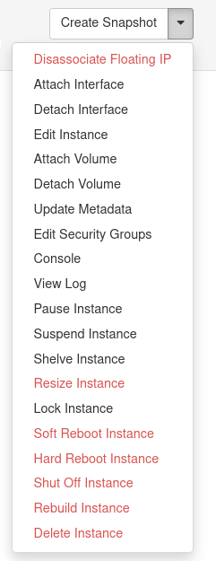

This article explains the different states that virtual machine instances
can have and their effect on resource usage.

[TOC]

Similar to other cloud providers, Pouta virtual machines also have a lifecycle. 
Different states of virtual machines have different
resource requirements for the underlying hardware and are therefore
billed differently. Knowing about these different states in Pouta 
helps you make better decisions on how to maintain your infrastructure.
This also helps you to save billing units. 

## States

The main states of virtual machines in Pouta:

### Active
A virtual machine is said to be active when it
is in the *power on* state. It remains in the active state
irrespective of whether you are using it or not. Virtual machines in
the active state consume computing resources on one of our compute
nodes and are thus billed normally as explained in [Pouta flavors and billing](vm-flavors-and-billing.md).

### Shut off
The virtual machine is not running and is *powered
off*. However, a shut off virtual machine still consumes billing
units in the same way as an **active** one. This is
because active/powered off virtual machines consume the same computing
resources on one of our compute nodes as explained in [Pouta flavors and billing](vm-flavors-and-billing.md).

!!! warning

    A *shut off* virtual machine still consumes billing units. To stop
    consuming, select the *shelved* state.

### Pause
Pausing a virtual machine pauses all processes running
in the virtual machine and saves the entire state of the machine
(memory, application state etc.) on the host compute node. You are
not able to access your virtual machine or hosted applications when
the virtual machine is in a *paused* state. Some applications may
suffer from side effects when  paused, thus this sate is not
recommended for production systems. Some legacy computational tasks
may benefit from the paused state but modern workflows generally do
not use this state. Pausing a virtual machine is billed in the same
way as an **active** state virtual machine.

### Suspend
Suspending a virtual machine saves its current state on
the virtual machine's host compute node. The virtual machine can be
resumed in the same state as it was before the suspension, but
compute resources (actual cores, compute nodes etc.) may be different
from the ones before suspending the virtual machine. You
are not able to access your machine when it is in the *suspended* state.
Virtual machines in the suspended state are billed in the same way
as **active** state virtual machines. Suspending is not generally used
in modern workflows.

### Shelved
Shelving means shutting down a virtual machine and removing it from the host compute node. 
This frees up the computing resources that were reserved for the virtual machine. 
However, the state of all other associated resources, for example the file system,
floating IPs, network configuration, etc., is saved in our central storage. 
Please note that shelving a virtual machine will **not** reduce the amount of
resources used by the project, only the billing for that virtual machine will stop.

Shelving works best for the standard flavors that are already backed by our 
central storage service. Shelving can be slow for flavors that are using local storage,
especially bigger flavors since the data needs to be copied between the local and 
central storage. On a rare occasion, if all of our compute resources are used up, 
we may not be able to unshelve your virtual machine until another user frees up 
compute resources. N.B. that your floating IPs, volumes etc. cannot be removed from
the virtual machine before it has been unshelved. If you have a floating IP quota
of two and one of them is attached to a shelved virtual machine, you have only one left. 
**Note** that the ephemeral storage in the IO, or TB flavors is **not** shelved.

### Terminate
Termination (or deletion) removes the virtual machine
from your project and frees up the compute resources that were in
use. They cannot be recovered, and all data stored in the virtual
machine is deleted, excluding any attached volumes. Once the virtual
machine is deleted, you are no longer billed for it.

## Save Your billing units

The figure below illustrates the state transitions between
states.

In the above section, we discussed the main states of virtual
machines in Pouta. Theoretically, there are other states as well.
The full list of states and their behaviors: [OpenStack documentation](https://developer.openstack.org/api-guide/compute/server_concepts.html).

In order to transition between states, you have two main options, use the [Command line client tools](command-line-tools.md), or use the webinterface.
From the web interface you can transition your VM to all these states. In the main page of the Pouta web interface, open the **Instances** view. Under the **Actions** column, you will be able to see a drop-down menu with all the possible options.

There are many other practices which help save billing units:

### Automated provisioning
Automated provisioning and configuration
of your virtual machines helps save billing units. For
example, you can tear down your unused virtual machines with automatic
provisioning and configuration when you no longer need them. Later when
you need them again, you can provision new virtual machines from
scratch. Your data should always be stored on a volume, and virtual
machines should be launched when you need computation done. 

An example how to automate a workflow with Heat, Ansible and Docker to
deploy Etherpad containing both clustered database and Load balancing: <https://github.com/CSCfi/etherpad-deployment-demo>

### Boot from image
A good utility in
Pouta is creating your own virtual machine using the *Boot from image
(creates new  volume)* option. In this case, even if you delete your
virtual  machine, the entire file system state is saved on the
persistent volume in our central storage service. You can boot a new
virtual machine from this volume. It will have the same file system
state as the previously deleted virtual machine. You can attach this
volume to any other virtual machine and access the file system of the
deleted virtual machine. It is billed as a normal volume in
billing units, which is cheaper than a running virtual
machine. Creating virtual machines with this utility and deleting them
when not needed helps save your billing unit
allocation. One great option is that you can easily delete your
virtual machine and start a new one with the same volume
and a new flavor. This makes it possible to easily scale
from a smaller virtual machine flavor to the biggest virtual machine
flavors.

!!! info

    This type of scaling is not recommended for the IO,
    GPU or TB flavors since ephemeral storage data is lost in this
    process.

### Select a suitable state of your virtual machine
Depending on your project requirements, you can change the state of your virtual
machines:

-   In case you are going on a long vacation and want to save 
    billing units, you can shelve your virtual machines.
-   If you no longer require your virtual machine, you can delete it
    after copying all essential data from it to a volume.

You can transition between different states via the Pouta dashboard,
command line tools or REST APIs, depending on your project setup. The
most common states for virtual machines are active, shut down,
shelved and deleted. There may be occasions when your virtual machine
enters the _error_ state. Virtual machines in the error state are still
billed. In case your virtual machine enters the error state and you are
unable to recover it, please contact cloud-support@csc.fi.

### Resize your virtual machine
Resizing a virtual machine is a
good utility in Pouta, and helps save billing
units. Based on your project requirements, you can scale your virtual machine up or
down to other flavors. Scaling down your
virtual machine when it has less computational workload frees up
compute resources and saves billing units. Later on,
depending on your computational workload, you can scale up your virtual
machines. Please note that you can resize to another flavor from another *family* but it's **highly not recommended!**.
You may lose data during this process and CSC is not responsible. We recommend to only resize to the flavors of the
same *family*. For example, if you are using a standard
family flavor, you can only resize it to another standard family
flavor. When the resize is complete, the virtual machine status first
displays _verify resize_. At this point, you need to confirm again if
your virtual machine has been resized as expected. Resizing will have
downtime for the virtual machine until the whole resize process has
been completed. Note that resizing is not as elegant as using the _boot
from volume_ option explained above. If you know beforehand that you want change the
size of the virtual machines at some point, using boot from
volume when launching the virtual machine gives more
flexibility.  
More information about how to resize an instance [here](../../support/faq/how-to-resize-in-pouta.md)

  [Pouta flavors and billing]: vm-flavors-and-billing.md
