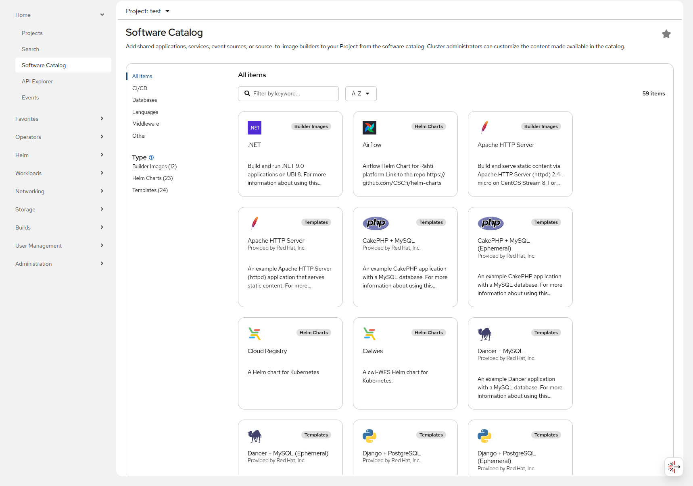

# Rahti-katalogi

Rahti tarjoaa valmiina sovellusten ja sovellusten komponenttien (kuten tietokantojen) katalogin. Lisäksi CSC lisää valikoidun ryhmän sovelluksia katalogiin. Nämä sovellukset toimitetaan "sellaisina kuin ne ovat". Seuraamme Redhatin, ylälähteen toimittajan, tarjoamia päivityksiä. Emme pysty päivittämään niitä itsenäisesti ennaltaehkäisevästi. Jos tarvitset apua sovelluksen uudemman version käyttöönottamiseksi, ole hyvä ja ota yhteyttä Service Deskiin osoitteessa <servicedesk@csc.fi>. Jokainen pyyntö käsitellään yksitellen.

Lisätietoja saat pääsemällä [oletus Openshift Helm Chartien GitHub-repositorioon](https://github.com/openshift-helm-charts/charts)

Mallipohjista löydät GitHub-resitorion täältä: [Openshift oletusmallipohjat](https://github.com/sclorg/)

Voit myös tarkastella [RedHat-ekosysteemikatalogia](https://catalog.redhat.com/). Tämä katalogi sisältää uusimmat kuvajulkaisut.  
Löydät ohjeet siitä, miten kuvat tuodaan nimialueeseesi/Rahti-projektiisi.

## Kuinka käyttää katalogia WebUI:n avulla {#how-to-access-the-catalog-using-the-webui}

Voit selata katalogia verkkokäyttöliittymästä kirjauduttuasi (1) Rahtiin ja sitten (2) siirtymällä kehittäjän näkymään ja napsauttamalla `+Lisää`.

!!! Huomautus "Rahti 1 -mallit Rahtissa"
    Useimmat aiemmat mallipohjat on siirretty Rahtin Helm Charteiksi. Jos haluat käyttää Rahti 1 -mallia Rahtissa, löydät repositorion tästä [linkistä](https://github.com/CSCfi/rahti-1-templates).  
    CSC ei enää päivitä näitä vanhoja mallipohjia, ainoastaan Helm Charteja.

