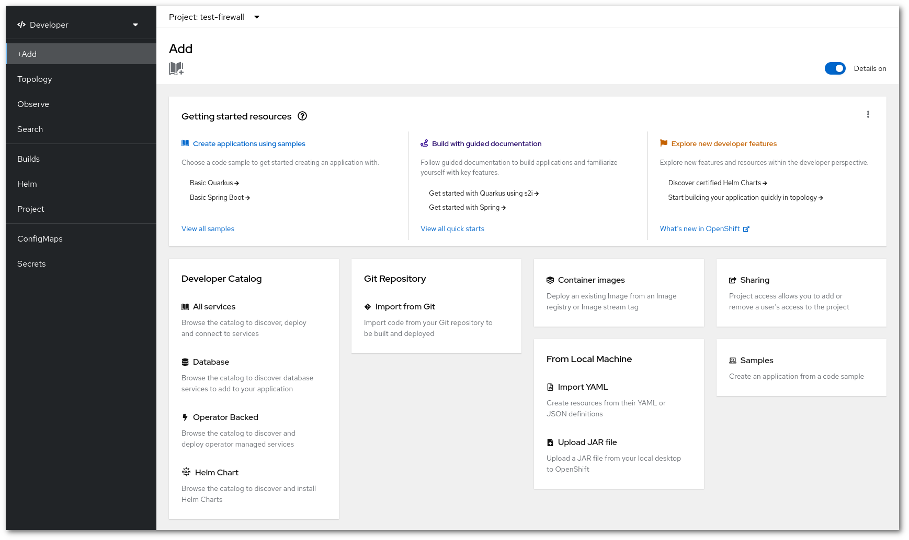

# Rahti catalog

Rahti offers out of the box a catalog of applications and components of applications (like databases). In addition to that, CSC adds a selected group of applications to the catalog. These applications are provided "as is". We follow the updates provided by Redhat, the upstream provider. We are not able to proactively update them on our own. If you need help to deploy a newer version of an application, please contact the Service Desk on the address <servicedesk@csc.fi>. Each request is studied individually.

For more information, you can access The official GitHub repository for the [default Openshift Helm Charts](https://github.com/openshift-helm-charts/charts)

Regarding templates, you can find the GitHub repository here: [Openshift default templates](https://github.com/sclorg/)

You can also take a look at the [RedHat Ecosystem Catalog](https://catalog.redhat.com/). This catalog contains the latest image releases.  
You will find the instructions on how to import the images into your namespace/Rahti project.

## How to access the catalog using the WebUI

!!! warning "Rahti Helm Charts"

    Starting on 29 September 2025, Bitnami will be changing its policy regarding its catalog. Read more [here](https://github.com/bitnami/containers/issues/83267)  
    - Current images will be moved to the [Bitnami Legacy Repository](https://hub.docker.com/u/bitnamilegacy) and will no longer be updated.  
    - Some images will still be available in the [Bitnami Secure Images](https://hub.docker.com/u/bitnamisecure) but only with the `latest` tag.  
    - To continue receiving images with the latest updates and access to different tags, you need to subscribe to the full version of [Bitnami Secure Images](https://www.arrow.com/globalecs/uk/products/bitnami-secure-images/)  
    
    Some of our Helm Charts used `Bitnami` images. Our Helm Charts are now intended for testing/development purposes because they use `bitnamilegacy` and/or `bitnamisecure` docker repositories.  
    
    However, the Bitnami project continues to make its source code available at [bitnami/containers](https://github.com/bitnami/containers) under the Apache 2 licence. You can build the image and then push it to your CSC project.
    
    You can find more information on how to push images [here](./images/Using_Rahti_integrated_registry.md)

You can browse the catalog from the webinterface after (1) logging in Rahti and then (2) Clicking on `Home` -> `Software Catalog`.

!!! Note "Rahti 1 templates in Rahti"
    Most of the previous templates have been migrated to Helm Charts for Rahti. If you want to use a Rahti 1 template on Rahti, you can find the repo at this [link](https://github.com/CSCfi/rahti-1-templates).  
    CSC will no longer update these legacy templates, only the Helm Charts.
