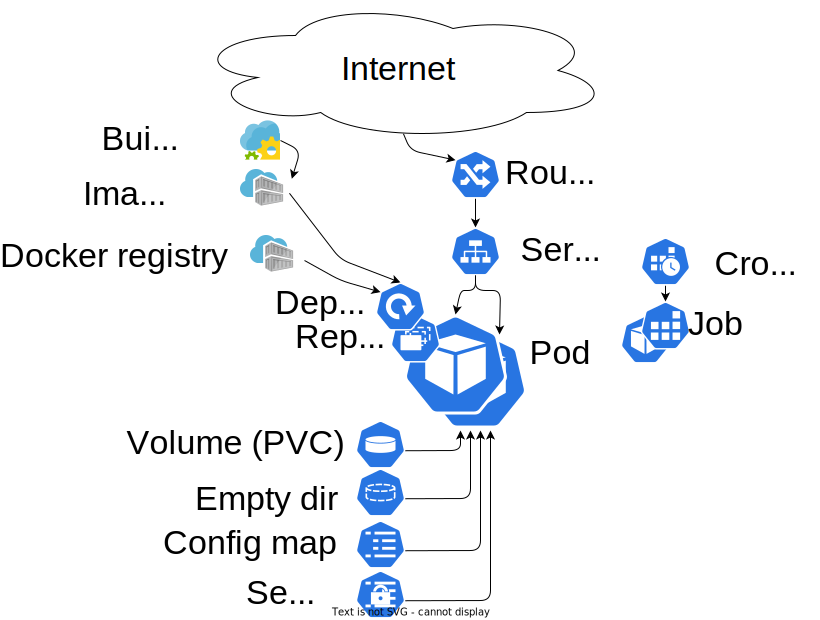
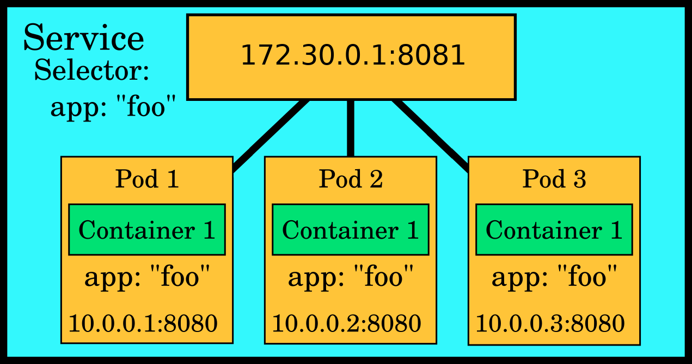
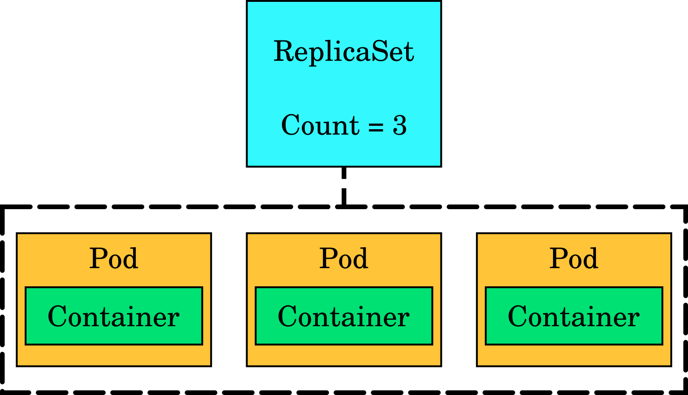
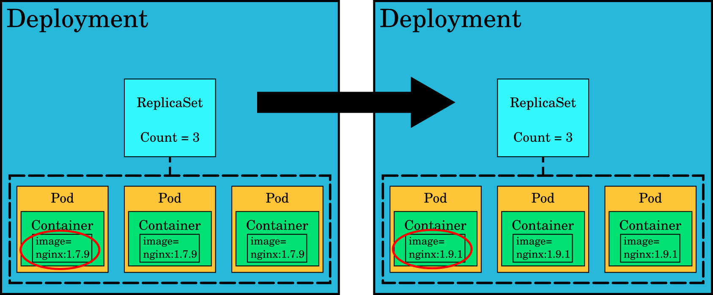

# Kubernetes and OpenShift concepts

The power of Kubernetes (and OpenShift) is in the relatively simple abstractions that they provide for complex tasks such as load balancing, software updates for a distributed system, or autoscaling. Here we give a very brief overview of some of the most important abstractions, but we highly recommend that you read the concept documentation for Kubernetes and OpenShift as well:

* [Kubernetes concepts](https://kubernetes.io/docs/concepts/)
* [OpenShift concepts](https://docs.redhat.com/en/documentation/openshift_container_platform/4.19/html/overview/index)

These abstractions are objects, persistent entities in the Kubernetes system. These entities are used to represent the desired state of the project (also called namespace in Kubernetes). Most of the objects are common to both plain Kubernetes and OpenShift, but OpenShift also introduces some of its own extra objects.



## Kubernetes concepts

### Namespace

Every Kubernetes object is created inside a **Namespace**. It is just a sandbox where all the other objects are 
contained and separated from objects belonging to other namespaces. In Openshift they are referred as **Projects**. 
The two names (project and namespace) are very common words in computing so referring to them can sometimes be confusing. 
In order to create a project, please go to the [Creating a project](usage/projects_and_quota.md#creating-a-project) documentation.

### Pod

**Pods** contain one or more containers that run applications. It is the basic
unit in Kubernetes: when you run a workload in Kubernetes, it always runs in a
pod. Kubernetes handles scheduling these pods on multiple servers. Pods can
contain volumes of different types for accessing data. Each pod has its own IP
address shared by all containers in the pod, this IP address may change if the Pod gets killed and recreated. In the most typical
case, a pod contains one container and perhaps one or a few different volumes.

Pods are intended to be _expendable_, i.e. they may be killed at any time and a "cloud native" application must be 
able to continue working and show no sign of interruption to the user. It must recover automatically. Any data that 
needs to persist after a pod is killed should be stored on a [persistent volume](storage/persistent.md) attached to the pod.


The abstractions in Kubernetes/OpenShift are described using YAML or JSON. YAML
and JSON are so-called data serialization languages that provide a way to
describe key value pairs and data structures such as lists in a way that is easy to
read for both humans and computers. An example of what the
representation of a pod looks like in YAML:

```yaml
---
apiVersion: v1
kind: Pod
metadata:
  name: name
spec:
  containers:
  - name: webserver
    image: cscfi/nginx-okd
    ports:
    - containerPort: 8080
      protocol: TCP
    volumeMounts:
    - name: website-content-volume
      mountPath: /usr/share/nginx/html
  volumes:
  - name: website-content-volume
    persistentVolumeClaim:
      claimName: web-content-pvc
```

The above YAML representation describes a web server pod that has one container
and one volume and exposes the port 8080. You could put this snippet of text
in a file and create a pod that runs NGINX by feeding that file to the Kubernetes API.

### Service

Pod IP addresses are not predictable. If a pod is replaced as part of normal
operations such as an update, the IP address of the new pod can be different. It is
also typical to have multiple pods serving the same content, in which case there
are several of these unpredictable IP addresses to point to. Thus, pods alone
are not enough to provide a predictable way to access an application.

A **service** provides a stable virtual IP, a port and a DNS name for one or
more pods. They act as **load balancers**, directing traffic to a group of pods
that all serve the same application.



*`service.yaml`*:

```yaml
apiVersion: v1
kind: Service
metadata:
  labels:
    app: app
  name: service-name
spec:
  ports:
  - name: 8080-tcp
    port: 8080
    protocol: TCP
    targetPort: 8080
  selector:
    app: app
  sessionAffinity: None
  type: ClusterIP
status:
  loadBalancer: {}
```

#### Ports 
- The `ports` field in a Kubernetes Service defines the network ports that the Service will expose to clients and how it maps those to the corresponding ports on the pods.

- It typically consists of several components:
  - **Name**: A label for the port, which can help identify it.
  - **Port**: The port number that clients will use to access the Service.
  - **Protocol**: The communication protocol used (usually TCP).
  - **TargetPort**: The port on the pod where the Service directs traffic.

#### Selector
- The `selector` field in a Kubernetes Service is crucial for determining which pods the Service should route traffic to.

- It consists of key-value pairs that match the labels assigned to the pods. The Service uses these labels to identify and connect to the appropriate pods dynamically.

```yaml
selector:
  app: app
```

- **Key Value Pair (`app: app`)**: This means that the Service will route traffic to any pods that have a label matching app: app.

- **Functionality**: This allows the Service to connect to all relevant pods automatically. If any pods with this label are added or removed, the Service will adjust its routing accordingly, ensuring that traffic is always directed to the correct pods.


### ReplicaSet

A **ReplicaSet** ensures that _n_ copies of a pod are running. If one of the
pods dies, the ReplicaSet ensures that a new one is created in its place. They
are typically not used on their own but rather as part of a **Deployment**
(explained next).



### Deployment

**Deployments** manage rolling updates for an application. They typically
contain a ReplicaSet and several pods. If you make a change that requires an
update such as switching to a newer image for pod containers, the deployment
ensures the change is made in a way that there are no service interruptions. It
will perform a rolling update to kill all pods one by one and replace them with
newer ones while making sure that end user traffic is directed towards working
pods at all times.



### InitContainer

_InitContainer_ is a container in a pod that is intended run to completion before
the main containers are started. Data from the init containers can be
transferred to the main container using e.g. empty volume mounts.

*`pod-init.yaml`*:

```yaml
apiVersion: v1
kind: ServiceAccount
metadata:
  name: build-reader
---
apiVersion: rbac.authorization.k8s.io/v1
kind: Role
metadata:
  name: build-reader
rules:
- apiGroups:
  - build.openshift.io
  resources:
  - builds
  verbs:
  - get
  - list
  - watch
---
apiVersion: rbac.authorization.k8s.io/v1
kind: RoleBinding
metadata:
  name: build-reader
subjects:
  - kind: ServiceAccount
    name: build-reader
roleRef:
  kind: Role
  name: build-reader
  apiGroup: rbac.authorization.k8s.io
---
apiVersion: v1
kind: Pod
metadata:
  name: mypod
  labels:
    app: serveapp
    pool: servepod
spec:
  volumes:
  - name: sharevol
    emptyDir: {}
  initContainers:
  - name: perlhelper
    imagePullPolicy: IfNotPresent
    image: quay.io/openshift/origin-cli:4.16
    command:
    - sh
    - -c
    - "oc wait --for=jsonpath='{.status.phase}'=Complete build -l buildconfig=app --timeout=900s"
  containers:
  - name: serve-cont
    image: image-registry.apps.2.rahti.csc.fi/project/app
    volumeMounts:
    - mountPath: /var/www/html
      name: sharevol
```

Here we run an init container that uses the `origin-cli` image and waits for the build in the `app` BuildConfig to end, once it ends the normal container can be launched, knowing that the image is already created.

The shared volume is defined in `spec.volumes` and "mounted" in
`spec.initContainers[].volumeMounts` and `spec.containers[].volumeMounts`.

### StatefulSet

Most Kubernetes objects are stateless. This means that they may be deleted and recreated, and the application should be
able to cope with that without any visible effect. For example, a Deployment defines a Pod with 5 replicas and a 
Rolling release strategy. When a new image is deployed, Kubernetes will kill one by one all Pods, recreating them with 
different names and possibly in different nodes, always keeping at least 5 replicas active. For some application this is
not acceptable, for this use case, Stateful sets have been created.

Like a Deployment, a StatefulSet defines Pods based on container specification. But unlike a Deployment, a StatefulSet 
gives an expected and stable identity, with a persistent identifier that it is maintained across any event 
(upgrades, re-deployments, ...). A stateful set provides:

* Stable, unique network identifiers.
* Stable, persistent storage.
* Ordered, graceful deployment and scaling.
* Ordered, automated rolling updates.

*`statefulSet.yaml`*:

```yaml
apiVersion: apps/v1
kind: StatefulSet
metadata:
  name: web
spec:
  selector:
    matchLabels:
      app: nginx # has to match .spec.template.metadata.labels
  serviceName: "nginx"
  replicas: 3 # If omitted, by default is 1
  template:
    metadata:
      labels:
        app: nginx # has to match .spec.selector.matchLabels
    spec:
      terminationGracePeriodSeconds: 10
      containers:
      - name: nginx
        image: openshift/hello-openshift
        ports:
        - containerPort: 8888
          name: web
        volumeMounts:
        - name: www
          mountPath: /usr/share/nginx/html
  volumeClaimTemplates:
  - metadata:
      name: www
    spec:
      accessModes: [ "ReadWriteOnce" ]
      storageClassName: "standard-csi"
      resources:
        requests:
          storage: 1Gi
```

### Jobs


A _Job_ uses  pods to execute a specific task one or several times, and will continue to retry execution of the Pods until
a specified number of them successfully terminate ot a backoff limit is reached. As pods successfully complete, the Job 
tracks the successful completions. When a specified number of successful completions is reached, the task (ie, Job) is 
complete. Deleting a Job will clean up the Pods it created. Suspending a Job will delete its active Pods until the Job 
is resumed again.

*`job.yaml`*:

```yaml
apiVersion: batch/v1
kind: Job
metadata:
  name: pi
spec:
  template:
    spec:
      volumes:
      - name: smalldisk-vol
        emptyDir: {}
      containers:
      - name: pi
        image: perl
        command:
        - sh
        - -c
        - >
          echo helloing so much here! Lets hello from /mountdata/hello.txt too: &&
          echo hello to share volume too >> /mountdata/hello-main.txt &&
          cat /mountdata/hello.txt
        volumeMounts:
        - mountPath: /mountdata
          name: smalldisk-vol
      restartPolicy: Never
      initContainers:
      - name: init-pi
        image: perl
        command:
        - sh
        - -c
        - >
          echo this hello is from the initcontainer >> /mountdata/hello.txt
        volumeMounts:
        - mountPath: /mountdata
          name: smalldisk-vol
  backoffLimit: 4
```

This job names the pod automatically, and the pod can be queried with
a job-name label:

```bash
$ oc get pods --selector job-name=pi
NAME       READY     STATUS      RESTARTS   AGE
pi-gj7xg   0/1       Completed   0          3m
```

The standard output of the job:

```bash
$ oc logs pi-gj7xg
helloing so much here! Lets hello from /mountdata/hello.txt too:
this hello is from the initcontainer
```

There may only be one object with a given name in the project namespace, thus the
job cannot be run twice unless its first instance is removed. The pod,
however, does not need to be cleaned, it will be removed automatically in cascade after the Job is removed.

### ConfigMap

**ConfigMaps** are useful in collecting configuration type data in Kubernetes
objects. Their contents are communicated to containers by environmental
variables or volume mounts.

*`configmap.yaml`*:

```yaml
kind: ConfigMap
apiVersion: v1
metadata:
  name: my-config-map
data:
  data.prop.a: hello
  data.prop.b: bar
  data.prop.long: |-
    fo=bar
    baz=notbar
```

#### Create a ConfigMap

ConfigMaps can be created in various ways. If we have a ConfigMap object definition
as listed above in `configmap.yaml`, then, an instance of it can be created using
the `oc create -f configmap.yaml` command. You can also use the more specific
command `oc create configmap <configmap_name> [options]` to create an instance
of a ConfigMap from directories, specific files, or literal values.
For example, if you have a directory with files containing the data needed to
populate a ConfigMap as follows:

```sh
$ ls example-dir
data.prop.a
data.prop.b
data.prop.long
```

You can then create a ConfigMap similar to the one defined in `configmap.yaml` as:

```sh
oc create configmap my-config-map \
    --from-file=example-dir/
```

This command also works with files instead of directories.

#### Use a ConfigMap

The following pod imports the value of `data.prop.a` to the `DATA_PROP_A`
environment variable and creates the files `data.prop.a`, `data.prop.b` and
`data.prop.long` inside `/etc/my-config`:

*`configmap-pod.yaml`*:

```yaml
kind: Pod
apiVersion: v1
metadata:
  name: my-config-map-pod
spec:
  restartPolicy: Never
  volumes:
  - name: configmap-vol
    configMap:
      name: my-config-map
  containers:
  - name: confmap-cont
    image: perl
    command:
    - /bin/sh
    - -c
    - |-
      cat /etc/my-config/data.prop.long &&
      echo "" &&
      echo DATA_PROP_A=$DATA_PROP_A
    env:
    - name: DATA_PROP_A
      valueFrom:
        configMapKeyRef:
          name: my-config-map
          key: data.prop.a
          optional: true     # Run this pod even
    volumeMounts:            # if data.prop.a is not defined in configmap
    - name: configmap-vol
      mountPath: /etc/my-config
```

Deploy the pod using `oc create -f configmap-pod.yaml` command. The output log, provided with the command `oc logs my-config-map-pod` of this container,
should be:

```
fo=bar
baz=notbar

DATA_PROP_A=hello
```

### Secret

Secrets behave much like ConfigMaps, with the difference that once created they are stored in *base64* encoded form, and their contents are not displayed by default in the command line or in the web interface.

*`secret.yml`*:

```yaml
apiVersion: v1
kind: Secret
data:
  WebHookSecretKey: dGhpc19pc19hX2JhZF90b2tlbgo=
metadata:
  name: webhooksecret
```

#### Create a secret

As with any other OpenShift/Kubernetes objects, Secrets can also be created from a Secret object definition.
For the definition listed above as `secret.yaml`, a Secret instance can be created using
the `oc create -f secret.yaml` command. You can also use the more specific command `oc create secret [flags] <secret_name> [options]`
to create an instance of a Secret from directories, specific files, or literal values.
For example, if you have a file  called `WebHookSecretKey` containing a secret key  you can
use it to create an instance of a secret similar to the one specified in the previous `secret.yaml` file
as follows:

```sh
oc create secret generic webhooksecret \
   --from-file=WebHookSecretKey
```

#### Edit a secret

The process to edit a secret is not trivial. The idea is to retrieve the secret JSON definition, decode it, edit it, and then encode it back and replace it.

* First you need to retrieve the different files/secrets inside the secret (the examples use jq to process the JSON files, but it can be done without it):

```sh
oc get secrets <SECRET_NAME> -o json | jq ' .data | keys '
```

* Then choose one of the options and get the file/secret itself:

```sh
oc get secrets <SECRET_NAME> -o json >secret.json
jq '.data.<KEY_NAME>' -r secret.json | base64 -d > <KEY_NAME>.file
```

* Edit the file with any editor.

* Encode the new file and replace the previous value in the JSON file:

```sh
B64=$(base64 <KEY_NAME>.file -w0)
jq " .data.<KEY_NAME> = \"$B64\" " secret.json
oc replace -f secret.json
```

As you can see the process can be a bit obfuscated.


##  OpenShift extensions

OpenShift includes all Kubernetes objects, plus some extensions:

* **BuildConfig** objects build container images
  based on the source files.
* **ImageStream** objects abstract images and
  enrich them to streams that emit signals when they see that a new image is
  uploaded into them by e.g. BuildConfig.
* **Route** objects connects a **Service** with the internet using _HTTP_.

### DeploymentConfig

!!! Warning

    Starting OKD 4.14, DeploymentConfig API is being deprecated. Only security-related and critical issues will be fixed in the future.
    More information [here](https://access.redhat.com/articles/7041372) and the [replacement guide for DeploymentConfig](https://developers.redhat.com/learning/learn:openshift:replace-deprecated-deploymentconfigs-deployments/resource/resources:convert-deploymentconfig-deployment).


DeploymentConfigs are objects that create
[ReplicationControllers](tutorials/deploy_static_webserver_cli.md#replicationcontroller) according to
`spec.template`. They differ from ReplicationControllers in the sense that
DeploymentConfig objects may start new ReplicationControllers based on the state of
`spec.triggers`. In the example below, the DeploymentConfig performs
an automatic rolling update when it gets triggered by an ImageStream named
`serveimagestream:latest`. For other update strategies, see "[Deployment
Strategies](https://docs.redhat.com/en/documentation/openshift_container_platform/4.17/html/building_applications/deployments#deployment-strategies)"
in the OpenShift documentation.

DeploymentConfig objects function similarly to deployments described in the
chapter [deployment](#deployment) except that deployments
trigger updates only when `spec.template` is changed. Furthermore, deployment
is a pure Kubernetes concept, and DeploymentConfig is an OpenShift extension.

Recall that [ReplicationControllers](tutorials/deploy_static_webserver_cli.md#replicationcontroller)
are objects that make sure that a requested number of replicas of the pod defined in the
`spec.template` is running.

*`deploymentconfig.yaml`*:

```yaml
apiVersion: apps.openshift.io/v1
kind: DeploymentConfig
metadata:
  labels:
    app: serveapp
  name: blogdeployment
spec:
  replicas: 1
  selector:
    app: serveapp
    deploymentconfig: blogdeployment
  strategy:
    activeDeadlineSeconds: 21600
    type: Rolling
  template:
    metadata:
      labels:
        app: serveapp
        deploymentconfig: blogdeployment
    spec:
      containers:
      - name: serve-cont
        image: "serveimagestream:latest"
  triggers:
  - type: ConfigChange
  - imageChangeParams:
      automatic: true
      containerNames:
      - serve-cont
      from:
        name: serveimagestream:latest
    type: ImageChange
```

In this case, the DeploymentConfig object listens to the *ImageStream* object
`serveimagestream:latest`.

### ImageStream

[ImageStreams](https://docs.redhat.com/en/documentation/openshift_container_platform/4.17/html/images/managing-image-streams) store images. They simplify
the management of container images and can be created by a BuildConfig or the user when a new images are uploaded to
the registry.

A simple ImageStream object:

*`imagestream.yaml`*:

```yaml
apiVersion: image.openshift.io/v1
kind: ImageStream
metadata:
  labels:
    app: serveapp
  name: serveimagestream
spec:
  lookupPolicy:
    local: false
```

### BuildConfig

[BuildConfig](https://docs.redhat.com/en/documentation/openshift_container_platform/4.17/html/builds_using_buildconfig/understanding-image-builds) objects 
create container images according to specific rules. In the following example, the _Docker_ strategy is used to build a trivial extension
of the `httpd` image shipped with OpenShift.

*`buildconfig.yaml`*:

```yaml
kind: "BuildConfig"
apiVersion: "build.openshift.io/v1"
metadata:
  name: "serveimg-generate"
  labels:
    app: "serveapp"
spec:
  runPolicy: "Serial"
  output:
    to:
      kind: ImageStreamTag
      name: serveimagestream:latest
  source:
    dockerfile: |
      FROM image-registry.openshift-image-registry.svc:5000/openshift/httpd
  strategy:
    type: Docker
```

After creating the build object (here named `serveimg-generate`), we can
request the OpenShift cluster to build the image:

```bash
 oc start-build serveimg-generate
```

Other source strategies include `custom`, `jenkins` and `source`.

### Route

Route objects are the OpenShift equivalent of _Ingress_ in vanilla Kubernetes, they expose a Service object to the internet via HTTP/HTTPS. A typical Route definition would be:

```yaml
apiVersion: route.openshift.io/v1
kind: Route
metadata:
  name: <name-of-the-route>
spec:
  host: <host.name.dom>
  to:
    kind: Service
    weight: 100
    name: <name-of-service>
  tls:
    insecureEdgeTerminationPolicy: Redirect
    termination: edge
status:
  ingress: []
```

This will redirect any traffics coming to `<host.name.dom>` to the service `name-of-service`.

* `insecureEdgeTerminationPolicy` is set to `Redirect`. This means that any traffic coming to port 80 (HTTP) will be redirected to port 443 (HTTPS).
* `termination` is set to `edge`, This means that the route will manage the TLS certificate and decrypt the traffic sending it to the service in clear text. Other options for `termination` include `passthrough` or `reencrypt`.

Every host with the pattern `*.2.rahtiapp.fi` or `*.rahtiapp.fi` will automatically have a **DNS record** and a valid **TLS certificate**. It is possible to configure a Route with any given hostname, but a `CNAME` pointing to `router.2.rahtiapp.fi` must be configured, and a **TLS certificate** must be provided. See the [Custom domain names and secure transport](tutorials/custom-domain.md) article for more information.

!!! info "Default hostname"
    By default, the hostname of the Route is `metadata.name` + `-` + `project name` + `.2.rahtiapp.fi` unless otherwise specified in `spec.host`.

## IP allowlisting

It is possible to use annotations to enable **IP allowlisting**, where only a few IP ranges are allowed to get through the **Route** and the rest of the internet is blocked. Security-wise it is highly encouraged to utilize IP allow list for services that are not meant to be visible to the entire internet. In order to add it to a route do:

```sh
oc annotate route <route_name> haproxy.router.openshift.io/ip_allowlist='192.168.1.0/24 10.0.0.1'
```

!!! warning
    The old `ip_whitelist` annotation is deprecated but still supported for compatibility.
    It will be removed in a future version.


!!! warning

    If the whitelist entry is malformed, OpenShift will discard the whitelist and allow all traffic.
