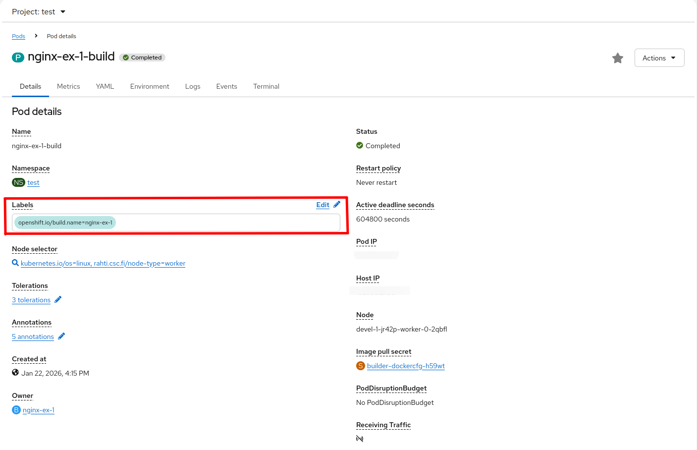
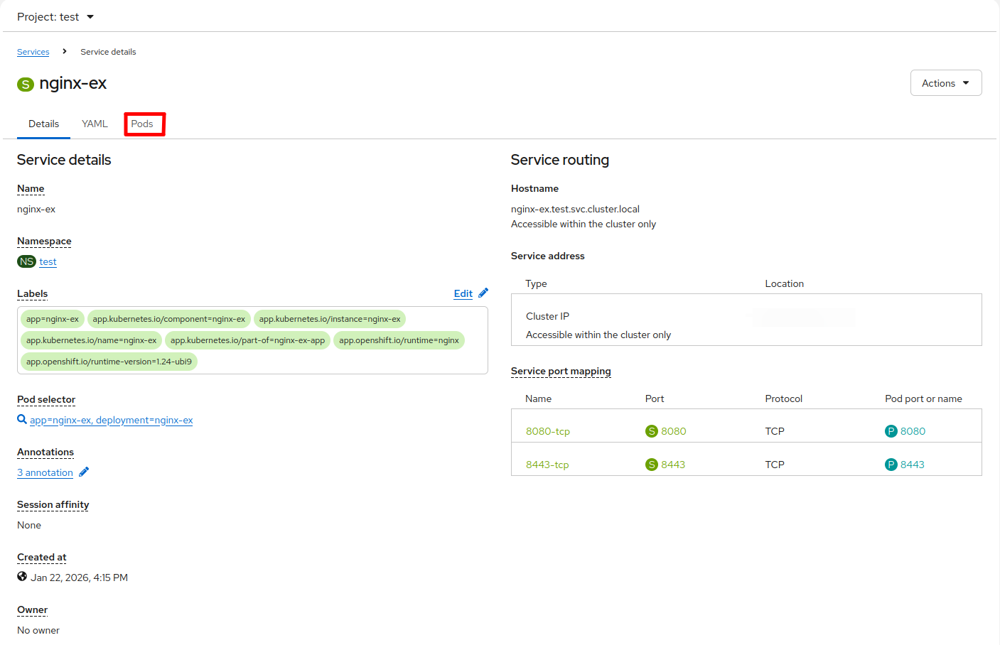

# LoadBalancer service type

Unlike [routes](../usage/kubernetes-concepts.md#route), the `LoadBalancer` service type makes it possible to expose services to the internet without being limited to HTTP/HTTPS protocols. This feature allows you to expose services to receive external inbound traffic on a dedicated public IP address, ensuring that external users or services can interact with your applications. To enable and use LoadBalancer services within your Rahti project, you must submit a request to the [Service Desk](../../../support/contact.md). The request must include the following details:

- **Project Name**: Provide the exact name of the Rahti project for which you want to enable LoadBalancer services.

- **CSC Project Number**: The `csc_project` number that is used for the Rahti project.

- **Use Case**: Clearly describe the use case, including:
    - The type of services you plan to expose (e.g. web applications, APIs).
    - Any specific requirements or considerations, for example how many IP addresses you need.

When your request is approved by the admins, you will receive the public IP address that can be used to access your services, and you can then proceed with the creation of the `LoadBalancer` service. Alternatively, you can use the following command to check the IP addresses that are assigned to your project. The information is visible under the `annotations.ip_pairs` field.

```bash
oc get ipaddresspools.metallb.io -n metallb-system <project_name> -o yaml
```

```yaml
apiVersion: metallb.io/v1beta1
kind: IPAddressPool
metadata:
  annotations:
    ip_pairs: |
      192.168.191.X - 86.50.228.M
      192.168.192.Y - 195.148.30.N
  creationTimestamp: "XXXX-XX-XXTXX:XX:XXZ"
  generation: 1
  name: <project_name>
  namespace: metallb-system
  resourceVersion: "XXXXXX"
  uid: XXXXXXX
spec:
  addresses:
  - 192.168.191.X/32
  - 192.168.192.Y/32
  autoAssign: true
  avoidBuggyIPs: false
  serviceAllocation:
    namespaces:
    - <project_name>
    priority: 1
```

For example, the following Service definition exposes a MySQL service on the assigned public IP at port 33306:

```yaml
kind: Service
apiVersion: v1
metadata:
  name: mysqllb
  namespace: my-namespace
spec:
  ports:
    - protocol: TCP
      port: 33306
      targetPort: 3306
  allocateLoadBalancerNodePorts: false
  type: LoadBalancer
  selector:
    app: mysql
```

You can find a detailed explanation of the `Service` object on the [Kubernetes and OKD concepts](../usage/kubernetes-concepts.md#service) page.

Ensure that the service type is set to `LoadBalancer`, and that the `allocateLoadBalancerNodePorts` field is set to `false` (the default is `true`) because NodePorts are not enabled in Rahti. If this field is not set correctly, the allocated node port will be unusable, and Service creation may fail if the entire default node port range is already allocated.

Additionally, the `port` field in the Service definition (e.g. `33306` in the previous example) must be within the range of `30000-35000`.

## How to retrieve the selector

The `selector` field of the Service must match the labels of the Pods that you want to expose. When you copy a label, make sure to follow the `yaml` syntax and change `=` to `:`.

### Using the CLI

On your CLI, run `oc describe pod <pod-name> -n <namespace>`. The output includes a section labeled `Labels`. Copy any of the labels and paste it into the `yaml` file under `selector`. For example, using the first label of the output below, the selector becomes `app: mysql`:

```bash
Name:           mysql-pod
Namespace:      my-namespace
Priority:       0
Node:           worker-node-1/10.0.0.1
Start Time:     Mon, 23 Oct 2024 10:00:00 +0000
Labels:         app=mysql
                environment=production
                app.kubernetes.io/name=mysql
(...)
```

### Using the web interface

In the web interface, under `Workloads`, click `Pods` and then choose the Pod you want. You can see all the labels under `Labels`. Copy any of the labels and paste it into the `yaml` file under `selector`.



## How to make sure your Service is pointing to the right Pod

### Using the CLI

On your CLI, run `oc get endpoints <service-name> -n <namespace>`. You should see the name of the Service and the IP addresses and ports of the Pods that are currently targeted by the Service. For example:

```bash
NAME      ENDPOINTS      AGE
mysqllb   10.0.0.1:3306  10m
```

### Using the web interface

In the web interface, under `Networking`, click `Services` and choose the LoadBalancer service you just created. Under the `Pods` tab you should see the targeted Pod.



## Share the same LoadBalancer IP among Services

It is also possible to expose multiple `LoadBalancer` services on the same public IP but on different ports. You can enable IP sharing by adding the `metallb.universe.tf/allow-shared-ip` annotation to the Services. The value of the annotation is a label of your choice, and the Services annotated with the same label share the same IP. Here is an example configuration of two Services that share the same IP address:

```yaml
kind: Service
apiVersion: v1
metadata:
  name: mysqllb
  namespace: my-namespace
  annotations:
     metallb.universe.tf/allow-shared-ip: "label-to-share-1.2.3.4"
spec:
  ports:
    - protocol: TCP
      port: 33306
      targetPort: 3306
  allocateLoadBalancerNodePorts: false
  type: LoadBalancer
  selector:
    app: mysql
```

```yaml
kind: Service
apiVersion: v1
metadata:
  name: httplb
  namespace: my-namespace
  annotations:
     metallb.universe.tf/allow-shared-ip: "label-to-share-1.2.3.4"
spec:
  ports:
    - protocol: TCP
      port: 30080
      targetPort: 80
  allocateLoadBalancerNodePorts: false
  type: LoadBalancer
  selector:
    app: httpd
```

## Add firewall IP blocking to a LoadBalancer Service using NetworkPolicy

It is possible to add firewall IP blocking to a LoadBalancer Service. This allows you to configure an allowlist of specific IP addresses (for example, `188.184.77.250`) and/or IP ranges (for example, `188.184.0.0/16`). Only traffic from these permitted addresses will be able to access the Service.

!!! info "Tip"

    IP firewalling alone is not sufficient to secure an application running behind a LoadBalancer Service. Always follow security best practices and use IP filtering as part of a layered security approach. **Combine** it with secure communication protocols such as TLS and strong authentication mechanisms, including safe password practices, to properly protect your applications.

The procedure to achieve this is the following:

1. Activate the `Local` external traffic policy in the Service. To do so, add `externalTrafficPolicy: Local` under `spec`, like this:

    ```yaml
    kind: Service
    apiVersion: v1
    metadata:
      name: mysqllb
    spec:
      ports:
        - protocol: TCP
          port: 33306
          targetPort: 3306
          name: http
      allocateLoadBalancerNodePorts: false
      externalTrafficPolicy: Local   # This is the line to add
      type: LoadBalancer
      selector:
        app: mysql
    ```

    !!! warning "Local traffic policy limitations"

        Rahti uses `L2Advertisement` mode in MetalLB. For more information, please refer to [Layer 2](https://metallb.universe.tf/usage/#traffic-policies).

        Also note that, when `externalTrafficPolicy` is set to `Local`, only one Service can be exposed using the external IP, i.e. the load balancer IP cannot be shared among multiple Services.

        For more information, refer to the official article: [Understanding Openshift/OKD `externalTrafficPolicy: local` and Source IP Preservation](https://access.redhat.com/solutions/7028639).

2. Add a `NetworkPolicy` to open access to selected IPs:

    ```yaml
    apiVersion: networking.k8s.io/v1
    kind: NetworkPolicy
    metadata:
      name: firewall
    spec:
      ingress:
      - from:
        - ipBlock:
            cidr: 188.184.0.0/16
        - ipBlock:
            cidr: 137.138.6.31/32
      - from:
        - namespaceSelector:
            matchLabels:
              policy-group.network.openshift.io/ingress: ""
      podSelector:
        matchLabels:
          app: mysql
      policyTypes:
      - Ingress
    ```

    The above example of `NetworkPolicy` allows ingress traffic from the [CIDR](https://en.wikipedia.org/wiki/Classless_Inter-Domain_Routing) `188.184.0.0/16`, which translates to the range [`188.184.0.0` - `188.184.255.255`], and from the single IP `137.138.6.31`. The destination of the traffic is limited by the `matchLabels` section. The label must be the same as the one used in the `LoadBalancer` Service.

3. When using `externalTrafficPolicy: Local` in your Service, your Pods need to be hosted on nodes that can forward traffic directly to them, i.e. locally. To achieve this, you need to add the [node selector](https://kubernetes.io/docs/concepts/scheduling-eviction/assign-pod-node/#nodeselector) `rahti.csc.fi/local-load-balancer: ''` to your Pods (or Deployment, or StatefulSet if applicable):

    ```yaml
    apiVersion: v1
    kind: Pod
    metadata:
      name: nginx
      labels:
        env: test
    spec:
      nodeSelector:
        rahti.csc.fi/local-load-balancer: ''
      # ...
    ```

## Differences between a Route and a LoadBalancer Service during deployment rollouts

In Rahti, traffic is managed differently by `Routes` and `LoadBalancer` services during deployment rollouts.

`Routes`, which are managed by the integrated HAProxy load balancer in OKD, are designed to quickly adjust and direct traffic as soon as a new Pod starts, and to simultaneously cease routing to the old or terminating Pods, ensuring rapid response to changes and minimizing service disruption.

In contrast, `LoadBalancer` services distribute traffic not only to new Pods but also continue to send requests to old or terminating Pods. This behavior occurs because these services rely on periodic updates from [EndpointSlices](https://kubernetes.io/docs/tutorials/services/pods-and-endpoint-termination-flow/), which can delay the exclusion of terminating Pods from traffic distribution. This difference in handling traffic can be useful to understand, as it affects how deployment strategies should be handled for application updates.

For more information, refer to the OKD documentation regarding [route based deployment strategies](https://docs.okd.io/4.22/applications/deployments/route-based-deployment-strategies.html). To avoid disruptions when using external load balancer services, you can adopt the principle of a [blue-green deployment](https://www.redhat.com/en/topics/devops/what-is-blue-green-deployment).
