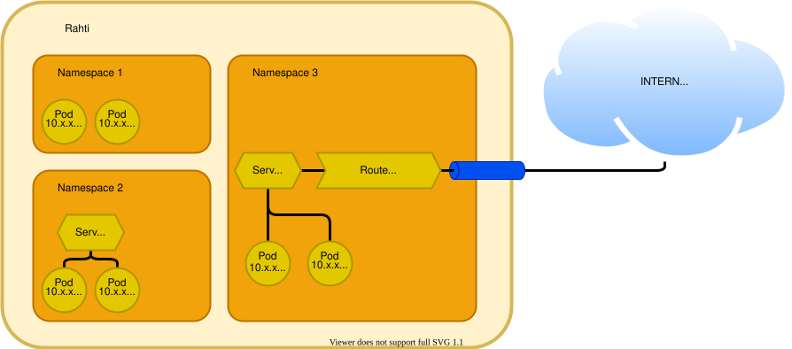

# Network policies

From a networking point of view, each namespace is configured by default to provide an isolated network for everything that runs inside it, notably [Pods](../usage/kubernetes-concepts.md#pod) and [Services](../usage/kubernetes-concepts.md#service). Traffic to any `Pod` or `Service` coming from outside the namespace, even from other namespaces in Rahti, is blocked. The only traffic that is allowed in from outside the namespace is the traffic that goes through a `Route`. This isolation is achieved with [network policies](https://kubernetes.io/docs/concepts/services-networking/network-policies/). It is possible to change this behaviour by editing the two `NetworkPolicy` objects that are created by default in Rahti.

!!! info "Advanced networking"

    In the Rahti web console, under `Networking > NetworkPolicies`, it is possible to browse and edit the default network policies, but only in YAML format. Only change them if you are really sure of what you are doing.

For an overview of how Pods, Services, and Routes are connected in Rahti, see [Networking in Rahti](../usage/networking.md).
