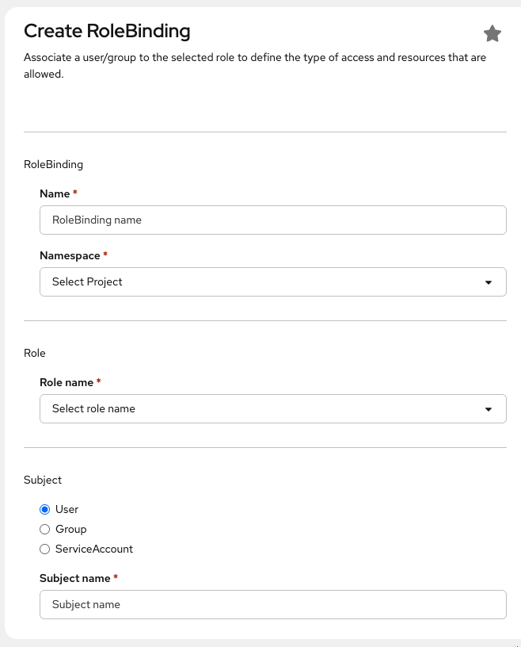

# Resource quota

## CSC computing project quotas

!!! info

    A CSC computing project quota is shared between the different Rahti projects (also known as namespaces). This means that if more than one person is working on the same CSC project and they create their own namespaces, the resources are shared.

Each CSC computing project has its own quota. The initial quota is the following:

| Resource                            | Default |
|-------------------------------------|---------|
| Virtual cores                       | 4       |
| RAM                                 | 16 GiB  |
| PVC Storage                         | 100 GiB |
| Ephemeral Storage                   | 5 GiB   |
| Number of imagestreams (images)     | 20      |
| Total number of concurrent pods     | 100     |
| Total number of PVCs                | 20      |

This means that your CSC computing project can use up to 4 cores and 16 GiB in total. This can be a single Pod using all 4 cores and 16 GiB, 8 Pods each using half a core and 2 GiB, or any other combination that fits within the quota.

!!! warning

    If several users have access to the same CSC computing project, each of them can create their own Rahti projects. Keep in mind that the quotas are shared across all of those Rahti projects. If you need to adjust your CSC computing project quotas, please contact us. See [Requesting more quota](#requesting-more-quota) for more information.

You can find the resource usage and quota of a project in the web interface, in the project view under **Administration -> ResourceQuota** of the `Administrator` menu.

Alternatively, you can use the `oc` command-line tool:

```sh
$ oc describe AppliedClusterResourceQuotas
Name:                      crq-200xxxx
Namespace Selector:        ["test-delete"]
Resource                   Used  Hard
--------                   ----  ----
limits.cpu                 500m  16
limits.ephemeral-storage   0     5Gi
limits.memory              1Gi   40Gi
openshift.io/imagestreams  1     20
persistentvolumeclaims     0     20
pods                       1     100
requests.storage           0     200Gi
```


## Requesting more quota

If you need more resources than the defaults, you can apply for more quota by contacting the Service Desk. See the [Contact page](../../../support/contact.md) for instructions. Quota requests are handled on a case-by-case basis depending on the currently available resources in Rahti and the use case.

## Sharing projects with other users

!!! info

    When creating a Rahti project that is associated with a certain CSC computing project, by default all members of the CSC computing project have admin access to the Rahti project. You can also add an individual user to a specific Rahti project. The user must have a CSC or HAKA login.

OKD has a flexible role-based access control system that allows you to give access to projects you have created to other users and groups in the system. You can give, for example, full admin, basic user, edit or read-only access to other users and groups in the system for collaboration.

You can edit project memberships in the web interface via **User Management -> RoleBindings**. You can give access rights to individual users, groups, or service accounts by selecting _User_, _Group_, or _ServiceAccount_ as the subject.



!!! note

    It is important to use correct usernames when sharing projects with others. Rahti allows you to freely enter any username and will not warn you if you enter a non-existent one. Usernames are also case-sensitive. You can find out your username in Rahti via the command line, by using the command `oc whoami`.


## LimitRanges

While the resource quota applies to the sum of all resources in a CSC computing project, a LimitRange applies to the individual objects inside a single Rahti project by Rahti admins. It defines how small or large a single container, image, or PersistentVolumeClaim is allowed to be, and which values are used when you do not specify any. Every Rahti project comes with a LimitRange called `limits`, which sets four things:

* The minimum and maximum CPU and memory that a single container can ask for.
* The [default request and limit](#default-pod-resource-limits) applied to a container that does not define its own.
* The maximum ratio between a limit and its request, which is 5 in Rahti.
* The maximum size of a single container image pushed to Rahti internal registry which is 5GiB.
* The maximum size of a single PersistentVolumeClaim which is 100GiB in Rahti.

A Pod that asks for more than the maximum, or less than the minimum, is rejected when it is created, even if the CSC computing project quota would still have room for it.

!!! info
    You can ask for adjustment of LimitRanges by contacting the [Service Desk](../../../support/contact.md). The requests are handled on a case-by-case basis depending on the use-case justifications.

You can find the default limit ranges of a project in the web interface, in the project view under **Administration -> LimitRanges** of the `Administrator` menu.

Alternatively, you can use the `oc` command-line tool:

```sh
$ oc describe limitranges
Name:                  limits
Namespace:             test-delete
Type                   Resource  Min  Max    Default Request  Default Limit  Max Limit/Request Ratio
----                   --------  ---  ---    ---------------  -------------  -----------------------
Container              cpu       50m  4      100m             500m           5
Container              memory    8Mi  16Gi   500Mi            1Gi            -
openshift.io/Image     storage   -    5Gi    -                -              -
PersistentVolumeClaim  storage   -    100Gi  -                -              -
```

In the example above, a single container can request between 50m and 4 cores of CPU and between 8 MiB and 16 GiB of memory, a single image can be at most 5 GiB, and a single PersistentVolumeClaim can be at most 100 GiB.

### Default Pod resource limits

Every Pod needs to have lower and upper limits for resources, specifically for CPU and memory. The lower ones are called `requests`, and the upper ones are called `limits`. The `requests` values are the resources reserved for a Pod when it is scheduled, and a Pod is not allowed to use more resources than those specified in `limits`.

You can set the limits explicitly within the available quota, but if no limit is set, the following defaults are used:

|Type|CPU|Memory|
|:-:|:-:|:-:|
|limits|500m|1Gi|
|requests|100m|500Mi|

!!! note

    `m` stands for millicores. `500m` is the equivalent of 0.5 cores, in other words half of the processing time of a CPU core.

Rahti enforces a maximum limit/request ratio of 5. This means that the CPU or memory `limits` cannot be more than 5 times the `requests`. So if the CPU request is 50m, the CPU limit cannot be higher than 250m. And if you want to increase the CPU limit to 1 core, you also have to increase the request to at least 200m.
