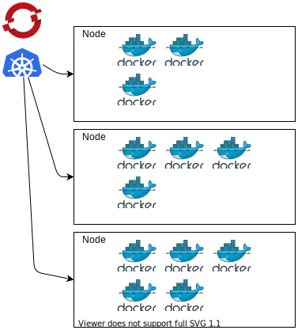

# Kontit ja niiden orkestrointi {#containers-their-orchestration}

## Kontit {#containers}

Kontit ovat tekniikka, joka perustuu käyttöjärjestelmän ytimen ominaisuuksiin ja mahdollistaa eristettyjen ympäristöjen luomisen, jotka jakavat saman ytimen. Esimerkiksi konttien ominaisuudet mahdollistavat useiden eristettyjen juuritiedostojärjestelmien, verkkojen ja prosessipuiden luomisen, jotka kaikki käyttävät samaa ydintä. Nämä eristetyt ympäristöt muistuttavat toiminnallisuudeltaan kevyitä virtuaalikoneita, mutta virtuaalikoneiden ja konttien välillä on olennaisia eroja. Suurin ero on, että virtuaalikoneilla on aina omat ytimensä, kun taas kontit jakavat isäntäjärjestelmän ytimen.


*Ero virtuaalikoneiden ja konttien välillä.*

Vaikka monilla käyttöjärjestelmillä on konttitoimintoja, tässä dokumentaatiossa keskitymme tarkemmin Linux-käyttöjärjestelmän kontteihin. Linux on suosituin käyttöjärjestelmä konttien ajamiseen, ja se on myös käyttis Rahti-konttipilvessä.

Konttitoiminnallisuuden käyttöön tarvitaan _suoritusaika_. Tällä hetkellä suosituin suoritusaika Linuxissa on _Docker_, mutta [podman](https://podman.io/), [cri-o](https://cri-o.io/), ynnä muut ovat saaneet yhä enemmän merkitystä. Kaikki nämä suoritukset noudattavat [Open Container Initiative](https://opencontainers.org/) (OCI) ohjeita. Suoritusaika tarjoaa työkalupaketin, joka helpottaa konttien käyttöä verrattuna suoraan ytimen ominaisuuksien hyödyntämiseen. Pääasiallisesti komentoriviliittymä ja taustakirjastot konttien ja kuvien ajamiseen, rakentamiseen ja hallintaan.

Docker on tehnyt konteista suosittuja helpottamalla niiden käyttöä. Sen sijaan että tutkisit ytimen dokumentaatiota ja selvittäisit, miten ytimen konttiominaisuuksia käytetään sekä valitsisit mitkä ominaisuudet haluat ottaa käyttöön, Docker tarjoaa yksinkertaisemman tavan suorittaa kontit yhden komentorivikomennon avulla. Tietyt ytimen ominaisuudet ja niiden käyttäminen jäävät Dockerin käyttäjän näkökulmasta piiloon.

Esimerkkinä siitä, miten Dockeria käytetään, voit suorittaa kontin tietokoneellasi asentamalla Dockerin:

```bash
docker run -it ubuntu
```

Tämä lataa _ubuntu_-kuvan, jos se ei ole jo ladattu tietokoneelle, käynnistää kontin kyseisestä kuvasta ja tarjoaa käyttäjälle komentoriviliittymän kontin sisällä. Käyttäjän näkökulmasta kokemus on samankaltainen kuin virtuaalikoneen käynnistämisessä: riippumatta tietokoneesi käyttöjärjestelmän jakelusta, konttiin vuorovaikutus tuntuu siltä kuin olisit tekemisissä Ubuntu-asennuksen kanssa.

Komentoa suorittaessasi, sinun pitäisi pystyä näkemään ladattu Ubuntu Docker -kuva listaamalla kuvat:

```bash
docker images
```

Voit myös tehdä monia muita asioita, kuten käynnistää kontteja taustalla, liittyä käynnissä olevaan konttiin vuorovaikuttaaksesi sen kanssa tai rakentaa omia Docker-kuvia Dockerfile-tiedoston avulla. Tässä annetut esimerkit on tarkoitettu antamaan yleiskuva siitä, millaista konttien käyttö on käyttäjän näkökulmasta. Täydellisempi dokumentaatio Dockerista löytyy [virallisesta Docker-dokumentaatiosta](https://docs.docker.com/).

## Konttien orkestrointi {#container-orchestration}

Ymmärtääksemme, miksi konttien orkestrointialustat ovat tärkeitä, kuvataan, kuinka tyypillinen web-sovellus, johon loppukäyttäjät pääsevät verkkoselaimen kautta, rakennetaan.



Sovellus koostuu käyttöliittymästä, joka on käyttäjille näkyvä osa sovellusta, ja taustajärjestelmästä, joka hoitaa erilaisia tehtäviä taustalla, kuten käyttäjän tietojen tallentamisen tietokantaan. Sovellus suorittaa palvelimen prosessin, johon asiakkaat liittyvät vuorovaikuttaakseen sovelluksen kanssa. Se myös käyttää taustalla tietokantaa, kuten PostgeSQL tai MongoDB, käyttäjän tietojen tallentamiseen.

Sovelluksen suunnittelijoiden on suunniteltava se siten, että sovellus pysyy luotettavana, nopeana ja turvallisena:

  * Palvelinlaitteisto voi epäonnistua, joten sovellus on replikointava useille fyysisille palvelimille siten, että yksittäisen palvelimen vikaantuminen ei tee koko sovellusta saavuttamattomaksi.
  * Suuri käyttäjämäärä aiheuttaa kuormitusta sovellukselle. Sovellus on voitava skaalata ylös lisäämällä enemmän sovellusprosesseja, jotta se voi valmistautua kasvaneeseen käyttäjäkuormitukseen.
  * Yhteyden sovellukseen on oltava turvallinen, jotta käyttäjät voivat syöttää tietonsa sovellukseen ilman pelkoa salakuuntelusta.
  * Käyttäjän tiedot on tallennettava luotettavasti vikasietoiseen tallennusjärjestelmään.

Voisit luoda Linux-virtuaalikoneita, asentaa Dockerin niihin ja suorittaa sovelluksen suoraan käyttäen niitä, mutta lisätyövaatimus täyttääksesi kaikki yllä olevat vaatimukset on suuri. Sinun pitäisi selvittää, miten hallita useita sovelluksen instansseja eri palvelimilla, miten ohjata saapuva liikenne tasaisesti kaikille sovellusinstansseille, miten tallentaa käyttäjän tiedot ja miten nopeasti lisätä kapasiteettia tarvittaessa.

Onneksi useimmilla sovelluksilla on samanlaiset vaatimukset, joten hyvien sovellusten luomisen vaiheet ovat usein melko samankaltaisia. Tässä kohtaa konttien orkestrointijärjestelmät tulevat mukaan. Ne hoitavat monia yleisiä tehtäviä, joita tarvitaan robustien web-sovellusten suorittamiseen, kuten sovellusinstanssien jakelu useille palvelimille, liikenteen ohjaaminen sovellusinstansseille ja pysyvän tallennustilan tarjoaminen tietokannoille.

Tällä hetkellä suosituin ohjelmisto konttien orkestrointiin on _Kubernetes_. Se perustuu Googlessa kehitettäviin järjestelmiin yli kymmenen vuoden ajan. Rahti-järjestelmä perustuu Red Hatin luomaan Kubernetes-jakeluun nimeltä _OpenShift_.