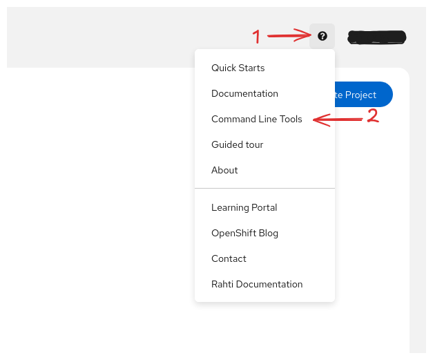
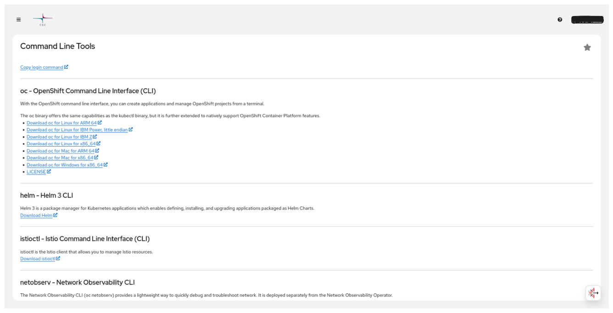
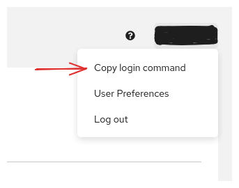

# Command line tool usage

Rahti can be used from the command line with either the `oc` tool (the OKD command line client) or the `kubectl` tool from Kubernetes. Some features specific to OKD are only available through the `oc` tool, so this page focuses on `oc`.

## Downloading the `oc` tool

The `oc` tool is a single binary that only needs to be on your `$PATH`. Download links for several platforms and operating systems, along with installation instructions, are available on the [Command Line Tools](https://console.rahti.csc.fi/command-line-tools) page in the web interface. You can reach it from the help menu:



Opening the page shows the available downloads:



Download the package for your platform, extract the files, and then copy the binary into a directory on your `$PATH`. See the example below for a linux-based machine.

```bash
curl -LO <DOWNLOAD_LINK>
tar -xvf oc.tar
mkdir -p "$HOME/.local/bin"
chmod +x oc
cp oc "$HOME/.local/bin/oc"
export PATH="$PATH:$HOME/.local/bin"
```

To confirm the installation, open a new terminal, go to any folder, and run:

```bash
oc --help
```

It should print the list of all available commands.

## How to login with `oc`

The `oc login` command is available from the dropdown menu next to your name in the web console. Click your username and select **Copy Login Command**, then paste the command into a terminal to start using Rahti from the command line. The command looks like:

```bash
oc login https://api.2.rahti.csc.fi:6443 --token=<secret access token>
```



!!! info "Multiple terminals"

    The login session for `oc` is shared across your terminals, so once you log
    in you are logged in for every terminal on that machine.

!!! info "Helm login"
    If you are using Helm and you are not logged in, you might see an error like
    this:
    ```sh
    $ helm ls
    Error: Kubernetes cluster unreachable: Get "http://localhost:8080/version": dial tcp 127.0.0.1:8080: connect: connection refused
    ```
    Logging in with `oc` resolves it.

## Logging in to the registry

To use the Rahti internal container registry, you need to log in to it separately. Once logged in, you can use the `docker` client to `pull` from and `push` to the registry.

### Using your personal account

After logging in with `oc`, generate a token with `oc whoami -t` and pass it to `docker login`:

```sh
docker login -p $(oc whoami -t) -u unused image-registry.apps.2.rahti.csc.fi
```

!!! info "Using `sudo`"
    Some Docker setups require running the `docker` client as root with `sudo`. In that case the `oc login` command must also be run with `sudo`: login information is stored in the user's home directory, so only the user that runs `oc login` is logged in to Rahti.

    As a general recommendation, prefer a "rootless" runtime such as Podman when possible. You can also configure Docker to run as a non-root user. On most Linux distributions this is done as follows.

    If you installed `docker.io`:
    
    ```sh
    sudo usermod -aG docker $USER
    ```

    If you have installed Docker Snap (> Ubuntu 22):

    ```sh
    sudo addgroup --system docker
    sudo useradd $USER docker
    newgrp docker
    sudo snap disable docker
    sudo snap enable docker
    ```

    And then log out and log back to have the group membership re-evaluated.


### Using a service account token

You can also use an internal service account to interact with the registry. This is the recommended approach for automated procedures such as a CI pipeline. Every Rahti namespace has three internal service accounts by default (`builder`, `default`, and `deployer`), but it is better to create a dedicated service account and assign it the `system:image-pusher` role: 

```sh
oc create serviceaccount pusher
oc policy add-role-to-user system:image-pusher -z pusher
docker login -p $(oc create token pusher) -u unused image-registry.apps.2.rahti.csc.fi
```

`oc create token` produces a token that expires. To set the lifetime, pass `--duration`. For example, `oc create token pusher --duration=87600h` creates a token valid for 10 years.

## CLI cheat sheet

**Basic usage:**

```bash
oc <command> <--flags>
oc help <command>
```

**Examples:**

Show projects:

```bash
oc projects
```

Create a new project:

```bash
oc new-project my-project --description="csc_project: 20XXXXXXX"
```

Switch to project `my-project`:

```bash
oc project my-project
```

Show all pods in the current namespace:

```bash
oc get pods
```

Show all pods in the namespace `<my-other-name-space>`:

```bash
oc get pods -n <my-other-namespace>
```

Show all pods that have the key-value pair `app: myapp` in `metadata.labels`:

```bash
oc get pods --selector app=myapp
```

Print the specifications of the pod `mypod`

```bash
oc get pod mypod -o yaml
```

### Other useful commands

* `oc create` creates an object. Example: `oc create -f file.yaml`
* `oc replace` replaces an object. Example: `oc replace -f file.yaml`
* `oc delete` deletes an object. Example: `oc delete rc myreplicationcontroller`
* `oc apply` modifies an object according to the input. Example: `oc apply -f file.yaml`
* `oc explain` prints out the API documentation. Example: `oc explain deploy.spec`
* `oc edit` loads an object from the API to the local editor chosen by the `$EDITOR`
  environment variable. Example: `oc edit Deployment mydeploy`

## Abbreviations

Object types have abbreviations that are recognized in the CLI:

|Abbreviation |Meaning|
|-----:|:-------|
|`is`|`ImageStream`|
|`dc`|`DeploymentConfig`\*|
|`svc`|`Service`|
|`bc`|`BuildConfig`|
|`rc`|`ReplicationController`|
|`pvc`|`PersistentVolumeClaim`|

\* Deployment Config is deprecated

## Further documentation

See the upstream documentation for more information about using the command line interface:

* [OKD documentation: `oc`](https://docs.okd.io/4.22/cli_reference/openshift_cli/getting-started-cli.html)
