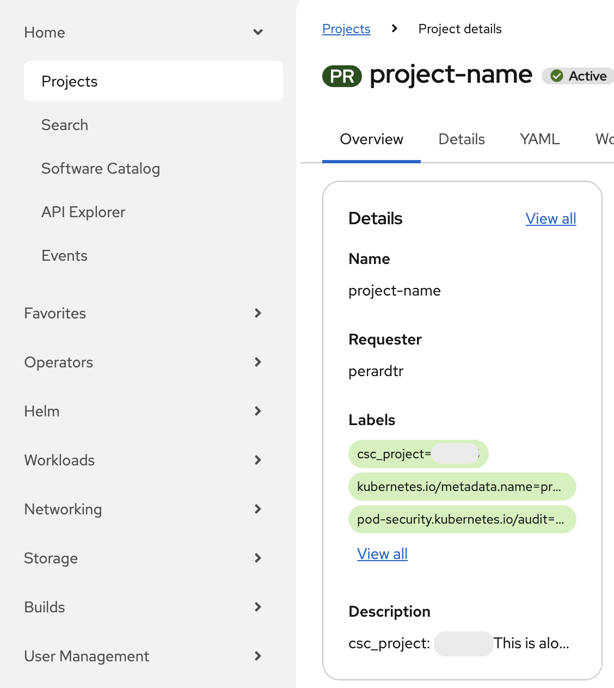
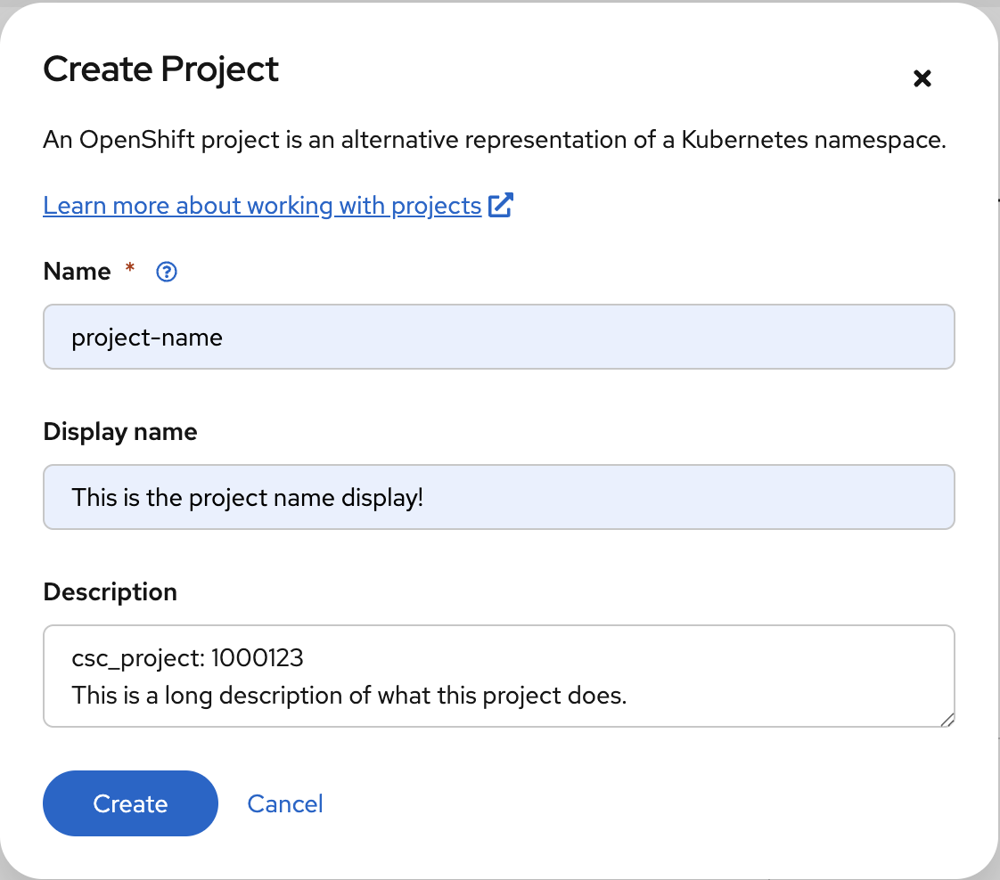
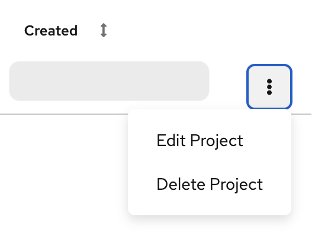
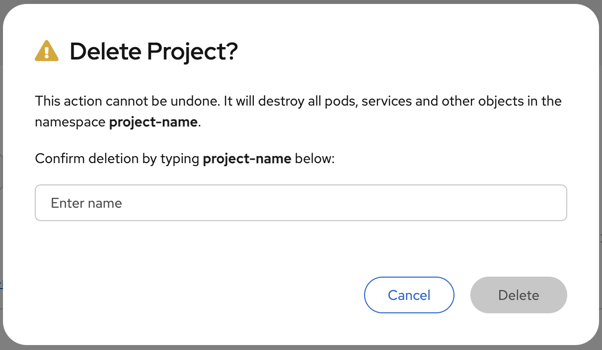

# Projects

## Rahti projects and CSC computing projects

!!! info
    A Rahti project is not the same thing as a CSC computing project. A CSC
    computing project is your billing and access unit in CSC's services; a Rahti
    project is a workspace inside Rahti. One CSC computing project can contain
    several Rahti projects, and each CSC computing project that has Rahti access
    appears in Rahti as a *group*.

Every project in Rahti must be mapped to a CSC computing project. This mapping determines which CSC computing project a given resource belongs to for billing, access, and other purposes. To set it, enter `csc_project:` followed by the name or number of your CSC computing project in the _Description_ field when creating a new project in Rahti. You can also add other text in the description field if you want a human-readable description for the project you are creating.

For example, if you have Rahti access via *project_1000123*, you would enter the following in the _Description_ field:

```yaml
csc_project: 1000123
```

You can also add a human-readable description alongside it, in which case the field could look like this:

```yaml
This project is used for hosting the Pied Piper web application.

csc_project: 1000123
```

Any usage within that Rahti project is then billed to the Cloud Billing Unit quota of project_1000123. Note that project_1000123 must have Rahti service enabled and you must be a member of that computing project, or the project creation will fail.

> For more information about the CSC accounts, check out [accounts](../../../accounts/index.md).

If you would like to know which CSC computing projects you are a member of, you can view a list in the [My Projects tool](https://my.csc.fi/projects) of MyCSC.

If you would like to know which CSC computing project a Rahti project is associated with, you can do so using the _oc_ command line tool. You can find instructions for setting up oc in the [command line tool usage instructions](cli.md). For example, if your Rahti project is called *project-name*, you would run:

```bash
oc get project project-name -o yaml
```

This should produce the following output:

```yaml
apiVersion: project.openshift.io/v1
kind: Project
metadata:
  annotations:
    openshift.io/description: |-
      csc_project: 1000123
      This is a long description of what this project does.
    openshift.io/display-name: This is the project name display!
    openshift.io/requester: user
    openshift.io/sa.scc.mcs: s0:c29,c19
    openshift.io/sa.scc.supplemental-groups: 1000850000/10000
    openshift.io/sa.scc.uid-range: 1000850000/10000
    security.openshift.io/MinimallySufficientPodSecurityStandard: restricted
  creationTimestamp: "2026-01-21T07:18:07Z"
  labels:
    csc_project: "1000123"
    kubernetes.io/metadata.name: project-name
    pod-security.kubernetes.io/audit: restricted
    pod-security.kubernetes.io/audit-version: latest
    pod-security.kubernetes.io/warn: restricted
    pod-security.kubernetes.io/warn-version: latest
  name: project-name
  resourceVersion: "12368468"
  uid: b2e8d386-db85-4f59-87d4-d9ea02d598d5
spec:
  finalizers:
  - kubernetes
status:
  phase: Active
```

In the output above, you can find the associated CSC computing project under `metadata.labels.csc_project`. In this case, the project is `1000123`. This information is also available via a web interface.

{: style="height:632px;width:564px"}

!!! info

    Normal users cannot change the *csc_project* label after a project has been created. If you would like to change the label for an existing project, please [contact the support](../../../support/contact.md). You can also create a completely new project if you want to use a different label.

## Creating a project

First, open the [Rahti homepage](https://rahti.csc.fi/) and click **Login Page**.

After logging in, click the blue **Create Project** button, and you will be presented with the following view:

{: style="height:500px;width:571px"}

1. You *need* to pick a **unique name** that is not in use by any other project
in the system.
2. You *can* also enter a **human-readable display name**.
3. You *have to* enter a **CSC computing project** in the _Description_ field. It must be a currently valid CSC project that your account has access to. To view which CSC projects you have access to, check <https://my.csc.fi>. If you do not have access to any CSC project, you will not be able to create a Rahti project. If you have Rahti access via project_1000123, you would enter the following in the Description field:

```yaml
csc_project: 1000123
```

> For more information about the CSC accounts, check out [accounts](../../../accounts/index.md).

Once you have filled in the fields, click **Create**, and you will see the application catalog where you can pick an application template or import your own.

For more information about using the web interface, refer to the [official OKD documentation](https://docs.okd.io/) (our current version is 4.22). You can find out which version of the documentation to look at in the web interface by clicking the question mark symbol in the top bar and selecting **About**.

## Deleting a project

In order to delete a project, you need to go to the main [web console](https://console.rahti.csc.fi/) and click the three vertical dots next to the name of the project. In the drop-down menu, you will see the option **Delete Project**.

{: style="height:197px;width:277px"}

Then you will be asked to input the name of the project to prevent accidental deletions.

{: style="height:353px;width:606px"}

After that, Rahti will start to delete all the resources of the project including the data stored in the **persistent volumes**, and there **will be no way to restore them**. It can take from a few seconds up to a minute, depending on the amount of resources the project had. Rahti will then release the project name, and it will be possible to create a new project with the same name.
