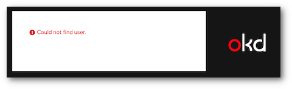
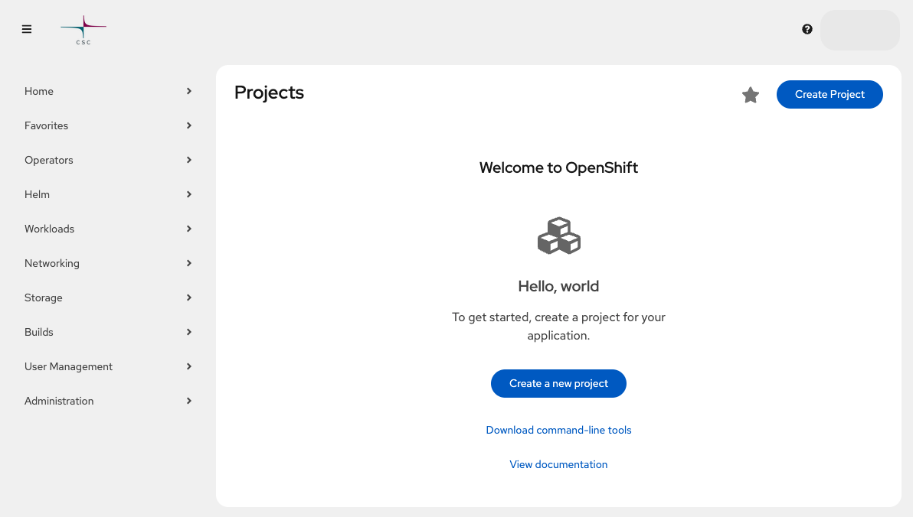

# Using the web interface

In Rahti, you run all applications inside **projects**. Any logged-in user can create a project. Each project has its own private network and is separate from other projects. You can only see the projects you created or that someone shared with you. All your containers, volumes, and other resources live inside a project.

After your access is approved, it may take a while before you can log in.

You can run applications in two ways:

- Pick a ready-made application from `Ecosystem` -> `Software Catalog` after you [create a project](./projects.md).
- Build your own from the core objects described in the [Kubernetes and OKD concepts](../usage/kubernetes-concepts.md) page.

## Log in

1. Go to <https://console.rahti.csc.fi/>.

    !!! warning "User not found"
        If you see an error like this, read the [Getting access](access.md) page.
        

2. Click the **Login page** button.

    > [MFA required] Since November 25th 2025

    Multi Factor Authentication (MFA) is required when login. For more information, visit the [Multi-Factor Authentication (MFA) Guide](../../../accounts/mfa.md)

1. After logging in you should see a page like this:

    

4. Next, [create a project](./projects.md) to run your applications.
