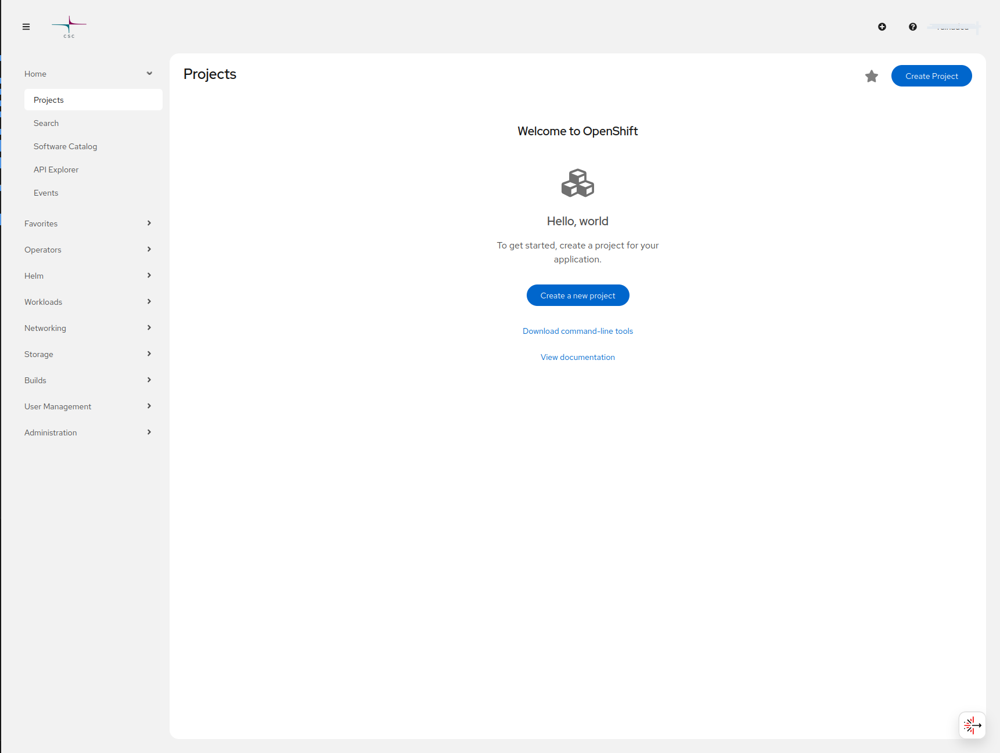

# What is Rahti?

!!! warning "Recommendations"
    Before you use Rahti, it is good to learn the basics of containers first. See the [external documentation](../reference/external-docs.md) to get started.

Rahti is the container cloud service at CSC. It runs [OKD](https://www.okd.io/), the open source distribution of OpenShift. It uses [OCI](https://opencontainers.org/) to package containers and [Kubernetes](https://kubernetes.io/) to manage them.

With Rahti you can run your own applications and share them on the web. Rahti can scale an application up and down. It also keeps the application running if a part of it fails. You get features like load balancing, high availability, and rolling updates. You can deploy in more than one way, for example with Helm Charts or with container images.

Rahti can run many kinds of applications. This includes web servers, databases, scientific software, and data analysis pipelines. cPouta can run these too, but you use it in a different way. With cPouta you manage the infrastructure, such as virtual machines and networks. With Rahti you manage only the application. Think of Rahti as one big computer where you start applications. cPouta is more like a data center where you add your own computers. You share this big computer with other users. Because of this, some security limits are in place. The main limit is that your application does not run as the root user.

## When should I choose Rahti?

Rahti is a good fit when you want to:

* Run an interactive web application or a normal web site.
* Package a complex application, like Apache Spark, so others can run their own copy.
* Deploy a web application written in a common language, such as Python, JavaScript, or Java, with a single command.
* Build a microservice-based application, connecting independent services into an end-to-end pipeline for building and deploying.

If you want to run a web application or host a web site, Rahti is likely the right choice. It comes with most of the features that web applications need.

## OKD vs Kubernetes

[OKD](https://www.okd.io/) is made for multi-tenant use. This means different users share the same hardware. For safety, **privileged mode** is not allowed, and containers **cannot run as the root user**.

OKD adds a few extra services on top of standard Kubernetes:

* **A Web Console**: <https://console.rahti.csc.fi/>

* **Routes**: Expose applications externally without managing Ingress resources.
* **BuildConfigs**: Declarative build automation integrated into the platform.
* **ImageStreams**: Track and automatically update application images.
* **Templates**: Deploy reusable application stacks with parameters.
* **Project Self-Service**: Easily create and manage isolated workspaces (projects).
* **Logs & Metrics UI**: View application logs and metrics from the web console.
