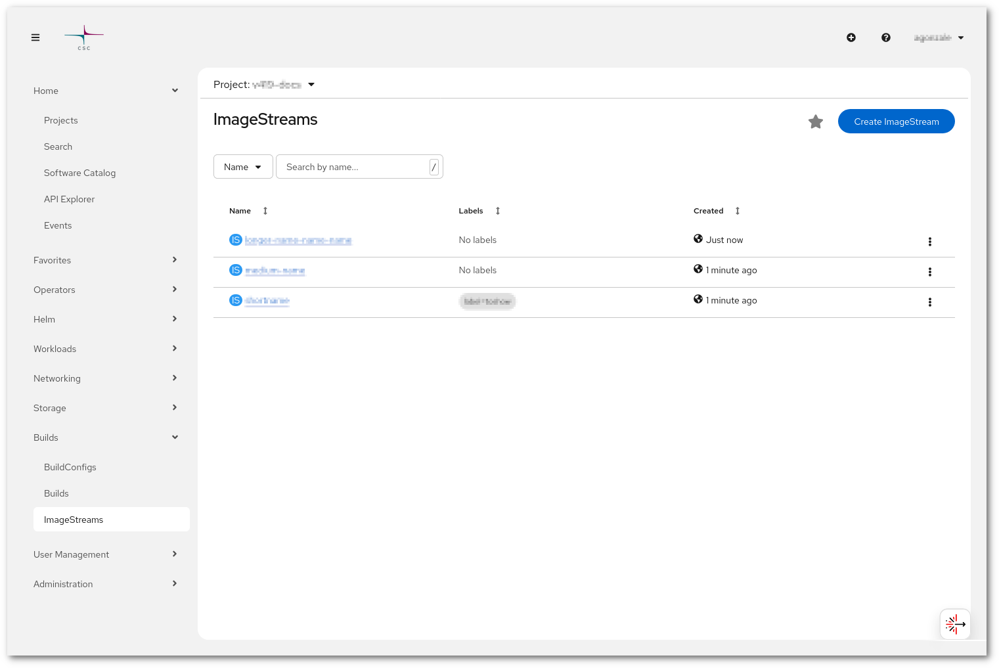
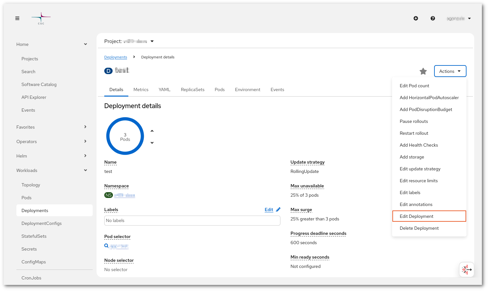
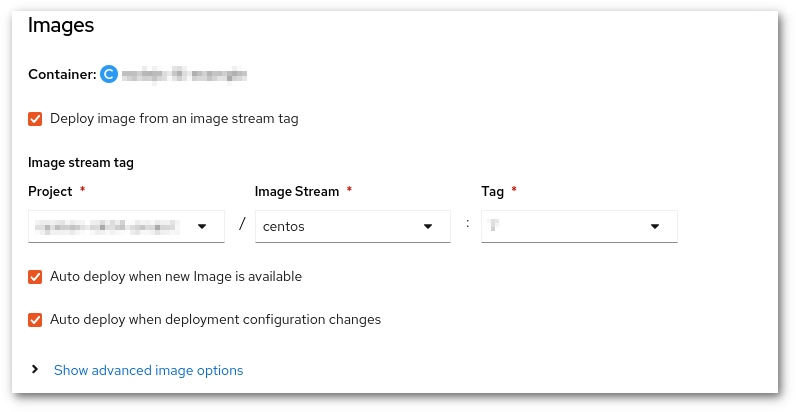

# Using Rahti integrated registry

## Manual Image Caching

It is possible to manually cache images in Rahti. This could be useful to remove
an external dependency or improve performance.

The process is simple:

1. [Install](../usage/cli.md#the-command-line-tools-page-in-the-rahti-web-ui) and [login with OC](../usage/cli.md#the-command-line-tools-page-in-the-rahti-web-ui).

1. With a terminal, connect to the Rahti registry:
    ```sh
    sudo docker login -p $(oc whoami -t ) -u unused image-registry.apps.2.rahti.csc.fi
    ```

    _Alternatively, you can access to this address: <https://oauth-openshift.apps.2.rahti.csc.fi/oauth/token/display> to request
    a token. Once connected, display and copy the token. The command will be:_

    ```sh
    sudo docker login -p <YOUR_TOKEN> -u unused image-registry.apps.2.rahti.csc.fi
    ```

    !!! info
        If you get any error, make sure you are logged in. If you run `oc whoami`, the command should return your username.

2. Tag the image you want to push:
   ```sh
   sudo docker tag almalinux:10 image-registry.apps.2.rahti.csc.fi/{YOUR_RAHTI_PROJECT_NAME}/almalinux:<tag>
   ```
   _Replace {YOUR_RAHTI_PROJECT_NAME} by the name of your project._
   _Please note that YOUR_RAHTI_PROJECT_NAME here is the Rahti project name (AKA namespace name), and does not refer to CSC project._

4. Push your image:
   ```sh
   sudo docker push image-registry.apps.2.rahti.csc.fi/{YOUR_RAHTI_PROJECT_NAME}/almalinux:<tag>
   ```

You should be able to see your images in your project:


Alternatively you can query images in remote registry with `docker image ls [OPTIONS] [REPOSITORY[:TAG]]`

!!! warning "Troubleshooting"

    If you receive this error when attempting to push your image:

    ```
    unknown: unexpected status from HEAD request to https://image-registry.apps.2.rahti.csc.fi/v2/{YOUR_RAHTI_PROJECT_NAME}/{YOUR_IMAGE_NAME}/manifests/sha256:834e7b0d913dd73e8616810c2c3a199cd8a3618e981f75eea235e0920d601ce4: 500
    ```

    You must create the `ImageStream` before pushing.

    Run this command:

    ```
    oc create imagestream {YOUR_IMAGE_NAME}
    ```

[oc](../usage/cli.md) must be installed locally on your machine.

## Using Manually Cached Images

Go to your project's deployment, and edit it.



Go to the Images section, make sure the option "Deploy images from an image stream tag" is clicked.
Finally select the new image.



## Access Control for the Rahti Integrated Registry

Rahti provides granular control over access to the integrated image registry, allowing you to manage permissions based on [user authentication](https://docs.redhat.com/en/documentation/openshift_container_platform/4.19/html/authentication_and_authorization/index).

As a Rahti user, you can choose how broadly your stored images are exposed for different scenarios.

### Use case 1: Publicly pullable images through the internet

This method allows **all images** within a Rahti project to be pulled by **anyone on the internet**.

!!! info "Expose selected images only"

    If you need to only make one or more specific images see [Use case 3](../images/Using_Rahti_integrated_registry.md#use-case-3-granular-control-over-publicly-exposing-specific-image-recommended)


- **How to enable**: Use one of the following commands to allow anyone pulling images from your Rahti project:

  ```bash
  oc policy add-role-to-user "system:image-puller" "system:anonymous" -n <project>
  # OR
  oc policy add-role-to-group "system:image-puller" "system:unauthenticated" -n <project>
  ```

- **How to disable**: Use one of the following commands to revert above changes:

  ```bash
  oc policy remove-role-from-user "system:image-puller" "system:anonymous" -n <project>
  # OR
  oc policy remove-role-from-group "system:image-puller" "system:unauthenticated" -n <project>
  ```

### Use case 2: Pullable images for all Rahti users, groups, serviceaccounts, and projects

This method allows **all images** within a project to be pulled by **any authenticated Rahti user**, including other projects and service accounts inside Rahti.

- **How to enable**: Use the following command to allow anyone pulling images from your Rahti project:

  ```bash
  oc policy add-role-to-group "system:image-puller" "system:authenticated" -n <project>
  ```

- **How to disable**: Use the following command to revert above changes:

  ```bash
  oc policy remove-role-from-group "system:image-puller" "system:authenticated" -n <project>
  ```

### Use case 3: Granular control over publicly exposing specific image (Recommended)

This method provides fine-grained control, allowing you to expose **only selected imagestreams** to unauthenticated users on the internet.
It is a more secure alternative to Use case 1 because it exposes only what you explicitly choose.

- **How to enable**: For this, you are required to create a custom role and rolebinding in your Rahti project. 

  ```bash
  # Select your project
  oc project my-project

  # Creating custom role
  # oc create role <ROLE_NAME> --verb=get --resource=imagestreams.image.openshift.io/layers --resource-name=<IMAGE_NAME>
  oc create role my-image-puller --verb=get --resource=imagestreams.image.openshift.io/layers --resource-name=MY_IMAGE_NAME # Repeat the option --resource-name to select more Imagestreams

  # Create custom rolebinding
  # oc create rolebinding <RB_NAME> --role=<ROLE_NAME> --user="system:anonymous"
  oc create rolebinding my-image-puller --role=my-image-puller --user="system:anonymous" # Alternative to --user, you can use --group="system:unauthenticated"
  ```

- **How to disable**: Use the following commands to revert above changes:

  ```bash
  # Delete the role and rolebinding
  
  oc delete rolebinding my-image-puller
  oc delete role my-image-puller
  ```

### Use case 4: Exposing the images from one Rahti project to another Rahti project (cross-namespace pulling)

This method enables one Rahti project to pull images from another project.
It is useful when different namespaces need to share base images.

- **How to enable**: To do so, you need to allow a certain `serviceaccount` from the other namespace be able to pull the image.

  ```bash
  oc policy add-role-to-group -n <project-that-has-the-image> "system:image-puller" "system:serviceaccounts:<project-that-pulls-the-image>"
  ```

- **How to disable**: Use the following command to revert above changes:

  ```bash
  oc policy remove-role-from-group -n <project-that-has-the-image> "system:image-puller" "system:serviceaccounts:<project-that-pulls-the-image>"
  ```
