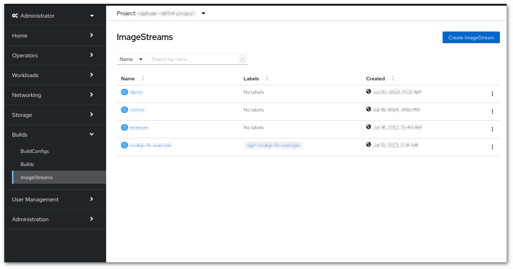

# Rahtin integroidun rekisterin käyttäminen { #using-rahti-integrated-registry }

## Konttikuvien manuaalinen välimuistitallennus { #manual-image-caching }

Rahtissa on mahdollista välimuistittaa kuvia manuaalisesti. Tästä voi olla hyötyä ulkoisen riippuvuuden poistamiseksi tai suorituskyvyn parantamiseksi.

Toimenpide on yksinkertainen:

1. [Asenna](../usage/cli.md#the-command-line-tools-page-in-the-rahti-web-ui) ja [kirjaudu OC:lla](../usage/cli.md#the-command-line-tools-page-in-the-rahti-web-ui).

1. Yhdistä terminaalista Rahtin rekisteriin:
    ```sh
    sudo docker login -p $(oc whoami -t ) -u unused image-registry.apps.2.rahti.csc.fi
    ```

    _Vaihtoehtoisesti voit siirtyä osoitteeseen <https://oauth-openshift.apps.2.rahti.csc.fi/oauth/token/display> pyytääksesi tokenin. Kun yhteys on muodostettu, näytä ja kopioi token. Komento on:_

    ```sh
    sudo docker login -p <YOUR_TOKEN> -u unused image-registry.apps.2.rahti.csc.fi
    ```

    !!! info
        Jos saat virheen, varmista että olet kirjautunut sisään. Kun ajat `oc whoami`, komennon pitäisi palauttaa käyttäjätunnuksesi.

2. Lisää tunniste (tag) kuvaan, jonka haluat työntää:
   ```sh
   sudo docker tag almalinux:10 image-registry.apps.2.rahti.csc.fi/{YOUR_RAHTI_PROJECT_NAME}/almalinux:<tag>
   ```
   _Korvaa {YOUR_RAHTI_PROJECT_NAME} projektisi nimellä._
   _Huomaa, että YOUR_RAHTI_PROJECT_NAME viittaa tässä Rahti-projektin nimeen (eli nimiavaruuden nimeen), ei CSC-projektiin._

4. Työnnä kuvasi:
   ```sh
   sudo docker push image-registry.apps.2.rahti.csc.fi/{YOUR_RAHTI_PROJECT_NAME}/almalinux:<tag>
   ```

Näet kuvasi projektissasi:


Vaihtoehtoisesti voit kysellä kuvia etärekisteristä komennolla `docker image ls [OPTIONS] [REPOSITORY[:TAG]]`

!!! warning "Vianmääritys"

    Jos saat tämän virheen yrittäessäsi työntää kuvaasi:

    ```
    unknown: unexpected status from HEAD request to https://image-registry.apps.2.rahti.csc.fi/v2/{YOUR_RAHTI_PROJECT_NAME}/{YOUR_IMAGE_NAME}/manifests/sha256:834e7b0d913dd73e8616810c2c3a199cd8a3618e981f75eea235e0920d601ce4: 500
    ```

    Sinun on luotava `ImageStream` ennen työntämistä.

    Suorita tämä komento:

    ```
    oc create imagestream {YOUR_IMAGE_NAME}
    ```

[oc](../usage/cli.md) on oltava asennettuna paikallisesti koneellesi.

## Manuaalisesti välimuistitettujen kuvien käyttäminen { #using-manually-cached-images }

Siirry projektisi käyttöönottoon (deployment) ja muokkaa sitä.


Siirry kohtaan Images ja varmista, että valittuna on vaihtoehto "Deploy images from an image stream tag".
Valitse lopuksi uusi kuva.


## Pääsynhallinta Rahtin integroidulle rekisterille { #access-control-for-the-rahti-integrated-registry }

Rahti mahdollistaa integroidun kuvarekisterin hienojakoisen käyttöoikeuksien hallinnan, jolloin pääsyä voidaan hallita [käyttäjien todennuksen](https://docs.openshift.com/container-platform/4.15/authentication/understanding-authentication.html) perusteella.

### 1. Anonyymi käyttö (`system:anonymous`) { #1-anonymous-access-systemanonymous }

Tämä viittaa käyttäjiin, jotka käyttävät rekisteriä antamatta todennustietoja. Tällöin heidän pyyntöihinsä ei liity henkilöllisyyttä.

- Miten otetaan käyttöön: Käytä seuraavaa komentoa salliaksesi anonyymien käyttäjien vetää kuvia projektisi rekisteristä:
  ```bash
  oc policy add-role-to-user registry-viewer system:anonymous -n <project>
  ```
- Käyttötapaus: Sopii, kun haluat tehdä kuvista julkisesti saatavilla olevia, jolloin kuka tahansa voi tarkastella tai vetää kuvia ilman kirjautumista.

### 2. Todentamaton käyttö (`system:unauthenticated`) { #2-unauthenticated-access-systemunauthenticated }

Tähän ryhmään kuuluvat kaikki käyttäjät, jotka käyttävät järjestelmää ilman kelvollisia todennustietoja, mukaan lukien anonyymit käyttäjät, mutta myös automatisoidut järjestelmät, skriptit tai ulkoiset palvelut, joiden ei tarvitse todentautua.

- Miten otetaan käyttöön: Myönnä todentamattomille käyttäjille käyttöoikeus komennolla:
  ```bash
  oc policy add-role-to-user registry-viewer system:unauthenticated -n <project>
  ```
- Käyttötapaus: Tämä on laajempi kuin `system:anonymous` ja on hyödyllinen, kun järjestelmien tai palvelujen on päästävä rekisteriin ilman todennusta.

### 3. Todennettu käyttö (`system:authenticated`) { #3-authenticated-access-systemauthenticated }

Todennetut käyttäjät ovat niitä, jotka ovat kirjautuneet sisään kelvollisilla tunnisteilla (esim. OAuth-tokeneilla).

- Miten otetaan käyttöön: Salli kaikkien todennettujen käyttäjien käyttää rekisteriä:
  ```bash
  oc policy add-role-to-user registry-viewer system:authenticated -n <project>
  ```
- Käyttötapaus: Sallii kenen tahansa kelvolliset tunnukset omaavan käyttäjän tarkastella tai vetää kuvia; hyödyllinen, kun halutaan rajoittaa pääsyä.