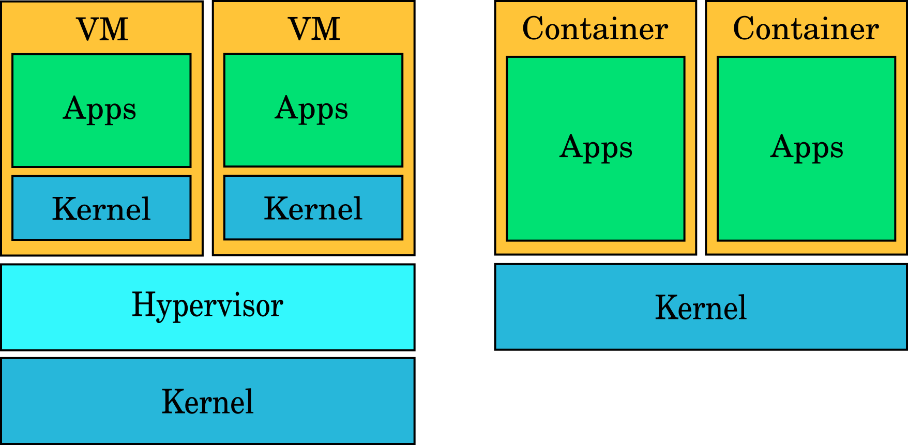
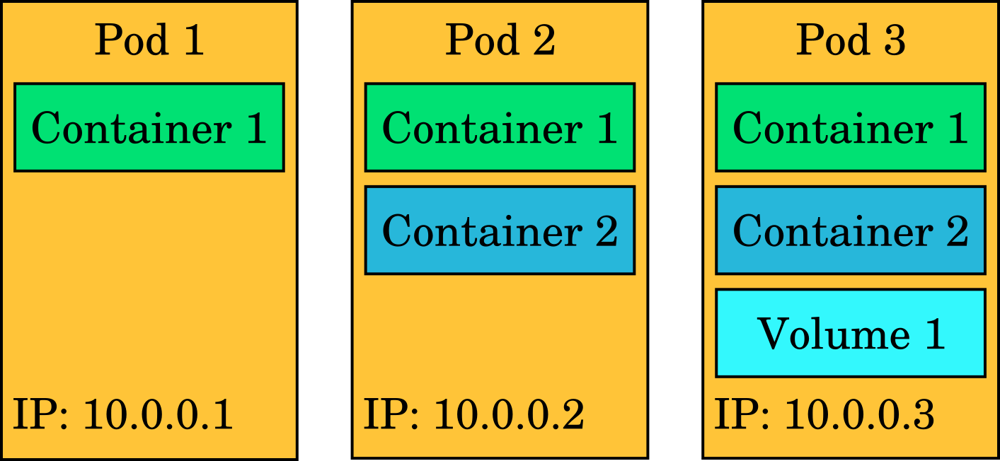
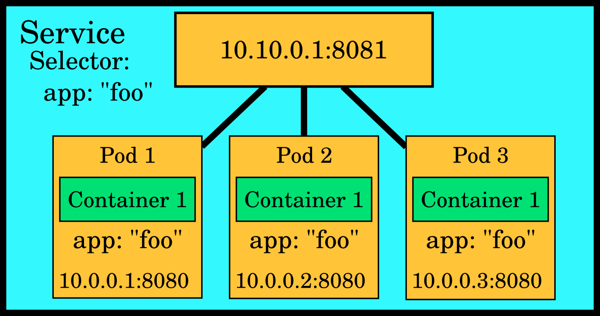

## Containers

Containers are a technology that is based on operating system kernel features
that allow the creation of isolated environments that all share the same kernel.
For example, container features make it possible to have several isolated root
filesystems, network stacks and process trees that all share the same kernel.
These isolated environments are similar in functionality to light weight virtual
machines, but there are some key differences between virtual machines and
containers. The biggest one is that virtual machines always have their own
kernel, while containers share the host system's kernel.


*The difference between virtual machines and containers.*

While many operating systems have container functionality, what we look at more
specifically in this documentation is containers in the Linux operating system.
Linux is the most popular operating system for running containers, and it is
also the operating system used in the Rahti container cloud. Currently the most
popular method for using container functionality in Linux is Docker. It provides
a set of tools that make it easier to use containers compared to using the
kernel functionality directly. Docker provides:

  * A runtime (runC) for containers
  * An image format for containers
  * A command line interface for running and managing containers and images
  * The Dockerfile format for building Docker images

Docker has popularized containers by making them easier to use. Instead of
looking at kernel documentation and figuring out how to use the different
interfaces to the kernel's container features and then having to figure out
which features you want to use and how, Docker provides a simpler way to start
containers with a single command line command. The specific kernel features and
how to use them have been defined by Docker.

As an example of how Docker is used, this is how you could start a container on
your computer after installing Docker:

```bash
docker run -it ubuntu
```

This will download the "ubuntu" image if it is not already present on the
computer, start a container based on that image and give the user a command line
interface within the container. From the user's point of view the experience is
similar to starting a virtual machine: regardless of the operating system
distribution on your computer, interacting with the container will seem like you
are interacting with a Ubuntu installation.

After running that command, you should be able to see the Ubuntu Docker image
that has been downloaded by listing images:

```bash
docker images
```

You can also do many other things, like launch containers in the background,
attach to a running container to interact with it or build your own Docker
images from a Dockerfile. The examples given here are meant to give a general
idea about what using containers is like from the user's perspective. For more
complete documentation about Docker, see the
[official Docker documentation](https://docs.docker.com/).

## Container orchestration

To understand why container orchestration platforms are important, let's
describe how a typical web based application that end users access via a web
browser is built.

The application is comprised of a frontend that is the part of the application
visible to users and a backend that handles various tasks in the background like
storing user data in a database. The application runs a server process that
clients access to interact with the application. It also accesses a database
like PostgeSQL or MongoDB in the background to store user data.

The architects of this application must design it to keep the application
running reliably, quickly and safely:

  * Server hardware can fail, so the application must be replicated to multiple
    physical servers so that the failure of an individual server won't make the
    entire application inaccessible.
  * A large number of users can cause load on the application. It must be
    possible to scale up the application by adding more application processes to
    prepare for increased user load.
  * The connection to the application must be secure so that users can safely
    enter their data into the application without fearing eavesdroppers.
  * User data must be stored reliably on a fault tolerant storage system.

You could create Linux virtual machines, install Docker on them and run the
application directly using those, but there is a lot of additional work that you
need to do to fulfill all of the above requirements. You would have to figure
out how to manage multiple instances of the application running on several
servers, how to direct incoming traffic evenly to all the application instances,
how to store user data and how to quickly add more capacity when needed.

Luckily most applications have similar requirements, so the steps for creating
good applications are often quite similar. This is where container orchestration
systems come in. They handle many of the common tasks required for running
robust web applications like distributing application instances on multiple
servers, directing traffic to the application instances and providing persistent
storage for databases.

Currently the most popular software for container orchestration is Kubernetes.
It is based on earlier systems developed at Google over a decade. The Rahti
system is based on a distribution of Kubernetes called OpenShift that is made by
Red Hat.

## Kubernetes and OpenShift concepts

The power of Kubernetes and OpenShift is in the relatively simple abstractions
that they provide for complex tasks like load balancing, software updates for
a distributed system or autoscaling. Here we give a very brief overview of some
of the most important abstractions, but we highly recommend that you read the
concept documentation for Kubernetes and OpenShift as well:

   * [Kubernetes concepts](https://kubernetes.io/docs/concepts/)
   * [OpenShift concepts](https://docs.okd.io/latest/architecture/core_concepts/index.html)

Most of the abstractions are common to both plain Kubernetes and OpenShift, but
OpenShift also introduces some of its own concepts.

### Pod

**Pods** contain one or more containers that run applications. It is the basic
unit in Kubernetes: when you run a workload in Kubernetes, it always runs in a
pod. Kubernetes handles scheduling these pods onto multiple servers. Pods can
contain volumes of different types for accessing data. Each pod has its own IP
address that is shared by all the containers in the pod. In the most common
case a pod contains one container and perhaps one or a few different volumes.

Pods are intended to be replaceable. Any data that needs to persist after a pod
is killed should be stored on a volume attached to the pod.



The abstractions in Kubernetes/OpenShift are described using YAML or JSON. YAML
and JSON are so called data serialization languages that provide a way to
describe key value pairs and data structures like lists in a way that is easy to
read for both humans and computers. Here is an example of what the
representation of a pod looks like in YAML:

```yaml
---
apiVersion: v1
kind: Pod
spec:
  containers:
  - name: webserver
    image: registry.access.redhat.com/rhscl/nginx-112-rhel7
    ports:
    - containerPort: 8080
      protocol: TCP
    volumeMounts:
    - name: website-content-volume
      mountPath: /usr/share/nginx/html
    volumes:
    - name: website-content-volume
      persistentVolumeClaim:
        claimName: web-content-pvc
```

The above YAML representation describes a web server pod that has one container
and one volume in it and exposes port 8080. You could put this snippet of text
in a file and create a pod that runs NGINX by feeding that file to the API of
Kubernetes.

### Service

Pod IP addresses are not predictable. If a pod is replaced as part of normal
operations like an update, the IP address of the new pod can be different. It is
also typical to have multiple pods serving the same content, in which case there
are several of these unpredictable IP addresses to point to. Thus pods alone
are not enough to provide a predictable way to access an application.

A **Service** provides a stable virtual IP, a port and a DNS name for one or
more pods. They act like a load balancer, directing traffic to a group of pods
that all serve the same application.



### ReplicaSet

A **ReplicaSet** ensures that *n* copies of a pod are running. If one of the
pods dies, the ReplicaSet ensures that a new one is created in its place. They
are typically not used on their own but rather as part of a **Deployment**
(explained next).


### Deployment

**Deployments** manage rolling updates for an application. They typically
contain a ReplicaSet and several pods. If you make a change that requires an
update like switching to a newer image for pod containers, the deployment
ensures the change is made in a way that there are no service interruptions. It
will perform a rolling update where it replaces all the pods one by one with
newer ones while making sure that end user traffic is directed towards working
pods at all times.


### Persistent volumes

Pods are expendable. When they die, all the state that was stored in the pod's
own filesystems is lost. Pods are also meant to die and be replaced as part of
normal operations like a rolling update triggered by a deployment. Therefore
storage that persists over a pod's lifetime is needed. This is what the concept
of **persistent volumes** is for.

Persistent volumes are stored in some backing storage like Ceph, NFS or
GlusterFS. They are claimed by a pod using a **PersistentVolumeClaim**. When a
new claim is made, this can either mean that an existing volume is claimed or a
new one is created dynamically and given to the pod to use.


