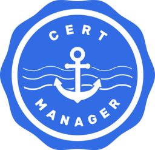

# Cert manager

[cert-manager](https://cert-manager.io/docs/) is a certificate controller that issues and renews TLS certificates for you. Instead of requesting a certificate by hand and remembering to replace it before it expires, you describe the certificate you want as an API object, and cert-manager keeps a Kubernetes `Secret` up to date with a valid certificate and its private key. In Rahti, cert-manager is provided as a managed component, so you do not need to install or maintain the controller yourself.



Because the result is an ordinary `Secret`, anything running in your Rahti project can use it: a web server such as NGINX or Apache HTTP Server, a database such as PostgreSQL, a cache such as Redis, a message broker, your own application, or an `Ingress` that publishes the application to the internet. The certificate can come from any certificate authority that speaks the ACME protocol, from a certificate authority of your own, or from a self-signed key.

## How cert-manager works

Three objects are involved:

* An **Issuer** describes where certificates come from: an ACME certificate authority, your own certificate authority, or a self-signed key. An `Issuer` is namespace-scoped, so it works in the Rahti project where it is created.
* A **Certificate** describes the certificate you want: the host names it covers, how long it is valid, and the name of the `Secret` where it should be stored.
* The resulting **Secret** contains the issued certificate in `tls.crt` and the private key in `tls.key`. Certificates signed by your own certificate authority also have the CA certificate in `ca.crt`.

When a `Certificate` is created, cert-manager contacts the issuer, completes any validation the issuer requires, and writes the result into the `Secret`. Before the certificate expires, cert-manager repeats the process and updates the same `Secret`, so renewal needs no action from you. Workloads that read the certificate from a mounted volume see the new file automatically, although many servers need to be reloaded or restarted before they use it.

!!! note "Issuer, not ClusterIssuer"

    cert-manager also has a cluster-scoped `ClusterIssuer` object. Creating one requires cluster-admin rights, which Rahti users do not have, so always create an `Issuer` inside your own Rahti project.

## ACME certificates

The Automatic Certificate Management Environment (ACME) protocol automates the interaction between a certificate authority and your server. cert-manager works with any certificate authority that supports ACME, and switching between them is mostly a matter of pointing the `server` field at a different directory URL. If your organisation, institution, or commercial certificate provider offers an ACME endpoint, use it: you keep your existing account, your existing validation rules, and any certificate profiles you already rely on.

The example below uses [Let's Encrypt](https://letsencrypt.org/), a non-profit certificate authority that issues free certificates over ACME, because it needs no account setup in advance.

### Prerequisites

* The [`oc` command line tool](../get-started/cli.md) installed, and you are logged in to the right Rahti project (`oc project <project_name>`).
* A domain name whose public DNS record points to the Rahti router, as described on the [Custom domains](../configurations/custom-domain.md) page. An ACME certificate authority verifies that you control the domain, and the HTTP-01 challenge used below is answered through the Rahti router, so the DNS record must be live before you start.

### 1. Create an Issuer

Save the following as `issuer.yaml`. Replace `<EMAIL>` with your own address, which the certificate authority uses for your account and for expiry warnings:

```yaml
apiVersion: cert-manager.io/v1
kind: Issuer
metadata:
  name: acme-issuer
spec:
  acme:
    email: <EMAIL>
    # The directory URL of your ACME certificate authority.
    # This example uses Let's Encrypt.
    server: https://acme-v02.api.letsencrypt.org/directory
    privateKeySecretRef:
      # Secret where the account's private key is stored.
      name: acme-account-key
      key: tls.key
    # A single challenge solver, HTTP01 through the Rahti router
    solvers:
    - http01:
        ingress:
          ingressClassName: openshift-default
```

```bash
oc apply -f issuer.yaml
```

The `http01` solver makes cert-manager publish a temporary validation URL on your domain. With `ingressClassName: openshift-default`, that URL is exposed through the Rahti router, which is why the domain has to resolve to Rahti already.

### Using your own ACME account

If you already have an ACME account with a provider, create the `Secret` named in `privateKeySecretRef` yourself from your existing account key, and cert-manager will use that account instead of registering a new one:

```bash
oc create secret generic acme-account-key --from-file=tls.key=account.key
```

Many commercial certificate authorities additionally require External Account Binding, which ties the ACME account to your subscription. Store the HMAC key they gave you in a `Secret` and reference it together with the key ID:

```bash
oc create secret generic acme-eab-hmac --from-literal=secret='<EAB_HMAC_KEY>'
```

```yaml
spec:
  acme:
    email: <EMAIL>
    server: <ACME_DIRECTORY_URL>
    externalAccountBinding:
      keyID: <EAB_KEY_ID>
      keySecretRef:
        name: acme-eab-hmac
        key: secret
    privateKeySecretRef:
      name: acme-account-key
      key: tls.key
    solvers:
    - http01:
        ingress:
          ingressClassName: openshift-default
```

!!! note "Test against a staging environment first"

    Certificate authorities apply rate limits to the number of certificates issued for a domain, and a misconfigured solver can consume that budget quickly. Most providers offer a staging endpoint for testing; for Let's Encrypt it is:

    ```yaml
    server: https://acme-staging-v02.api.letsencrypt.org/directory
    ```

    Staging certificates are not trusted by browsers, but they are issued with far looser limits. Switch to the production URL once the certificate is issued successfully.

### 2. Create a Certificate

Save the following as `certificate.yaml` and replace both occurrences of `<HOSTNAME>` with the domain you want the certificate for:

```yaml
apiVersion: cert-manager.io/v1
kind: Certificate
metadata:
  name: my-app
spec:
  secretName: hostname-tls
  duration: 2160h # 90d
  renewBefore: 360h # 15d
  issuerRef:
    name: acme-issuer
    kind: Issuer
  commonName: <HOSTNAME>
  dnsNames:
    - <HOSTNAME>
```

```bash
oc apply -f certificate.yaml
```

With these values, the certificate is valid for 90 days and cert-manager renews it 15 days before it expires. Adjust `duration` and `renewBefore` to what your certificate authority allows. When issuance succeeds, a `Secret` named `hostname-tls` appears in your project with the `tls.crt` and `tls.key` entries.

## Using the certificate in an application

Mount the `Secret` as a volume and point your server at the two files. The following Deployment makes them available under `/etc/tls`:

```yaml
apiVersion: apps/v1
kind: Deployment
metadata:
  name: my-app
spec:
  replicas: 1
  selector:
    matchLabels:
      app: my-app
  template:
    metadata:
      labels:
        app: my-app
    spec:
      containers:
      - name: my-app
        image: <your_image>
        volumeMounts:
        - name: tls
          mountPath: /etc/tls
          readOnly: true
      volumes:
      - name: tls
        secret:
          secretName: hostname-tls
          defaultMode: 0440
```

The configuration option to set depends on the software:

* NGINX: `ssl_certificate /etc/tls/tls.crt;` and `ssl_certificate_key /etc/tls/tls.key;`
* Apache HTTP Server: `SSLCertificateFile /etc/tls/tls.crt` and `SSLCertificateKeyFile /etc/tls/tls.key`
* Redis: `--tls-cert-file /etc/tls/tls.crt --tls-key-file /etc/tls/tls.key`
* PostgreSQL: `ssl_cert_file = '/etc/tls/tls.crt'` and `ssl_key_file = '/etc/tls/tls.key'`

!!! note "Private key file permissions"

    Some servers, PostgreSQL among them, refuse to start if the private key is readable by anyone beyond its owner and group. The `defaultMode: 0440` setting above keeps the mounted files out of reach of other users. Note also that a mounted `Secret` is updated in place when cert-manager renews the certificate, but most servers only read it at startup, so reload or restart the workload to pick up the new certificate.

### Publishing the application with an Ingress

If the certificate is for a web application that you want to expose to the internet, an `Ingress` can use the `Secret` directly. Rahti creates the corresponding `Route` automatically and serves it with that certificate, including after a renewal:

```yaml
apiVersion: networking.k8s.io/v1
kind: Ingress
metadata:
  name: my-app
spec:
  rules:
  - host: <HOSTNAME>
    http:
      paths:
      - backend:
          service:
            name: <SERVICE>
            port:
              number: <PORT>
        path: /
        pathType: Prefix
  tls:
  - hosts:
    - <HOSTNAME>
    secretName: hostname-tls
```

!!! info "Ingress or Route"

    `Ingress` and `Route` solve the same use case in different ways, and a `Route` cannot reference a `Secret`: its certificate has to be written into `spec.tls.certificate` and `spec.tls.key` directly. Using an `Ingress` is therefore the simpler option with cert-manager, because a renewed certificate is picked up without any manual copying. See the [Routes](../usage/networking.md#routes) section for what the generated Route looks like.

## Self-signed certificates

Self-signed certificates are not signed by a public certificate authority, so browsers show a warning for them. They are useful for encrypting traffic between your own applications inside Rahti, for example between an application and its database, or for testing before a real domain is available.

For a single self-signed certificate, create an `Issuer` with an empty `selfSigned` section:

```yaml
apiVersion: cert-manager.io/v1
kind: Issuer
metadata:
  name: selfsigned
spec:
  selfSigned: {}
```

Then request a certificate from it exactly as from an ACME issuer, using the internal DNS name of your Service:

```yaml
apiVersion: cert-manager.io/v1
kind: Certificate
metadata:
  name: my-app-internal
spec:
  secretName: my-app-internal-tls
  issuerRef:
    name: selfsigned
    kind: Issuer
  dnsNames:
    - my-service.my-rahti-project.svc.cluster.local
```

### Using your own certificate authority

If several applications need certificates that they can also validate, sign them with one certificate authority of your own instead of making each certificate independently self-signed. This takes three objects: a self-signed CA certificate, an `Issuer` that signs with it, and then the application certificates.

```yaml
apiVersion: cert-manager.io/v1
kind: Certificate
metadata:
  name: my-ca
spec:
  isCA: true
  commonName: my-ca
  secretName: my-ca-key-pair
  duration: 43800h # 5y
  issuerRef:
    name: selfsigned
    kind: Issuer
---
apiVersion: cert-manager.io/v1
kind: Issuer
metadata:
  name: my-ca-issuer
spec:
  ca:
    secretName: my-ca-key-pair
```

Certificates that name `my-ca-issuer` in their `issuerRef` are now signed by your certificate authority. Applications trust them by mounting the `ca.crt` entry of the certificate `Secret` and using it as the trusted CA bundle.

!!! warning

    The `my-ca-key-pair` `Secret` contains the private key of your certificate authority. Anyone who can read it can issue certificates that your applications trust, so keep it in a project with restricted access and never copy it into an image or a Git repository. The same care applies to the `tls.key` entry of any certificate `Secret` and to a private key written into `spec.tls.key` of a `Route`.

## Testing that cert-manager works

The quickest way to check that cert-manager is available and working in your project is to issue a self-signed certificate. It needs no domain name and no external service, so it either works within a few seconds or tells you what is missing. Save this as `cert-manager-test.yaml`:

```yaml
apiVersion: cert-manager.io/v1
kind: Issuer
metadata:
  name: selfsigned-test
spec:
  selfSigned: {}
---
apiVersion: cert-manager.io/v1
kind: Certificate
metadata:
  name: cert-manager-test
spec:
  secretName: cert-manager-test-tls
  duration: 24h
  issuerRef:
    name: selfsigned-test
    kind: Issuer
  dnsNames:
    - cert-manager-test.example.com
```

```bash
oc apply -f cert-manager-test.yaml
```

Then check that the certificate became ready:

```bash
oc get certificate cert-manager-test
```

```sh
NAME                READY   SECRET                  AGE
cert-manager-test   True    cert-manager-test-tls   5s
```

`READY: True` means cert-manager is running, has permission to work in your project, and has written the `Secret`. You can inspect the issued certificate itself:

```bash
oc get secret cert-manager-test-tls -o jsonpath='{.data.tls\.crt}' | base64 -d | openssl x509 -noout -subject -issuer -dates
```

```sh
subject=CN=cert-manager-test.example.com
issuer=CN=cert-manager-test.example.com
notBefore=Aug  4 09:00:00 2026 GMT
notAfter=Aug  5 09:00:00 2026 GMT
```

The subject and issuer are the same, which is what makes it self-signed. Finally, remove the test objects:

```bash
oc delete -f cert-manager-test.yaml
oc delete secret cert-manager-test-tls
```

The same commands work for real certificates. If a `Certificate` stays `False`, these show how far the process got and why it stopped:

```bash
oc describe certificate my-app
oc get certificaterequest,order,challenge
oc describe challenge <challenge_name>
```

With an ACME issuer, a certificate that never becomes ready is most often caused by a domain that does not resolve to Rahti yet, a firewall that blocks the validation request, or a rate limit at the certificate authority.

## More information

* [Custom domain names and secure transport](../tutorials/intermediate/custom-domain.md): a step-by-step tutorial that also covers the DNS setup and the ACME controller as an alternative to cert-manager.
* [Custom domains](../configurations/custom-domain.md): what Rahti requires from your DNS records and certificates.
* [cert-manager documentation](https://cert-manager.io/docs/): the full reference for issuers, certificates, and troubleshooting.
