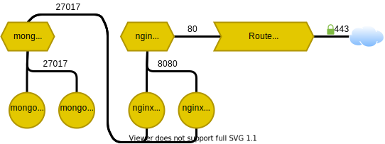

## Ipv4

All networking in Rahti uses [IPv4](https://en.wikipedia.org/wiki/IPv4). All IPs in this document and Rahti's system itself are ipv4 only, no ipv6 IP is used.

## Namespaces

Rahti is divided in **Namespaces**. Depending on the context, namespaces can be referred as **Projects**. Every object in Rahti must belong to and run inside a namespace.

## NetworkPolicy

From a networking point of view, namespaces are configured by default to provide an isolated **VLAN** to everything that runs inside it, notably to [Pods](concepts.md#pod) and [Services](concepts.md#service). Traffic to any `Pod` or `Service` coming from outside the namespace (even from other namespaces in Rahti) will be blocked. The only traffic that will be able to pass from outside the namespace will be the one going through the `Route`. This isolation is obtained via [Network Policies](https://kubernetes.io/docs/concepts/services-networking/network-policies/). It is possible to change this by editing the two `NetworkPolicy` objects that are created by default in Rahti.


!!! Note "Advanced networking"
    In the Administrator menu, under `Networking > NetworkPolicies` it is possible to browse and edit the default network policies, but only in YAML format. Only change the [NetworkPolicies](https://kubernetes.io/docs/concepts/services-networking/network-policies/) if you are really sure of what you are doing.

## Pods

**Pods** are the basic unit in Kubernetes. They accommodate one or more containers that contain the software and the environment needed to run an application. Each Pod has a [**private** IP](https://en.wikipedia.org/wiki/Private_network), which is only reachable from inside the namespace/VLAN. It is not advisable to use these Pod IPs directly in applications, they are meant to be used by **Services**. This is because not only other Pods in other namespaces may share this private IP, but more importantly, when a Pod is recreated it will get a new IP.

For example, if we deploy the `nginx` image in a Pod. This Pod will get a random private IP like `10.1.1.200`. Any unprivileged port (`>=1024`) that the image exports, like for example `8081`, will be reachable in that IP. A Pod will fail to start if it tries to export a privileged port (`[0-1023]`). If the Pod is killed, normally due to a change in its configuration, but also possibly due to unexpected reasons like hardware failure, a new Pod with a different IP will be created, like for example `10.1.1.140`. These IPs will respond to traffic from within the namespace only. If we set up a Pod that will query the first IP (`10.1.1.200`), it will obviously stop working at the moment of the recreation of the Pod associated with it. This is why we use **services**.

## Services

**Services** (also abbreviated `svc`) provide a _stable_ [private IP](https://en.wikipedia.org/wiki/Private_network) to one or more Pods. This IP will act as a load balancer, distributing the traffic load between the Pods behind it. For this, the service will make sure to keep an updated list of IPs so requests are only sent to valid ones.

Services are built to export one or more ports, and they also provide an internal DNS name. Any of these names are valid and will resolve to the same service IP:

* `<service_name>`, e.g., nginx.
* `<service_name>.<namespace>`, e.g., ngin.fenic
* and `<service_name>.<namespace>.svc.cluster.local`, e.g., nginx.fenic.svc.cluster.local.

In the same manner as Pods, Rahti Services can only be reached from inside the namespace they run, any request from another namespace will be able to resolve the DNS into an IP, but it will never connect. Another feature of services is that they can forward requests from one port to another target port (ex: 80 to 8080). This is useful in Rahti as Pods cannot listen on privileged ports (`<1024`).

Services can be used for internal connections. For example, if we have one or more MongoDB database replicas running in the `fenic` namespace, each in a different pod, and they export port `27017`. We can create a service called `mongo` associated with the pods under the same name. Then we can launch `nginx` Pods that run a Python application which will use the URL `<mongo:27017` to connect to the database. When connections to the service are attempted, one of the mongo pods will be selected to serve the data request.



## Routes

**Routes** are the OpenShift equivalent of _Ingress_ in vanilla Kubernetes, they expose a single port of a single Service object to traffic from outside the namespace and the Internet, via HTTP/HTTPS only. If the route is configured to provide no encrypted HTTP traffic, the pods associated should talk in HTTP non encrypted traffic. If the route is configured to provide TLS/HTTPS secure traffic, several options are available regarding the Route encryption:

* **Edge**, this is the default and the simplest to configure. The Route provides the certificate, which is stored in the Route object itself. The traffic is decrypted and the Pod is contacted using plain text un-encrypted HTTPD traffic.
* **Passthrough** is when the encryption is delegated to the pod, which must listen for TLS/HTTPS traffic and provide the certificate the client will receive.
* **Re-encrypt**, this is a mixture of two previous options, the Route will provide a certificate, but it will connect to the Pod using TLS/HTTPS and expect a valid certificate for the domain name of the service. The client will still get the certificate stored by the Route. This is for example used when the internal network between nodes in the cluster is not considered secure enough and we still want the Route to control the certificates that the client will get. Also in some rare applications is not possible to disable TLS in the Pods.


!!! warning "Re-encrypt"
    For Re-encrypt to work, it is necessary to provide your own certificate. There are 3 steps: (1) You must have a certificate/key pair in PEM-encoded files, where the certificate is valid for the route host. (2) You may have a separate CA certificate in a PEM-encoded file that completes the certificate chain. (3) You must have a separate destination CA certificate in a PEM-encoded file. If one of these steps is not followed correctly, the route will not work.

A Route can also be configured to (1) provide a HTTP/302 redirection from port `80` to `443`. It is also possible to (2) serve the same content in both ports, or to (3) not serve anything at all in the un secure `80` port.

An important limitation for Rahti is that **only the HTTP/80 and HTTPS/443 ports are exposed for incoming traffic**, and they only can serve **HTTPD protocol requests**. Internally to a namespace, any port and protocol is supported, this means we can connect an application to a database with no issues, but we will never be able to expose that database to outside traffic. This is due to the fact that the same incoming virtual IP is shared with all the incoming traffic in Rahti's HAProxy load balancers. [Name-based virtual hosts](https://en.wikipedia.org/wiki/Virtual_hosting#Name-based) are used to redirect the traffic to the correct Route. Other protocols that are not HTTPD, do not have this feature and will need a dedicated IP/port pair to work.

Rahti provides a range of pre-created domain names, `XXXX.2.rahtiapp.fi` where `XXXX` can be any combination of letters, numbers and dashes. These pre-created domain names also come with a valid TLS certificate.

Every single pre-created domain name is configured to point to the HAProxy load balancers.

### Custom domains

Any existing possible domain name could potentially be used in Rahti, but the DNS configuration and the certificates must be managed by the customer:

* For the DNS configuration, you need to configure a `CNAME` pointing to `router-default.apps.2.rahti.csc.fi` or in cases that this is not possible, another possibility is to configure an `A` record containing the IP of `router-default.apps.2.rahti.csc.fi` has to be configured. The way this needs to be configured depends on the register of the DNS record.

    ```console
    $ host ?????.??
    ?????.?? is an alias for router-default.apps.2.rahti.csc.fi.
    router-default.apps.2.rahti.csc.fi has address 195.148.21.61
    ```

* Any certificate provider can be used, like for example use the free certificates provided by the [Let's Encrypt controller](./tutorials/custom-domain.md#acme-protocol-automatic-certificates).

Another aspect of routes is the IP white listing feature, ie: only allowing a range of IPs to access the route. This is controlled by creating an annotation in the Route object with the key `haproxy.router.openshift.io/ip_whitelist`, and by setting the value to a space separated list of IPs and or IP ranges. Assuming variable `route_name` holds the name of the route

* This first example will white list a range of IPs (`193.166.[0-255].[1-254]`):

    ```bash
    oc annotate route $route_name haproxy.router.openshift.io/ip_whitelist='193.166.0.0/16'
    ```

* This other example will white list only a specific IP:

    ```bash
    oc annotate route $route_name haproxy.router.openshift.io/ip_whitelist='188.184.9.236'
    ```

* And this example will combine both:

    ```bash
    oc annotate route $route_name haproxy.router.openshift.io/ip_whitelist='193.166.0.0/15 193.167.189.25'
    ```

## Egress IPs

The IP for all outgoing customer traffic is `86.50.229.150`. Any pod that runs in Rahti will use by default this IP to reach anything located outside Rahti or a Route. It is possible, for selected namespaces that need it, to configure a dedicated IP. Each request is reviewed individually due to the fact that there is a limited pool of virtual IPs available.

!!! warning "Egress IP may change"

    The egress IP of Rahti might change in the future. For example, if several versions of Rahti are run in parallel each will have a different IP. Or if a major change in the underlining network infrastructure happens.


## Using LoadBalancer Service Type with Dedicated IPs

Unlike routes, the `LoadBalancer` service type makes it possible to expose services to the internet without being limited to HTTP/HTTPS. This feature allows you to expose services to receive external inbound traffic on a dedicated public IP address, ensuring that external users or services can interact with your applications. To enable and use LoadBalancer services within your Rahti project, you must submit a request to the service desk (`servicedesk@csc.fi`). The request must include the following details:

- **Project Name**: Provide the exact name of the Rahti project for which you want to enable LoadBalancer services.

- **CSC Project Number**: The `csc_project` number that is used for Rahti Project.

- **Use Case**: Clearly describe the use case, including:
    - The type of services you plan to expose (e.g., web applications, APIs).
    - Any specific requirements or considerations. (e.g., how many ips)

When your request is approved by the admins, you will receive the public IP address that can be used to access your services, and you can then proceed with the creation of the ```LoadBalancer``` service.
Alternatively, you can use the following command to check the IP addresses that are assigned to your project. The information will be visible under `annotations.ip_pairs` field.

```bash
oc get ipaddresspools.metallb.io -n metallb-system <project_name> -o yaml
```

```bash
apiVersion: metallb.io/v1beta1
kind: IPAddressPool
metadata:
  annotations:
    ip_pairs: |
      192.168.191.X - 86.50.228.M
      192.168.192.Y - 195.148.30.N
  creationTimestamp: "XXXX-XX-XXTXX:XX:XXZ"
  generation: 1
  name: <project_name>
  namespace: metallb-system
  resourceVersion: "XXXXXX"
  uid: XXXXXXX
spec:
  addresses:
  - 192.168.191.X/32
  - 192.168.192.Y/32
  autoAssign: true
  avoidBuggyIPs: false
  serviceAllocation:
    namespaces:
    - <project_name>
    priority: 1

```

For example, the following service definition exposes a MySQL service on the assigned public IP at port 33306.


```yaml
kind: Service
apiVersion: v1
metadata:
  name: mysqllb
  namespace: my-namespace
spec:
  ports:
    - protocol: TCP
      port: 33306
      targetPort: 3306
  allocateLoadBalancerNodePorts: false
  type: LoadBalancer
  selector:
    app: mysql
```

**You can find detailed explanation about `Service` [here](./concepts.md#service)**

Ensure that the service type is set to `LoadBalancer`, and that the `allocateLoadBalancerNodePorts` field is set to false (the default is true) because NodePorts are not enabled in Rahti. If this field is not set correctly, the allocated node port will be unusable, and service creation may fail if the entire default node port range (`30000-32767`) is already allocated.

Additionally, the port field in the service definition (e.g., `33306` in the previous example) must be within the range of `30000-35000`.

#### How to retrieve the selector

##### **Using CLI**

 on your CLI run `oc describe pod <pod-name> -n <namespace>`. After running the oc command, you will see an output that includes a section labeled `Labels`, Copy any of labels and paste in the `yaml` file under `selector`. **Make sure to follow the `yaml` syntax and change `=` to `:`**. For example under the `Labels` we are using the first one:

```bash
Name:           mysql-pod
Namespace:      my-namespace
Priority:       0
Node:           worker-node-1/10.0.0.1
Start Time:     Mon, 23 Oct 2024 10:00:00 +0000
Labels:         app=mysql
                environment=production
                app.kubernetes.io/name=postgresql
(...)
```

##### **Using the Web Interface**

On the web interface under `Developer`, go to the `Project` tab, press on `pods` and then choose the pod you want. You can see all the labels under `Labels`. Copy any of labels and paste in the `yaml` file under `selector`. **Make sure to follow the `yaml` syntax and change `=` to `:`**.


#### How to make sure your service is pointing to the right pod

##### **Using CLI**

 On your CLI run `oc get endpoints <service-name> -n <namespace>`. You should see the name of the Service and the IP addresses and ports of the Pods that are currently targeted by the Service. For example:

```bash
NAME       ENDPOINTS           AGE
mysqllb   10.0.0.1:3306        10m
```

##### **Using the Web Interface**

On the web interface under `Developer`, go to the `Project` tab, press on `Services` and choose the LoadBalancer service you just created. Under the `Pods` tab you should see the targeted pod. 


### Share the same LoadBalancer IP among Services

It is also possible to expose multiple `LoadBalancer` services on the same public IP but on different ports, you can enable IP sharing by adding the `metallb.universe.tf/allow-shared-ip` annotation to services. The value of the annotation is a label of your choice. The services annotated with the same label will share the same IP. Here is an example configuration of two services that share the same IP address:

```yaml
kind: Service
apiVersion: v1
metadata:
  name: mysqllb
  namespace: my-namespace
  annotations:
     metallb.universe.tf/allow-shared-ip: "label-to-share-1.2.3.4"
spec:
  ports:
    - protocol: TCP
      port: 33306
      targetPort: 3306
  allocateLoadBalancerNodePorts: false
  type: LoadBalancer
  selector:
    app: mysql
```


```yaml
kind: Service
apiVersion: v1
metadata:
  name: httplb
  namespace: my-namespace
  annotations:
     metallb.universe.tf/allow-shared-ip: "label-to-share-1.2.3.4"
spec:
  ports:
    - protocol: TCP
      port: 30080
      targetPort: 80
  allocateLoadBalancerNodePorts: false
  type: LoadBalancer
  selector:
    app: httpd
```

### Add firewall IP blocking to a LoadBalancer Service

It is possible to add firewall IP blocking to a `LoadBalancer` Service. This means that we can add a whitelist of IPs (`188.184.77.250`) and/or IP masks (`188.184.0.0/16`)
that will be the only ones that will be able to access the service. This added to using secure protocols and safe password practises, can be a good improvement in security.

The procedure to achieve this is the following:

1. Activate the `Local` external traffic policy in the service. To do so add `externalTrafficPolicy: Local` under `spec` like this:

    ```yaml
    kind: Service                                       kind: Service
    apiVersion: v1                                      apiVersion: v1
    metadata:                                           metadata:
      name: mysqllb                                       name: mysqllb
    spec:                                               spec:
      ports:                                              ports:
        - protocol: TCP                                     - protocol: TCP
          port: 33306                                         port: 33306
          targetPort: 3306                                    targetPort: 3306
          name: http                                          name: http
      allocateLoadBalancerNodePorts: false                allocateLoadBalancerNodePorts: false
                                                     >    externalTrafficPolicy: Local
      type: LoadBalancer                                  type: LoadBalancer
      selector:                                           selector:
        app: mysql                                          app: mysql

    ```

    !!! Warning "Local Traffic Policy Limitations"
        Rahti uses `L2Advertisement` mode in metallb. Fore more information please refer to ['Layer 2'](https://metallb.universe.tf/usage/#traffic-policies).
   
        Also note that, when `externalTrafficPolicy` is set to `Local`, only one service can be exposed using the external IP; i.e., the load balancer IP can not be shared among multiple services.

        For more information refer to the official article: [Understanding Openshift `externalTrafficPolicy: local` and Source IP Preservation](https://access.redhat.com/solutions/7028639)

1. Add a `NetworkPolicy` to open access to selected IPs:

    ```yaml
    apiVersion: networking.k8s.io/v1
    kind: NetworkPolicy
    metadata:
      name: firewall
    spec:
      ingress:
      - from:
        - ipBlock:
            cidr: 188.184.0.0/16
        - ipBlock:
            cidr: 137.138.6.31/32
      - from:
        - namespaceSelector:
            matchLabels:
              policy-group.network.openshift.io/ingress: ""
      podSelector:
        matchLabels:
          app: mysql
      policyTypes:
      - Ingress
    ```

    The above example of `NetworkPolicy` allows ingress traffic from the [CIDR](https://en.wikipedia.org/wiki/Classless_Inter-Domain_Routing) `188.184.0.0/16` which translates to the range [`188.184.0.0` - `188.184.255.255`], and from the single IP `137.138.6.31`. The destination of the traffic is limited by the `matchLabels` section. The label must be the same as the one used in the `LoadBalancer` service.

### Differences between a Route and a LoadBalancer service during deployment roll outs

In Rahti, the way `Route`s and `LoadBalancer` services manage traffic during deployment rollouts work differently.

`Routes`, managed by OpenShift's HAProxy integraged load blanacer, are designed to quickly adjust and direct traffic as soon as a new pod starts and simultaneously cease routing to the old or terminating pods, ensuring rapid response to changes and minimizing service disruption.

In contrast, `LoadBalancer` services distribute traffic not only to new pods but also continue to send requests to old or terminating pods. This behavior occurs because these services rely on periodic updates from [EndpointSlices](https://kubernetes.io/docs/tutorials/services/pods-and-endpoint-termination-flow/), which can delay the exclusion of terminating pods from traffic distribution. This difference in handling traffic can be useful to understand, as it affects how deployment strategies should be handled for application updates.

For more information refer to the OpenShift documentation regarding [route based deployment strategies](https://docs.openshift.com/container-platform/4.15/applications/deployments/route-based-deployment-strategies.html#deployments-proxy-shard_route-based-deployment-strategies).
To avoid disruptions when using external load balancer services, you can adopt the principle of a [blue-green deployment](https://www.redhat.com/en/topics/devops/what-is-blue-green-deployment)
