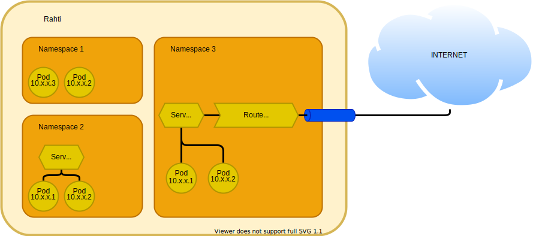

# Verkkotoiminta

## Ipv4 {#ipv4}

Kaikki Rahti-verkkotoiminta käyttää [IPv4:tä](https://en.wikipedia.org/wiki/IPv4). Kaikki dokumentissa ja Rahtin järjestelmässä olevat IP:t ovat vain IPv4, eikä IPv6-osoitteita käytetä.

## Nimitilat {#namespaces}

Rahti on jaettu **nimitiloihin**. Riippuen kontekstista, nimitiloihin voidaan viitata myös nimellä **projektit**. Jokaisen objektin Rahtissa tulee kuulua ja toimia nimitilan sisällä.

## Verkkopolitiikka {#networkpolicy}

Verkkonäkökulmasta nimitilat on oletusarvoisesti konfiguroitu tarjoamaan eristetty **VLAN** kaikelle sisällään olevalle, erityisesti [podeille](concepts.md#pod) ja [palveluille](concepts.md#service). Kaikki nimitilan ulkopuolelta (jopa muista Rahtin nimitiloista) tuleva liikenne `Podiin` tai `Palveluun` tukitaan. Ainoa liikenne, joka voi tulla nimitilan ulkopuolelta, kulkee `Reitin` kautta. Tämä eristys saavutetaan [verkkopolitiikoiden](https://kubernetes.io/docs/concepts/services-networking/network-policies/) avulla. Tätä on mahdollista muuttaa muokkaamalla kahta `Verkkopolitiikka`-objektia, jotka luodaan oletusarvoisesti Rahtissa.



!!! Huom "Edistynyt verkkokäyttö"
    Ylläpitäjän valikossa, kohdassa `Verkot > Verkkopolitiikat`, on mahdollista selata ja muokata oletusarvoisia verkkopolitiikoita, mutta vain YAML-muodossa. Muuta [verkkopolitiikoita](https://kubernetes.io/docs/concepts/services-networking/network-policies/) vain, jos olet varma mitä teet.

## Podit {#pods}

**Podit** ovat Kubernetesin perusyksikkö. Ne sisältävät yhden tai useamman kontin, joissa on sovelluksen ajamiseen tarvittava ohjelmisto ja ympäristö. Jokaisella Podilla on [**yksityinen** IP](https://en.wikipedia.org/wiki/Private_network), joka on saavutettavissa vain nimitilan/VLANin sisällä. Ei ole suositeltavaa käyttää näitä Pod-osoitteita suoraan sovelluksissa, koska niitä käytetään **palveluiden** kautta. Tämä johtuu siitä, että paitsi muut nimetilat saattavat jakaa tämän yksityisen IP:n, myös siksi, että Podin uudelleenluonti antaa sille uuden IP:n.

Esimerkiksi, jos otamme käyttöön `nginx`-kuvan Podissa. Tämä Pod saa satunnaisen yksityisen IP:n, kuten `10.1.1.200`. Kaikki ei-etuoikeutetut portit (≥1024), jotka kuva vie, kuten esimerkiksi `8081`, ovat saavutettavissa tuossa IP:ssä. Podin käynnistys epäonnistuu, jos se yrittää käyttää etuoikeutettua porttia ([0-1023]). Jos Pod tapetaan, tavallisesti konfiguraation muuttuessa, mutta myös mahdollisesti odottamattomista syistä kuten laitteistovika, luodaan uusi Pod, jossa on eri IP, kuten esimerkiksi `10.1.1.140`. Nämä IP:t vastaavat vain nimitilan sisäisestä liikenteestä. Jos asetamme Podin, joka kysyy ensimmäistä IP:tä (`10.1.1.200`), se lakkaa toimimasta, kun siihen liittyvä Pod luodaan uudelleen. Tästä syystä käytämme **palveluita**.

## Palvelut {#services}

**Palvelut** (myös lyhennetty `svc`) tarjoavat _vakaan_ [yksityisen IP:n](https://en.wikipedia.org/wiki/Private_network) yhdelle tai useammalle Podille. Tämä IP toimii kuormantasaajana, jakamalla liikennekuorman niiden Podi'en välillä, jotka ovat sen takana. Palvelun tulee pitää ajan tasalla oleva luettelo IP:stä, jotta pyyntöjä lähetetään vain kelvollisille IP:ille.

Palvelut on rakennettu tuomaan esiin yksi tai useampi portti, ja ne tarjoavat myös sisäisen DNS-nimen. Mitä tahansa näistä nimistä on pätevä ja ne palautuvat samaan palvelu-IP:hen:

* `<palvelun_nimi>`, esim., nginx.
* `<palvelun_nimi>.<nimitila>`, esim., nginx.fenic
* ja `<palvelun_nimi>.<nimitila>.svc.cluster.local`, esim., nginx.fenic.svc.cluster.local.

Aivan kuten Podit, Rahdin palveluita voi saavuttaa vain siitä nimitilasta, jossa ne toimivat; toinen nimitila voi ratkaista DNS:n IP:ksi, mutta ei ikinä yhdisty siihen. Toinen palveluiden ominaisuus on se, että ne voivat ohjata pyyntöjä yhdeltä portilta toiselle kohdeportille (esim. 80 -> 8080). Tämä on kätevää Rahdissa, sillä Podit eivät voi kuunnella etuoikeutetuilla porteilla (<1024).

Palveluita voidaan käyttää sisäisiin yhteyksiin. Esimerkiksi, jos meillä on yksi tai useampi MongoDB-tietokantakopio ajettuna `fenic` -nimitilassa, jokainen eri Podissa, ja ne tuovat esille portin `27017`. Voimme luoda palvelun nimeltä `mongo`, joka liittyy kyseisiin Podi'eihin samassa nimessä. Sitten voimme käynnistää `nginx`-Podi'a, jotka ajavat Python-sovellusta, joka käyttää URL:ia `<mongo:27017>` yhdistyäkseen tietokantaan. Kun palveluun kohdistuu yhteyspyyntöjä, yksi mongo-Podista valitaan palvelupyynnön käsittelijäksi.


## Reitit {#routes}

**Reitit** ovat OpenShiftin vastine _Ingressille_ jälleen Kubernetesissa, ne avaavat yhden palveluobjektin yksittäisen portin liikenteelle nimitilan ulkopuolelta ja internetistä, vain HTTP/HTTPS:n kautta. Jos reitti on konfiguroitu tarjoamaan salaamatonta HTTP-liikennettä, Podien tulisi keskustella salaamattomalla HTTP-liikenteellä. Jos reitti on konfiguroitu tarjoamaan TLS/HTTPS-suojattua liikennettä, useita vaihtoehtoja on saatavilla reitin salausta varten:

* **Edge**, tämä on oletus ja helpoin konfiguroida. Reitti tarjoaa todistuksen, joka on tallennettu reittiobjektiin itse. Liikenne puretaan ja Podiin otetaan yhteys salaamattoman HTTP:n avulla.
* **Passthrough** on silloin, kun salaus delegoidaan Podille, jonka pitää kuunnella TLS/HTTPS-liikennettä ja tarjota asiakasohjelman saama sertifikaatti.
* **Re-encrypt**, tämä on sekoitus kahdesta edellisestä vaihtoehdosta. Reitti tarjoaa sertifikaatin, mutta yhdistää Podiin TLS/HTTPS:n avulla ja odottaa pätevän sertifikaatin palvelun verkkotunnukselle. Asiakkaan saama sertifikaatti on yhä reitillä tallennettu. Tätä käytetään esimerkiksi silloin, kun solmujen välistä verkkoa ei pidetä tarpeeksi turvallisena, ja haluamme edelleen reitin hallitsevan asiakasohjelman saamia sertifikaatteja. Myös joissain harvinaisissa sovelluksissa ei voida poistaa TLS:ää Podeista.


!!! Varoitus "Uudelleensalaus"
    Uudelleensalauksen toimimiseksi tulee tarjota oma sertifikaatti. On kolme vaihetta: (1) Sinulla tulee olla sertifikaatti/avainpari PEM-koodatuissa tiedostoissa, jossa sertifikaatti on pätevä reitin isäntänä. (2) Sinulla voi olla erillinen CA-sertifikaatti PEM-koodatussa tiedostossa, joka täydentää sertifikaattiketjun. (3) Sinulla pitää olla erillinen kohde CA-sertifikaatti PEM-koodatussa tiedostossa. Jos joku näistä vaiheista ei ole oikein suoritettu, reitti ei toimi.

Reitti voidaan myös konfiguroida (1) tarjoamaan HTTP/302-uudelleenohjaus portista `80` porttiin `443`. On myös mahdollista (2) tarjota sama sisältö molemmilla porteilla tai (3) olla tarjoamatta mitään lainkaan turvattomassa `80`-portissa.

Tärkeä rajoitus Rahdille on, että **vain HTTP/80 ja HTTPS/443 portit avataan sisääntulevalle liikenteelle**, ja ne voivat käsitellä vain **HTTPD-protokollapyyntöjä**. Nimitilan sisällä mikä tahansa portti ja protokolla on tuettuna, mikä tarkoittaa, että voimme yhdistää sovelluksen tietokantaan ilman ongelmia, mutta emme koskaan kykene paljastamaan kyseistä tietokantaa ulospäin. Tämä johtuu siitä, että sama tuleva virtuaalinen IP jaetaan kaikkien Rahtin HAProxy-kuormantasaimien liikenteen kesken. [Nimiperusteisia virtuaalipalvelimia](https://en.wikipedia.org/wiki/Virtual_hosting#Name-based) käytetään liikenteen ohjaamiseen oikeaan reittiin. Muita kuin HTTPD-protokollia ei ole tälle ominaisuudelle ja ne edellyttävät omaa IP/porttiparia toimiakseen.

Rahti tarjoaa valikoiman etukäteen luotuja verkkotunnuksia, `XXXX.2.rahtiapp.fi`, missä `XXXX` voi olla mikä tahansa yhdistelmä kirjaimia, numeroita ja viivoja. Näihin etukäteen luotuihin verkkotunnuksiin tulee myös pätevä TLS-sertifikaatti.

Jokainen etukäteen luotu verkkotunnus on konfiguroitu osoittamaan HAProxy-kuormantasaimiin.

### Omat verkkotunnukset {#custom-domains}

Mikä tahansa mahdollinen olemassa oleva verkkotunnus voitaisiin käyttää Rahdissa, mutta DNS-konfigurointi ja sertifikaatit on hallittava asiakaskohtaisesti:

* DNS-konfigurointia varten sinun on konfiguroitava `CNAME`, joka osoittaa `router-default.apps.2.rahti.csc.fi` tai, tapauksissa jossa tämä ei ole mahdollista, toinen mahdollisuus on konfiguroida `A`-tietue, joka sisältää `router-default.apps.2.rahti.csc.fi:n` IP-osoitteen. Tapa, jolla tämä on konfiguroitava, riippuu DNS-tietueen rekisteristä.

    ```console
    $ host ?????.??
    ?????.?? is an alias for router-default.apps.2.rahti.csc.fi.
    router-default.apps.2.rahti.csc.fi has address 195.148.21.61
    ```

* Mikä tahansa sertifikaattipalvelu voidaan käyttää, kuten esimerkiksi käyttää Let's Encrypt -järjestelmän tarjoamia ilmaisia sertifikaatteja [Let's Encrypt -ohjaimen](./tutorials/custom-domain.md#acme-protokolla-automaattiset-sertifikaatit) kautta.

Toinen reittien ominaisuus on IP-valkoinen listaustoiminto, eli: sallia vain tietty IP-alue pääsemään reitille. Tämä hallitaan luomalla anotaatio Reitti-objektiin avaimella `haproxy.router.openshift.io/ip_whitelist` ja määrittämällä arvo IP:n ja/tai IP-alueiden välilyönneillä erotetuksi luetteloksi. Jos oletamme muuttujan `route_name` sisältävän reitin nimen

* Tämä ensimmäinen esimerkki valkoistaa IP-alueen (`193.166.[0-255].[1-254]`):

    ```bash
    oc annotate route $route_name haproxy.router.openshift.io/ip_whitelist='193.166.0.0/16'
    ```

* Tämä toinen esimerkki valkoistaa vain tietyn IP:n:

    ```bash
    oc annotate route $route_name haproxy.router.openshift.io/ip_whitelist='188.184.9.236'
    ```

* Ja tämä esimerkki yhdistää molemmat:

    ```bash
    oc annotate route $route_name haproxy.router.openshift.io/ip_whitelist='193.166.0.0/15 193.167.189.25'
    ```

## Lähtevät IP:t {#egress-ips}

Kaikki ulospäin suuntautuvan asiakasliikenteen IP on `86.50.229.150`. Mikä tahansa Rahtissa toimiva pod käyttää oletuksena tätä IP:tä päästäkseen mihin tahansa, joka sijaitsee Rahtin ulkopuolella tai reitin ulkopuolella. On mahdollista, että tietyillä nimitiloilla, jotka tarvitsevat sitä, voidaan konfiguroida oma IP. Jokainen pyyntö tarkastellaan erikseen, koska saatavilla olevan virtuaalisen IP-poolin kapasiteetti on rajallinen.

!!! Varoitus "Lähtevät IP:t saattavat muuttua"

    Rahtin lähtevät IP:t voivat muuttua tulevaisuudessa. Esimerkiksi, jos useita Rahti-versioita ajetaan rinnakkain, jokaisella on eri IP. Tai jos verkon perusrakenteessa tapahtuu suuri muutos.

## LoadBalancer-palvelutyypin käyttäminen omilla IP-osoitteilla {#using-loadbalancer-service-type-with-dedicated-ips}

Toisin kuin reitit, `LoadBalancer`-palvelutyyppi mahdollistaa palveluiden altistamisen internetille ilman rajoitusta HTTP/HTTPS:ään. Tämä ominaisuus sallii palveluiden altistamisen saapuvan ulkoisen liikenteen vastaanottamiseksi omalla julkisella IP-osoitteella varmistaen, että ulkoiset käyttäjät tai palvelut voivat kommunikoida sovellustesi kanssa. LoadBalancer-palveluiden käyttämiseksi Rahti-projektissa täytyy tehdä pyyntöpalvelu ulkoiseen palvelunumeroon `servicedesk@csc.fi`. Pyyntö tulee sisältää seuraavat tiedot:

- **Projektin nimi**: Anna täsmällinen Rahti-projektin nimi, jolle haluat mahdollistaa LoadBalancer-palvelut.

- **CSC-projektin numero**: `csc_project`-numero, jota käytetään Rahti-projektiin.

- **Käyttötapaus**: Kuvaa selvästi käyttötapaus, mukaan lukien:
    - Palvelutyyppi, jota suunnittelet altistavasi (esim. verkkosovellukset, API:t).
    - Mahdolliset erityisvaatimukset tai huomiot. (esim. kuinka monta IP: tä)
    
Kun pyyntösi hyväksytään ylläpitäjien toimesta, saat julkisen IP-osoitteen, jota voidaan käyttää palveluidesi saavuttamiseen, ja voit sitten aloittaa `LoadBalancer`-palvelun luomisen.
Vaihtoehtoisesti voit käyttää seuraavaa komentoa tarkistaaksesi projektiisi osoitetut IP-osoitteet. Tieto näkyy `annotations.ip_pairs`-kentässä.

```bash
oc get ipaddresspools.metallb.io -n metallb-system <project_name> -o yaml
```

```bash
apiVersion: metallb.io/v1beta1
kind: IPAddressPool
metadata:
  annotations:
    ip_pairs: |
      192.168.191.X - 86.50.228.M
      192.168.192.Y - 195.148.30.N
  creationTimestamp: "XXXX-XX-XXTXX:XX:XXZ"
  generation: 1
  name: <project_name>
  namespace: metallb-system
  resourceVersion: "XXXXXX"
  uid: XXXXXXX
spec:
  addresses:
  - 192.168.191.X/32
  - 192.168.192.Y/32
  autoAssign: true
  avoidBuggyIPs: false
  serviceAllocation:
    namespaces:
    - <project_name>
    priority: 1

```

Esimerkiksi, seuraava palvelumääritys altistaa MySQL-palvelun osoitettuun julkiseen IP:hen portissa 33306.


```yaml
kind: Service
apiVersion: v1
metadata:
  name: mysqllb
  namespace: my-namespace
spec:
  ports:
    - protocol: TCP
      port: 33306
      targetPort: 3306
  allocateLoadBalancerNodePorts: false
  type: LoadBalancer
  selector:
    app: mysql
```

**Voit löytää yksityiskohtaisen selityksen `Palvelusta` [täältä](./concepts.md#service)**

Varmista, että palvelutyyppi on asetettu `LoadBalancer`-koodiin, ja että `allocateLoadBalancerNodePorts`-kenttä on asetettu falseksi (oletus on true), koska NodePortseja ei ole käytössä Rahdissa. Jos tämä kenttä ei ole asetettu oikein, allokoitu solmupiste ei ole käytettävissä ja palvelun luominen saattaa epäonnistua, jos koko oletus solmupistealue (30000-32767) on jo allokoitu.

Lisäksi palvelun määritelmässä oleva porttikenttä (esim. `33306` edellisessä esimerkissä) täytyy olla alueella `30000-35000`.

#### Of how to retrieve the selector

##### **CLIn käyttö**

CLI-ympäristössä aja `oc describe pod <pod-name> -n <namespace>`. Komennon suorittamisen jälkeen näet tulosteen, jossa on osio nimeltä `Labels`. Kopioi jokin merkinnöistä ja liitä se `yaml`-tiedoston `selector`-kohtaan. **Muista noudattaa `yaml` syntaksia ja muuta `=` muotoon `:`**. Esimerkiksi alla `Labels` osiossa käytetään ensimmäistä:

```bash
Name:           mysql-pod
Namespace:      oma-nimitila
Priority:       0
Node:           worker-node-1/10.0.0.1
Start Time:     Mon, 23 Oct 2024 10:00:00 +0000
Labels:         app=mysql
                environment=production
                app.kubernetes.io/name=postgresql
(...)
```

##### **Web-käyttöliittymän käyttö**

Web-käyttöliittymässä valitse `Kehittäjä` välilehti, siirry `Projekti` välilehdelle, paina `podes` ja valitse Podi, jonka haluat. Näet kaikki merkinnät kohdassa `Labels`. Kopioi mikä tahansa merkinnöistä ja liitä se `yaml`-tiedoston kohtaan `selector`. **Muista noudattaa `yaml` syntaksia ja muuta `=` muotoon `:`**.


#### Miten varmistaa palvelusi kohdistuvan oikeaan Podiin

##### **Käyttämällä CLI:a**

 CLI:ssa aja `oc get endpoints <service-name> -n <namespace>`. Sinun pitäisi nähdä palvelun nimi sekä Podien IP-osoitteet ja portit, joita palvelu tällä hetkellä kohdistaa. Esimerkiksi:

```bash
NAME       ENDPOINTS           IKÄ
mysqllb   10.0.0.1:3306        10m
```

##### **Web-käyttöliittymän kautta**

Web-käyttöliittymässä `Kehittäjä` osiossa, mene `Projekti` välilehdelle, paina `Palvelut` ja valitse juuri luomasi LoadBalancer-palvelu. Kohdan `Podit` alla sinun pitäisi nähdä kohdistettu Podi. 


### Jaa sama LoadBalancer-IP palveluiden kesken {#share-the-same-loadbalancer-ip-among-services}

On myös mahdollista altistaa useita `LoadBalancer`-palveluita samalla julkisella IP:llä mutta erilaisilla porteilla. Voit ottaa IP-jakamisen käyttöön lisäämällä `metallb.universe.tf/allow-shared-ip`-anotaation palveluihin. Anotaatioarvo on valitsemasi etiketti. Samalla etiketillä anotetut palvelut jakavat saman IP:n. Tässä esimerkki kahden palvelun konfiguraatiosta, jotka jakavat saman IP-osoitteen:

```yaml
kind: Service
apiVersion: v1
metadata:
  name: mysqllb
  namespace: my-namespace
  annotations:
     metallb.universe.tf/allow-shared-ip: "etiketti-jotta-jaetaan-1.2.3.4"
spec:
  ports:
    - protocol: TCP
      port: 33306
      targetPort: 3306
  allocateLoadBalancerNodePorts: false
  type: LoadBalancer
  selector:
    app: mysql
```


```yaml
kind: Service
apiVersion: v1
metadata:
  name: httplb
  namespace: my-namespace
  annotations:
     metallb.universe.tf/allow-shared-ip: "etiketti-jotta-jaetaan-1.2.3.4"
spec:
  ports:
    - protocol: TCP
      port: 30080
      targetPort: 80
  allocateLoadBalancerNodePorts: false
  type: LoadBalancer
  selector:
    app: httpd
```

### Lisää palomuuri-IP-esto LoadBalancer-palveluun {#add-firewall-ip-blocking-to-a-loadbalancer-service}

On mahdollista lisätä palomuuri-IP-esto `LoadBalancer`-palveluun. Tämä tarkoittaa sitä, että voimme lisätä sallittujen IP:iden (`188.184.77.250`) ja/tai IP-maskien (`188.184.0.0/16`) valkoisen listauksen, jotka ovat ainoita, jotka voivat käyttää palvelua. Tämä, yhdessä turvallisten protokollien ja turvallisten salasanojen käytäntöjen kanssa, voi olla erinomainen parannus turvallisuuteen.

Menettely tämän saavuttamiseksi on seuraava:

1. Aktivoi `Paikallinen` ulkoisen liikenteen politiikka palvelussa. Tee niin lisäämällä `externalTrafficPolicy: Paikallinen` kohdan `spec` alle seuraavasti:

    ```yaml
    kind: Service                                       kind: Service
    apiVersion: v1                                      apiVersion: v1
    metadata:                                           metadata:
      name: mysqllb                                       name: mysqllb
    spec:                                               spec:
      ports:                                              ports:
        - protocol: TCP                                     - protocol: TCP
          port: 33306                                         port: 33306
          targetPort: 3306                                    targetPort: 3306
          name: http                                          name: http
      allocateLoadBalancerNodePorts: false                allocateLoadBalancerNodePorts: false
                                                     >    externalTrafficPolicy: Local
      type: LoadBalancer                                  type: LoadBalancer
      selector:                                           selector:
        app: mysql                                          app: mysql

    ```

    !!! Varoitus "Paikallisen liikenteen politiikan rajoitukset"
        Rahti käyttää `L2Advertisement`-tilaa Metallb:ssä. Lisätietoja löydät ['Kerros 2'](https://metallb.universe.tf/usage/#traffic-policies).
   
        Huomioi myös, että kun `externalTrafficPolicy` on asetettu `Local`, vain yksi palvelu voidaan altistaa käyttämällä ulkoista IP:tä; eli kuormantasaimen IP:tä ei voida jakaa useiden palveluiden kesken.

        Lisätietoja löydät virallisesta artikkelista: [Ymmärrä Openshiftin `externalTrafficPolicy: local` ja Lähde-IP:n säilyttäminen](https://access.redhat.com/solutions/7028639)

1. Lisää `NetworkPolicy`, joka avaa pääsyn valituille IP:ille:

    ```yaml
    apiVersion: networking.k8s.io/v1
    kind: NetworkPolicy
    metadata:
      name: firewall
    spec:
      ingress:
      - from:
        - ipBlock:
            cidr: 188.184.0.0/16
        - ipBlock:
            cidr: 137.138.6.31/32
      - from:
        - namespaceSelector:
            matchLabels:
              policy-group.network.openshift.io/ingress: ""
      podSelector:
        matchLabels:
          app: mysql
      policyTypes:
      - Ingress
    ```

    Yllä olevassa `NetworkPolicy`-esimerkissä sallitaan saapuva liikenne [CIDR](https://en.wikipedia.org/wiki/Classless_Inter-Domain_Routing) `188.184.0.0/16`, joka kääntyy matkaluokkaan [`188.184.0.0` - `188.184.255.255`], ja yksittäiseltä IP:ltä `137.138.6.31`. Liikenteen kohdetta rajoitetaan `matchLabels` osiolla. Etiketti pitää olla sama kuin käytetty `LoadBalancer`-palveluun.

### Ero reitin ja LoadBalancer-palvelun välillä käyttöönottorollouttien aikana {#differences-between-a-route-and-a-loadbalancer-service-during-deployment-roll-outs}

Rahtissa tapa, jolla `Reitit` ja `LoadBalancer`-palvelut hallitsevat liikennettä käyttöönottojen aikana, toimii eri tavalla.

`Reitit`, jotka OpenShiftin HAProxy integroitu kuormantasaaja hallitsee, on suunniteltu muokkaamaan ja ohjaamaan liikennettä nopeasti heti kun uusi pod käynnistyy, ja samalla lopettavat reitittämisen vanhoihin tai päättyviin podeihin varmistaen nopean reaktion muutokseen ja minimoimalla palvelukatkokset.

Toisaalta `LoadBalancer`-palvelut jakavat liikennettä paitsi uusille podeille, myös jatkavat pyyntöjen lähettämistä vanhoille tai päättyville podeille. Tämä käytös tapahtuu, koska nämä palvelut ovat riippuvaisia säännöllisistä [EndpointSlices](https://kubernetes.io/docs/tutorials/services/pods-and-endpoint-termination-flow/) -päivityksistä, mikä voi viivyttää päättyvien podejen poissulkemista liikenteen jakelusta. Tämä erilaista liikenteen hoitamisessa voi olla hyödyllistä ymmärtää, koska se vaikuttaa siihen, miten käyttöönotto-strategioita pitäisi käsitellä sovelluspäivitysten osalta.

Lisätiedot löytyvät OpenShiftin dokumentaatiosta liittyen [reitti perustaisiin käyttöönotto-strategioihin](https://docs.openshift.com/container-platform/4.15/applications/deployments/route-based-deployment-strategies.html#deployments-proxy-shard_route-based-deployment-strategies).
Välttääkssesi keskeytyksiä käyttäessäsi ulkoisia kuormantasaajapalveluita, voit käyttää [sininen-vihreä käyttöönottoperiaatetta](https://www.redhat.com/en/topics/devops/what-is-blue-green-deployment)