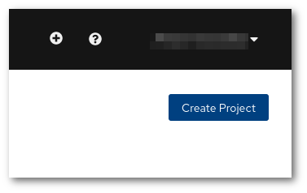
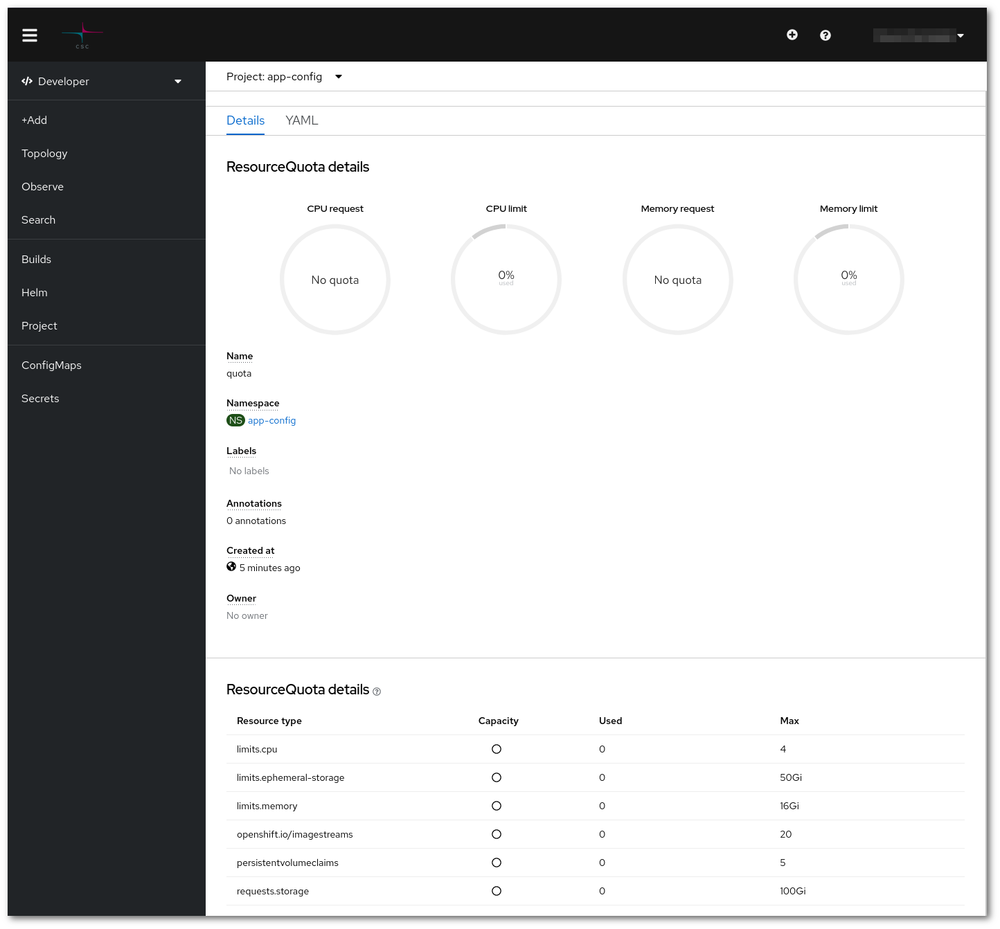
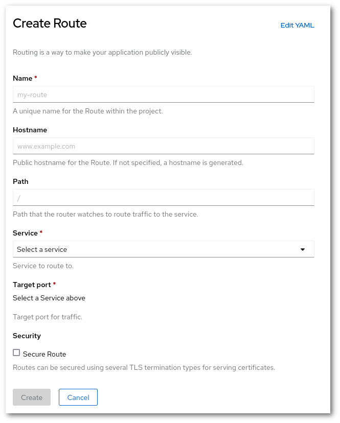

# Rahti 2 migration guide

This guide is dedicated to answer the most frequent questions and provide procedures for the Rahti 1 to Rahti 2 migration.

Rahti 1 is the current deployed and used version of OpenShift OKD running in CSC. The exact version is `v3.11`, it is the last released version in the `3.XX` series. The underlining Kubernetes version is v1.11. Rahti 1 is in open beta, and was not meant to reach production status.

Rahti 2 production is the next version of OpenShift OKD running in CSC. The underlining version of Kubernetes is v1.28. This version uses [cri-o](https://cri-o.io/) as the container runtime. `CRI-o` it is a lightweight alternative to using Docker as the runtime for kubernetes, both are fully compatible with each other and follow the `OCI` standard. Due to the fact that OpenShift OKD v4 is a re-implementation, there is no upgrade path provided by the manufacturer for Rahti 1 (OKD v3.11) to become Rahti 2 production (OKD 4.xx). So in other words, this means that every single application running in Rahti 1 needs to be migrated to production Rahti 2 manually. The two versions will run in parallel for a certain amount of time, but all wanted applications should be migrated to new platform by the latest June 2024.

## General steps

Before you start the migration, you need to gather information about your application:

1. Where is the **data stored**? And how is it **accessed**? Do you use a database?
     1. If you use a PostgreSQL database hosted in Rahti, think about migrating to [Pukki DBaaS](../../dbaas/).
     1. If you use Read-Write-Once (RWO) volumes, you can easily migrate them to Rahti 2. Just follow the instruction in the [How to use storage?](#how-to-use-storage) section.
     1. If you use Read-Write-Many (RWX), you have to check why are you using it. It may be two main options: (1) It was the default and you could use a RWO volume instead because you are only mounting the volume once, or (2) You need to mount at the same time the same volume in several Pods. If you are in option (2), sadly there is not yet a supported solution in Rahti 2 for RWX, please contact us at <servicedesk@csc.fi> and let us know your use case, we are gathering customer needs to better develop the RWX solution. And we will work together on possible alternatives.

     In order to see the storage type of your volumes, you can check the types in the Storage page.

     

1. What are the **CPU** and **memory** requirements? Rahti 2 has lower _default_ **memory** or **CPU** limits, see the [What are the default limits?](#what-are-the-default-limits) section for more details about this.

1. How was the application **deployed** in Rahti 1? Ideally you used [Helm Charts](https://helm.sh/), [Kustomize](https://kustomize.io/) or Source to Image, and deploying your application to Rahti 2 will be simple. If not, consider creating one Helm chart using the guide [How to package a Kubernetes application with Helm](../../tutorials/helm/). As a last option, you may copy manually each API object.
1. How do users access the application? What are the URLs? Is the URL is a Rahti provided URL (`*.rahtiapp.fi`), or a dedicated domain?
    1. If you use a dedicated domain, you need to see with your DNS provider how to update the name record. The DNS information can be found on the [Route](../../rahti2/networking/#routes) documentation.
    1. If you use a URL of the type `*.rahtiapp.fi`, you will no longer be able to use use it in Rahti 2 and will need to migrate to `*.2.rahtiapp.fi` or to a dedicated domain.
1. Migration day considerations. What is an acceptable downtime? - We can provide you some assistance on planning the migration, but we cannot coordinate with your users or decide what is an acceptable downtime.

Suggested migration procedure:

1. Deploy a test application in Rahti 2.
1. Make a copy of the data from Rahti 1 to Rahti 2. Remember to write down the time it takes.
1. Validate that the application works as expected in Rahti 2. Stress tests are a recommended way to better catch any possible issue.
1. Schedule the migration, where you stop the Rahti 1 app, copy the data, and make the necessary DNS updates.

## FAQ

### How to log in Rahti 2?

Go to [Rahti 2](https://rahti.csc.fi/), click in `Login`


You will be then served with a page with all the authentication options that Rahti 1 accepts. Choose the one that is more convenient for you, all your identities should be linked to the same Rahti 1 account.

#### Command line login

In order to get the "login command", once you have logged in the web interface, click on your name and then in "Copy Login Command". For security reasons, you will be required to login again, after that you will be served the page the login command you can copy to the clipboard and paste it in any terminal running on your system.


### How to create a project?

There are few places in th web interface where a project can be created. One of the paths to create a project is to go to `Administrator` > `Home` > `Projects`


Then click in "Create Project".



The fields are the same as with Rahti 1 had:

1. You need to pick a unique name that is not in use by any other project in the system.
    
1. You can also enter a human-readable display name and.
    
1. You have to also enter a CSC computing project in the Description field. It must be a currently valid CSC project, that your account has access to. In order to view to which CSC projects you have access to, please check https://my.csc.fi. If you have access to no CSC project, you will not be able to create any Rahti 1 project. If you have Rahti 1 access via project_1000123, you would enter the following in the Description field:

> csc_project: 1000123

### How to see quota/limits?

The quota and limits of a given project can be found in the bottom of the project details page.


If you click in "quota"



### What are the default limits?

Every Pod needs to have lower and upper limits regarding resources, specifically for CPU and memory. The lower are called requests, and the upper are called limits. The requests sets the minimum resources needed for a Pod to run, and a Pod is not allowed to use more resources than the specified in limits. The user can set the limits explicitly within the available quota.

In Rahti 1 the default limits were the same as the default quota:

```yaml
      resources:
        limits:
          cpu: '2'
          memory: 8Gi
        requests:
          cpu: 50m
          memory: 200Mi
```

In Rahti 2 the default limits are lower than the default quota:

```yaml
    - resources:
        limits:
          cpu: 500m
          memory: 1Gi
        requests:
          cpu: 50m
          memory: 500Mi
```

The recommended way to discover the suitable values for your application is trial and error. Launch your application in Rahti 2 and observe the memory and CPU consumption. If your application gets to the memory limit, it will be killed with an `OutOfMemoryError` (`OOM`), normally with a `137 error code`. CPU on the other hand, behaves differently, and the application will not be killed. But both limits have to be treated on the same way, if you see that any of the two limits is reached, raise the limit and try again. It is recommended to have at least a small margin of 10-20% over the expected limits. Of course, you can skip this process if you already know your application's resource needs. Also you might take a look to the [Horizontal Autoscaler](../../tutorials/addHorizontalAutoscaler/), which allows you to automatically create and delete replicas of your Pods. It is better for availability and resource scheduling to have several smaller Pods, but not all applications support it.  

!!! info "Why are limits tighter?"
    Rahti 1 resource range (difference between request and limits) was too wide. This made the scheduler's job harder, as every Pod looked the same regarding resource needs (every Pod requested the same resources). This increased the "noisy neighbours effect", were Pods hungry for resources were placed on the same nodes as more modest Pods. The hungry ones were starving the more modest ones. With tighter limits and a maximum factor of between request and limit, Pods will need to be configured with more explicit limits.

### How to edit a Deployment/DeploymentConfig default limits?

{ align=right }

In order to increase or decrease the resource limits, one can use the web UI or the command line.

From the web UI, go to the Deployment page, go to **Actions > Edit resource limits**. You will be presented with a dialog with the CPU request and limit and Memory request and limit. The limit cannot be more than 5 times higher than the request. The request is the minimum CPU (or memory) necessary for the deploy to work, and will be used to schedule the Pod. The limit is the maximum allowed usage of CPU (or memory). If a Pod tries to use more memory than the limit, the Pod will be killed (OOMKilled). On the other hand, if a Pod tries to use more CPU then the limit, it will be simply limited, but it will not be killed.


!!! Warning "DeploymentConfig is deprecated"
    DeploymentConfig is deprecated in newer versions of OpenShift OKD and will be completely removed in the future. See Redhat's [deprecation announcement of DeploymentConfig](https://access.redhat.com/articles/7041372) and their [replacement guide for DeploymentConfig](https://developers.redhat.com/learning/learn:openshift:replace-deprecated-deploymentconfigs-deployments/resource/resources:convert-deploymentconfig-deployment).

### How to create routes?

!!! info "Default URLs suffix have changed"

    In Rahti 1 default URLs were `<whatever>.rahtiapp.fi` meanwhile in Rahti 2 it will be `<whatever>.2.rahtiapp.fi`

A Route can be created by going to the project details page, and click in Routes.


And then click in "Create Route"



A Route has two compulsory parameters:

* a `name`, which must be unique within the project.
* a `service`/`port`, which is where the traffic will be routed to.

Other optional parameters are:

* a `hostname`, which must be unique within Rahti. If none is provided, the hostname will be autogenerated by using the route `name` and the `project name`.
* `Secure Route` can be activated to activate TLS encryption (Only TLS v1.3 and v1.2 are supported in Rahti 2, Rahti 1 only support TLS v1.2). The options are similar than in [Rahti 2 Routes](../rahti2/networking.md#routes)

### How to edit a route?

A Route can be edited by going to the project details page, click in Route, and then click in the route name you would like to edit.

Then click in Actions > Edit Route. A YAML representation of the route will appear. You can edit it following the example at the [Concepts Route](../rahti2/concepts.md#route) page. If for example you want to add TLS support (https support), you need to add inside the `spec` section:

```
spec:
  tls:
    insecureEdgeTerminationPolicy: Redirect
    termination: edge
```

Where `Redirect` tells the route to redirect users from http to https automatically.


### What changes must be made in firewalls?

The egress IP used in Rahti 2 is different that for Rahti 1 had. This means that if you have a firewall rule opening for traffic coming from Rahti 1, the IP has to be updated. The Rahti 1 IP is `193.167.189.25` and the new one for Rahti 2 is `86.50.229.150`.

!!! warning "egress IP may change"

    The egress IP of Rahti 2 might change in the future. For example, if several versions of Rahti 2 are run in parallel each will have a different IP. Or if a major change in the underlining network infrastructure happens.

Some project with dedicated egress IPs will have to request a new dedicated IP in Rahti 2 and update their firewalls accordingly.

### How to manage users in project?

Rahti 2 will synchronize the Rahti 2 project members with the CSC project members. Any member of the linked CSC project will get **Admin** access to the Rahti 2 project. The membership of the CSC project can be then handled in <my.csc.fi>. For example, we have the CSC project 1000123, we can go to <my.csc.fi> and add or remove members. We can create few Rahti 2 projects and link each of them to 1000123. A couple of minutes after creation, all members of the CSC project will be Admins of each of the Rahti 1 projects.
In the project details page select "Project access".
It is also possible to add permissions manually to specific users that are not member of the CSC project and maybe that we do not want to make Admins. In the **Project** page in the Developer section, select "Project access".


You just need to write the user's user name, and a role level: `admin`, `Edit` or `View`. To save the changes, just click in `Save`. The different access that each role level has can be checked out in the linked documentation in the page itself.

### How to delete project?

A project can be deleted from the Project details page (`Developer` > `Project`), by selecting `Actions` > `Delete project`. A dialog to confirm the deletion will appear:


The name of the project (`app-config` in this example) has to be typed in before the project is deleted. This is just to avoid accidental deletion.

### How to use storage?

In the Project details page (`Developer` > `Project`), click `PersistentVolumeClaims` and then click in `Create PersistentVolumeClaim`.


* For the moment only a single type of `StorageClass` can be used. It corresponds to `Cinder` volumes, which can only be read or write by a single Pod.

* A unique name within the project must be provided.

* A size within the quota limits has to be defined.

* The Volume mode should be `Filesystem`.

!!! warning "Lazy volume creation"
    The volume will only be created when it is mounted for the first time, this is a change in behavior in `Rahti 2`.

### How to use Integrated Registry

To learn more about image caching and access control registry in Rahti 2, refer to the following article: [Using Rahti 2 Integrated Registry](../../cloud/rahti2/images/Using_Rahti_2_integrated_registry.md)