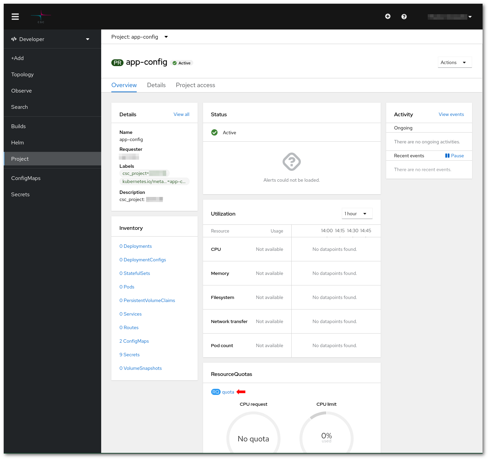
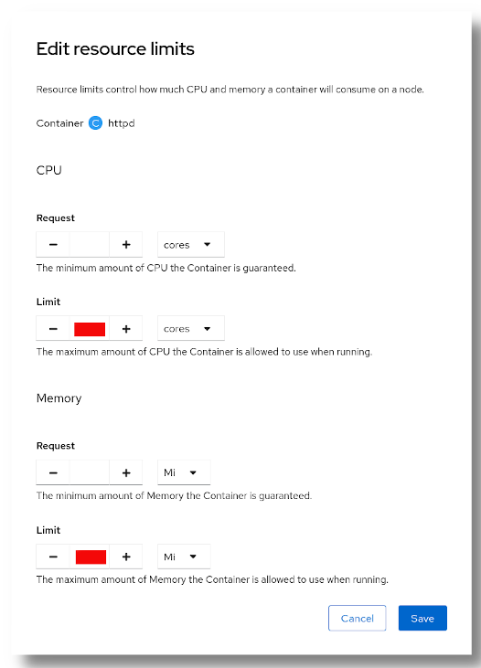
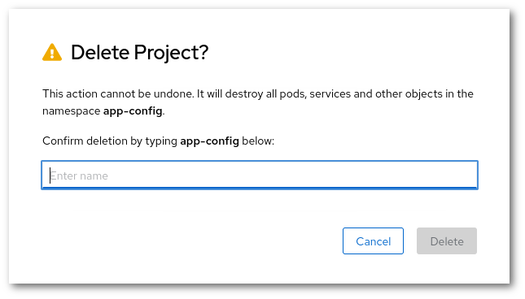

# Rahti-siirto-opas {#rahti-migration-guide}

Tämä opas on omistettu vastaamaan yleisimpiin kysymyksiin ja tarjoamaan menettelytavat Rahti 1:stä Rahtiin siirtymiseen.

Rahti 1 on nykyisin käytössä oleva OpenShift OKD:n versio, joka toimii CSC:ssä. Tarkka versio on `v3.11`, ja se on viimeinen julkaistu versio `3.XX`-sarjassa. Alustana oleva Kubernetes-versio on v1.11. Rahti 1 on avoin betaversio, eikä sen ollut tarkoitus saavuttaa tuotantotilaa.

Rahti tuotanto on seuraava OpenShift OKD:n versio, joka toimii CSC:ssä. Alustana oleva Kubernetes-versio on v1.28. Tämä versio käyttää [cri-o](https://cri-o.io/):ta konttikäyttöön. `CRI-o` on kevyt vaihtoehto käyttää Dockeria kubernetesin ajonaikana, molemmat ovat täysin yhteensopivia keskenään ja noudattavat `OCI`-standardia. Koska OpenShift OKD v4 on uudelleen toteutus, valmistaja ei tarjoa päivityspolkua, jolla Rahti 1 (OKD v3.11) voisi päivittää Rahti tuotannoksi (OKD 4.xx). Toisin sanottuna, tämä tarkoittaa, että jokainen Rahti 1:ssä toimiva sovellus tarvitsee siirtää tuotantoon manuaalisesti. Kaksi versiota toimivat rinnakkain tietyn ajan, mutta kaikki halutut sovellukset tulee siirtää uudelle alustalle viimeistään 22. lokakuuta 2024.

## Yleiset vaiheet {#general-steps}

Ennen siirron aloittamista sinun tulee kerätä tietoja sovelluksestasi:

1. Missä **data** on tallennettuna? Ja miten se on **käytettävissä**? Käytätkö tietokantaa?
     1. Jos käytät PostgreSQL-tietokantaa, joka on isännöity Rahtissa, harkitse siirtymistä [Pukki DBaaS](../dbaas/index.md):iin.
     1. Jos käytät Read-Write-Once (RWO) -volyymeja, voit helposti siirtää ne Rahtiin. Seuraa vain ohjeita kohdassa [Miten käyttää tallennustilaa?](#how-to-use-storage).
     1. Jos käytät Read-Write-Many (RWX) -volyymeja, sinun täytyy tarkistaa miksi käytät niitä. Syitä voi olla kaksi: (1) Se oli oletusarvo ja voit käyttää RWO-volyymia sen sijaan, koska kiinnität volyymin vain kerran, tai (2) sinun täytyy kiinnittää sama volyymi samaan aikaan useaan Pod:iin. Jos olet vaihtoehdossa (2), valitettavasti Rahtissa ei ole vielä tukea RWX:lle, ota yhteyttä osoitteeseen <servicedesk@csc.fi> ja kerro meille käyttötapauksesi, keräämme asiakastarpeita kehittääksemme RWX-ratkaisua paremmin. Työskentelemme yhdessä mahdollisten vaihtoehtojen parissa.

     Voit nähdä volyymiesi tallennustyypin Tarkista -sivulla.

     

1. Mitkä ovat **CPU**- ja **muisti**vaatimukset? Rahtissa on alemmat _oletus_ **muisti**- tai **CPU**-rajoitukset, katso lisätietoja kohdasta [Mitkä ovat oletusrajat?](#what-are-the-default-limits).

1. Miten sovellus on **asennettu** Rahti 1:ssä? Ihanteellisesti käytit [Helm-kaavioita](https://helm.sh/), [Kustomize](https://kustomize.io/) tai Source to Image, ja sovelluksen asentaminen Rahtiin on helppoa. Jos ei, harkitse yhden Helm-kaavion luomista ohjeen [Kuinka pakata Kubernetes-sovellus Helmin avulla](../../support/faq/helm.md) avulla. Viimeisenä vaihtoehtona voit kopioida manuaalisesti jokaisen API-objektin.
1. Miten käyttäjät pääsevät sovellukseen? Mitkä ovat URL-osoitteet? Onko URL-osoite Rahtin tarjoama osoite (`*.rahtiapp.fi`), vai oma verkkotunnus?
    1. Jos käytät omaa verkkotunnusta, sinun tulee tarkistaa DNS-palveluntarjoajalta, miten päivität nimikirjauksen. DNS-tiedot löytyvät [Reitti](../rahti/networking.md#routes) -dokumentaatiosta.
    1. Jos käytät URL-osoitetta muodossa `*.rahtiapp.fi`, et voi enää käyttää sitä Rahtissa, ja sinun on siirrettävä se osoitteeseen `*.2.rahtiapp.fi` tai omaan verkkotunnukseen.
1. Siirtopäivän huomiot. Mikä on hyväksyttävä käyttökatkos? - Voimme tarjota sinulle apua siirron suunnittelussa, mutta emme voi koordinoida käyttäjiesi kanssa tai päättää, mikä on hyväksyttävä käyttökatkos.

Ehdotettu siirtomenettely:

1. Asenna testisovellus Rahtiin.
1. Tee kopio datasta Rahti 1:stä Rahtiin. Muista kirjoittaa ylös käytetty aika.
1. Varmista, että sovellus toimii odotetusti Rahtissa. Stressitestit ovat suositeltava tapa havaita mahdolliset ongelmat.
1. Aikatauluta siirto, jolloin keskeytät Rahti 1 -sovelluksen, kopioi datan ja tee tarvittavat DNS-päivitykset.

## FAQ {#faq}

### Kuinka kirjautua Rahtiin? {#how-to-log-in-rahti}

Mene [Rahti](https://rahti.csc.fi/):n, klikkaa `Kirjaudu sisään`


Tämän jälkeen sinulle tarjotaan sivu kaikilla tunnistusvaihtoehdoilla, jotka Rahti 1 hyväksyy. Valitse sinulle sopivin vaihtoehto, kaikki tunnuksesi pitäisi olla linkitettyyn samaan Rahti 1 -tiliin.

#### Komentorivin kirjautuminen {#command-line-login}

Jotta saat "kirjautumiskomennon", kun olet kirjautunut sisään verkkoliittymään, klikkaa nimeäsi ja sitten "Kopioi kirjautumiskomento". Turvallisuussyistä sinua pyydetään kirjautumaan uudelleen sisään, jonka jälkeen sinua palvellaan sivulla, josta voit kopioida kirjautumiskomennon leikepöydälle ja liittää sen mihin tahansa järjestelmässäsi ajettavaan terminaaliin.


### Kuinka luoda projekti? {#how-to-create-a-project}

Omassa verkkoliittymässä on muutamia paikkoja, joissa projekti voidaan luoda. Yksi poluista projektin luomiseen on mennä `Ylläpitäjä` > `Koti` > `Projektit`


Klikkaa sitten kohtaa "Luo projekti".


Kentät ovat samat kuin mitä Rahti 1:ssä oli:

1. Sinun täytyy valita ainutlaatuinen nimi, jota ei ole käytössä järjestelmän muussa projektissa.
    
1. Voit myös antaa ihmisen luettavan näyttönimen.
    
1. Sinun täytyy myös syöttää CSC-laskentaprojekti Kuvaus-kenttään. Sen täytyy olla tällä hetkellä voimassa oleva CSC-projekti, johon tilillesi on pääsy. Jotta voit nähdä, mihin CSC-projekteihin sinulla on pääsy, tarkista https://my.csc.fi. Jos sinulla ei ole pääsyä mihinkään CSC-projektiin, et pysty luomaan yhtään Rahti 1 projektia. Jos sinulla on Rahti 1:n pääsy project_1000123:n kautta, syötä seuraava Kuvaus-kenttään:

> csc_projekti: 1000123

### Kuinka nähdä kiintiöt/rajat? {#how-to-see-quota-limits}

Tietyn projektin kiintiöt ja rajat löytyvät projektin tietosivun alareunasta.



Klikkaa "kiintiö"


### Mitkä ovat oletusrajat? {#what-are-the-default-limits}

Jokaisella Pod:illa on oltava ala- ja ylärajat resursseille, erityisesti CPU:lle ja muistille. Alarajoja kutsutaan pyynnöiksi, ja ylärajoja kutsutaan rajoiksi. Pyynnöt määrittelevät vähimmäisresurssit, jotka tarvitaan Pod:in suorittamiseen, eikä Pod:ille ole sallittua käyttää enemmän resursseja kuin rajoina on määritelty. Käyttäjä voi asettaa rajat nimenomaisesti käytettävän kiintiön puitteissa.

Rahti 1:ssä oletusrajat olivat samat kuin oletuskiintiö:

```yaml
      resources:
        limits:
          cpu: '2'
          memory: 8Gi
        requests:
          cpu: 50m
          memory: 200Mi
```

Rahtissa oletusrajat ovat matalampia kuin oletuskiintiö:

```yaml
    - resources:
        limits:
          cpu: 500m
          memory: 1Gi
        requests:
          cpu: 50m
          memory: 500Mi
```

Suositeltu tapa löytää sovelluksellesi sopivat arvot on yritys ja erehdys. Käynnistä sovellus Rahtissa ja tarkkaile sen muistin ja CPU:n kulutusta. Jos sovelluksesi saavuttaa muistirajan, se surmataan `OutOfMemoryError` (`OOM`) kanssa, yleensä `137 virhekoodilla`. CPU käyttäytyy toisaalta eri tavalla, ja sovellusta ei surmata. Mutta molempien rajoja on käsiteltävä samalla tavalla, jos näet, että jokin rajoista on saavutettu, nosta rajaa ja yritä uudelleen. On suositeltavaa pitää ainakin pieni 10-20% marginaali odotettujen rajojen yli. Tietenkin voit ohittaa tämän prosessin, jos tiedät jo sovelluksesi resurssitarpeet. Voit myös tutustua [Horizontal Autoscaler](../../support/faq/addHorizontalAutoscaler.md) -ratkaisuun, joka mahdollistaa Pod:ien automaattisen luomisen ja poistamisen. On parempi saatavuuden ja resurssien planoituksen kannalta, että on useita pienempiä Pod:ia, mutta kaikki sovellukset eivät tue sitä.

!!! info "Miksi rajat ovat tiukemmat?"
    Rahti 1:n resurssialue (pyynnön ja rajojen välinen ero) oli liian laaja. Tämä teki aikatauluttajan tehtävästä vaikeamman, koska jokainen Pod näyttäytyi samanlaisena resurssitarpeidensa suhteen (jokainen Pod pyysi samoja resursseja). Tämä lisäsi "meluisan naapurustovaikutusta", jolla nälkäiset Pod:t sijoitettiin samoille solmuille kuin vaatimattomammat Pod:t. Nälkäiset aiheuttivat vaatimattomampien nälkäkuoleman. Tiukempien rajojen ja enimmäiskertoimen välillä pyynnön ja rajan välillä, Pod:t täytyy konfiguroida tarkemmilla rajoilla.

### Kuinka muokata Deployment/DeploymentConfig oletusrajoja? {#how-to-edit-a-deployment-deploymentconfig-default-limits}

{ align=right }

Resurssirajojen lisäämiseksi tai pienentämiseksi voi käyttää web-käyttöliittymää tai komentoriviä.

Web-käyttöliittymästä, mene Deployment-sivulle, mene **Toiminnot > Muokkaa resurssirajoja**. Sinulle esitellään dialogi, jossa on CPU-pyyntö ja raja sekä Muistipyyntö ja raja. Raja ei voi olla yli 5 kertaa korkeampi kuin pyyntö. Pyyntö on vähimmäis-CPU (tai muisti), joka on tarpeen asennuksen toimimiseksi, ja sitä käytetään Pod:in aikatauluttamiseen. Raja on suurin sallittu CPU (tai muistin) käyttö. Jos Pod yrittää käyttää enemmän muistia kuin rajana, Pod surmataan (OOMKilled). Toisaalta, jos Pod yrittää käyttää enemmän CPU:ta kuin rajana, se yksinkertaisesti rajataan, mutta sitä ei surmata.



!!! Varoitus "DeploymentConfig on vanhentumassa"
    DeploymentConfig on vanhentumassa uudemmissa OpenShift OKD:n versioissa, ja se poistetaan kokonaan tulevaisuudessa. Katso Redhatin [DeploymentConfigin vanhenemisilmoitus](https://access.redhat.com/articles/7041372) heidän [korvausoppaastanssa DeploymentConfigille](https://developers.redhat.com/learning/learn:openshift:replace-deprecated-deploymentconfigs-deployments/resource/resources:convert-deploymentconfig-deployment).

### Kuinka luoda reittejä? {#how-to-create-routes}

!!! info "Oletus-URL-päätteet ovat muuttuneet"

    Rahti 1:ssä oletus-URL:t olivat `<mikä tahansa>.rahtiapp.fi` kun taas Rahtissa ne ovat `<mikä tahansa>.2.rahtiapp.fi`

Reitti voidaan luoda menemällä projektin tietosivulle ja klikkaamalla Reitit.


Klikkaa sitten kohtaa "Luo reitti"


Reitillä on kaksi pakollista parametria:

* `nimi`, jonka tulee olla ainutlaatuinen projektin sisällä.
* `palvelu`/`portti`, johon liikenne reititetään.

Muut vapaaehtoiset parametrit ovat:

* `isäntänimi`, joka tulee olla ainutlaatuinen Rahtin sisällä. Jos isäntänimeä ei ole annettu, se luodaan automaattisesti yhdistämällä reitin `nimi` ja `projektin nimi`.
* `Turvallinen reitti` voidaan aktivoida TLS-salauksen aktivoimiseksi (Vain TLS v1.3 ja v1.2 on tuettu Rahtissa, Rahti 1 tukee vain TLS v1.2:ta). Vaihtoehdot ovat samankaltaisia kuin [Rahti-reitit](../rahti/networking.md#routes)

### Kuinka muokata reittiä? {#how-to-edit-a-route}

Reittiä voidaan muokata menemällä projektin tietosivulle, klikkaamalla Reitti, ja sitten klikkaamalla sitä reittiä, jota haluat muokata.

Klikkaa sitten Toiminnot > Muokkaa Reitti. Näkyviin tulee reitin YAML-esitys. Voit muokata sitä seuraamalla esimerkkiä [Käsitteen Reitti](../rahti/concepts.md#route) -sivulla. Jos esimerkiksi haluat lisätä TLS-tuennan (https tuki), sinun on lisättävä sisään `spec` -osioon:

```
spec:
  tls:
    insecureEdgeTerminationPolicy: Redirect
    termination: edge
```

Missä `Redirect` kertoo reitille ohjata käyttäjät automaattisesti http:stä https:ään.


### Mitä muutoksia on tehtävä palomuureissa? {#what-changes-must-be-made-in-firewalls}

Rahtissa käytettävä ulosmenevä IP on eri kuin Rahti 1:ssä käytetty. Tämä tarkoittaa, että jos sinulla on palomuurisääntö, joka avaa liikenteelle Rahti 1:stä, IP on päivitettävä. Rahti 1:n IP on `193.167.189.25` ja uusi Rahtin IP on `86.50.229.150`.

!!! varoitus "ulosmenevä IP saattaa muuttua"

    Rahtin ulosmenevä IP saattaa muuttua tulevaisuudessa. Esimerkiksi, jos useita Rahtin versioita ajetaan rinnakkain, jokaisella on eri IP. Tai jos alustavan verkkoinfrastruktuurin suuri muutos tapahtuu.

Joillakin projekteilla, joilla on omat ulosmenevät IP:t, on pyydettävä uusi oma IP Rahtissa ja päivitettävä palomuurit asianmukaisesti.

### Kuinka hallita käyttäjiä projektissa? {#how-to-manage-users-in-project}

Rahti synkronoi Rahti-projektien jäsenet CSC-projektien jäsenten kanssa. Kaikki linkitetyn CSC-projektin jäsenet saavat **ylläpitäjän** pääsyn Rahti-projektiin. CSC-projektin jäsenyyttä voidaan sitten hallita <my.csc.fi>:ssa. Esimerkiksi, meillä on CSC-projekti 1000123, voimme mennä <my.csc.fi>:hin ja lisätä tai poistaa jäseniä. Voimme luoda muutamia Rahti-projekteja ja linkittää kukin niistä 1000123:ään. Muutaman minuutin kuluttua luomisesta, kaikki CSC-projektin jäsenet ovat kaikkien Rahti 1 -projektien ylläpitäjiä.
Projektin tietosivulla valitse "Projektin käyttöoikeus".
On myös mahdollista lisätä oikeuksia manuaalisesti tietyille käyttäjille, jotka eivät ole CSC-projektin jäseniä ja joita emme ehkä halua tehdä ylläpitäjiksi. **Projektisivulla** Kehittäjä-osiossa valitse "Projektin käyttöoikeus".


Sinun tarvitsee vain kirjoittaa käyttäjän käyttäjätunnus ja roolitason: `ylläpitäjä`, `Muokkaus` tai `Näytä`. Tallenna muutokset napsauttamalla `Tallenna`. Eri pääsy, joka jokaisella roolitasolla on, voidaan tarkistaa linkitetyssä dokumentaatiossa itse sivulla.

### Kuinka poistaa projekti? {#how-to-delete-project}

Projekti voidaan poistaa Projektin tietosivulta (`Kehittäjä` > `Projekti`), valitsemalla `Toiminnot` > `Poista projekti`. Vahvistusdialogi poistolle tulee näkyviin:



Projekti nimi (`app-config` tässä esimerkissä) on kirjoitettava ennen projektin poistamista. Tämä on vain estämään vahingossa tapahtuva poisto.

### Kuinka käyttää tallennustilaa? {#how-to-use-storage}

Projektin tietosivulla (`Kehittäjä` > `Projekti`), klikkaa `PersistentVolumeClaims` ja sitten klikkaa `Luo PersistentVolumeClaim`.


* Tällä hetkellä vain yksittäistä `StorageClass`-tyyppiä voidaan käyttää. Se vastaa `Cinder`-volyymeja, joita voidaan lukea tai kirjoittaa (mounted) vain yhdellä nodella (jotta se voidaan kiinnittää useaan Pod:iin, sinun on käytettävä [Pod affinity](../rahti/tutorials/pod-affinity.md):a, jotta kaikki Podit luodaan samaan nodeen).

* Uniikki nimi projektin sisällä on annettava.

* Koko kiintiön rajoissa on määriteltävä.

* Volyymimuodon tulee olla `Filesystem`.

!!! varoitus "Hidas volyymin luonti"
    Volyymi luodaan vasta, kun se on kiinnitetty ensimmäisen kerran, mikä on muutos käyttäytymisessä `Rahti`:ssa.

### Kuinka luoda pod uudelleen tapahtumassa, jossa on RWO-volyymeja {#how-to-recreate-pod-for-deployment-having-rwo-volumes}

Rahti 1:ssä oletusvolyymi oli RWX (read-write-many), joten nämä volyymit voitiin kiinnittää useille podeille samanaikaisesti. Rahtissa volyymit ovat RWO (read-write-once), joten nämä volyymit voidaan kiinnittää vain yhdelle podille kerrallaan.

Joten, jos asennuksessa on kiinnitetty volyymi ja haluat päivittää asennuksen, muuta asennusstrategiaa "rullapäivityksestä" "luokseen". Siirry kohtaan "Toiminnot" ja napsauta "Muokkaa päivitysstrategiaa", valitse nyt "luokseen"


### Kuinka käyttää integrointirekisteriä {#how-to-use-integrated-registry}

Jos haluat lisätietoja kuvien välimuistista ja pääsynhallintarekisteristä Rahtissa, katso seuraava artikkeli: [Rahtin integroidun rekisterin käyttäminen](../../cloud/rahti/images/Using_Rahti_integrated_registry.md)