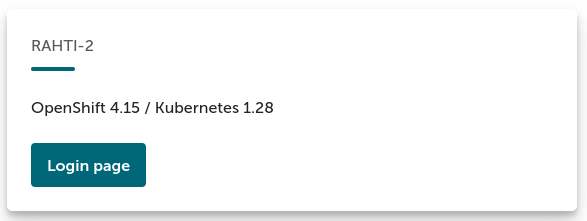
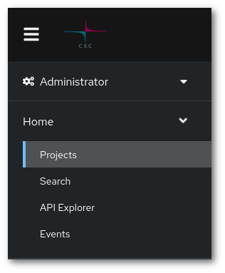
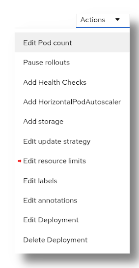
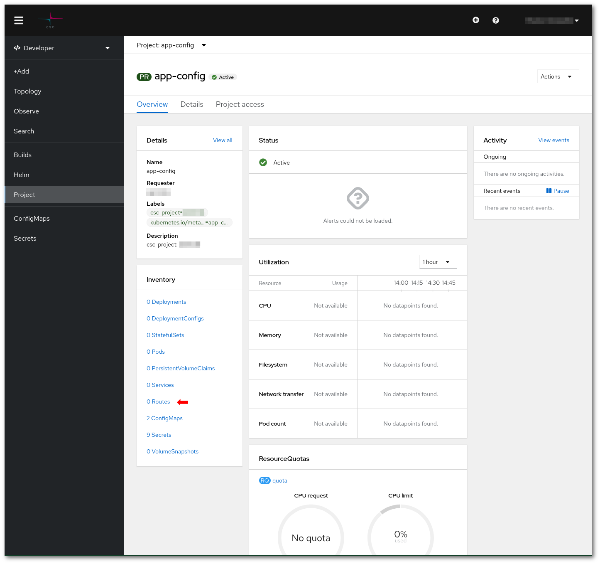
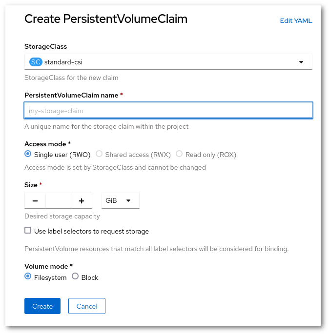

# Rahti FAQ

This page collects frequently asked questions and practical guidance for using Rahti,
including project management, resource limits, networking, storage, and application deployment.


### How do I log in to Rahti?

Go to [Rahti](https://rahti.csc.fi/), click in `Login`



You will be then served with a page with all the authentication options supported by Rahti. Choose the one that is more convenient for you; all your identities should be linked to the same Rahti account.

#### Command line login

In order to get the "login command", once you have logged in the web interface, click on your name and then in "Copy Login Command". For security reasons, you will be required to login again, after that you will be served the page the login command you can copy to the clipboard and paste it in any terminal running on your system.


### How do I create a project?

There are few places in the web interface where a project can be created. One of the paths to create a project is to go to `Home` > `Projects`



Then click in "Create Project".


The fields are the following:

1. You need to pick a unique name that is not in use by any other project in the system.
    
1. You can also enter a human-readable display name.
    
1. You have to also enter a CSC computing project in the Description field. It must be a currently valid CSC project, that your account has access to. In order to view to which CSC projects you have access to, please check https://my.csc.fi. If your CSC project number is `1000123`, you would enter the following in the Description field:

> csc_project: 1000123

### How do I see quota and limits?

The quota and limits of a given project can be found in the bottom of the project details page.


If you click on your project number under "AppliedClusterResourceQuotas"


### What are the default limits?

Every Pod needs to have lower and upper limits regarding resources, specifically for CPU and memory. The lower are called requests, and the upper are called limits. The requests sets the minimum resources needed for a Pod to run, and a Pod is not allowed to use more resources than the specified in limits. The user can set the limits explicitly within the available quota.

In Rahti the default limits are:

```yaml
    - resources:
        limits:
          cpu: 500m
          memory: 1Gi
        requests:
          cpu: 50m
          memory: 500Mi
```

The recommended way to discover the suitable values for your application is trial and error. Launch your application in Rahti and observe the memory and CPU consumption. If your application gets to the memory limit, it will be killed with an `OutOfMemoryError` (`OOM`), normally with a `137 error code`. CPU on the other hand, behaves differently, and the application will not be killed. But both limits have to be treated on the same way, if you see that any of the two limits is reached, raise the limit and try again. It is recommended to have at least a small margin of 10-20% over the expected limits. Of course, you can skip this process if you already know your application's resource needs. Also you might take a look to the [Horizontal Autoscaler](../../support/faq/addHorizontalAutoscaler.md), which allows you to automatically create and delete replicas of your Pods. It is better for availability and resource scheduling to have several smaller Pods, but not all applications support it.  

### How to edit a Deployment/DeploymentConfig default limits?

{ align=right }

In order to increase or decrease the resource limits, one can use the web UI or the command line.

From the web UI, go to `Workloads` -> `Deployment`, chhose the deployment and press **Actions > Edit resource limits**. You will be presented with a dialog with the CPU request and limit and Memory request and limit. The limit cannot be more than 5 times higher than the request. The request is the minimum CPU (or memory) necessary for the deploy to work, and will be used to schedule the Pod. The limit is the maximum allowed usage of CPU (or memory). If a Pod tries to use more memory than the limit, the Pod will be killed (OOMKilled). On the other hand, if a Pod tries to use more CPU then the limit, it will be simply limited, but it will not be killed.


!!! Warning "DeploymentConfig is deprecated"
    DeploymentConfig is deprecated in newer versions of OpenShift OKD and will be completely removed in the future. See Redhat's [deprecation announcement of DeploymentConfig](https://access.redhat.com/articles/7041372) and their [replacement guide for DeploymentConfig](https://developers.redhat.com/learning/learn:openshift:replace-deprecated-deploymentconfigs-deployments/resource/resources:convert-deploymentconfig-deployment).

### How to create routes?

!!! info "Default URL suffix"

    Rahti provides default application URLs in the form `<whatever>.2.rahtiapp.fi`.

A Route can be created by going `Networking` -> `Routes`.



And then click in "Create Route"


Routes can be configured using either the **Form view** or the **YAML view**, selectable at the top of the page.

A Route has two compulsory parameters:

* a `name`, which must be unique within the project.
* a `service`/`port`, which is where the traffic will be routed to.

Other optional parameters are:

* a `Hostname`, which must be unique within Rahti. If none is provided, the hostname will be autogenerated by using the route `name` and the `project name`.
* a `Path`, which allows routing only a specific URL path to the service.
* a `Service weight`, which controls how traffic is distributed when multiple routes target the same service.
* `Secure Route` can be enabled to activate TLS encryption (Only TLS v1.3 and v1.2 are supported in Rahti). The options are similar than in [Rahti Routes](../rahti/networking.md#routes)

### How to edit a route?

A Route can be edited by going to the project details page, click in Route, and then click in the route name you would like to edit.

Then click in Actions > Edit Route. A YAML representation of the route will appear. You can edit it following the example at the [Concepts Route](../rahti/concepts.md#route) page. If for example you want to add TLS support (https support), you need to add inside the `spec` section:

```
spec:
  tls:
    insecureEdgeTerminationPolicy: Redirect
    termination: edge
```

Where `Redirect` tells the route to redirect users from http to https automatically.


### What changes must be made in firewalls?

Rahti uses a fixed egress IP for outgoing traffic. The current Rahti egress IP is `86.50.229.150`.

!!! warning "egress IP may change"

    The egress IP of Rahti might change in the future. For example, if several versions of Rahti are run in parallel each will have a different IP. Or if a major change in the underlining network infrastructure happens.

Some project with dedicated egress IPs will have to request a new [dedicated IP](./networking.md#egress-ips) in Rahti and update their firewalls accordingly.

### How do I delete a project?

A project can be deleted from the Project details page (`Home` > `Projects`), by pressing on the 3 dots and then `Delete project`. A dialog to confirm the deletion will appear:


The name of the project (`test` in this example) has to be typed in before the project is deleted. This is just to avoid accidental deletion.

### How do I use storage?

Go to `Storage` -> `PersistentVolumeClaims` and then click in `Create PersistentVolumeClaim`.



* For the moment only a single `StorageClass` is available (`standard-csi`). It corresponds to Cinder-backed volumes, which can only be read or written (mounted) by a single node (In order to mount it in several Pods, you need to use [Pod affinity](../rahti/tutorials/pod-affinity.md), so all the Pods are created on the same node).

* A unique name within the project must be provided.

* The access mode is fixed to **ReadWriteOnce (RWO)** by the StorageClass and cannot be changed.

* A size within the quota limits has to be defined.

* The Volume mode should be `Filesystem`. The `Block` mode is available but intended only for advanced use cases.

PVCs can also be created or modified using **Edit YAML** for advanced configurations.

!!! warning "Lazy volume creation"
    The volume will only be created when it is mounted for the first time, this is the current behavior in Rahti.

### How to Recreate Pod for Deployment having RWO Volumes

Rahti volumes are ReadWriteOnce (RWO), meaning they can only be mounted by a single Pod at a time.

So, if the deployment have a mounted volume and you want to update the deployment, change the deployment strategy from "rolling update" to "recreate". Go to `Workloads` -> `Deployments` and press on the 3 dots, click on "Edit update strategy", now select "recreate"


### How to use Integrated Registry

To learn more about image caching and access control registry in Rahti, refer to the following article: [Using Rahti Integrated Registry](../../cloud/rahti/images/Using_Rahti_integrated_registry.md)
