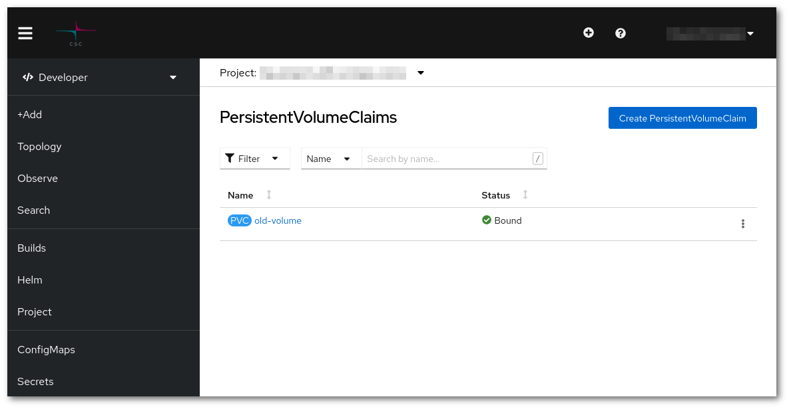

# Laajenna volyymi {#expand-a-volume}

Koska dynaaminen volyymilaajennus ei ole aktivoitu, jos muokataan suoraan `YAML`-objektissa volyymin kokoa, syntyy virhe kuten tämä:

```sh
(...)
# * spec: Forbidden: spec is immutable after creation except resources.requests for bound claims
(...)
```

Tällöin on noudatettava hieman käsityöläismäisempää menettelyä:

* Luo uusi volyymi halutulla koolla



* Skaalaa alas se käyttöönotto, johon uudelleen koottava volyymi on liitetty.


* Liitä vanha ja uusi volyymi toiseen Pod-konttiin. Paras vaihtoehto on luoda uusi käyttöönotto, luoda tiedosto nimeltä `two-volumes.yaml` ja korvata molempien volyymien nimet:

```yaml
apiVersion: apps/v1
kind: Deployment
metadata:
  name: two-volumes
spec:
  replicas: 1
  selector:
    matchLabels:
      app: two-volumes
  template:
    metadata:
      labels:
        app: two-volumes
    spec:
      containers:
      - image: cscfi/nginx-okd:plus
        name: two-volumes
        ports:
        - containerPort: 8081
          protocol: TCP
        volumeMounts:
        - mountPath: /new
          name: new-volume
        - mountPath: /old
          name: old-volume
      volumes:
      - name: new-volume
        persistentVolumeClaim:
          claimName: new-volume
      - name: old-volume
        persistentVolumeClaim:
          claimName: old-volume
```

```sh
oc create -f two-volumes.yaml
```

* Synkronoi tiedot

```sh
oc rsh deploy/two-volumes rsync -vrlpD /old/ /new/
```

* Poista tämä uusi Pod

```sh
oc delete deploy/two-volumes
```

* Vaihda volyymi siinä käyttöönotossa, jossa volyymi on liitetty, se on kohdassa **template > spec > volumes** kohdassa `claimName`.

```sh
oc edit deploy/<käyttöönoton nimi>
```

* Lopuksi skaalaa käyttöönotto takaisin ylös.

Tarkistaaksesi, että toimenpide onnistui, voit siirtyä siihen `Pod`-konttiin, johon volyymi on liitetty, ja tarkistaa uuden koon.