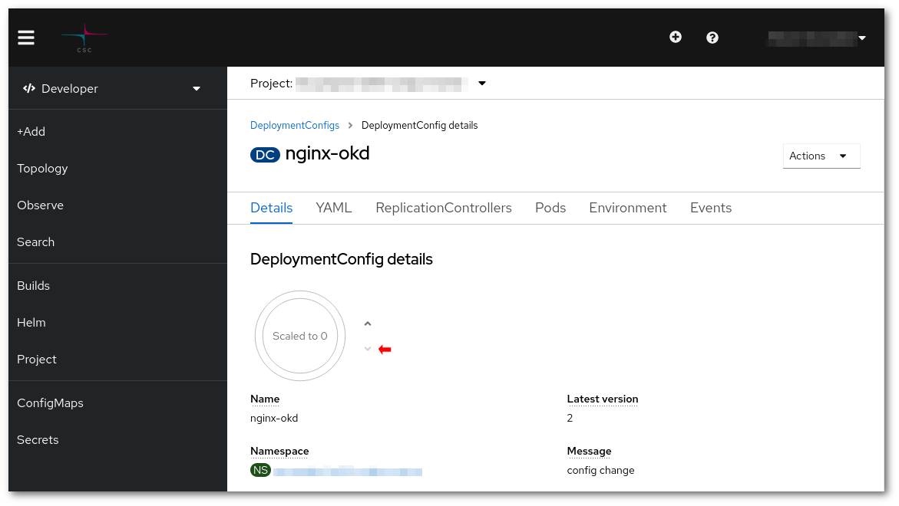

# Laajenna volyymi { #expand-a-volume }

Koska volyymien dynaaminen laajennus ei ole käytössä, jos muokkaat suoraan `YAML`-objektissa volyymin kokoa, palautetaan esimerkiksi tällainen virhe:

```sh
(...)
# * spec: Forbidden: spec is immutable after creation except resources.requests for bound claims
(...)
```
!!! warning ""
    Kun kasvatat PersistentVolumeClaimin (PVC) kokoa, on suositeltavaa käyttää kokoja, jotka ovat **8 GiB** kerrannaisia (esim. 16 GiB, 32 GiB, 64 GiB, 128 GiB jne.).  
    Muut arvot eivät välttämättä toimi, ja koon kasvatus saattaa epäonnistua hiljaisesti.

Tämän jälkeen on noudatettava manuaalisempaa menettelyä:

* Luo uusi volyymi halutulla koolla


* Skaalaa alas se deployment, joka liittää (mounttaa) muutettavan volyymin.



* Liitä vanha ja uusi volyymi toiseen Podiin. Paras vaihtoehto on luoda uusi deployment, tehdä `two-volumes.yaml` -niminen tiedosto ja korvata molempien volyymien nimet:

```yaml
apiVersion: apps/v1
kind: Deployment
metadata:
  name: two-volumes
spec:
  replicas: 1
  selector:
    matchLabels:
      app: two-volumes
  template:
    metadata:
      labels:
        app: two-volumes
    spec:
      containers:
      - image: cscfi/nginx-okd:plus
        name: two-volumes
        ports:
        - containerPort: 8081
          protocol: TCP
        volumeMounts:
        - mountPath: /new
          name: new-volume
        - mountPath: /old
          name: old-volume
      volumes:
      - name: new-volume
        persistentVolumeClaim:
          claimName: new-volume
      - name: old-volume
        persistentVolumeClaim:
          claimName: old-volume
```

```sh
oc create -f two-volumes.yaml
```

* Synkronoi tiedot

```sh
oc rsh deploy/two-volumes rsync -vrlpD /old/ /new/
```

* Poista tämä uusi Pod

```sh
oc delete deploy/two-volumes
```

* Vaihda volyymit siinä deploymentissa, joka liitti volyymin; se löytyy kohdan **template > spec > volumes** alta kentässä `claimName`.

```sh
oc edit deploy/<name of deployment>
```

* Lopuksi skaalaa deployment takaisin ylös.

Voit varmistaa toimenpiteen onnistuneen menemällä sellaiseen `Pod`iin, joka liittää volyymin, ja tarkistamalla uuden koon.