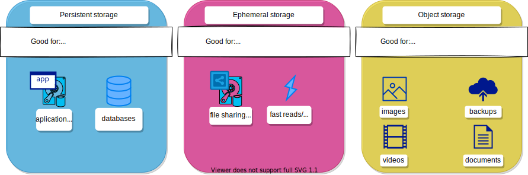

# Tallennus Rahtissa {#storage-in-rahti}

Tässä artikkelissa esitellään CSC:n Rahti-ympäristön tarjoamat tallennusvaihtoehdot. Tallennuksen käyttö edellyttää tiliä, CSC-projektia, Rahti-projektia ja vähintään yhtä Podeja. Rahtissa projekti on Kubernetes-nimiavaruus lisämerkinnöillä.

Yksi Dockerin perusperiaatteista on kuvausten muuttumattomuus; kerran luodut docker-kuvat eivät muutu. Useimmille sovelluksille tarvitaan kuitenkin tapa tallentaa, päivittää ja myöhemmin hakea sovellustietoja. Dockerissa tämä ratkaistaan volyymien konseptilla, ulkoinen tiedostojärjestelmä (dockerille), joka liitetään kontin sisäiseen tiedostojärjestelmään. Kubernetesissa, ja laajennettuna OpenShiftissa, tämä ongelma voidaan ratkaista useilla tavoilla.

## Pysyvä säilytys {#persistent-storage}

Ratkaisu, joka on samanlainen kuin Dockerin volyymit, on [Pysyvä volyymi](persistent.md). Tämä on volume, joka sijaitsee ulkoisessa tallennuksessa ja liitetään suoraan kontin tiedostojärjestelmään kuten lisäkiintolevy. Tämä on paras ratkaisu saumattomaan tallennusratkaisuun. Voit myös irrottaa sen Podeista, joihin se on liitetty, ja liittää sen toiseen Podi-sarjaan. Lisäksi pysyvät volyymit edustavat luotettavaa tallennusvaihtoehtoa, koska niiden tiedot on replikoitu.

Lisätietoja löytyy [Pysyvän volyymin](persistent.md) sivulta.

## Lyhytkestoinen säilytys {#ephemeral-storage}

Toinen ratkaisu on käyttää lyhytkestoista tallennusta, joka Kubernetesissa tunnetaan _Empty dir_ nimisenä. Tämä on tarkoitettu vain väliaikaisten tai tilapäisten tietojen tallentamiseen, joihin sovellusten tarvitsee nopeaa luku- ja kirjoitusoikeutta säiliöissä. Sama _Empty dir_ voidaan liittää jokaiseen kontin sisällä olevaan Podiin. Tiedot lyhytkestoisessa tallennuksessa menetetään, kun Podi poistetaan. Koska lyhytkestoisissa tallennuksissa tietoja ei pitäisi säilyttää pysyvästi, sitä ei tulisi pitää luotettavana.

Lisätietoja löytyy [Lyhytkestoisen säilytyksen](ephemeral.md) sivulta.

## Objektien tallennus {#object-storage}

Jos sinun täytyy tallentaa suuria tietomääriä tai haluat, että tietosi ovat helposti saatavilla Internetin kautta, esimerkiksi URL-osoitteiden avulla, objektien tallennus on etsimäsi tallennusratkaisu. Objektien tallennusta käytettäessä voit vapaasti luoda ja poistaa Podejasi, koska objektien tallennus ei ole sidottu mihinkään Pod-malliin. Lisäksi tietosi on replikoitu, joten objektien tallennus edustaa luotettavaa pitkäaikaista tallennusratkaisua.

CSC:llä tarjoamme Allas-nimistä objektien tallennusratkaisua. Lisätietoja on saatavilla [Allas-sivulla](../../../data/Allas/index.md).

Esimerkkejä Allakselle varmuuskopioinnista löytyy [täältä](objectstorage.md).

## Volyymien tilannekuvat {#volume-snapshots}

Tilannekuva edustaa tallennettavan volyymin tilaa klusterissa tiettynä ajankohtana. Volyymien tilannekuvia voidaan käyttää uuden volyymin provisiointiin ja auttavat suojaamaan tietojen häviämiseltä OKD:ssa. Rahti tukee Container Storage Interface (CSI) volyymien tilannekuvia oletuksena, ja oletus volyymin tilannekuvan luokan nimi on standard-csi.

CSI volyymien tilannekuvien avulla sovelluskehittäjä voi:

- Käyttää volyymitilannekuvia sovellustason tai klusteritason tallennuksen varmuuskopiointiratkaisujen kehittämiseen.
- Palauttaa nopeasti aiempaan kehitysversioon kehityksen aikana.
- Käyttää tallennusta tehokkaammin välttämällä tarpeen luoda täydellistä kopiota joka kerta.

Lisätietoja löytyy [Volyymien tilannekuvan](volume-snapshot.md) sivulta.