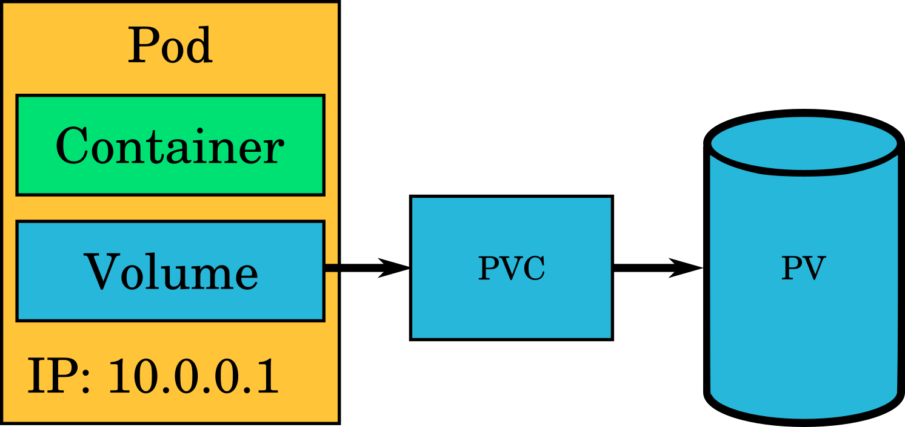

## Persistent volumes

Storage that persists over a pod's lifetime is needed. This is what **persistent volumes** are for.

Persistent volumes are stored in a backing storage such as Ceph, NFS or
GlusterFS. They are claimed by a pod using a **PersistentVolumeClaim**. When a
new claim is made, this can mean that either an existing volume is claimed or a
new one is created dynamically and given to the pod to use.

There are two storage classes available:

 * *glusterfs-storage*. This kind of volume supports "Read Write Many" (RWX) storage, this means multiple nodes can mount it in read-write mode. This is the default class.
 * *standard-rwo*. This kind supports two modes: "Read Write Once" (RWO), meaning that one node can mount in read-write mode. And "Read Only Many" (ROX), multiple nodes can mount in read-only mode.

Other option is to use an object storage service, like for example [Allas](../../../../data/Allas/), which is provided as a service by CSC, or to deploy a private [Minio](../../template-docs/#minio) application using a template. Both Allas and Minio, support the S3 API.




Persistent storage is requested in the cluster using `PersistentVolumeClaim` objects:

*`pvc.yaml`*

```yaml
apiVersion: v1
kind: PersistentVolumeClaim
metadata:
  name: testing-pvc
spec:
  accessModes:
  - ReadWriteMany
  resources:
    requests:
      storage: 1Gi
```

Persistent storage can be requested also via the web console.

This will request a 1 GiB persistent storage that can be mounted in read-write
mode by multiple nodes. Other access modes are ReadWriteOnce (Only one node can mount it read-write) and ReadOnlyMany (Multiple nodes can mount read-only).

The persistent volume can be used in a pod by specifying `spec.volumes`
(defines the volumes to attach) and `spec.containers.volumeMounts` (defines where
to mount the attached volumes in the container's filesystem):

*`pvc-pod.yaml`*:

```yaml
apiVersion: v1
kind: Pod
metadata:
  name: mypod-vol
  labels:
    app: serveapp-vol
    pool: servepod-vol
spec:
  containers:
  - name: serve-cont
    image: "docker-registry.default.svc:5000/openshift/httpd"
    volumeMounts:
    - mountPath: /mountdata
      name: smalldisk-vol
  volumes:
  - name: smalldisk-vol
    persistentVolumeClaim:
      claimName: testing-pvc
```
