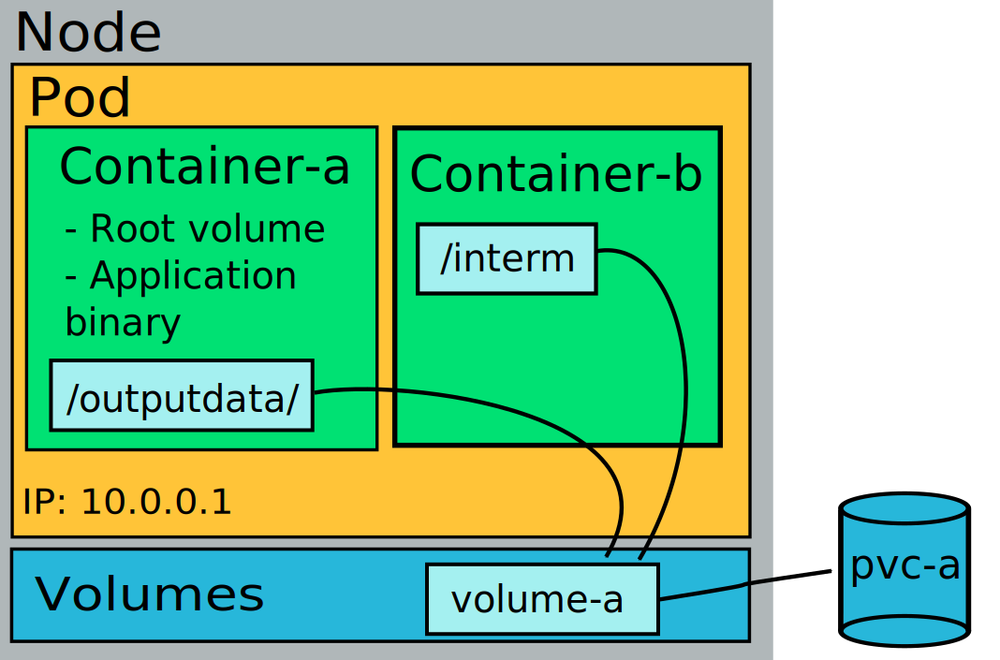

# Persistent-volyymit {#persistent-volumes}

**Persistent-volyymit** ovat tallennustilaa, joka säilyy Podin elinkaaren aikana ja sen jälkeen.

Persistent-volyymit Rahtissa tallennetaan kestävään tallennustilaan, kuten CEPH. Ne luodaan käyttämällä **PersistentVolumeClaim**-resurssia. Kun uusi vaatimus tehdään ja **Pod kiinnittää sen**, uusi tallennustila luodaan.

!!! info "Muutos Rahti 1 -versiosta"

    Tuotannollisessa Rahtissa uusi persistent-volyymi jää tilaan **"⏳ Odottaa"** kunnes jokin Pod kiinnittää sen. Tämä on muutos Rahti 1:stä, jossa volyymi luotiin heti.

Rahtissa on saatavilla yksi tallennusluokka:

 * *standard-csi*. Tämä on "Read Write Once" (RWO) tallennusluokka, mikä tarkoittaa, että vain yksi pod voi mountata volyymin (kirjoitus-luku-tilassa).

Lisää tallennusluokkia on työn alla.



Pysyvä tallennustila pyydetään klusterissa käyttämällä `PersistentVolumeClaim`-objekteja:

*`pvc.yaml`*

```yaml
apiVersion: v1
kind: PersistentVolumeClaim
metadata:
  name: testing-pvc
spec:
  accessModes:
  - ReadWriteOnce
  resources:
    requests:
      storage: 1Gi
```

Yllä oleva esimerkki pyytää 1 GiB persistent-tallennustilan, joka voidaan kiinnittää yhden podin käyttöön kirjoitus-luku-tilassa.

Pysyvä tallennustila voidaan pyytää myös verkkokonsolin kautta.

!!! warning

    Kun volyymissa on suuri määrä tiedostoja (>15 000), aika, jonka se vie kiinnittyäkseen ja saatavilla ollakseen, voi olla yli 5 minuuttia. Mitä enemmän tiedostoja, sitä enemmän aikaa se vie tullakseen saataville.

Persistent-volyymi voidaan käyttää podissa määrittämällä `spec.volumes` (määrittelee kiinnitettävät volyymit) ja `spec.containers.volumeMounts` (määrittelee, mihin kiinnitettävät volyymit kiinnitetään säilön tiedostojärjestelmässä):

*`pvc-pod.yaml`*:

```yaml
apiVersion: v1
kind: Pod
metadata:
  name: mypod-vol
  labels:
    app: serveapp-vol
    pool: servepod-vol
spec:
  containers:
  - name: serve-cont
    image: "image-registry.openshift-image-registry.svc:5000/openshift/httpd"
    volumeMounts:
    - mountPath: /mountdata
      name: smalldisk-vol # Viittaa alla olevaan volyymiisi
  volumes:
  - name: smalldisk-vol
    persistentVolumeClaim:
      claimName: testing-pvc # Viittaa PersistentVolumeClaimiin (pvc.yaml)
```

!!! warning
    Kun Pysyvä Volyymi poistetaan, vastaava data poistetaan **pysyvästi**. On erittäin suositeltavaa ottaa säännöllisesti ja versioituja kopioita datasta itsenäiseen tallennusjärjestelmään kuten [Allas](../../../data/Allas/using_allas/a_backup.md).

