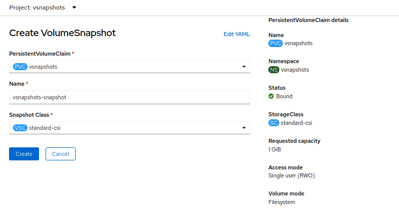

# Volyymin tilannevedos {#volume-snapshot}

## Volyymin tilannevedoksen käyttöönotto {#volume-snapshot-provisioning}

Rahti tarjoaa kaksi menetelmää tilannevedosten käyttöönottoon: verkkokäyttöliittymän kautta ja käyttämällä CLI:ta.

### Esivaatimukset {#prerequisites}

- Aktiivinen projekti Rahtissa
- Varmista, ettei mikään pod käytä pysyvää volyymivaatimusta (PVC), josta haluat ottaa tilannevedoksen.

### Menettelytapa {#procedure}

1. Luo käyttöönotto
2. Luo PVC
3. Kiinnitä PVC käyttöönottoon (Rahtissa PVC luodaan vasta, kun se kiinnitetään käyttöönottoon)
4. Irrota PVC käyttöönotosta
5. Luo volyymin tilannevedos
6. Liitä PVC volyymin tilannevedokseen

### Verkkokäyttöliittymän kautta {#through-web-interface}

Varmistettuasi, että PVC ei ole kiinnitetty mihinkään podiin, siirry 'VolumeSnapshot'-osioon ja napsauta 'Create VolumeSnapshot' luodaksesi tilannevedoksen PVC:stäsi.


Tilannevedoksen löytämiseksi, valitse 'Developer'-näkymä, napsauta 'Project' vasemman puolen valikossa, 'Invertory'-osiossa 'Overview'-välilehden viimeinen vaihtoehto on VolumeSnapshot.


Täytä tarvittavat tiedot. Valitse PersistentVolumeClaim-kohdassa PVC, jonka haluat liittää, anna nimi volyymin tilannevedokselle, valitse oletuksena tilannevedosluokka 'standard-csi' ja napsauta 'luo'.



### CLI:n avulla {#using-cli}

Luo `snapshot.yaml`-tiedosto liittääksesi PVC volyymin tilannevedokseen

```
apiVersion: snapshot.storage.k8s.io/v1
kind: VolumeSnapshot
metadata:
  name: <name_of_volumesnapshot>
spec:
  source:
    persistentVolumeClaimName: <name_of_PVC>
  volumeSnapshotClassName: standard-csi
```

Suorita `oc apply -f snapshot.yaml` käyttöönottaaksesi `snapshot.yaml`.

Listataksesi kaikki volyymin tilannevedokset, käytä komentoa:

`oc get volumesnapshot`

Saadaksesi tietoja luodusta volyymin tilannevedoksesta, suorita seuraava komento:

`oc describe volumesnapshot <your-volume-snapshot>`

Poista volyymin tilannevedos syöttämällä seuraava komento:

`oc delete volumesnapshot <volumesnapshot_name>`

## Volyymin tilannevedoksen palautus {#restore-a-volume-snapshot}

CSI Snapshot Controller Operator luo seuraavat tilannevedoksen mukautetut resurssimääritelmät (CRD:t) snapshot.storage.k8s.io/v1 API-ryhmässä. VolumeSnapshot CRD -sisältöä voidaan käyttää nykyisen volyymin palauttamiseksi aikaisempaan tilaan. Luo `pvc-restore.yaml`-tiedosto.

``` 
apiVersion: v1
kind: PersistentVolumeClaim
metadata:
  name: myclaim-restore
spec:
  storageClassName: csi-hostpath-sc
  dataSource:
    name: <name-of-snapshot> 
    kind: VolumeSnapshot 
    apiGroup: snapshot.storage.k8s.io 
  accessModes:
    - ReadWriteOnce
  resources:
    requests:
      storage: 1Gi
```

Suorita `oc apply -f pvc-restore.yaml` käyttöönottaaksesi `pvc-restore.yaml`.

Tässä, `spec.dataSource.name`-kohdassa, annetaan käytettävän tilannevedoksen nimi.

## Käyttötapaus {#use-case}

Tässä otamme tilannevedoksen nginx-käyttöönoton sisällöstä ja varmuuskopioimme tiedot palautusskriptillä. Seuraa ohjeita:

1. Luo nginx-käyttöönotto `nginx-deployment.yaml`.
2. Luo PVC nimeltään `nginx-pvc.yaml`.
3. Liitä tämä PVC nginx-käyttöönottoon.
4. Mene tähän käyttöön luotuun podiin ja luo tiedosto nimeltä test.txt sekä lisää siihen staattista sisältöä. Tämä sisältö tallennetaan aikaisemmin luotuun PVC:hen.
5. Tallenna tilannevedoksen määritelmä tiedostoon nimeltä `nginx-snapshot.yaml`. Tämä tiedosto viittaa Nginxin käyttämään PVC:hen (kuten määritelty `nginx-pvc.yaml`-tiedostossa).
6. Poista PVC.
7. Luo uusi PVC tilannevedoksesta tallentamalla uusi PVC-konfiguraatio `nginx-restore-pvc.yaml`-tiedostoon. Tämä tiedosto määrittää, että tietolähde on edellisessä vaiheessa luotu tilannevedos.
8. Ota käyttöön uusi Nginxin instance palautetulla PVC:llä muokatun käyttöönottomäärityksen mukaisesti, tallennettuna `nginx-restored-deployment.yaml`-tiedostoon. Tämä uusi käyttöönotto käyttää tilannevedoksesta luotua PVC:tä, jolloin se voi palvella aiemmin lisättyä staattista sisältöä.
9. Voit nähdä, että tiedot on palautettu.