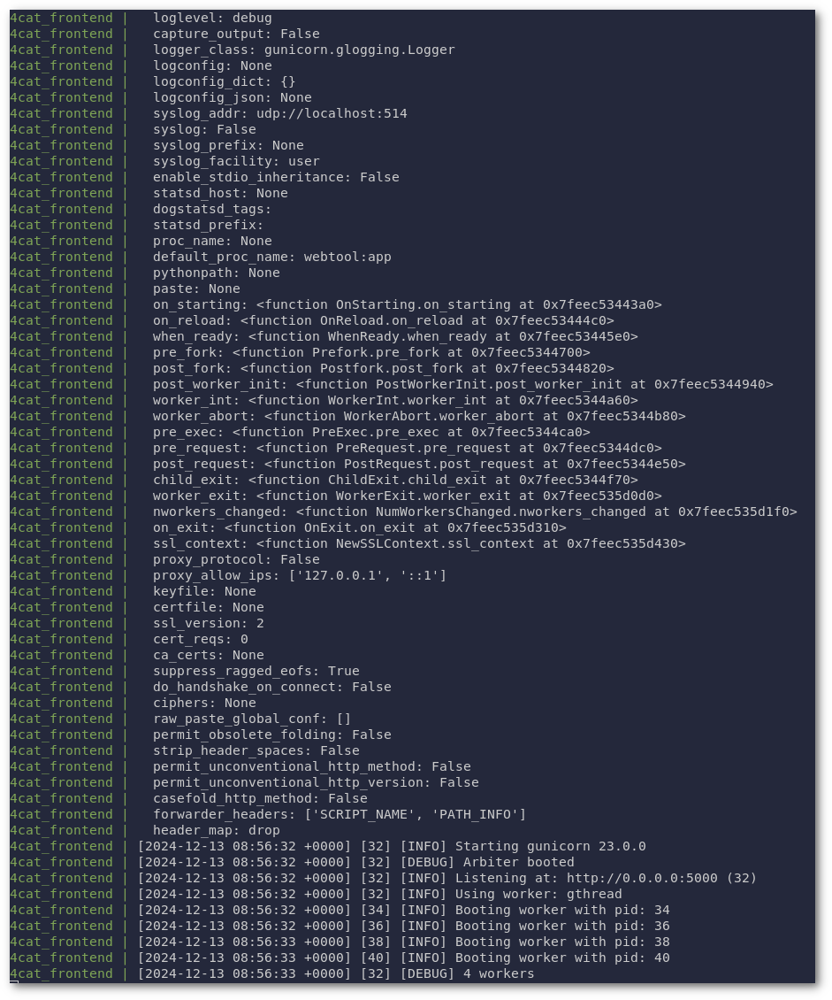
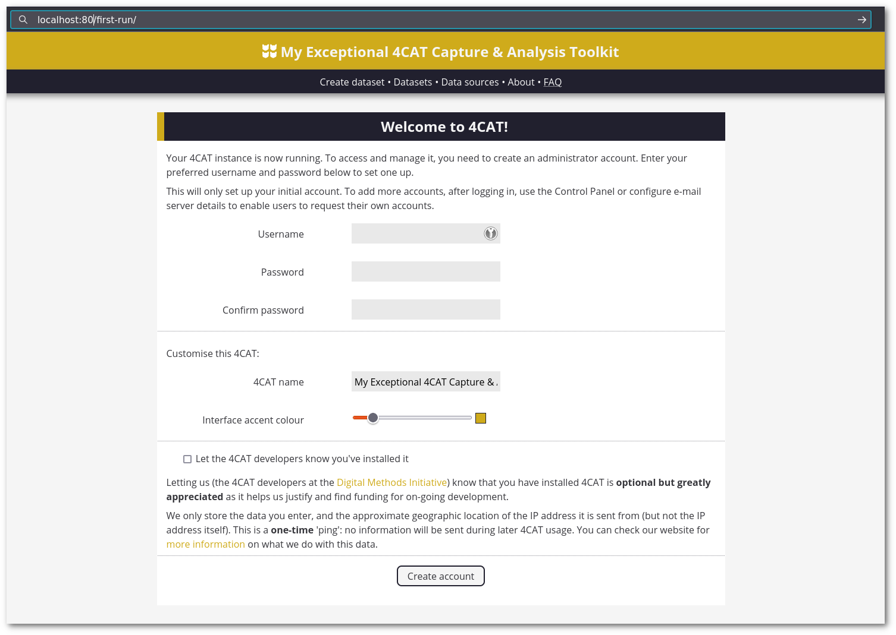
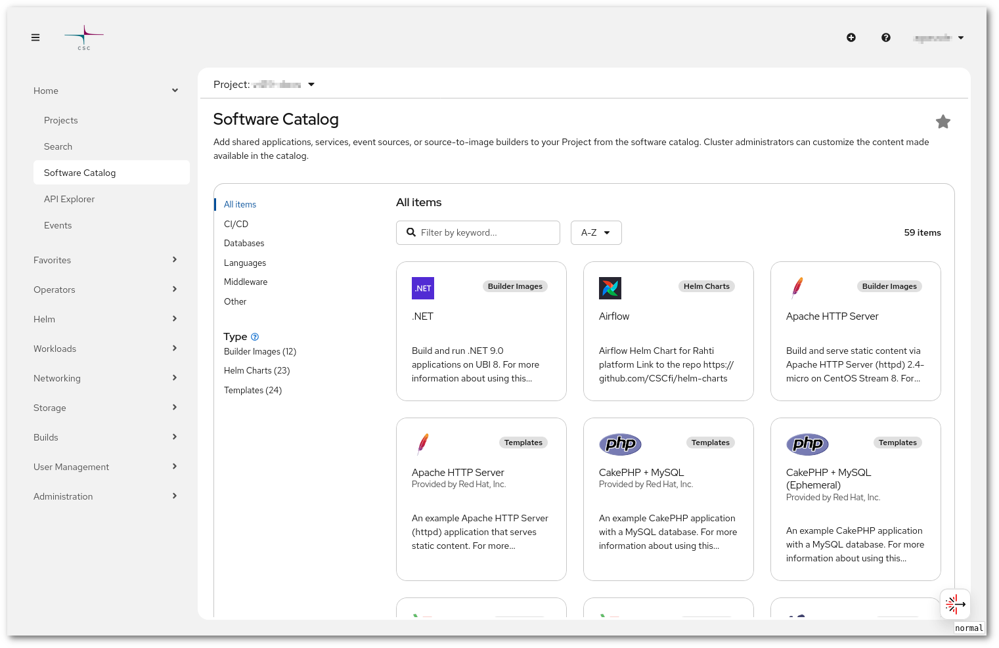
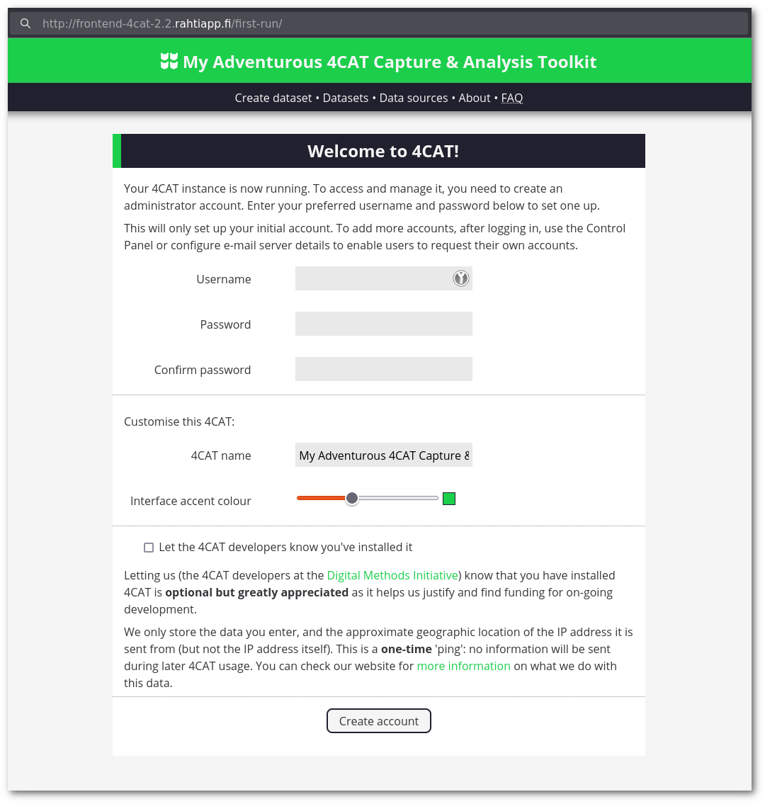

!!! error "Advanced level"
    You need to have Linux, Docker, Docker Compose and Kompose knowledge. Python knowledge is a plus.  
    Regarding Rahti, we will privilege the use of OpenShift CLI tool [oc](../usage/cli.md)

# How to deploy 4cat in Rahti

This tutorial is a long format one, it explains all the different steps that were necessary to deploy the [4cat_fi](https://github.com/uh-dcm/4cat_fi) application into Rahti. The idea is to explain the story of how the different issues were found and solved. Each issue will have its own chapter and hopefully the solution will be easy to apply to any other application with similar symptoms. We will omit some of the false solutions and leads that I followed when I originally tried to deploy this application for the sake of keeping this tutorial from growing exponentially. But keep in mind that these kind of processes are rarely straight forward and that to find the solution you normally find a lot of non solutions.

4Cat is a capture and analysis toolkit. From the Github page linked above, we learnt that the tool is used for analysing social media platforms and that one of the installation methods is docker compose. This is good news because:

1. We can test the application deployment using docker compose and see how it looks.
1. We do not need to create a docker container from scratch.
1. We can use the docker compose deployment as a base and adapt it to Kubernetes deployment using [kompose](https://kompose.io). This tool is specifically designed to make these conversions. From their website: "Our conversions are not always 1:1 from Docker Compose to Kubernetes, but we will help get you 99% of the way there!". And it indeed will save us a lot of tedious conversion time, but it will not be the end of it.

!!! warning "Linux 🐧 is used for all the examples"
    We have prepared this tutorial using a Linux machine. In principle, with a bit of adapting all these commands run also in Windows and Mac, but if confused I recommend you to [install a tiny VM in Pouta](../../pouta/launch-vm-from-web-gui.md) and use it for following the tutorial instead. This is useful even for Linux users, as you will be able to install, uninstall or change software without risking corrupting your local installation.


## Docker compose

1. Before continuing, we will need to have docker and the docker compose plugin installed. You can find instructions on how to install docker compose here:

    - <https://docs.docker.com/compose/install/>

    For Debian and Ubuntu you can install it by:

    ```sh
    sudo apt-get update
    sudo apt-get install docker.io docker-compose
    ```

    !!! Info "Alternatives to docker 🐋"
        You can instead use podman compose or similar, but we will use docker as it is the most common tool.

1. Once docker compose is installed, let's deploy 4cat and see how the it looks and works. You will need to clone the repository and run docker-compose inside the cloned folder:

    ```sh
    git clone https://github.com/uh-dcm/4cat_fi
    cd 4cat_fi
    sudo docker compose up
    ```

    This will start the process for deploying the application in the machine. It can take some time to pull the images and configure the application. If you `Ctrl+C` the application will exit. If you want to run it on the background, you just need to add `-d` or  `--detach` to the docker-compose command.

    

    After a while the application will be available on port `80` (The `PUBLIC_PORT`):

    

### Analysis

The [docker-compose.yml](https://github.com/digitalmethodsinitiative/4cat/blob/master/docker-compose.yml) file is the following:

```yaml
services:
  db:
    container_name: 4cat_db
    image: postgres:${POSTGRES_TAG}
    restart: unless-stopped
    environment:
      - POSTGRES_USER=${POSTGRES_USER}
      - POSTGRES_PASSWORD=${POSTGRES_PASSWORD}
      - POSTGRES_DB=${POSTGRES_DB}
      - POSTGRES_HOST_AUTH_METHOD=${POSTGRES_HOST_AUTH_METHOD}
    volumes:
      - 4cat_db:/var/lib/postgresql/data/
    healthcheck:
      test: [ "CMD-SHELL", "pg_isready -U $${POSTGRES_USER}" ]
      interval: 5s
      timeout: 5s
      retries: 5

  backend:
    image: digitalmethodsinitiative/4cat:${DOCKER_TAG}
    container_name: 4cat_backend
    restart: unless-stopped
    env_file:
      - .env
    depends_on:
      db:
        condition: service_healthy
    ports:
      - ${PUBLIC_API_PORT}:4444
    volumes:
      - 4cat_data:/usr/src/app/data/
      - 4cat_config:/usr/src/app/config/
      - 4cat_logs:/usr/src/app/logs/
    entrypoint: docker/docker-entrypoint.sh

  frontend:
    image: digitalmethodsinitiative/4cat:${DOCKER_TAG}
    container_name: 4cat_frontend
    restart: unless-stopped
    env_file:
      - .env
    depends_on:
      - db
      - backend
    ports:
      - ${PUBLIC_PORT}:500
      - ${TELEGRAM_PORT}:443
    volumes:
      - 4cat_data:/usr/src/app/data/
      - 4cat_config:/usr/src/app/config/
      - 4cat_logs:/usr/src/app/logs/
    command: ["docker/wait-for-backend.sh"]

volumes:
  4cat_db:
    name: ${DOCKER_DB_VOL}
  4cat_data:
    name: ${DOCKER_DATA_VOL}
  4cat_config:
    name: ${DOCKER_CONFIG_VOL}
  4cat_logs:
    name: ${DOCKER_LOGS_VOL}
```

Also let's check the [.env](https://github.com/uh-dcm/4cat_fi/blob/master/.env) file:

```ini
# 4CAT Version: Update with latest release tag or 'latest'
# https://hub.docker.com/repository/docker/digitalmethodsinitiative/4cat/tags?page=1&ordering=last_updated
DOCKER_TAG=stable
# You can select Postrgres Docker image tags here to suit your needs: https://hub.docker.com/_/postgres
POSTGRES_TAG=latest

# Database setup
POSTGRES_USER=fourcat
POSTGRES_PASSWORD=supers3cr3t
POSTGRES_DB=fourcat
POSTGRES_HOST_AUTH_METHOD=trust
# POSTGRES_HOST should correspond with the database container name set in docker-compose.yml
POSTGRES_HOST=db
POSTGRES_PORT=5432  # Docker postgres image uses port 5432

# Server information
# SERVER_NAME is only used on first run; afterwards it can be set in the frontend
SERVER_NAME=localhost
PUBLIC_PORT=80

# Backend API
# API_HOST is used by the frontend; in Docker it should be the backend container name
# (or "localhost" if front and backend are running together in one container
API_HOST=backend
PUBLIC_API_PORT=4444

# Telegram apparently needs its own port
TELEGRAM_PORT=443

# Docker Volume Names
DOCKER_DB_VOL=4cat_4cat_db
DOCKER_DATA_VOL=4cat_4cat_data
DOCKER_CONFIG_VOL=4cat_4cat_config
DOCKER_LOGS_VOL=4cat_4cat_logs

# Gunicorn settings
worker_tmp_dir=/dev/shm
workers=4
threads=4
worker_class=gthread
log_level=debug
```

As you can see this `docker-compose.yml` file is a [YAML](https://en.wikipedia.org/wiki/YAML) file with two main sections: `services` and `volumes`. There are 3 `services` and 4 `volumes`. In Kubernetes this will mean 3 `Deployments` and 4 `PersistentVolumeClaim`s (PVC). The most important fields of a service are:

- `image` is the image that docker will need to pull and run for every service. In our case, we have two different images, the `postgres` image (a well known database) and the `4cat_fi` one. `Frontend` and `backend` use the same image, but have a different command/entry point. As docker compose is working we know that both images exists and can be pulled with no issue.
- `environment` and `env_file` define the environment variables that will configure the services. For example `POSTGRES_PASSWORD` is used to pass the password to the database.
- `volumes` is where we tell docker which volumes we need to be attached to the service and in which folder they need to be mounted.
- `ports` tells us the public ports, the internal ports, and the mapping between themselves. The notation is `<external_port>:<internal_port>`.
- `entrypoint` and `command` are the commands to be executed when the image is launched. Postgres does not have either due to the fact that we will use the default `command`/`entrypoint` defined in the image.

The volumes section is simpler and only contains a list of names. A docker compose "volume" is a normal docker volume and does not include a size. This is because it will be using the local disk, and the size will be the limit of the local disk itself. Volumes in Kubernetes do have a size and we will need to account for that when we do the conversion.

The `.env` file has the default values to properly deploy the application. Like `PUBLIC_PORT` that is set to `80`.

## Kompose

Kompose will allow us to translate the `docker-compose.yaml` file into a set of Kubernetes YAML files.

1. We need to have [kompose](https://kompose.io/) installed. You can follow the instruction here:

    - <https://kompose.io/installation/>

    As we have docker already installed, we can follow the docker method that will build the image from source:

    ```sh
    sudo docker build -t kompose https://github.com/kubernetes/kompose.git\#main
    ```

1. Run kompose (while still being in the 4cat_fi folder):

    ```sh
    $ docker run --rm -it -v $PWD:/opt kompose sh -c "cd /opt && kompose convert"
    WARN The "DOCKER_CONFIG_VOL" variable is not set. Defaulting to a blank string.
    WARN The "DOCKER_LOGS_VOL" variable is not set. Defaulting to a blank string.
    WARN The "DOCKER_DB_VOL" variable is not set. Defaulting to a blank string.
    WARN The "DOCKER_DATA_VOL" variable is not set. Defaulting to a blank string.
    WARN The "PUBLIC_PORT" variable is not set. Defaulting to a blank string.
    WARN The "TELEGRAM_PORT" variable is not set. Defaulting to a blank string.
    WARN The "DOCKER_TAG" variable is not set. Defaulting to a blank string.
    WARN The "POSTGRES_TAG" variable is not set. Defaulting to a blank string.
    WARN The "POSTGRES_USER" variable is not set. Defaulting to a blank string.
    WARN The "POSTGRES_PASSWORD" variable is not set. Defaulting to a blank string.
    WARN The "POSTGRES_DB" variable is not set. Defaulting to a blank string.
    WARN The "POSTGRES_HOST_AUTH_METHOD" variable is not set. Defaulting to a blank string.
    WARN The "PUBLIC_API_PORT" variable is not set. Defaulting to a blank string.
    WARN The "DOCKER_TAG" variable is not set. Defaulting to a blank string.
    WARN Restart policy 'unless-stopped' in service frontend is not supported, convert it to 'always'
    WARN Restart policy 'unless-stopped' in service db is not supported, convert it to 'always'
    WARN Restart policy 'unless-stopped' in service backend is not supported, convert it to 'always'
    WARN File don't exist or failed to check if the directory is empty: stat :/usr/src/app/data: no such file or directory
    WARN File don't exist or failed to check if the directory is empty: stat :/usr/src/app/config: no such file or directory
    WARN File don't exist or failed to check if the directory is empty: stat :/usr/src/app/logs: no such file or directory
    WARN Service "db" won't be created because 'ports' is not specified
    WARN File don't exist or failed to check if the directory is empty: stat :/var/lib/postgresql/data: no such file or directory
    WARN File don't exist or failed to check if the directory is empty: stat :/usr/src/app/data: no such file or directory
    WARN File don't exist or failed to check if the directory is empty: stat :/usr/src/app/config: no such file or directory
    WARN File don't exist or failed to check if the directory is empty: stat :/usr/src/app/logs: no such file or directory
    INFO Kubernetes file "backend-service.yaml" created
    INFO Kubernetes file "frontend-service.yaml" created
    INFO Kubernetes file "backend-deployment.yaml" created
    INFO Kubernetes file "env-configmap.yaml" created
    INFO Kubernetes file "4cat-data-persistentvolumeclaim.yaml" created
    INFO Kubernetes file "4cat-config-persistentvolumeclaim.yaml" created
    INFO Kubernetes file "4cat-logs-persistentvolumeclaim.yaml" created
    INFO Kubernetes file "db-deployment.yaml" created
    INFO Kubernetes file "4cat-db-persistentvolumeclaim.yaml" created
    INFO Kubernetes file "frontend-deployment.yaml" created
    ```

1. You should have few new files created:

    - "backend-service.yaml"
    - "frontend-service.yaml"
    - "backend-deployment.yaml"
    - "env-configmap.yaml"
    - "4cat-data-persistentvolumeclaim.yaml"
    - "4cat-config-persistentvolumeclaim.yaml"
    - "4cat-logs-persistentvolumeclaim.yaml"
    - "db-deployment.yaml"
    - "4cat-db-persistentvolumeclaim.yaml"
    - "frontend-deployment.yaml"

### Analysis

The tool has generated 4 kind of files: `service`, `deployment`,  `configmap` and `persistentvolumeclaim`. Let's start with the simpler ones:

- `persistentvolumeclaim` files are the definitions of volumes. There is one file per `volume` definition in the docker compose file. Let's see an example and the meaning of the relevant lines:

    ```yaml
    apiVersion: v1
    kind: PersistentVolumeClaim
    metadata:
      labels:
        io.kompose.service: 4cat-logs
      name: 4cat-logs
    spec:
      accessModes:
        - ReadWriteOnce
      resources:
        requests:
          storage: 100Mi
    ```

    We can see that the `name` has been kept from the compose definition (Found in `metadata > name`). The `accessMode` is set to `ReadWriteOnce`, which means that the volume can only be mounted once. Finally the size is set to `100Mi` by default (Found in `spec > resources > request > storage`).

- The `configmap` file(s) store configuration. In our case the (non docker-compose specific) variables defined in `.env` have been translated to `env-configmap.yaml`. The `name` is set to `env` and the variables are defined under `data`.

- The `service` files define "stable network identities" that act as a load balancer. A service is created for each `deployment` and it exports every port that the deployment provides. For example in `frontend-service.yaml`:

    ```yaml
    apiVersion: v1
    kind: Service
    metadata:
      annotations:
        kompose.cmd: kompose convert
        kompose.version: 1.34.0 (cbf2835db)
      labels:
        io.kompose.service: frontend
      name: frontend
    spec:
      ports:
        - name: "5000"
          port: 5000
          targetPort: 5000
        - name: "443"
          port: 443
          targetPort: 443
      selector:
        io.kompose.service: frontend
    ```

    The two relevant parts are `selector` and `ports`. The first one links the service with the `deployment` and the second lists the ports this service export. See more information about [Services](../networking.md#services).

- `deployment` is the most complex configuration generated. We can try to map the con figuration of `docker-compose.yaml` into these files. For example using the shortest one generated:

    ```yaml
    apiVersion: apps/v1
    kind: Deployment
    metadata:
      annotations:
        kompose.cmd: kompose convert
        kompose.version: 1.34.0 (cbf2835db)
      labels:
        io.kompose.service: db
      name: db
    spec:
      replicas: 1
      selector:
        matchLabels:
          io.kompose.service: db
      strategy:
        type: Recreate
      template:
        metadata:
          annotations:
            kompose.cmd: kompose convert
            kompose.version: 1.34.0 (cbf2835db)
          labels:
            io.kompose.service: db
        spec:
          containers:
            - env:
                - name: POSTGRES_DB
                - name: POSTGRES_HOST_AUTH_METHOD
                - name: POSTGRES_PASSWORD
                - name: POSTGRES_USER
              image: 'postgres:'
              livenessProbe:
                exec:
                  command:
                    - pg_isready -U ${POSTGRES_USER}
                failureThreshold: 5
                periodSeconds: 5
                timeoutSeconds: 5
              name: 4cat-db
              volumeMounts:
                - mountPath: /var/lib/postgresql/data
                  name: 4cat-db
          restartPolicy: Always
          volumes:
            - name: 4cat-db
              persistentVolumeClaim:
                claimName: 4cat-db
    ```

    - The `image` is defined at `spec > template > spec > containers > image`, and in this case is `postgres:`. This is a mistake as the tag `latest` is missing, we will fix this later.
    - The `environment` is defined at `spec > template > spec > containers > env`, values are also missing.
    - The `volumes` are defined at `spec > template > spec > volumes` and `spec > template > spec > containers > volumeMounts`.
    - The `ports` are defined in `spec > template > spec > containers > ports` and in the already mentioned corresponding `service` files.
    - Finally the `command` is defined in `spec > template > spec > containers > command` (you can see the example in `backend-deployment.yaml`).

    As you can see the generated YAML files sare not perfect, but will be fine as a base for continuing the deployment.

## Deployment to Rahti

We will take the current unmodified YAML files and deploy them one by one. First you need to [install oc](../usage/cli.md#the-command-line-tools-page-in-the-rahti-web-ui) and [login into Rahti](../usage/cli.md#how-to-login-with-oc). Then you need to [create a Rahti project](../usage/projects_and_quota.md#creating-a-project). Finally make sure you are in the correct project: `oc project <project_name>`.

### Volumes, ConfigMaps and Services

These 3 types are going to be straight forward and should cause no issue.

1. We can start creating the `volumes` one by one:

     ```sh
     $ oc create -f 4cat-config-persistentvolumeclaim.yaml
     persistentvolumeclaim/4cat-config created

     $ oc create -f 4cat-data-persistentvolumeclaim.yaml
     persistentvolumeclaim/4cat-data created

     $ oc create -f 4cat-db-persistentvolumeclaim.yaml
     persistentvolumeclaim/4cat-db created

     $ oc create -f 4cat-logs-persistentvolumeclaim.yaml
     persistentvolumeclaim/4cat-logs created
     ```

    This will create 4 volumes in `Pending` status. They will remain in `Pending` till we deploy the `deployments`. This is expected.

1. We will also create the `configMap`:

    ```sh
    $ oc create -f env-configmap.yaml
    configmap/env created

    $ oc get cm
    NAME                       DATA   AGE
    env                        22     5s
    kube-root-ca.crt           1      5m45s
    openshift-service-ca.crt   1      5m45s
    ```

    The other two entries (`kube-root-cs.crt` and `openshift-service-ca.crt`) are pre-created Kubernetes and Openshift base config maps.

1. We do not expect any error while creating the `services` (db service is missing because the docker cmpose file did not mention any ports, and we will need to create it ourselves manually later):

    ```sh
    $ oc create -f frontend-service.yaml
    service/frontend created

    $ oc create -f backend-service.yaml
    service/backend created

    $ oc get service
    NAME       TYPE        CLUSTER-IP       EXTERNAL-IP   PORT(S)            AGE
    backend    ClusterIP   172.30.109.120   <none>        4444/TCP           21h
    frontend   ClusterIP   172.30.139.56    <none>        5000/TCP,443/TCP   21h
    ```

    The result is the expected for the backend, the mapping was `4444:4444`. But not for the frontend, which was `80:5000`. This is not a big deal, as in order to access the service from outside Rahti, we will use a `Route`, and the `Route` allows us to translate and expose any port to the standard 80/443 ports. We will leave it as it is.

### DB Deployments

Finally we will create the deployments. We have 3 deployments and we will start with the DB deployment.

1. Let's create what we currently have:

    ```sh
    $ oc create -f db-deployment.yaml
    deployment.apps/db created

    $ oc get pods
    NAME                  READY   STATUS             RESTARTS   AGE
    db-66db46fb89-vzqrz   0/1     InvalidImageName   0          26s
    ```

1. This is expected as the tag `latest` was missing in the image name. Let's fix it and try again. So we will edit the file `db-deployment.yaml`, add `latest` to the image value so it looks like: `postgres:latest`,

    ```diff
                 - name: POSTGRES_USER
    -          image: 'postgres:'
    +          image: 'postgres:latest'
               livenessProbe:
                 exec:
    ```

    and recreate/replace the deployment:

    ```sh
    $ oc replace -f db-deployment.yaml
    deployment.apps/db replaced

    $ oc get pods
    NAME                  READY   STATUS              RESTARTS   AGE
    db-76fcbdc9d8-dgmqr   0/1     CrashLoopBackOff    1 (1s ago)   24s
    ```

    !!! Info "YAML files"
        We are making the modifications into the `YAML` files so we can re-create the whole deployment afterwards. You can also add the files to a Git repository and commit every change so later the history and reasons of modifications are clear in the commit history.

1. The deployment is not working, but for a different reason. Let's see why:

    ```sh
    $ oc logs db-76fcbdc9d8-dgmqr
    chmod: changing permissions of '/var/lib/postgresql/data': Operation not permitted
    chmod: changing permissions of '/var/run/postgresql': Operation not permitted
    Error: Database is uninitialized and superuser password is not specified.
           You must specify POSTGRES_PASSWORD to a non-empty value for the
           superuser. For example, "-e POSTGRES_PASSWORD=password" on "docker run".

           You may also use "POSTGRES_HOST_AUTH_METHOD=trust" to allow all
           connections without a password. This is *not* recommended.

           See PostgreSQL documentation about "trust":
           https://www.postgresql.org/docs/current/auth-trust.html
    ```

    This shows two kind of errors: folder permission errors and missing variables errors. Let's to reproduce the error localy on our machine. The command will be:

    ```sh
    docker run -it --rm -u 1000 postgres:latest
    chmod: changing permissions of '/var/lib/postgresql/data': Operation not permitted
    chmod: changing permissions of '/var/run/postgresql': Operation not permitted
    Error: Database is uninitialized and superuser password is not specified.
           You must specify POSTGRES_PASSWORD to a non-empty value for the
           superuser. For example, "-e POSTGRES_PASSWORD=password" on "docker run".

           You may also use "POSTGRES_HOST_AUTH_METHOD=trust" to allow all
           connections without a password. This is *not* recommended.

           See PostgreSQL documentation about "trust":
           https://www.postgresql.org/docs/current/auth-trust.html
    ```

    In our example above, we added `-u 1000` to change the UID to a non root UID, so we can reproduce the same error Rahti is showing us. Any random UID can be used, this is the way Rahti runs images (running then with random UIDs). Let's repeat it with the `POSTGRES_PASSWORD` variable defined as suggested:

    ```sh
    $ podman run -it --rm -u 1000 -e  POSTGRES_PASSWORD=password postgres:latest
    WARN[0000] Error validating CNI config file /home/galvaro/.config/cni/net.d/4cat_default.conflist: [plugin firewall does not support config version "1.0.0"]
    chmod: changing permissions of '/var/lib/postgresql/data': Operation not permitted
    chmod: changing permissions of '/var/run/postgresql': Operation not permitted
    The files belonging to this database system will be owned by user "1000".
    This user must also own the server process.

    The database cluster will be initialized with locale "en_US.utf8".
    The default database encoding has accordingly been set to "UTF8".
    The default text search configuration will be set to "english".

    Data page checksums are disabled.

    fixing permissions on existing directory /var/lib/postgresql/data ... initdb: error: could not change permissions of directory "/var/lib/postgresql/data": Operation not permitted
    ```

    In this case we can see that this container image will never work in Rahti, as it needs to be able to change folder permissions. Luckily Rahti/Openshift provides a PostgreSQL template that is available in the developer catalog.

    

    In the description of the template we can see a link to a Github page <https://github.com/sclorg/postgresql-container/>. On the page we can see the list of all the available images. We will choose [quay.io/sclorg/postgresql-15-c9s](https://quay.io/repository/sclorg/postgresql-15-c9s) as it is the newest available version and uses Centos 9 as a base.

1. After replacing the image (`postgres:latest` to `quay.io/sclorg/postgresql-15-c9s:latest`) the logs are:

    ```sh
    $ oc logs db-747df6885c-sh289
    For general container run, you must either specify the following environment
    variables:
      POSTGRESQL_USER  POSTGRESQL_PASSWORD  POSTGRESQL_DATABASE
    Or the following environment variable:
      POSTGRESQL_ADMIN_PASSWORD
    Or both.

    To migrate data from different PostgreSQL container:
      POSTGRESQL_MIGRATION_REMOTE_HOST (hostname or IP address)
      POSTGRESQL_MIGRATION_ADMIN_PASSWORD (password of remote 'postgres' user)
    And optionally:
      POSTGRESQL_MIGRATION_IGNORE_ERRORS=yes (default is 'no')

    Optional settings:
      POSTGRESQL_MAX_CONNECTIONS (default: 100)
      POSTGRESQL_MAX_PREPARED_TRANSACTIONS (default: 0)
      POSTGRESQL_SHARED_BUFFERS (default: 32MB)

    For more information see /usr/share/container-scripts/postgresql/README.md
    within the container or visit https://github.com/sclorg/postgresql-container.
    ```

    The variable names are different, but easy to translate. We will also take the values from the `env` `configMap`:

    ```diff
           containers:
             - env:
    -            - name: POSTGRES_DB
    -            - name: POSTGRES_HOST_AUTH_METHOD
    -            - name: POSTGRES_PASSWORD
    -            - name: POSTGRES_USER
    -          image: 'postgres:'
    +          - name: POSTGRESQL_DATABASE
    +            valueFrom:
    +              configMapKeyRef:
    +                key: POSTGRES_DATABASE
    +                name: env
    +          - name: POSTGRESQL_PASSWORD
    +            valueFrom:
    +              configMapKeyRef:
    +                key: POSTGRES_PASSWORD
    +                name: env
    +          - name: POSTGRESQL_USER
    +            valueFrom:
    +              configMapKeyRef:
    +                key: POSTGRES_USER
    +                name: env
    +          image: 'quay.io/sclorg/postgresql-15-c9s'
               livenessProbe:
                 exec:
    ```

    This last change made the trick and the Pod now it running as expected:

    ```sh
    $ oc get pods
    NAME                  READY   STATUS    RESTARTS   AGE
    db-58947cf497-p4vnq   1/1     Running   0          66s
    ```

### Backend deployment

This deployment also needs few changes. Let's go through them in hopefully a more agile way:

1. Fix the image name. The error:

    ```sh
    $ oc get pods
    NAME                       READY   STATUS             RESTARTS   AGE
    backend-7f47d4c5d4-zrxjp   0/1     InvalidImageName   0          41s
    ```

    The solution:

    ```diff
                       key: workers
                       name: env
    -          image: 'digitalmethodsinitiative/4cat:'
    +          image: 'digitalmethodsinitiative/4cat:stable'
               name: 4cat-backend
               ports:
    ```

1. Add the DB service to solve this issue:

    ```sh
    db: forward host lookup failed: Unknown host
    ```

    This requires us to create the db service:

    ```sh
    $ oc expose deploy/db --port 5432
    service/db exposed
    ```

1. The next error is about password authentication:

    ```
    Password for user fourcat:
    psql: error: connection to server at "db" (172.30.154.239), port 5432 failed: fe_sendauth: no password supplied
    ```

    This is due to the fact that meanwhile we are defining `POSTGRESQL_PASSWORD` the application is expecting `PGPASSWPRD`. This means that the fix is:

    ```diff
                       key: POSTGRES_HOST_AUTH_METHOD
                       name: env
    -            - name: POSTGRES_PASSWORD
    +            - name: PGPASSWORD
                   valueFrom:
                     configMapKeyRef:
    ```

1. The output of the backend Pod is now much longer but it ends with this error:

    ```py
    During handling of the above exception, another exception occurred:

    Traceback (most recent call last):
      File "helper-scripts/migrate.py", line 336, in <module>
        finish(args, logger, no_pip=pip_ran)
      File "helper-scripts/migrate.py", line 122, in finish
        check_for_nltk()
      File "helper-scripts/migrate.py", line 74, in check_for_nltk
        nltk.download('punkt_tab', quiet=True)
      File "/usr/local/lib/python3.8/site-packages/nltk/downloader.py", line 774, in download
        for msg in self.incr_download(info_or_id, download_dir, force):
      File "/usr/local/lib/python3.8/site-packages/nltk/downloader.py", line 642, in incr_download
        yield from self._download_package(info, download_dir, force)
      File "/usr/local/lib/python3.8/site-packages/nltk/downloader.py", line 698, in _download_package
        os.makedirs(download_dir, exist_ok=True)
      File "/usr/local/lib/python3.8/os.py", line 223, in makedirs
        mkdir(name, mode)
    PermissionError: [Errno 13] Permission denied: '/nltk_data'
    ```

    We need to make the folder `/nltk_data` writable to the user running the application. If we come back to check the docker compose, this folder was not mentioned. As containers are stateless, this means that any data written on the folder, will not survive the restart of the container. The easiest way to accomplish this is to mount an [ephemeral storage](../storage/ephemeral.md) folder (or `emptyDir`). This is a fast temporal storage that will be deleted when the Pod is terminated, the same behaviour as with the docker compose. The change is the following:

    ```diff
                   protocol: TCP
               volumeMounts:
    +            - mountPath: /nltk_data
    +              name: nltk-data
                 - mountPath: /usr/src/app/data
                   name: 4cat-data
    @@ -151,4 +153,6 @@
           restartPolicy: Always
           volumes:
    +        - name: nltk-data
    +          emptyDir: {}
             - name: 4cat-data
               persistentVolumeClaim:
    ```

1. The next error is again about environment variables:

    ```py
    Creating config/config.ini file
    Traceback (most recent call last):
      File "/usr/local/lib/python3.8/runpy.py", line 194, in _run_module_as_main
        return _run_code(code, main_globals, None,
      File "/usr/local/lib/python3.8/runpy.py", line 87, in _run_code
        exec(code, run_globals)
      File "/usr/src/app/docker/docker_setup.py", line 88, in <module>
        update_config_from_environment(CONFIG_FILE, config_parser)
      File "/usr/src/app/docker/docker_setup.py", line 35, in update_config_from_environment
        config_parser['DATABASE']['db_password'] = os.environ['POSTGRES_PASSWORD']
      File "/usr/local/lib/python3.8/os.py", line 675, in __getitem__
        raise KeyError(key) from None
    KeyError: 'POSTGRES_PASSWORD'
    ```

    This environment variable is hardwired on the application's code. We could patch the code, but this means to rebuild the image and keep patching the code for every new version of the image. The most cost effecive solution is to define the variable twice. If you remember, in step 3 of this chapter we changed the variable's name to satisfy other part of the code.

    ```diff
                       key: POSTGRES_PASSWORD
                       name: env
    +            - name: POSTGRES_PASSWORD
    +              valueFrom:
    +                configMapKeyRef:
    +                  key: POSTGRES_PASSWORD
    +                  name: env
                 - name: POSTGRES_PORT
                   valueFrom:
    ```

1. We are progressing, but we are not over. The new error is:

    ```sh
    $ oc logs backend-7f9c9dbfbb-78sh8 -f
    Waiting for postgres...
    PostgreSQL started
    Database already created

               4CAT migration agent
    ------------------------------------------
    Interactive:             no
    Pull latest release:     no
    Pull branch:             no
    Restart after migration: no
    Repository URL:          https://github.com/digitalmethodsinitiative/4cat.git
    .current-version path:   config/.current-version
    Current Datetime:        2024-12-12 07:00:22

    WARNING: Migration can take quite a while. 4CAT will not be available during migration.
    If 4CAT is still running, it will be shut down now (forcibly if necessary).

    - No PID file found, assuming 4CAT is not running
    - Version last migrated to: 1.46
    - Code version: 1.46
      ...already up to date.

    Migration finished. You can now safely restart 4CAT.

    Creating config/config.ini file
    Created config/config.ini file

    Starting app
    4CAT is accessible at:
    http://localhost

    Starting 4CAT Backend Daemon...
    ...error while starting 4CAT Backend Daemon (pidfile not found).
    tail: cannot open 'logs/backend_4cat.log' for reading: No such file or directory
    tail: no files remaining

    ```

    For solving this issue we again have two paths: we can guess or we can use the `oc debug` tool. The `oc debug` tool allows you to launch a failed pod in an interactive session without launching the initial command of the Pod.

    ```sh
    $ oc debug backend-7f9c9dbfbb-78sh8
    Starting pod/backend-7f9c9dbfbb-78sh8-debug-vcb6f, command was: docker/docker-entrypoint.sh
    Pod IP: 10.129.12.120
    If you don't see a command prompt, try pressing enter.

    $ ls logs
    4cat.stderr  lost+found  migrate-backend.log
    $ df -h
    Filesystem      Size  Used Avail Use% Mounted on
    overlay         1.2T  435G  766G  37% /
    tmpfs            64M     0   64M   0% /dev
    shm              64M     0   64M   0% /dev/shm
    tmpfs            22G   91M   22G   1% /etc/passwd
    /dev/sda4        90G   17G   73G  19% /nltk_data
    /dev/sdr        974M   24K  958M   1% /usr/src/app/data
    /dev/sds        974M   36K  958M   1% /usr/src/app/config
    /dev/sdq        974M  168K  958M   1% /usr/src/app/logs
    tmpfs           1.0G   24K  1.0G   1% /run/secrets/kubernetes.io/serviceaccount
    devtmpfs        4.0M     0  4.0M   0% /proc/keys
    $
    ```

    So we can see that the `logs` folder is a persistent volume and indeed does not have the log file there. The solution might be to just create the file meanwhile we are still on the debug interactive session:

    ```sh
    $ touch logs/backend_4cat.log
    ```

    It is strange that the application does not create the file itself and that this was not an issue for the compose approach. It is suspicious but we will continue and see if this becomes a problem later. To see if the fix made the trick, we need to delete the Pod, so a new one is created:

    ```sh
    $ oc get pods
    NAME                       READY   STATUS    RESTARTS        AGE
    backend-7f9c9dbfbb-78sh8   1/1     Running   7 (7m49s ago)   21m
    db-545945c9b8-tkbwc        1/1     Running   0               17h

    $ oc delete pod backend-7f9c9dbfbb-78sh8
    pod "backend-7f9c9dbfbb-78sh8" deleted

    ```

1. And then see if the Pod still fails:

    ```sh
    $ oc get pods
    NAME                       READY   STATUS    RESTARTS   AGE
    backend-7f9c9dbfbb-sznxl   1/1     Running   0          3m22s
    db-545945c9b8-tkbwc        1/1     Running   0          17h
    ```

    It has been running for few minutes without crashing, which is good. But the log shows now a new error, which is not so good:

    ```sh
    $ oc logs backend-7f9c9dbfbb-sznxl
    [...]
    Starting 4CAT Backend Daemon...
    ...error while starting 4CAT Backend Daemon (pidfile not found).
    ```

    We are assuming that the application is trying to write the PID file (a file with the process number on it, common practise in Unix) to a folder that you can only write to if you are `root`. This is a typical error with these kind of coversions. The log does not tell us where the PID file should be, so we need to investigate it for ourselves. As the Pod is running, we can use `oc rsh`, which is a tool used to open a remote shell, this works only with to running Pods:

    ```sh
    $ oc rsh deploy/backend
        $ grep 'pidfile not' -C 4 -nR *
        4cat-daemon.py-144-            else:
        4cat-daemon.py-145-                time.sleep(0.1)
        4cat-daemon.py-146-
        4cat-daemon.py-147-        if not pidfile.is_file():
        4cat-daemon.py:148:            print("...error while starting 4CAT Backend Daemon (pidfile not found).")
        4cat-daemon.py-149-            return False
        4cat-daemon.py-150-
        4cat-daemon.py-151-        else:
        4cat-daemon.py-152-            with pidfile.open() as infile:

        $ grep pidfile 4cat-daemon.py
        pidfile = config.get('PATH_ROOT').joinpath(config.get('PATH_LOCKFILE'), "4cat.pid")  # pid file location
        if pidfile.is_file():
            with pidfile.open() as infile:
    ```

    !!! Info "Grep tool"
        We used the `grep` tool to find the error message in the code, and then again to see where and how the `pidfile` variable was defined. We could have used a local text editor, or directly use GitHub search. I just think `grep` is a great tool and that everyone can benefit by knowing how to use it.

    So now we know that the PID file is stored on a folder configured with the `PATH_LOCKFILE` variable. We will check if we can find it on the `config.ini` file:

    ```sh
    $ oc rsh deploy/backend
        $ grep path -i config/config.ini
        [PATHS]
        path_images = data
        path_data = data
        path_lockfile = backend
        path_sessions = config/sessions
        path_logs = logs/
        $ ls -alh backend
        total 24K
        drwxr-xr-x. 1 root root  108 Oct 14 10:52 .
        drwxr-xr-x. 1 root root   30 Dec 12 07:22 ..
        -rw-r--r--. 1 root root  919 Oct 14 10:52 README.md
        -rw-r--r--. 1 root root   92 Oct 14 10:52 __init__.py
        -rw-r--r--. 1 root root 3.4K Oct 14 10:52 bootstrap.py
        -rw-r--r--. 1 root root 4.7K Oct 14 10:52 database.sql
        drwxr-xr-x. 2 root root  157 Oct 14 10:52 lib
        drwxr-xr-x. 2 root root 4.0K Oct 14 10:52 workers
    ```

    This one was probably one of the most complicated ones to fix, and the one that required more guessing. The solution we will follow is to first change the config `path_lockfile` to a different value. For example to `pid`, which I think that it is a good descriptive name for the folder. As the `config.ini` file is in a volume, we can change the value directly on the Pod (`sed -i 's#path_lockfile = backend#path_lockfile = pid#' config/config.ini`) or copy the file to the local machine (see `oc cp`) edit it with a text editor and copy it back. Secondly add a `pid` folder as an `emptyDir`:

    ```diff
    @@ -150,4 +150,6 @@
                 - mountPath: /nltk_data
                   name: nltk-data
    +            - mountPath: /usr/src/app/pid
    +              name: pid
                 - mountPath: /usr/src/app/data
                   name: 4cat-data
    @@ -160,4 +162,6 @@
             - name: nltk-data
               emptyDir: {}
    +        - name: pid
    +          emptyDir: {}
             - name: 4cat-data
               persistentVolumeClaim:
    ```

1. Our next error is the following:

    ```sh
    $ oc logs backend-65cb8dc8dd-8thwg

    12-12-2024 12:40:44 | INFO at api.py:54: Could not open port 4444 yet ([Errno 99] Cannot assign requested address), retrying in 10 seconds
    12-12-2024 12:40:54 | INFO at api.py:54: Could not open port 4444 yet ([Errno 99] Cannot assign requested address), retrying in 10 seconds
    12-12-2024 12:41:04 | INFO at api.py:54: Could not open port 4444 yet ([Errno 99] Cannot assign requested address), retrying in 10 seconds
    12-12-2024 12:41:14 | INFO at api.py:54: Could not open port 4444 yet ([Errno 99] Cannot assign requested address), retrying in 10 seconds
    12-12-2024 12:41:24 | INFO at api.py:54: Could not open port 4444 yet ([Errno 99] Cannot assign requested address), retrying in 10 seconds
    12-12-2024 12:41:34 | INFO at api.py:54: Could not open port 4444 yet ([Errno 99] Cannot assign requested address), retrying in 10 seconds
    ```

    In this case we get the file and line where the error is happening `app.py` line 54. The relevant parts of [app.py](https://github.com/uh-dcm/4cat_fi/blob/master/backend/workers/api.py#L50) are these:

    ```py linenums="18"
      host = config.get('API_HOST')
      port = config.get('API_PORT')
    ```

    ```py linenums="47"
    while has_time:
			has_time = start_trying > time.time() - 300  # stop trying after 5 minutes
			try:
				server.bind((self.host, self.port))
				break
			except OSError as e:
				if has_time and not self.interrupted:
					self.manager.log.info("Could not open port %i yet (%s), retrying in 10 seconds" % (self.port, e))
					time.sleep(10.0)  # wait a few seconds before retrying
					continue
				self.manager.log.error("Port %s is already in use! Local API not available. Check if a residual 4CAT process may still be listening at the port." % self.port)
				return
			except ConnectionRefusedError:
				self.manager.log.error("OS refused listening at port %i! Local API not available." % self.port)
				return
    ```

    The function on line `50` is trying to bind the port to a given hostname. In the case of the compose approach, the hostname is `backend` but this is not true in the case of Kubernetes where the Pods have a (partly) random name. We could change the config from `backend` to `0.0.0.0`, this will make the backend to work. Sadly the same config file is also used by the frontend, they share the same volume.

    !!! Error "Configuration in volumes"
        Storing configurations on a volume and share it in between deployments is a bad practise. You should no change the configuration files on the fly. And you might need to use different configuration for different deployments.

    In the case of these kind of application deployments, sadly the best is to change as little as possible so we can still get updates from upstream. For this case, we will try to duplicate the config volume, one for the frontend one for the backend (and "we will pretend we never saw that"):

    ```sh
    $ cp 4cat-config-persistentvolumeclaim.yaml 4cat-config-front-persistentvolumeclaim.yaml

    $ diff 4cat-config-persistentvolumeclaim.yaml 4cat-config-front-persistentvolumeclaim.yaml -U 2
    --- 4cat-config-persistentvolumeclaim.yaml	2024-12-10 15:48:29.123813479 +0200
    +++ 4cat-config-front-persistentvolumeclaim.yaml	2024-12-12 15:55:41.207227320 +0200
    @@ -4,5 +4,5 @@
       labels:
         io.kompose.service: 4cat-config
    -  name: 4cat-config
    +  name: 4cat-config-front
     spec:
       accessModes:

    $ oc create -f 4cat-config-front-persistentvolumeclaim.yaml
    persistentvolumeclaim/4cat-config-front created
    ```

    We also need to edit the `env` `configMap` because the backend overwrites the `config.ini` file with the configMap on start up (another thing I am not a fan of):

    ```diff
     apiVersion: v1
     data:
    -  API_HOST: backend
    +  API_HOST: 0.0.0.0
       DOCKER_CONFIG_VOL: 4cat_4cat_config
       DOCKER_DATA_VOL: 4cat_4cat_data
    ```

    ```sh
    $ oc replace -f env-configmap.yaml
    configmap/env replaced

    ```

This should be all the changes needed on the backend:

  ```sh
  12-12-2024 14:03:30 | INFO at api.py:65: Local API listening for requests at 0.0.0.0:4444
  ```

### Frontend deployment

This is our last piece to fix.

1. Before deploying the frontend, we need to change the deployment file to use the new volume:

    ```diff
    @@ -158,5 +168,5 @@
             - name: 4cat-config
               persistentVolumeClaim:
    -            claimName: 4cat-config
    +            claimName: 4cat-config-front
             - name: 4cat-logs
               persistentVolumeClaim:
    ```

1. We will now deploy the frontend and see what is the result:

    ```sh
    $ oc create -f frontend-deployment.yaml
    deployment.apps/frontend created

    $ oc get pods
    NAME                        READY   STATUS             RESTARTS   AGE
    backend-7f9c9dbfbb-sznxl    1/1     Running            0          125m
    db-545945c9b8-tkbwc         1/1     Running            0          19h
    frontend-6b99c94fff-fv5wd   0/1     InvalidImageName   0          2s
    ```

    ... we get a familiar error, with a known solution:

    ```diff
                       key: workers
                       name: env
    -          image: 'digitalmethodsinitiative/4cat:'
    +          image: 'digitalmethodsinitiative/4cat:stable'
               name: 4cat-frontend
               ports:
    ```

1. Now the Pods finally starts, but it fails to connect to the backend:

    ```sh
    $ oc replace -f frontend-deployment.yaml
    deployment.apps/frontend replaced

    $ oc get pods
    NAME                       READY   STATUS    RESTARTS   AGE
    backend-7f9c9dbfbb-sznxl   1/1     Running   0          127m
    db-545945c9b8-tkbwc        1/1     Running   0          19h
    frontend-9ffbcf6b-wfg98    1/1     Running   0          4s

    $ oc logs frontend-9ffbcf6b-wfg98 -f
    Backend has not started - sleeping
    Backend has not started - sleeping
    Backend has not started - sleeping
    Backend has not started - sleeping
    Backend has not started - sleeping
    Backend has not started - sleeping
    Backend has not started - sleeping
    Backend has not started - sleeping
    Backend has not started - sleeping
    Backend has not started - sleeping
    Backend has not started - sleeping
    Backend has not started - sleeping
    ```

    If we look into the frontend config folder (`/usr/src/app/config/`), it is empty. This is easy to solve, we will copy the config file in the backend folder using `oc cp`:

    ```sh
    $ oc cp backend-65cb8dc8dd-nxq6p:config/config.ini config.ini
    ```

    Edit the file, replacing the `api_host` by the name of the service:

    ```diff
         [API]
     api_port = 4444
    -api_host = 0.0.0.0
    +api_host = backend

     [PATHS]
    ```

    Copy the edited file to the new folder:

    ```sh
    $ oc cp config.ini frontend-79864b8548-pvh8z:config/
    ```

1. After applying the solution we get an error we also got on the backend:

    ```py
    During handling of the above exception, another exception occurred:

    Traceback (most recent call last):
      File "/usr/local/lib/python3.8/runpy.py", line 185, in _run_module_as_main
        mod_name, mod_spec, code = _get_module_details(mod_name, _Error)
      File "/usr/local/lib/python3.8/runpy.py", line 111, in _get_module_details
        __import__(pkg_name)
      File "/usr/src/app/helper-scripts/migrate.py", line 336, in <module>
        finish(args, logger, no_pip=pip_ran)
      File "/usr/src/app/helper-scripts/migrate.py", line 122, in finish
        check_for_nltk()
      File "/usr/src/app/helper-scripts/migrate.py", line 74, in check_for_nltk
        nltk.download('punkt_tab', quiet=True)
      File "/usr/local/lib/python3.8/site-packages/nltk/downloader.py", line 774, in download
        for msg in self.incr_download(info_or_id, download_dir, force):
      File "/usr/local/lib/python3.8/site-packages/nltk/downloader.py", line 642, in incr_download
        yield from self._download_package(info, download_dir, force)
      File "/usr/local/lib/python3.8/site-packages/nltk/downloader.py", line 698, in _download_package
        os.makedirs(download_dir, exist_ok=True)
      File "/usr/local/lib/python3.8/os.py", line 223, in makedirs
        mkdir(name, mode)
    PermissionError: [Errno 13] Permission denied: '/nltk_data'
    ```

    That gets solved in the same way:

    ```diff
    @@ -145,4 +155,6 @@
                   protocol: TCP
               volumeMounts:
    +            - mountPath: /nltk_data
    +              name: nltk-data
                 - mountPath: /usr/src/app/data
                   name: 4cat-data
    @@ -153,4 +165,6 @@
           restartPolicy: Always
           volumes:
    +        - name: nltk-data
    +          emptyDir: {}
             - name: 4cat-data
               persistentVolumeClaim:
    ```

1. Finally the frontend starts. We can see that it is listening to port `5000`, as expected:

    ```sh
    [2024-12-13 05:53:41 +0000] [35] [INFO] Starting gunicorn 23.0.0
    [2024-12-13 05:53:41 +0000] [35] [DEBUG] Arbiter booted
    [2024-12-13 05:53:41 +0000] [35] [INFO] Listening at: http://0.0.0.0:5000 (35)
    [2024-12-13 05:53:41 +0000] [35] [INFO] Using worker: gthread
    [2024-12-13 05:53:41 +0000] [37] [INFO] Booting worker with pid: 37
    [2024-12-13 05:53:41 +0000] [39] [INFO] Booting worker with pid: 39
    [2024-12-13 05:53:41 +0000] [41] [INFO] Booting worker with pid: 41
    [2024-12-13 05:53:41 +0000] [43] [INFO] Booting worker with pid: 43
    [2024-12-13 05:53:41 +0000] [35] [DEBUG] 4 workers
    ```

1. But shortly after we have a permission denied error:

    ```py
    PermissionError: [Errno 13] Permission denied: '/usr/src/app/webtool/static/css/colours.css'
    ```

    The folder `/usr/src/app/webtool/static/css/` has `drwxr-xr-x` permissions. This means that only the owner `(root`) can _w_rite to it. We can not use the emptyDir trick this time, because the folder is not empty in the original image:

    ```sh
    root@5878384231b9:/usr/src/app# ls webtool/static/css/ -alh
    total 160K
    drwxr-xr-x 2 root root 4.0K Oct 14 10:52 .
    drwxr-xr-x 7 root root 4.0K Oct 14 10:52 ..
    -rw-r--r-- 1 root root  569 Oct 14 10:52 colours.css.template
    -rw-r--r-- 1 root root 4.6K Oct 14 10:52 control-panel.css
    -rw-r--r-- 1 root root  13K Oct 14 10:52 dataset-page.css
    -rw-r--r-- 1 root root 8.7K Oct 14 10:52 explorer.css
    -rw-r--r-- 1 root root  13K Oct 14 10:52 flags.css
    -rw-r--r-- 1 root root  428 Oct 14 10:52 flowchart.css
    -rw-r--r-- 1 root root 1.2K Oct 14 10:52 jquery-jsonviewer.css
    -rw-r--r-- 1 root root  50K Oct 14 10:52 progress.css
    -rw-r--r-- 1 root root 1.1K Oct 14 10:52 reset.css
    -rw-r--r-- 1 root root 4.6K Oct 14 10:52 sigma_network.css
    -rw-r--r-- 1 root root  21K Oct 14 10:52 stylesheet.css
    ```

    So the simplest solution available is to create our own image by patching the current one. We will use this `Dockerfile`:

    ```Dockerfile
    FROM docker.io/digitalmethodsinitiative/4cat:stable

    RUN chmod g+w /usr/src/app/webtool/static/css/
    RUN chmod g+w /usr/src/app/webtool/static/img/favicon/
    ```

    Rahti can build it for us if we run this command:

    ```sh
    $ oc new-build -D $'FROM docker.io/digitalmethodsinitiative/4cat:stable
    RUN chmod g+w /usr/src/app/webtool/static/css/\
    RUN chmod g+w /usr/src/app/webtool/static/img/favicon/' \
    --to 4cat
      --> Found container image ca4511d (8 weeks old) from docker.io for "docker.io/digitalmethodsinitiative/4cat:stable"

          * An image stream tag will be created as "4cat:stable" that will track the source image
          * A Docker build using a predefined Dockerfile will be created
            * The resulting image will be pushed to image stream tag "4cat:latest"
            * Every time "4cat:stable" changes a new build will be triggered

      --> Creating resources with label build=4cat ...
          imagestream.image.openshift.io "4cat" created
          imagestreamtag.image.openshift.io "4cat:latest" created
          buildconfig.build.openshift.io "4cat" created
      --> Success
    ```

    We used the [inline Dockerfile method](../images/creating.md#using-the-inline-dockerfile-method) because the `Dockerfile` is only 3 lines. After no so much time we have a new image called 4cat in our internal Rahti registry. The internal URL is `image-registry.openshift-image-registry.svc:5000/4cat-2/4cat:latest`. Where `4cat-2` is the name of the project I am using to write this documentation.

    ```diff
                       key: workers
                       name: env
    -          image: 'digitalmethodsinitiative/4cat:'
    +          image: 'image-registry.openshift-image-registry.svc:5000/4cat-2/4cat:latest'
               name: 4cat-frontend
               ports:
    ```

1. After replacing the URL all looks good 🤞. We just need to expose the frontend service to the Internet:

    ```sh
    $ oc expose svc/frontend
    route/frontend exposed

    $ oc get route
    NAME       HOST/PORT                       PATH   SERVICES   PORT   TERMINATION   WILDCARD
    frontend   frontend-4cat-2.2.rahtiapp.fi          frontend   5000                 None
    ```

If we visit the URL <http://frontend-4cat-2.2.rahtiapp.fi> we can finally see the application.



## Conclusion

As you can see deploying this application into Rahti was a long process. We used every trick in the book, but we managed to make it run on Rahti. I hope all the techniques and rationalizations are clear to you at this moment. We made some leaps of faith, based on intuition and experience, but leaps of faith and experience are hard to write down on paper. If you follow this tutorial with your own application and have any question, do not hesitate to contact us at <servicedesk@csc.fi>. Also reach out to us if you use some other technique that we are not covering here, we will add it to this tutorial.

At the end of the tutorial you should have the deployment YAML files with all the necessary changes. One way to continue the learning experience and to consolidate these YAML files is to package them in a Helm chart following our [Helm chart tutorial](../../../support/faq/helm.md). This way you will be able to deploy the application multiple times in multiple projects (production, test, development, ...) with a single command and consistently.
