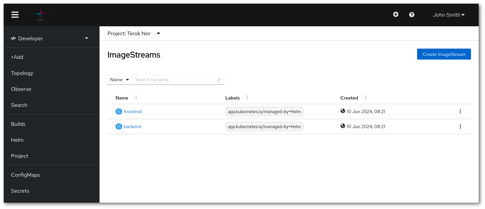

!!! success "Perustaso"
    Sinulla tulee olla tietoa OpenShift CLI-työkalusta [oc](../usage/cli.md) tai Rahti [web-käyttöliittymästä](../usage/getting_started.md).

# Salli kuvien nouto yhdestä Rahti-projektista toiseen {#allow-pulls-of-images-from-one-rahti-project-to-another}

Jokaisella Rahti-projektilla on yksityinen kuvarekisteritila. Rekisteriin voidaan tallentaa mikä tahansa [OCI](https://opencontainers.org/) -muodon mukainen kuva. Rekisterin yleisiä käyttötapoja ovat [Rahtin rakentamien kuvien](../images/creating.md#using-rahti-to-build-container-images) tallentaminen tai ylävirran kuvien välimuistitus.



Oletuksena mitä tahansa projektin yksityiseen rekisteriin tallennettua kuvaa voidaan noutaa projektin sisältä. Myös oletuksena vain projektin todennetut jäsenet voivat noutaa tai työntää kuvan projektin ulkopuolelta. Tämä tarkoittaa, että jos haluat rakentaa ja ottaa käyttöön kuvan, Podit voivat käyttää sitä ilman lisäasetuksia. Lisäksi voit noutaa kyseisen kuvan vain, jos olet todennettu ja projektin jäsen.

Tämän oppaan tavoitteena on selittää, kuinka saavuttaa lisäkäyttötapauksia, kuten kuvien noutaminen toisesta Rahti-projektista. Käyttötapaus on relevantti, kun useita projekteja käytetään saman infrastruktuurin käyttöönottoon ja siten kuvien jakamiseen. Alla olevassa esimerkissä ensimmäinen projekti on tuotanto (`bajor-prod`), ja toinen projekti on testaukseen (`bajor-test`). Molempien täytyy jakaa sama rekisteri helpottamaan testaus- ja käyttöönottoprosessia.

1. Varmista, että sinulla on kaksi projektia käytettävissä. Jos sinulla ei ole kahta projektia, joita voit käyttää, voit seurata [luo projekti](../usage/projects_and_quota.md#creating-a-project) dokumentaatiota.

1. Tämä voidaan saavuttaa kahdella menetelmällä:
    1. Voit käyttää [oc komentorivityökalua](../usage/cli.md) suorittamalla seuraavan komennon:

        ```sh
        oc adm policy add-role-to-user system:image-puller system:serviceaccounts:bajor-test \
               -n bajor-prod
        ```

        Yllä oleva komento sallii ryhmän `system:serviceaccounts:bajor-test` noutaa minkä tahansa kuvan, joka on tallennettu projektissa `bajor-prod`. Ryhmä sisältää kaikki projektin palvelutilit.

    1. Voit käyttää web-käyttöliittymää menemällä `Administrator`-käyttöliittymään ja sitten `User Management > RoleBindings`. Lopuksi klikkaa `Create binding` -painiketta ja täytä lomake seuraavasti:

        

        Uuden rolebindingin **Nimi** voi olla mikä tahansa, mutta suositellaan, että se informoi sen tarkoituksesta. **Namespace** on oltava kohdeprojekti, eli projekti, joka isännöi kuvia. **Roolin nimi** on oltava `system:image-puller`. Lopuksi **Ryhmä** on `system:serviceaccounts:bajor-test`, joka vastaa projektia, joka tarvitsee kuvien noutoa.

1. Testataksesi sitä, tarvitset vain ottaa käyttöön Podin `bajor-test` -projektissa, joka käyttää kuvaa `bajor-prod` -projektista (esim. `image-registry.apps.2.rahti.csc.fi/bajor-prod/image-name`).