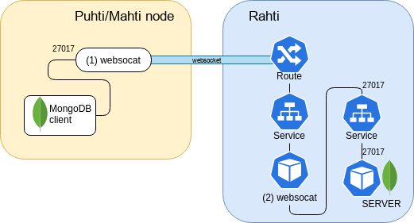

# Accessing databases on Rahti from CSC supercomputers

Many HPC workflows require a database. Running these on the login node poses several issues and running on Pouta brings administration overhead. Rahti is a good candidate, but one obstacle is that Rahti does not support non-HTTP traffic from external sources.

A workaround for this problem is to establish a TCP tunnel over an HTTP-compatible WebSocket connection using a program called WebSocat. Here, a WebSocat instance running on Puhti/Mahti translates a database request coming from a workflow to an HTTP-compatible WebSocket protocol. Once the traffic enters Rahti we use another WebSocat instance running inside Rahti to translate back the WebSocket connection to a TCP connection over the original port the database is configured to receive traffic. A drawing of the process is shown below.



This tutorial outlines the steps to achieve this using MongoDB as an example database.

!!! Note
    The OpenShift template used below to configure WebSocat on Rahti is an unsupported beta version!

!!! Note
    This solution is suitable for computationally light use cases. Reasonable scaling can be expected for up to ~100 processes simultaneously accessing a database on Rahti. Exceeding this limit is not advised and may result in performance degradation.

## Step 1: Setting up MongoDB and WebSocat on Rahti

Configuring MongoDB and WebSocat on Rahti can be done either through the web interface or using the `oc` command line tool.

### Option 1: Using the Rahti web interface

- Log in to the [Rahti web interface](https://rahti.csc.fi:8443). See [Getting access](../access.md) for instructions
- Select MongoDB from the front page catalog
- Configure the database. You need to at least select or create a project to which you want to add the database. If creating a new project, make sure to include your CSC project number in the description (e.g. 2001234)
- Create the database and take note of:
    - Username
    - Password
    - Database name (`sampledb` by default)
    - Database service name (`mongodb` by default)
- Select the created project, navigate to `Applications > Services` and select the created database service. Take note of:
    - Target port (27017 by default)
    - Hostname address (of the form `<service name>.<project name>.svc`)
- An [OpenShift template](https://github.com/CSCfi/websocat-template/blob/main/websocat-template.yaml) is needed to configure WebSocat on Rahti. Download or copy this YAML file to your clipboard. Note that this is an unsupported beta template
- On the Rahti web interface front page, select Import YAML/JSON and add the WebSocat template to the same project as the MongoDB (upload by dragging & dropping, selecting it, or pasting from the clipboard)
- Process the template and input the above hostname and target port in the requested database service name and database port fields
- Select the created project, navigate to `Applications > Services` and select the WebSocat service. Take note of:
    - Route hostname (of the form `websocat-<project name>.rahtiapp.fi`)

### Option 2: Using the `oc` command line tool

- See [Command line tool usage](../usage/cli.md) for basic instructions
- Login using your CSC username and password

```bash
oc login https://rahti.csc.fi:8443 -u <username> -p <password>
```

- Create a new project (namespace) or switch to existing one. If creating a new project, make sure to include your CSC project number in the description (e.g. 2001234)

```bash
oc new-project <project name> --display-name='My new project' --description='csc_project: <project number>'
# or
oc project <project name>
```

- Add MongoDB by launching the `mongodb-persistent` template. Take note of the username, password, database name and the database service name. Use the `-p` flag to modify default parameters

```bash
oc new-app --template=mongodb-persistent
```

- Add WebSocat by launching the [OpenShift template](https://github.com/CSCfi/websocat-template/blob/main/websocat-template.yaml). You can check the target port with `oc describe services <service name>`. The default parameters for the service name and target port are `mongodb` and 27017, respectively

```bash
oc new-app --file=/path/to/websocat-template.yaml --param=DATABASE_SERVICE=<service name>.<project name>.svc --param=DATABASE_PORT=<target port>
```

- Take note of route hostname of the form `websocat-<project name>.rahtiapp.fi`. You can check this later with `oc get route websocat`.

## Step 2: Running WebSocat on CSC supercomputers

MongoDB and WebSocat have now been set up on Rahti and you should have the following details: MongoDB username, password, database name and the WebSocat route hostname. These are needed when connecting to the database. However, first we need to run the `websocat` binary on Puhti/Mahti to open the required TCP tunnel.

- [Download `websocat` from GitHub](https://github.com/vi/websocat/releases) and add it to your `PATH`. For example:

```bash
wget -O websocat https://github.com/vi/websocat/releases/download/v1.8.0/websocat_amd64-linux-static
export PATH=$PATH:/path/to/websocat
```

- We do not want to run WebSocat on the login node, so open an interactive session with `sinteractive -i` and launch `websocat`. By passing 0 as the target port, WebSocat gets handed an available port which we can extract using `lsof` (the below commands are conveniently put into a script)

```bash
websocat -b tcp-l:127.0.0.1:0 wss://websocat-<project name>.rahtiapp.fi -E &
ws_pid=$!  # $! contains the process ID of the most recently executed background command
mkdir -p /tmp/$USER
lsof -i -p $ws_pid 2>/dev/null | grep TCP | grep -oE "localhost:[0-9]*" | cut -d ":" -f2 > /tmp/$USER/${SLURM_JOB_ID}_rahtidb_port
echo "Got target port $(cat /tmp/$USER/${SLURM_JOB_ID}_rahtidb_port)"
```

!!! Note
    If you want to access your database within a batch job, make sure to run `websocat` also within the batch script. Here, the obtained target port should be passed, `websocat -b tcp-l:127.0.0.1:<target port> wss://websocat-<project name>.rahtiapp.fi -E &`.

- Now `websocat` is running in the interactive session and you may connect to your MongoDB database on Rahti using the obtained target port. You can verify the connection with e.g. Python:

```python
from pymongo import MongoClient
from pymongo.errors import ConnectionFailure

client = MongoClient('localhost', port=<target port>, password=<password>, username=<username>, authSource=<database name>)
try:
    client.admin.command('ping')
except ConnectionFailure:
    print('Server not available')
```
