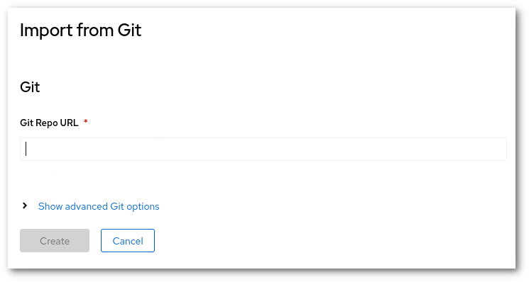
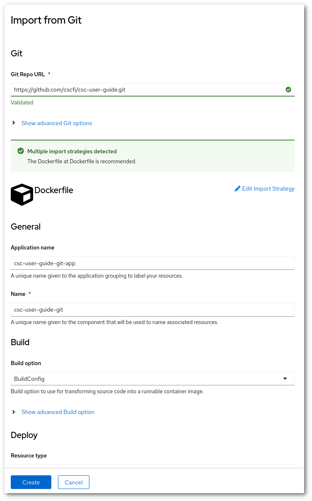

!!! success "Basic level"
    This is a simple tutorial to show how to deploy a web server using the Rahti [web interface](../usage/getting_started.md) using a git repository as a source

# Deploy from Git

How to set up a static web server in Rahti from a Git repository.

1. Create a project. [Instructions](../usage/projects_and_quota.md)

1. In the Openshift web console, switch to the Developer perspective. Select _Add_ from the navigation panel. To create an application, under Developer Catalog list Select _Import from Git_. 

    

1. Input the URL of the Git repository. OpenShift will use that URL to clone the repository.  

    

    The `Advanced Git Options` allows you to change the "reference" (Branch, tag or commit) or the context dir. And also allows to add a secret to get access to the repository (username and password, or SSH keys).

1. After inputting the URL. OpenShift will validate and analyze the repository. 

    

1. If the analysis was successful, the last step is to click on `Create`. After few minutes, the site should be available.

After this tutorial, you can check the [Webhooks](webhooks.md) article. Web hooks will allow you to automatically re-deploy this site for every change in the main master branch.
