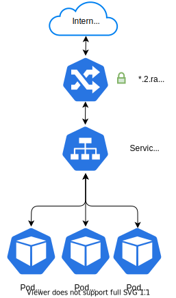
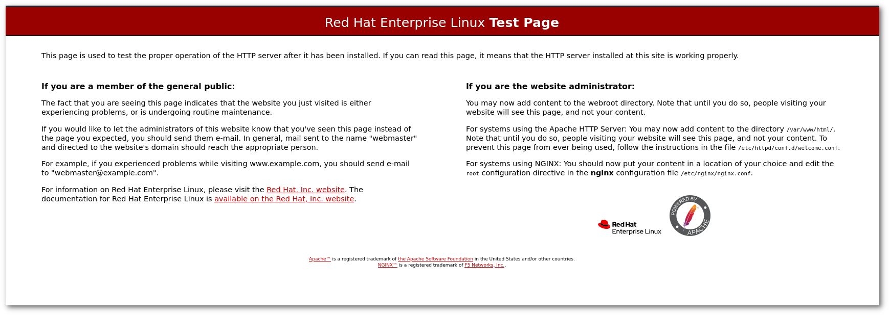

!!! warning "Keskitaso"
Tarvitset OpenShift CLI-työkalun [oc](../usage/cli.md) sekä OpenShift [Routes](../concepts.md#route) API:n tuntemusta ja lisäksi Kubernetesin [Podit](../concepts.md#pod) ja [Palvelut](../concepts.md#service).

# Johdanto {#introduction}

Tässä tutoriaalissa käsitellään Kubernetesin ydinkonsepteja _pods_, _services_, _routes_ ja _ReplicationControllers_ sekä niiden YAML-muodossa olevia esityksiä. Näiden _Kubernetes API objektien_ havainnollistamiseksi rakennetaan Apache HTTP-palvelinsovellus kirjoittamalla näiden objektien yksinkertaisia tekstimuotoisia YAML-esityksiä.

Klusterissa tarvittavat vähimmäismääräiset objektit palvelimen ajamiseksi:

1. Pod, joka ajaa kontin.
2. Palvelu, joka altistaa podin sisäisesti ja antaa sille ennustettavan nimen.
3. Reitti, joka avaa palvelun internetiin ohjaamalla liikenteen `<myservice>.2.rahtiapp.fi`:sta palveluobjektiin.

!!! info

    Käytännössä sinun ei pitäisi ottaa sovelluksia käyttöön samalla tavalla kuin tässä tutoriaalissa on kuvattu. Sen sijaan se on tarkoitettu Kubernetesin ydinkonseptien oppimiseen.



## Valmistelu {#preparation}

Varmista, että `oc`-komentorivi on asennettuna ja että olet kirjautunut sisään. Katso tarvittaessa [komentorivityökalun asennus](../usage/cli.md) saadaksesi apua.

## Projektit {#projects}

Komento `oc projects` näyttää projektit, joihin sinulla on pääsy:

```bash
$ oc projects
Sinulla on pääsy seuraaviin projekteihin, ja voit vaihtaa niiden välillä komennolla 'oc
project <projectname>':

    someone-elses-public-project
  * my-project-with-unique-name

Käytät projektia "my-project-with-unique-name" palvelimella "https://api.2.rahti.csc.fi:6443".
```

!!! info

    Listaus saattaa sisältää projekteja, jotka muut käyttäjät ovat luoneet isännöidäkseen julkisia Docker-kuvia. Vaikka on mahdollista vaihtaa näihin projekteihin, sinulla on niissä vain lukuoikeudet Docker-kuviin.

Jos sopivaa projektia ei ole, uusi voidaan luoda komennolla `oc
new-project`:

```bash
oc new-project my-project-with-unique-name
```

Projektin nimen on oltava yksilöllinen Rahti-konteineripilvessä, ja lisäksi nimi voi sisältää vain kirjaimia, numeroita ja yhdysmerkkejä, eikä se ole kirjainkoon herkkä. Pohjimmiltaan nimen on oltava sellainen, että sitä voidaan käyttää DNS-nimen osana.

Jos kuulut useampaan kuin yhteen CSC-projektiin, joilla on pääsy Rahtiin, projektin kuvauksessa on oltava `csc_project: #######`, jossa `#######` on laskutettava projekti (katso [Projektit ja kiintiöt](../usage/projects_and_quota.md)). Kuvaus voidaan liittää `new-project`-komentoon:

```bash
oc new-project my-project-with-unique-name --description='csc_project: #######'
```

Voit vaihtaa projektien välillä komennolla `oc project`:

```bash
oc project another-project
```

## Podit ja komentoriviliitäntä {#pods-and-the-command-line-interface}

Podit ovat objekteja, jotka ajavat yhden tai useampia kontteja. Podin kontit jakavat IP-osoitteen ja voivat kommunikoida `localhost`in tai jaetun muistin kautta. Tämän vuoksi ne on suoritettava yhdellä fyysisellä solmulla.

Meidän tapauksessamme pod suorittaa web-palvelimen asennettuna konttikuvassa:

*`pod.yaml`*:

```yaml
apiVersion: v1
kind: Pod
metadata:
  name: mypod
  labels:
    app: serveapp
    pool: servepod
spec:
  containers:
  - name: serve-cont
    image: "image-registry.openshift-image-registry.svc:5000/openshift/httpd"
```

Tämä pod suorittaa yhden konttikuvan, joka on määritelty kentässä `spec.containers.image`.

Podin nimi on annettu `metadata.name` kohdassa. Podiin voidaan viitata käyttäen `oc`-komentoa:

```bash
oc get pods mypod
```

Kenttä `metadata.labels.pool` on mielivaltainen avain-arvo pari, joka mahdollistaa podien ryhmittelyn ja niiden löytymisen esim. _palveluiden_ avulla.

Kubernetes API -objekteja esitetään YAML-muodossa. [Lyhyt johdanto YAML:iin](yaml_introduction.md).

Podit ja muut Kubernetes/OpenShift API-objektit luodaan `oc`-komentorivityökalun avulla:

```bash
oc create -f pod.yaml
```

Podin pitäisi nyt näkyä "Yhteenveto"-sivulla OpenShiftin web-konsolissa projektia tarkasteltaessa.

Podi voidaan poistaa `oc delete` komennolla:

```bash
oc delete pod mypod
```

Näin ollen podin pitäisi kadota OpenShiftin verkkokonsolista, mutta pidetään se toistaiseksi käynnissä.

----

### Resurssipyynnöt ja rajat {#resource-requests-and-limits}

Tyypillisesti varaat _resursseja_ konteille käyttämällä _pyyntöjä_ ja _rajoja_, mutta näissä esimerkeissä pidättäydymme niiden käytöstä lyhyyden vuoksi. Jos arvoja ei ole annettu, käytetään oletusarvoja. Sama pod kuin yllä, muistin ja suorittimen resursseilla 200 MB - 1 GB ja 0,2 suorittimesta - 1 suorittimeen, voidaan lukea seuraavasti:

*`pod.yaml`*:

```yaml
apiVersion: v1
kind: Pod
metadata:
  name: mypod
  labels:
    app: serveapp
    pool: servepod
spec:
  containers:
  - name: serve-cont
    image: "image-registry.openshift-image-registry.svc:5000/openshift/httpd"
    resources:
      requests:
        memory: "200M"
        cpu: "200m"
      limits:
        memory: "1G"
        cpu: "1"
```

Lue lisää pyynnöistä ja rajoista [Kubernetes-dokumentaatiosta](https://kubernetes.io/docs/tasks/configure-pod-container/quality-service-pod/).

----

## Palvelu {#service}

Podien IP-osoitteet eivät ole pysyviä ja saattavat muuttua, jos esimerkiksi pod tapetaan ja luodaan uudelleen. Siksi, jotta podiin voidaan luotettavasti päästä, sen IP-osoite on seurattava ja tallennettava. Palveluobjektit tekevät juuri sen, ja seurauksena ne tarjoavat pysyvän verkkoidentiteetin podeille:

*`service.yaml`*:

```yaml
apiVersion: v1
kind: Service
metadata:
  name: serve
  labels:
    app: serveapp
spec:
  ports:
  - name: 8081-tcp
    port: 8081
    protocol: TCP
    targetPort: 8080
  selector:
    pool: servepod
```

Tämä palvelu välittää TCP-liikenteen sisäisesti portista 8081 projektissa porttiin 8080 podeissa, joiden etiketit ovat listattu `spec.selector`-kohdassa. Tässä tapauksessa liikenne ohjataan podeihin, joilla on etiketti `pool: servepod`. Jos on olemassa useita podeja, jotka vastaavat `spec.selector`-kohtaa, liikenne jaetaan podeille. Oletuksena jako tehdään vuorotellen käännöksellä.

`spec.ports`-kentässä vaadittu kenttä on vain `port`. `protocol` oletusarvo on TCP ja `targetPort` oletusarvo on `port`in arvo.

Varmistaaksemme, että palvelu on määritelty, aloitamme etäshellin podin `mypod` kontissa ja kyselemme sisäistä DNS-palvelua:

```bash
$ oc rsh mypod
sh-4.2$ nslookup serve
Server:		172.30.0.10
Address:	172.30.0.10#53

Name:	serve.test-sidecar.svc.cluster.local
Address: 172.30.103.178

```

## Reitti {#route}

_Reitti_ objektit ovat OpenShiftin lisäyksiä Kubernetesiin, jotka ohjaavat HTTP-liikenteen internetistä (tai mihin tahansa verkkoon, johon OpenShift-klusteri on yhdistetty) OpenShiftin klusterin palveluihin.

*`route.yaml`*:

```yaml
apiVersion: route.openshift.io/v1
kind: Route
metadata:
  labels:
    app: serveapp
  name: myservice
  annotations:
    haproxy.router.openshift.io/ip_whitelist: 192.168.1.0/24 10.0.0.1
spec:
  host: <myroute>.2.rahtiapp.fi
  to:
    kind: Service
    name: serve
    weight: 100
```

Tämä reitti ohjaa liikenteen internetistä klusterin palveluun, jonka `metadata.name` vastaa `spec.to.name`-kohtaa.

* Sinun täytyy korvata `<myroute>` millä tahansa arvolla, joka on kelvollinen DNS-nimi (on suositeltavaa käyttää projektnimeä).

Erityisesti tämä reitti sallii vain liikenteen aliverkosta `192.168.1.0/24` ja IP:stä `10.0.0.1`. Turvallisuusnäkökulmasta on erittäin suositeltavaa käyttää IP-listoja palveluille, joiden ei ole tarkoitus olla näkyvissä koko internetille.

* Jotta voit muodostaa yhteyden, sinun täytyy lisätä (tai korvata) oma IP:si tai aliverkon maski, joka sisältää oman IP:si. Toinen vaihtoehto on poistaa merkintä kokonaan, jolloin kaikki maailmassa voivat muodostaa yhteyden.

Voit nyt mennä selaimeesi ja kirjoittaa asettamasi osoitteen: `<myservice>.2.rahtiapp.fi`. Sen pitäisi palauttaa sinulle Apache-testisivu:



!!! warning

    Jos whitelist-merkintä on muotoiltu väärin, OpenShift hylkää whitelistin ja sallii kaiken liikenteen.

Oletuksena isäntänimi on `metadata.name` + `-` + `projektnimi` + `.2.rahtiapp.fi`, ellei muuta ole määritelty `spec.host`:ssa.

Tähän mennessä olemme asettaneet podin, palvelun ja reitin. Jos fyysinen palvelin, jossa pod sijaitsee, sammuu, sinun täytyy manuaalisesti käynnistää podit uudelleen käyttämällä `oc create -f pod.yaml`. _ReplicationController_ ja _ReplicaSet_ objektit ovat mekanismeja, jotka tekevät tämän puolestasi.

## Replikaationohjaus {#replicationcontroller}

!!! Warning "ReplicationControllers vanhentuneet"
    ReplicationControllers, samoin kuin DeploymentConfigs ovat vanhentuneet OpenShift OKD:n nykyisissä versioissa. Seuraa ohjeita [korvaa DeploymentConfig Deploymentilla](https://developers.redhat.com/learning/learn:openshift:replace-deprecated-deploymentconfigs-deployments/resource/resources:convert-deploymentconfig-deployment).

Replikaationohjaus varmistaa, että klusterissa on `spec.replicas` numero podeja, joiden etiketit vastaavat `spec.selector`:ia. Jos podeja on liikaa, Replikaationohjaus sammuttaa ylimääräiset, ja jos podeja on liian vähän, se käynnistää podeja `spec.template`-kohtaan perustuen. Todellisuudessa template-kenttä on täsmälleen pod, joka on kuvattu `pod.yaml`:issa, paitsi että kentät `apiVersion` ja `kind` puuttuvat.

*`ReplicationController.yaml`*:

```yaml
apiVersion: v1
kind: ReplicationController
metadata:
  labels:
    app: serveapp
  name: blogtest-replicator
spec:
  replicas: 1
  selector:
    app: serveapp
    pool: servepod
  template:
    metadata:
      name: mypod
      labels:
        app: serveapp
        pool: servepod
    spec:
      containers:
      - name: serve-cont
        image: "image-registry.openshift-image-registry.svc:5000/openshift/httpd"
```

Replikaationohjaimet toimivat suurin piirtein samalla tavalla kuin ReplicaSets, joita käsitellään "[Kubernetes- ja OpenShift-konseptit](../concepts.md)" luvussa.
Replikaationohjaimen voi muuntaa ReplicaSetiksi vaihtamalla `spec.selector` kohtaan `spec.selector.matchLabels` ja asettamalla `kind: ReplicaSet`.

!!! info

    Keskeinen Kubernetes-konsepti nimeltään *rekonsiliaatiosilmukka* ilmenee Replikaationohjaimissa. Rekonsiliaatiosilmukka on mekanismi, joka mittaa järjestelmän *aktuaalisen tilan*, rakentaa mittaukseen perustuvan *nykytilan* ja suorittaa toimia niin, että järjestelmän tila vastaisi haluttua *tavoitetilaa*.

    Tässä terminologiassa, Replikaationohjaimet ovat objekteja, jotka kuvaavat klusterin *tavoitetilaa*. Toinen tällainen objekti on aiemmin kohdattu palveluobjekti. Siellä toinen rekonsiliaatiosilmukka vertaa palvelun päätepisteitä todellisiin ja valmis oleviin podeihin ja säätää niitä tarpeen mukaan. Tämän seurauksena palvelun päätepisteet osoittavat aina valmiisiin podeihin ja vain niihin podeihin, joiden etiketeissä on kaikki palveluobjektin valitsimessa esiintyvät kentät. Itse asiassa jokainen `spec`:n esiintymä Kubernetes-objektin YAML-esityksessä kuvailee spesifikaatiota rekonsiliaatiosilmukalle. Silmukat podeille vain sattuvat olemaan sidoksissa Kubernetesin työntekijäsolmuihin ja ovat siten altistuneita poistettaviksi, jos tai kun työntekijäsolmut lopetetaan.

## Siivous {#cleaning-up}

Kun olemme tyytyväisiä sovellukseen, emme pidä sitä klusterissa käynnissä, vaan poistamme sen `oc delete` komennolla:

```bash
oc delete all --selector app=serveapp
```

Tämä poistaa kaikki objektit, joiden etiketti on `app: serveapp`.

## Johtopäätös {#conclusion}

Tässä tutoriaalissa asennettiin staattinen verkkosivupalvelin käyttäen Kubernetes-objekteja edustavia YAML-tiedostoja. Luotuja objekteja voidaan edelleen muokata OpenShift-verkkokonsolissa, jossa:

* Reittejä voidaan muokata turvallisiksi TLS:llä salatuiksi.
* Automaattisia skaalaimia, pysyviä tallennustiloja, resurssirajoja ja terveysseurantoja voidaan lisätä Replikaationohjaimiin.
* Uusia reittejä voidaan lisätä palveluille.