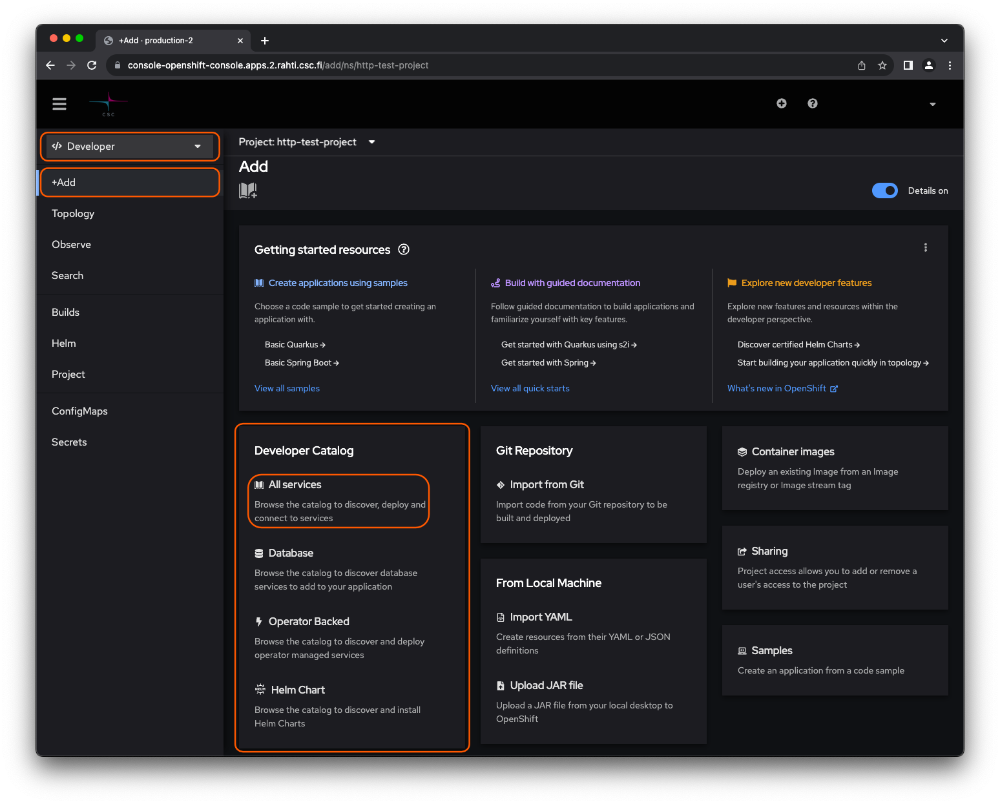
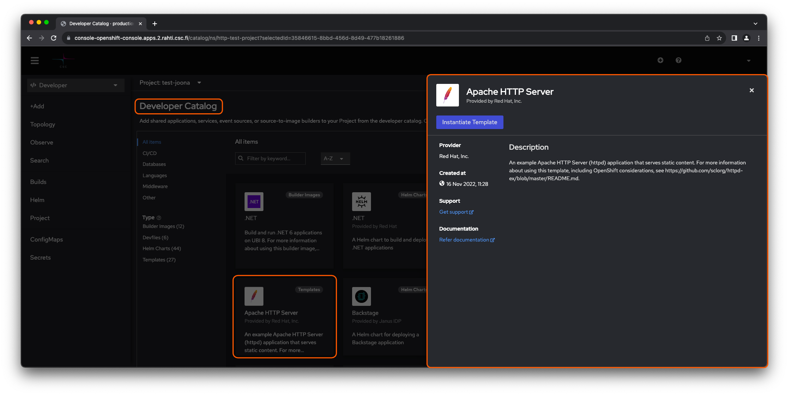

!!! success "Basic level"
    This is a simple tutorial to show how to deploy a web server using the Rahti [web interface](../usage/getting_started.md) as
    the same as the one using the CLI that you can find [here](./deploy_static_webserver_cli.md)

# Static web server

How to set up a static web server in Rahti.

1. Create a project. [Instructions](../usage/projects_and_quota.md)

2. In the Openshift web console, in left hand side menu, click on `Software Catalog` under `Home` dropdown list. 
    

3. To create an application, search and click _Apache HTTP Server_, since templates are deprecated now, please use builder image only. Now, click on  _create_ on the pop-up window on the right.
    

4. Type in the source Git repository containing the content to be
    served. You can also try sample by clicking on _Try sample_ . Now, Click _Create_ . The application will be created in the project namespace you provided.
    

5. Click on _Topology_ under `Workloads` in the navigation panel to Navigate to the newly created project and Click name of the project from _project_ list . Select _Details_ on the pop-up window on the right. Now, the OpenShift dashboard should display information about the application.
    

 This application is available at _Resources_ on the pop-up window on the right under the last field _Routes_ .
 

!!! info ""

    If the link did not work, make sure that the browser did not change the address to use `https` instead of intended `http`.

OpenShift processed a template that provisioned
various objects, such as _Pods_, _Services_, _Routes_, _Deployment_, and
_Builds_ into the container cloud, and as a result, a web server emerged.

For deeper insight in to the created objects, please see:

* [Core objects](deploy_static_webserver_cli.md) for introduction to the fundamental objects on
  which OpenShift/Kubernetes applications are built upon.
* Kubernetes and OpenShift [Concepts](../concepts.md) for how managing applications in
  OpenShift/Kubernetes is further streamlined using higher abstraction level objects.
