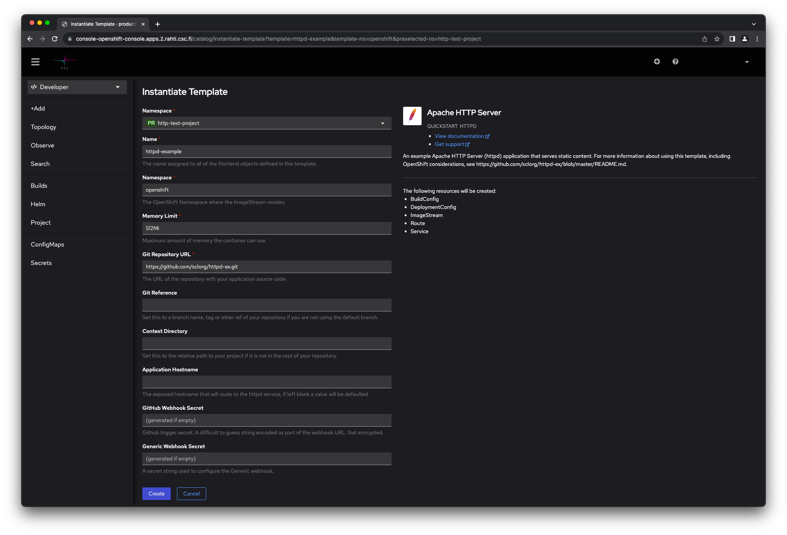
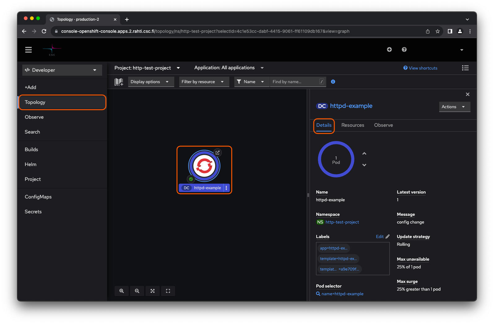
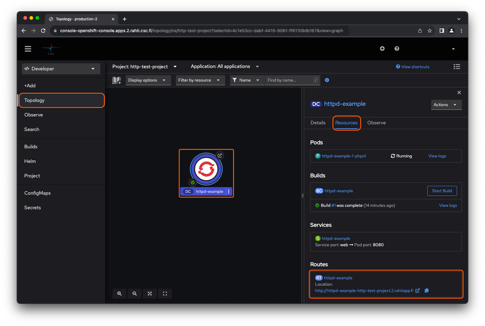

!!! success "Perustaso"

Tämä on yksinkertainen opas, joka näyttää, kuinka ottaa käyttöön verkkopalvelin Rahti [web-käyttöliittymän](../usage/getting_started.md) kautta, samalla tavalla kuin komentoriviliittymää käyttäen, jonka löydät [täältä](./deploy_static_webserver_cli.md).

# Staattinen verkkopalvelin {#static-web-server}

Kuinka määrittää staattinen verkkopalvelin Rahtiin.

1. Luo projekti. [Ohjeet](../usage/projects_and_quota.md)

2. Vaihda Openshiftin verkkokonsolissa Kehittäjän näkökulmaan. Valitse _Lisää_ navigointipaneelista. Sovelluksen luomiseksi, Kehittäjäkatalogi-luettelossa valitse _Kaikki palvelut_ ja etsi _Apache HTTP Server_, napsauta _Apache HTTP Server_ ja valitse _Instantiate Template_ oikealla puolella olevassa ponnahtusikkunassa.
   
   

3. Syötä lähteenä olevan Git-repositorion, joka sisältää palvelimelle toimitettavan sisällön. Napsauta _Luo_. Tässä käytetään esimerkkisisältöä, ja sovellus luodaan projektiin _http-test-project_.
   

4. Valitse _Topologia_ navigointipaneelista siirtyäksesi vastikään luotuun projektiin ja napsauta projektin nimeä käynnissä olevien sovellusten graafisesta kartasta. Valitse _Tiedot_ oikealla olevassa ponnahtusikkunassa. Nyt OpenShift-hallintapaneelin pitäisi näyttää sovellusta koskevia tietoja.
   

Tämä sovellus on käytettävissä oikealla olevassa ponnahtusikkunassa kohdassa _Resurssit_ kohdan _Reitit_ -listauksessa.
[httpd-example-http-test-project.2.rahtiapp.fi](http://httpd-example-http-test-project.2.rahtiapp.fi)

!!! info ""

    Jos linkki ei toimi, varmista, ettei selain muuttanut osoitetta käyttämään `https` sijasta tarkoitettua `http`.

OpenShift käsitteli mallin, joka toimitti useita objekteja, kuten _Podit_, _Palvelut_, _Reitit_, _Tietojen levitys_ ja _Rakenna_ konttipilveen, ja tämän seurauksena verkkopalvelin luotiin.

Syvempää tietoa luoduista objekteista saat:

* [Perus-objekteista](deploy_static_webserver_cli.md), johdatus OpenShift/Kubernetes-sovellusten rakentamiseen käytetyistä perustavanlaatuisista objekteista.
* Kubernetes ja OpenShift [Konseptit](../concepts.md), kuinka sovellusten hallintaa OpenShift/Kuberentesissa yksinkertaistetaan edelleen abstraktiotasolla.