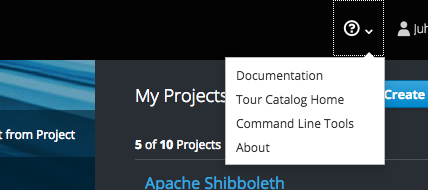

# Introduction

In this tutorial Kubernetes' core concepts Pods, Services, Routes and
ReplicationControllers and their YAML representations are discussed. And in order
to illustrate these *Kubernetes API Objects*, an Apache HTTP server application
is constructed by writing plain-text YAML representations of these said objects.

Minimally we need the following objects defined in the cluster to have the
server running:

1. A Pod that runs the container
1. A Service that exposes the pod internally and gives it a predictable name
1. A Route that will expose the Service to the Internet by redirecting
   traffic to `<myservice>.rahtiapp.fi` to the Service object.

!!! Note
    In practice, one should not deploy applications the way described in this
    tutorial. Instead, it is meant for learning the core concepts of
    Kuberenetes. If you already know about pods, services and routes,
    you might be interested in the
    "[Advanced concepts ](/cloud/rahti/tutorials/advanced_tutorial)" chapter.

## Preparations

If you are logged in to the Rahti web console and have the OpenShift command
line tool `oc` installed and the command line session authorized, you can skip
this section and move on to the next one ("Projects").

Install the `oc` command line tool and authenticate a command line session after
logging in to Rahti at [rahti.csc.fi](https://rahti.csc.fi:8443/) as follows:

1.  Install `oc` command line tools by clicking the question mark and then "Command
    Line Tools" at the top right corner of OpenShift web console:

    

1.  Click the "Latest release" link:

    

1.  Download and unpack the correct version for your platform and make sure that the
    binaries are found in a directory that is in the PATH environment variable.

1.  Copy the login command by clicking here:

    

1.  Paste the result to terminal. It should be similar to this:

```bash
oc login https://rahti.csc.fi:8443 --token=<secret access token>
```

!!! Note

    The secret access token is only valid for a limited time. After it expires,
    you will need to repeat the steps to login. Once logged in, the session will
    be valid in newly created terminal sessions as well.
    
## Projects

The command `oc projects` shows the projects one has access to:

```bash
$ oc projects
You have access to the following projects and can switch between them with 'oc
project <projectname>':

    someone-elses-public-project
  * my-project-with-unique-name

Using project "my-project-with-unique-name" on server "https://rahti.csc.fi:8443".
```

!!! Note

    The listing may include projects that other users have created to host
    public Docker images. While it is possible to switch to these projects, you
    will only have read-only access to the Docker images hosted in them.

If there weren't a single suitable project, a new one could be created with the `oc
new-project`-command:

```bash
oc new-project my-project-with-unique-name
```

The name of the project needs to be unique across the Rahti container cloud, and
moreover, the name may only contain letters, digits and hyphen symbols and it
is not case sensitive. In essence, the name needs to be usable as part of a DNS
name.

If you are a member of multiple CSC projects with access to Rahti, the description of the
project must contain `csc_project: #######`, where `#######` is the project
that should be billed (see
"[Projects and quota ](/cloud/rahti/usage/projects_and_quota/#projects_and_quota)").
The description can be included in the `new-project` command as follows

```bash
oc new-project my-project-with-unique-name --description='csc_project: #######'
```

Switching between projects is done with the `oc project` command:

```bash
oc project another-project
```

## Pods and Command Line Interface

Pods are objects that run one or more containers. The containers in the pod
share an IP address and they can communicate through `localhost` or shared memory.
Consequently, they need to be executed in a single physical node.

In our case, the pod will run a container image with a web server installed in
it:

*`pod.yaml`*:

```yaml
apiVersion: v1
kind: Pod
metadata:
  name: mypod
  labels:
    app: serveapp
    pool: servepod
spec:
  containers:
  - name: serve-cont
    image: "docker-registry.default.svc:5000/openshift/httpd"
```

This pod will run one container image given in the field
`spec.containers.image`.

The name of the pod is given in `metadata.name`. The pod can be referred now
using `oc`:

```bash
oc get pods mypod
```

The field `metadata.labels.pool` is an arbitrary key-value pair that enables
the pods to be grouped and referred by, e.g., *services*.

The Kubernetes API objects are represented in YAML format.
[Here](#short-introduction-to-yaml) is a minimal introduction to it.

Pods and other Kubernetes/OpenShift API objects are created with the `oc`
command line utility as follows:

```bash
oc create -f pod.yaml
```

The pod should now appear in the "Overview" page in OpenShift's web console if
the correct project is viewed.

Pods can be deleted using the `oc delete` command:

```bash
oc delete pod mypod
```

Consequently, the pod should disapper from the OpenShift web console, but let's
keep this one running for now.

----

### Resource requests and limits

Typically one allocates *resources* to containers using *requests* and
*limits*, but in these examples we refrain from doing that for the sake of
brevity. If no values are provided, default values will be used instead. The
same pod as above with memory and CPU resources of 200 MB to 1 GB and 0.2 CPU
to 1 CPU would read as:

*`pod.yaml`*:

```yaml
apiVersion: v1
kind: Pod
metadata:
  name: mypod
  labels:
    app: serveapp
    pool: servepod
spec:
  containers:
  - name: serve-cont
    image: "docker-registry.default.svc:5000/openshift/httpd"
    resources:
      requests:
        memory: "200M"
        cpu: "200m"
      limits:
        memory: "1G"
        cpu: "1"
```

You can read more about requests and limits in the [Kubernetes
documentation](https://kubernetes.io/docs/tasks/configure-pod-container/quality-service-pod/).

----

## Service

The IP addresses of Pods are not consistent and may change if, for example,
a pod is killed and recreated. Thus, in order to reliably access a pod, its IP
address must be tracked and stored. Service objects do just that and as
a result they provide a consistent network identity to pods:

*`service.yaml`*:

```yaml
apiVersion: v1
kind: Service
metadata:
  name: serve
  labels:
    app: serveapp
spec:
  ports:
  - name: 8081-tcp
    port: 8081
    protocol: TCP
    targetPort: 8080
  selector:
    pool: servepod
```

This service will redirect TCP traffic internally from port 8081 in the project
to the port 8080 of the pods having labels listed in `spec.selector`. In this
case, the traffic is redirected to the pods with label `pool: servepod`. If
there are multiple pods matching `spec.selector`, then the traffic is split
between pods. By default, the splitting is done in a round-robin manner.

The only required field in the `spec.ports` field is `port`. Omitting
`protocol` defaults it to TCP and omitting `targetPort` will default to the
value of `port`.

Let's ensure that the Service actually works by launching a remote shell in the
container running in the pod `mypod` and pinging the Service:

```bash
$ oc rsh mypod
sh-4.2$ ping serve
PING serve.my-project-with-unique-name.svc.cluster.local (172.30.39.82) 56(84) bytes of data.
```

## Route

*Route* object is an OpenShift extension to Kubernetes that will route HTTP
traffic from the Internet (or from whichever network the OpenShift cluster is
connected to) to Services in the OpenShift cluster.

*`route.yaml`*:

```yaml
apiVersion: v1
kind: Route
metadata:
  labels:
    app: serveapp
  name: myservice
  annotations:
    haproxy.router.openshift.io/ip_whitelist: 192.168.1.0/24 10.0.0.1
spec:
  host: <myservice>.rahtiapp.fi
  to:
    kind: Service
    name: serve
    weight: 100
```

This route will redirect traffic from internet to that service in the cluster
whose `metadata.name` equals `spec.to.name`.

This particular route also allows traffic only from subnet `192.168.1.0/24` and
the IP `10.0.0.1`. Security-wise it is highly encouraged to utilize IP
whitelisting for services that are not meant to be visible to the entire
Internet.

!!! Caution

    If the whitelist entry is malformed, OpenShift will discard the whitelist
    and traffic is allowed from everywhere.

By default, the hostname is `metadata.name` + `-` + project name
+ `.rahtiapp.fi` unless otherwise specified in `spec.host`.

So far we have set up a pod, a service and a route. If the physical server
where to pod lives gets shut down one has to manually start the pod again with
`oc create -f pod.yaml`. The ReplicationController and ReplicaSet objects are
mechanism that will, roughly speaking, do that for the user.

## ReplicationController

A ReplicationController ensures that there are `spec.replicas` number of pods
whose labels match `spec.selector` running in the cluster. If there are too many,
ReplicationController will shut down the extra ones and if there are too few,
it will start up pods according to `spec.template` field. Actually, the
template field is exactly the pod described in `pod.yaml` except the fields
`apiVersion` and `kind` are missing.

*`ReplicationController.yaml`*:

```yaml
apiVersion: v1
kind: ReplicationController
metadata:
  labels:
    app: serveapp
  name: blogtest-replicator
spec:
  replicas: 1
  selector:
    app: serveapp
    pool: servepod
  template:
    metadata:
      name: mypod
      labels:
        app: serveapp
        pool: servepod
    spec:
      containers:
      - name: serve-cont
        image: "docker-registry.default.svc:5000/openshift/httpd"
```

The ReplicationControllers are functionally near ReplicaSets, treated
in Chapter "[Kubernetes and OpenShift
Concepts](../introduction/background#kubernetes-and-openshift-concepts)".
And really, a ReplicationController can be transformed in to a ReplicaSet by
changing `spec.selector` to `spec.selector.matchLabels` and setting
`kind: ReplicaSet`. The motivation to understand the ReplicationController
object is that [DeploymentConfig](advanced_tutorial#deploymentconfig)
objects generate ReplicationControllers.

!!! Note
    A central Kubernetes' concept coined *reconciliation loop* manifests in
    ReplicationControllers. The reconciliation loop is a mechanism that measures
    the *actual state* of the system, constructs *current state* based to the
    measurement of the system and performs such actions that the state of the
    system would equal to the *desired state*.

    In such a terminology, ReplicationControllers are objects that describe the
    *desired state* of the cluster. Another such an object is the service
    object encountered earlier. There, an another reconciliation loop compares
    the endpoints of the service to the actual pods that are ready and adjusts
    accordingly. As a result, the endpoints of the service always point to pods
    that are ready and only those pods whose labels contain all the fields in
    the selector of the service object. In fact, every incidence of `spec` in
    a YAML representations of Kubernetes objects, describes a specification for
    a reconciliation loop. The loops for pods just happen to be tied to the
    worker nodes of Kubernetes and are thus susceptible to deletion if, or
    when, the worker nodes are deprovisioned.

## Cleaning up

Once we are satisfied with the application, let us not keep it running in the
cluster but let's remove it with the `oc delete` command:

```bash
oc delete all --selector app=serveapp
```

This will delete all objects having label `app: serveapp`.

## Conclusion

In this tutorial a static web page server was set up using YAML files
representing the Kubernetes objects. The created objects can be further
modified in the OpenShift web console where, e.g.,

* Routes can be modified to be secure ones encrypted by TLS.
* Autoscalers, persistent storage, resource limits and health checks can be
  added to ReplicationControllers.
* New routes can be added to Services.

## Short introduction to YAML

YAML is used to describe key-value maps and arrays. YAML file are recognized
from `.yml` or `.yaml` file suffix.

A YAML dataset can be

*   a value

```yaml
value
```

*  an array

```yaml
- value 1
- value 2
- value 3
```

or

```yaml
[value 1, value 2, value 3]
```

*   a dictionary

```yaml
key: value
another_key: another value
```

  or

```yaml
key:
  value
another_key:
  another value
```

*   YAML dataset

```yaml
key:
  - value 1
  - another key:
      yet another key: value 2
    another key 2:
      - more values
    this keys value is also an array:
    - but indentation is not necessary here
```

Values can be inputted across multiple lines with `>`:

```yaml
key: >
  Here's a value that is written over multiple lines
  but is actually still considered a single line until now.

  Placing double newline here will result in newline in the actual data.
```

Verbatim style is supported with `|` character:

```yaml
key: |
  Now each
  newline is
  treated as such
```

YAML is also a superset of JSON (JavaScript Object Notation). Thus,

```json
{
  "key":
  [
    "value 1",
    {
      "another key": {"yet another key": "value 2"},
      "another key 2": ["more values"],
      "this keys value is also an array": ["but indentation is not necessary here"]
    }
  ]
}
```

is also valid YAML.

For more information, see [yaml.org](https://yaml.org/) or [json.org](https://json.org).


